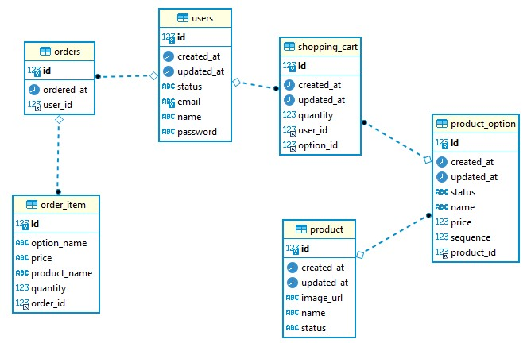

# step2-BE-kakao-shop
카카오 테크 캠퍼스 2단계 카카오 쇼핑하기 백엔드 클론 프로젝트 레포지토리입니다.

# 1주차

카카오 테크 캠퍼스 2단계 - BE - 1주차 클론 과제
</br>
</br>

## **과제명**
```
1. 요구사항분석/API요청 및 응답 시나리오 분석
2. 요구사항 추가 반영 및 테이블 설계도
```

## **과제 설명**
```
1. 요구사항 시나리오를 보고 부족해 보이는 기능을 하나 이상 체크하여 README에 내용을 작성하시오.
2. 제시된 화면설계를 보고 해당 화면설계와 배포된 기존 서버의 API주소를 매칭하여 README에 내용을 작성하시오. (카카오 화면설계 시나리오가 있음)
3. 배포된 서버에 모든 API를 POSTMAN으로 요청해본 뒤 응답되는 데이터를 확인하고 부족한 데이터가 무엇인지 체크하여 README에 내용을 작성하시오.
4. 테이블 설계를 하여 README에 ER-Diagram을 추가하여 제출하시오.
```

</br>

## **과제 상세 : 수강생들이 과제를 진행할 때, 유념해야할 것**
아래 항목은 반드시 포함하여 과제 수행해주세요!
>- 부족한 기능에 대한 요구사항을 미리 예상할 수 있는가? (예를 들면 상품등록 api가 기존 요구사항에는 없는데 추후 필요하지는 않을지, 이런 부분들을 생각하였는지) 
>- 요구사항에 맞는 API를 분석하고 사용자 시나리오를 설계하였는가? (예를 들어 배포된 서버와 화면 설계를 제시해줄 예정인데, 특정 버튼을 클릭했을 때 어떤 API가 호출되어야 할지를 아는지)
>- 응답되는 데이터가 프론트앤드 화면에 모두 반영될 수 있는지를 체크하였는가?(예를 들어 배송관련 비용이 있는데, 이런것들이 API에는 없는데 이런 부분을 캐치할 수 있는지)
>- 테이블 설계가 모든 API를 만족할 수 있게 나왔는가? (테이블이 효율적으로 나왔는가 보다는 해당 테이블로 요구사항을 만족할 수 있는지에 대한 여부만)
>- 테이블명이 이해하기 쉽게 만들어졌는가? (상품테이블이 product이면 이해하기 쉽지만, material이라고 하면 이해하기 어렵기 때문)

</br>

## **코드리뷰 관련: PR시, 아래 내용을 포함하여 코멘트 남겨주세요.**
**1. PR 제목과 내용을 아래와 같이 작성 해주세요.**

>- PR 제목 : 부산대BE_라이언_1주차 과제

</br>

**2. PR 내용 :**

>- 코드 작성하면서 어려웠던 점
>- 코드 리뷰 시, 멘토님이 중점적으로 리뷰해줬으면 하는 부분


# 카카오 테크 캠퍼스 2단계 - BE - 1주차 클론 과제


### 1. 요구사항분석/API요청 및 응답 시나리오 분석


<br>

- (기능1) 회원가입
    - POST /check
        - 폼에 작성된 이메일을 받아서 중복 여부를 반환한다.
        - 예외: 이메일 중복, 이메일 형식 오류
    - POST /join
        - 이름, 이메일, 비밀번호를 받아서 회원 계정을 생성하고 결과를 반환한다.
        - 예외: 이메일 중복, 이메일 형식 오류, 비밀번호 유효성 검사
    - 이메일 소유자 인증

<br>

- (기능2) 로그인
    - POST /login
        - 이메일, 비밀번호를 입력받아 토큰을 반환한다.
        - 예외: 이메일 및 비밀번호 형식 오류, 이메일이 존재하지 않는 경우, 비밀번호가 일치하지 않는 경우

<br>

- (기능3) 로그아웃
    - 연결된 API 없음.
    - 필요하다면 토큰을 입력받아서 블랙리스트를 구현하는 시도 등을 할 수 있겠다.

<br>  

- (기능4) 전체 상품 목록 조회
    - GET /products?page={number}
    - 번호에 해당하는 페이지의 상품 목록을 반환한다.
    - PK 기반 페이지네이션으로 구현하려는 경우, page 가 아닌 product-id 를 받아야 할 것 같다.

<br>

- (기능5) 개별 상품 상세 조회
    - GET /products/{product-id}
    - 해당 상품의 옵션들을 반환한다.

<br>

- (기능6) 상품 옵션 선택
- (기능7) 옵션 확인 및 수량 결정
    - 클라이언트 상에서 처리되는 부분으로 보인다.

<br>

- (기능8) 장바구니 담기
    - POST /carts/add
    - 옵션 아이템과 수량, 토큰을 함께 전달하여, 유저의 장바구니를 업데이트한다.

<br>

- (기능9) 장바구니 보기
    - GET /carts
    - 토큰을 전달하여 유저의 장바구니를 조회한다.

<br>

- (기능10) 장바구니 상품 옵션 확인 및 수량 결정
    - POST /carts/update
    - 변경하고자 하는 옵션 ID 와 수량을 입력받아 장바구니를 업데이트한다.
    - 예외: 장바구니에 없는 옵션 ID, 수량이 0 이하인 경우

<br>

- (기능11) 주문
    - POST /orders/save
    - 유저의 장바구니 정보를 기반으로 주문을 생성하고 장바구니를 비운다.
    - 예외: 장바구니가 비어있는 경우

<br>

- (기능12) 결제
    - 생략

<br>

- (기능13) 주문 결과 확인
    - GET /orders/{order-id}
    - 주문 ID 를 입력받아서 주문 정보를 반환한다.
    - 주문 완료 후 자동으로 보여지는 구매 결과 확인 페이지로 확인된다.

<br>

- (기능14) 주문 내역 확인
    - GET /orders<br>
    - 토큰을 입력받아서 해당 유저의 주문 내역을 반환한다. 날짜 등을 입력할 수 있고 페이지네이션도 고려해볼 수 있겠다.


상품 카테고리   
상품 검색  
환불 등 ...


### 2. 요구사항 추가 반영 및 테이블 설계도

- User table
    - status 는 ACTIVE, INACTIVE, DELETE 등... WAS 에서 enum 으로 관리하면 좋을 것 같습니다.
    - Customer 가 아닌 고객의 계정도 관리할 필요가 있다면, Account 로 이름을 바꾸고 계정 역할 필드를 추가하고, 1:1 관계로 Customer, Seller 등으로 분할하는것에 대해서 생각...


    CREATE TABLE `user` (  
      `id` int NOT NULL AUTO_INCREMENT,  
      `name` varchar(255),  
      `email` varchar(255) NOT NULL,  
      `password` varchar(255),  
      `status` varchar(255),  
      `created_at` datetime(6),  
      `updated_at` datetime(6),  

      PRIMARY KEY (`id`),  
      UNIQUE KEY (`email`)  
    )  

- Product table
    - starCount 는 생략하였습니다.
    - status 에 ACTIVE, INACTIVE, DELETE 뿐 아니라 품절상태를 관리할 수 있으면 좋을 것 같습니다.
    - 실제로 가격을 가지고 있는 것은 Product 에 연결된 Option 들이기 때문에, Product 에서 가격을 제거하고 반드시 1개 이상의 Option을 가지도록 하는 것을 생각해보았습니다.


    CREATE TABLE `product` (  
      `id` int NOT NULL AUTO_INCREMENT,  
      `name` varchar(255),  
      `image_url` varchar(255),  
      `status` varchar(255),  
      `created_at` datetime(6),  
      `updated_at` datetime(6),  

      PRIMARY KEY (`id`)  
    )  


- Option table
    - sequence: 클라이언트 화면에 보여지는 옵션의 순서 관리
    - status 는 활성화 여부, 삭제 정도로 일단 충분할 것 같습니다.


    CREATE TABLE `product_option` (
      `id` int NOT NULL AUTO_INCREMENT,
      `name` varchar(255),
      `price` int NOT NULL,
      `sequence` int NOT NULL,
      `status` varchar(255)ACTIVE',
      `created_at` datetime(6),
      `updated_at` datetime(6),
      `product_id` int,
      PRIMARY KEY (`id`),
      KEY (`product_id`),
      CONSTRAINT FOREIGN KEY (`product_id`) REFERENCES `product` (`id`)
    )


- Cart table


    CREATE TABLE `shopping_cart` (  
      `id` int NOT NULL AUTO_INCREMENT,  
      `user_id` int,  
      `option_id` int,  
      `quantity` int NOT NULL,  
      `created_at` datetime(6),  
      `updated_at` datetime(6),  

      PRIMARY KEY (`id`),  
      KEY (`user_id`),  
      KEY (`option_id`),  
      CONSTRAINT FOREIGN KEY (`option_id`) REFERENCES `product_option` (`id`),  
      CONSTRAINT FOREIGN KEY (`user_id`) REFERENCES `user` (`id`)  
    )  


- Order table


    CREATE TABLE `orders` (
      `id` int NOT NULL AUTO_INCREMENT,
      `ordered_at` datetime(6),
      `user_id` int,  

      PRIMARY KEY (`id`),
      KEY (`user_id`),
      CONSTRAINT FOREIGN KEY (`user_id`) REFERENCES `user` (`id`)
    )


- Item table
    - 주문 시 장바구니 내역을 그대로 옮겨적는 History table.
    - 추후 product 와 option 의 정보가 변경될 수 있으니 필요한 정보들을 기록하는 것이 좋을 것 같습니다.


    CREATE TABLE `order_item` (
      `id` int NOT NULL AUTO_INCREMENT,
      `option_name` varchar(255),
      `price` varchar(255),
      `product_name` varchar(255),
      `quantity` int NOT NULL,
      `order_id` int,

      PRIMARY KEY (`id`),
      KEY (`order_id`),
      CONSTRAINT FOREIGN KEY (`order_id`) REFERENCES `orders` (`id`)
    )


- ER Diagram




# 2주차

카카오 테크 캠퍼스 2단계 - BE - 2주차 클론 과제
</br>
</br>

## **과제명**
```
1. 전체 API 주소 설계
2. Mock API Controller 구현
```

## **과제 설명**
```
1. API주소를 설계하여 README에 내용을 작성하시오.
2. 가짜 데이터를 설계하여 응답하는 스프링부트 컨트롤러를 작성하고 소스코드를 업로드하시오.
```

</br>

## **과제 상세 : 수강생들이 과제를 진행할 때, 유념해야할 것**
아래 항목은 반드시 포함하여 과제 수행해주세요!
>- 전체 API 주소 설계가 RestAPI 맞게 설계되었는가? (예를 들어 배포된 서버는 POST와 GET으로만 구현되었는데, 학생들은 PUT과 DELETE도 배울 예정이라 이부분이 반영되었고, 주소가 RestAPI에 맞게 설계되었는지)
>- 가짜 데이터를 설계하여 Mock API를 잘 구현하였는가? (예를 들어 DB연결없이 컨트롤러만 만들어서 배포된 서버의 응답과 동일한 형태로 데이터가 응답되는지 여부)
</br>

## **코드리뷰 관련: PR시, 아래 내용을 포함하여 코멘트 남겨주세요.**
**1. PR 제목과 내용을 아래와 같이 작성 해주세요.**

>- PR 제목 : 부산대BE_라이언_2주차 과제

</br>

**2. PR 내용 :**

>- 코드 작성하면서 어려웠던 점
>- 코드 리뷰 시, 멘토님이 중점적으로 리뷰해줬으면 하는 부분

# 3주차

카카오 테크 캠퍼스 2단계 - BE - 3주차 클론 과제
</br>
</br>

## **과제명**
```
1. 레포지토리 단위테스트
```

## **과제 설명**
```
1. 레포지토리 단위테스트를 구현하여 소스코드를 제출하시오.
2. 쿼리를 테스트하면서 가장 좋은 쿼리를 작성해보시오.
```

</br>

## **과제 상세 : 수강생들이 과제를 진행할 때, 유념해야할 것**
아래 항목은 반드시 포함하여 과제 수행해주세요!
>- 레포지토리 단위테스트가 구현되었는가?
>- 테스트 메서드끼리 유기적으로 연결되지 않았는가? (테스트는 격리성이 필요하다)
>- Persistene Context를 clear하여서 테스트가 구현되었는가? (더미데이터를 JPA를 이용해서 insert 할 예정인데, 레포지토리 테스트시에 영속화된 데이터 때문에 쿼리를 제대로 보지 못할 수 있기 때문에)
>- 테스트 코드의 쿼리 관련된 메서드가 너무 많은 select를 유발하지 않는지? (적절한 한방쿼리, 효율적인 in query, N+1 문제 등이 해결된 쿼리)
</br>

## **코드리뷰 관련: PR시, 아래 내용을 포함하여 코멘트 남겨주세요.**
**1. PR 제목과 내용을 아래와 같이 작성 해주세요.**

>- PR 제목 : 부산대BE_라이언_3주차 과제

</br>

**2. PR 내용 :**

>- 코드 작성하면서 어려웠던 점
>- 코드 리뷰 시, 멘토님이 중점적으로 리뷰해줬으면 하는 부분

# 4주차

카카오 테크 캠퍼스 2단계 - BE - 4주차 클론 과제
</br>
</br>

## **과제명**
```
1. 컨트롤러 단위 테스트
```

## **과제 설명**
```
1. 컨트롤러 단위테스트를 작성한뒤 소스코드를 업로드하시오.
2. stub을 구현하시오.
```

</br>

## **과제 상세 : 수강생들이 과제를 진행할 때, 유념해야할 것**
아래 항목은 반드시 포함하여 과제 수행해주세요!
>- 컨트롤러 단위테스트가 구현되었는가?
>- Mockito를 이용하여 stub을 구현하였는가?
>- 인증이 필요한 컨트롤러를 테스트할 수 있는가?
>- 200 ok만 체크한 것은 아닌가? (해당 컨트롤러에서 제일 필요한 데이터에 대한 테스트가 구현되었는가?)
</br>

## **코드리뷰 관련: PR시, 아래 내용을 포함하여 코멘트 남겨주세요.**
**1. PR 제목과 내용을 아래와 같이 작성 해주세요.**

>- PR 제목 : 부산대BE_라이언_4주차 과제 

</br>

**2. PR 내용 :**

>- 코드 작성하면서 어려웠던 점
>- 코드 리뷰 시, 멘토님이 중점적으로 리뷰해줬으면 하는 부분

# 5주차

카카오 테크 캠퍼스 2단계 - BE - 5주차 클론 과제
</br>
</br>

## **과제명**
```
1. 실패 단위 테스트
```

## **과제 설명**
```
1. 컨트롤러 단위테스트를 구현하는데, 실패 테스트 코드를 구현하시오.
2. 어떤 문제가 발생할 수 있을지 모든 시나리오를 생각해본 뒤, 실패에 대한 모든 테스트를 구현하시오.
```

</br>

## **과제 상세 : 수강생들이 과제를 진행할 때, 유념해야할 것**
아래 항목은 반드시 포함하여 과제 수행해주세요!
>- 실패 단위 테스트가 구현되었는가?
>- 모든 예외에 대한 실패 테스트가 구현되었는가?
</br>

## **코드리뷰 관련: PR시, 아래 내용을 포함하여 코멘트 남겨주세요.**
**1. PR 제목과 내용을 아래와 같이 작성 해주세요.**

>- PR 제목 : 부산대BE_라이언_5주차 과제

</br>

**2. PR 내용 :**

>- 코드 작성하면서 어려웠던 점
>- 코드 리뷰 시, 멘토님이 중점적으로 리뷰해줬으면 하는 부분

# 6주차

카카오 테크 캠퍼스 2단계 - BE - 6주차 클론 과제
</br>
</br>

## **과제명**
```
1. 카카오 클라우드 배포
```

## **과제 설명**
```
1. 통합테스트를 구현하시오.
2. API문서를 구현하시오. (swagger, restdoc, word로 직접 작성, 공책에 적어서 제출 등 모든 방법이 다 가능합니다)
3. 프론트앤드에 입장을 생각해본뒤 어떤 문서를 가장 원할지 생각해본뒤 API문서를 작성하시오.
4. 카카오 클라우드에 배포하시오.
5. 배포한 뒤 서비스 장애가 일어날 수 있으니, 해당 장애에 대처할 수 있게 로그를 작성하시오. (로그는 DB에 넣어도 되고, 외부 라이브러리를 사용해도 되고, 파일로 남겨도 된다 - 단 장애 발생시 확인을 할 수 있어야 한다)
```

</br>

## **과제 상세 : 수강생들이 과제를 진행할 때, 유념해야할 것**
아래 항목은 반드시 포함하여 과제 수행해주세요!
>- 통합테스트가 구현되었는가?
>- API문서가 구현되었는가?
>- 배포가 정상적으로 되었는가?
>- 서비스에 문제가 발생했을 때, 로그를 통해 문제를 확인할 수 있는가?
</br>

## **코드리뷰 관련: PR시, 아래 내용을 포함하여 코멘트 남겨주세요.**
**1. PR 제목과 내용을 아래와 같이 작성 해주세요.**

>- PR 제목 : 부산대BE_라이언_6주차 과제

</br>

**2. PR 내용 :**

>- 코드 작성하면서 어려웠던 점
>- 코드 리뷰 시, 멘토님이 중점적으로 리뷰해줬으면 하는 부분
