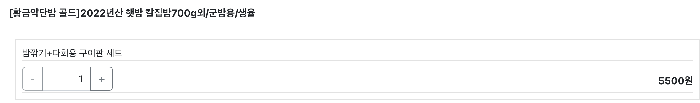
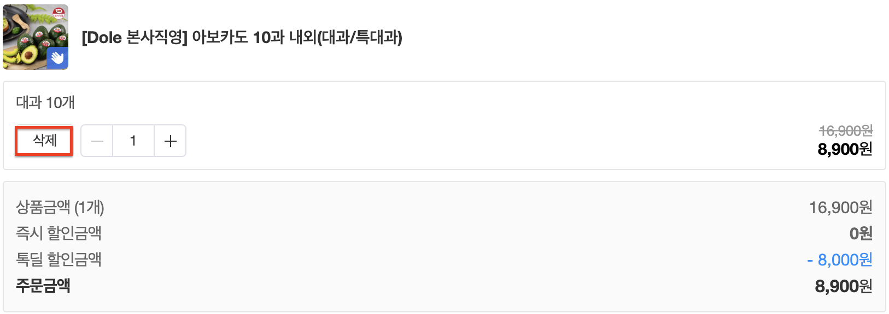
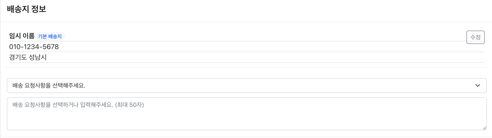
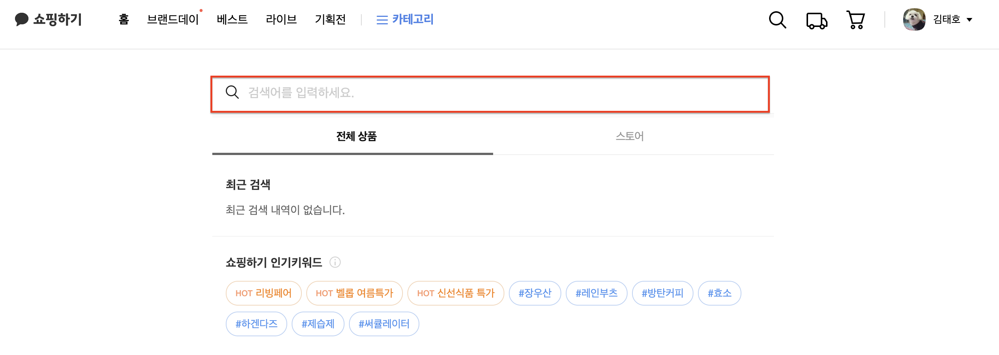

# 요구사항 보충

### 로그아웃 api 부족

- 현재 로그아웃 버튼은 존재하지만 클라이언트에서 서버로 api를 요청하진 않는다.
- 하지만 RefreshToken등을 추가한다면 api로 만드는 것이 좋아 보인다.

 
 

### 회원 정보 수정, 회원 탈퇴 api 부족

- 현재 회원 기능 중 로그인, 회원 가입은 구현되어 있지만 회원 정보를 수정하는 기능은 없다.
- 또한 카카오와 같은 카카오톡 아이디로 모든 서비스들을 로그인할 수 있는 시스템이 아니라면 회원 탈퇴기능도 구현해야한다.

 
 

### 장바구니 삭제 api 부족

- 현재 api 설계상에는 한번 장바구니 물품을 넣으면 제거할 수 없는 구조이다.
    
    
    
    삭제 버튼이 없고 수량을 0으로 만들 수 없다.
    
- 하지만 실제 서비스(카카오 쇼핑몰)에는 장바구니 삭제 기능이 포함되어 있다.
    
    

 
     

### 배송지 관련 api 부족

- 현재 배송지에 대한 정보를 입력할 순 있지만 서버에 저장되지 않는다.
- 사용자가 설정한 배송지를 저장할 수 있어야한다.

 
 

### 환불(주문 삭제) api 부족

- 특정 상황에서는 환불 요청을 할 수 있어야 한다.
- 하지만, 현재 제공하는 api 문서에서는 해당 기능이 없다.

 
 

### 검색 API 부족

- 현재 상품을 접근할 수 있는 방법이 인덱스 페이지인 전체 상품 목록을 통해서만 가능하다.
- 하지만 상품의 갯수가 늘어나면 해당 방법으로는 사용자가 상품을 찾기 매우 어려워 진다.
- 그렇기에 검색 기능이 필요해보인다.

 
 

### 판매자 관련 API 부족

- 현재 대부분의 기능은 구매자 기준으로 맞춰져 있다.
- 하지만 실제 쇼핑몰은 판매자와 구매자 모두에게 알맞는 서비스를 제공해야한다. 즉, 다음과 같은 api가 추가로 필요하다 판단된다.
    1. 상품 등록 api
    2. 상품(옵션)별 주문 조회 api
    3. 상품 삭제 api
    4. 상품 수정 api