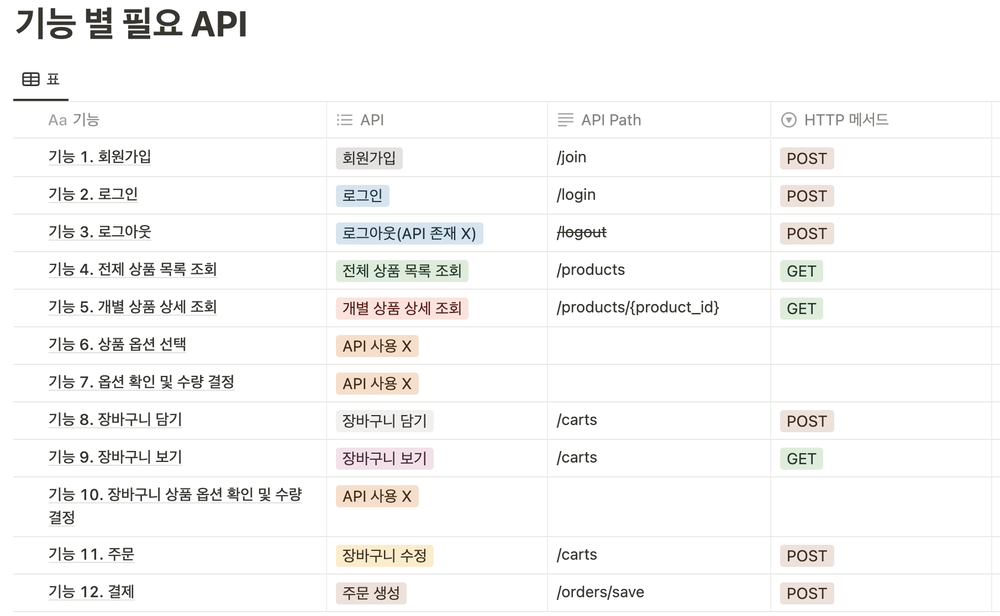
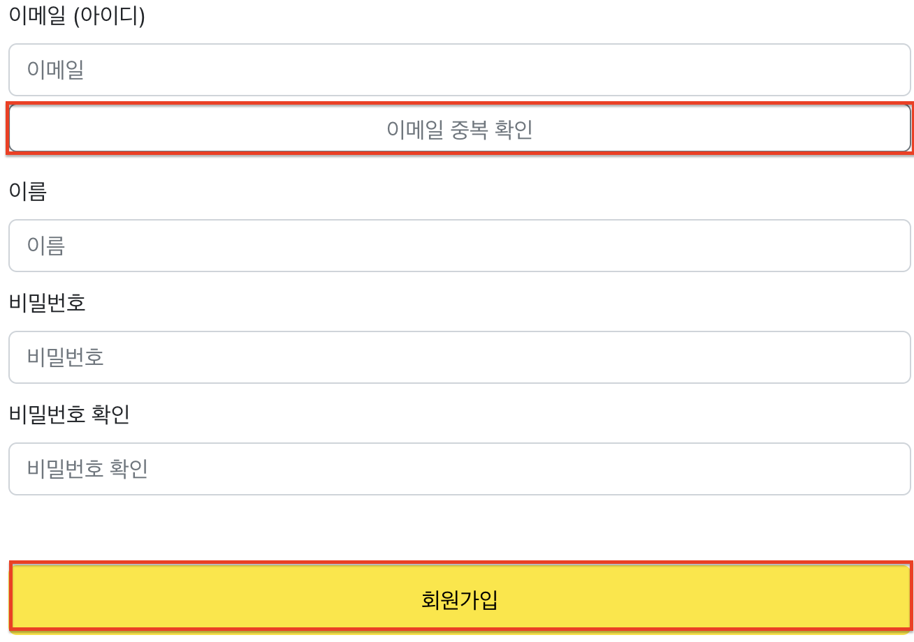
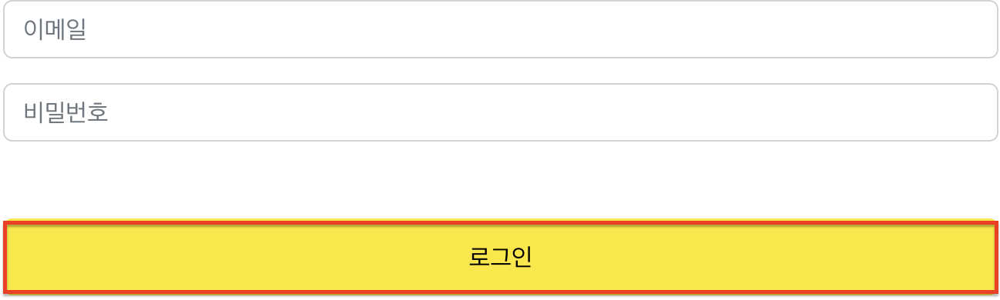
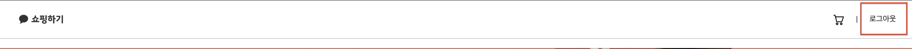
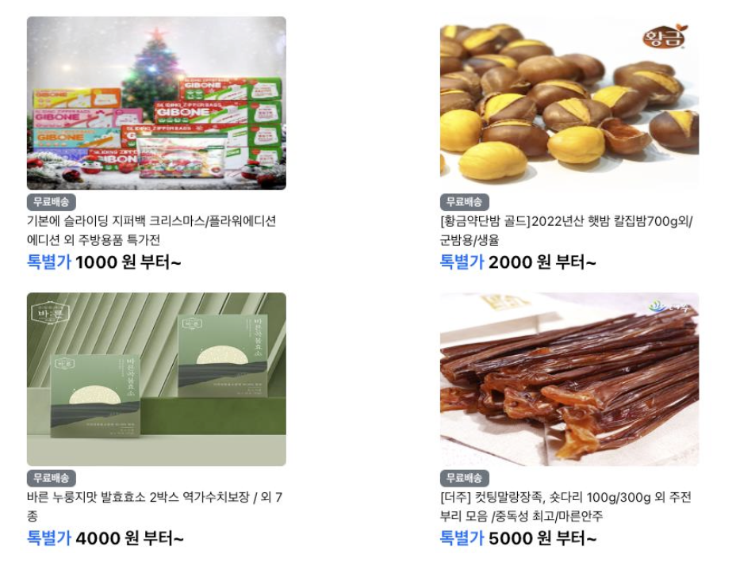
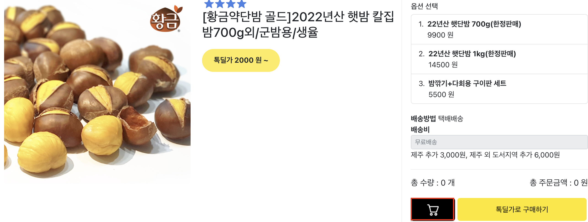
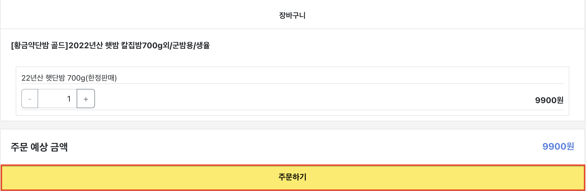
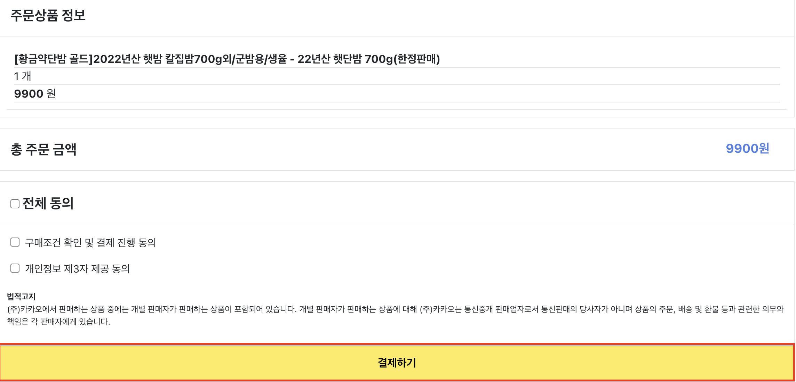
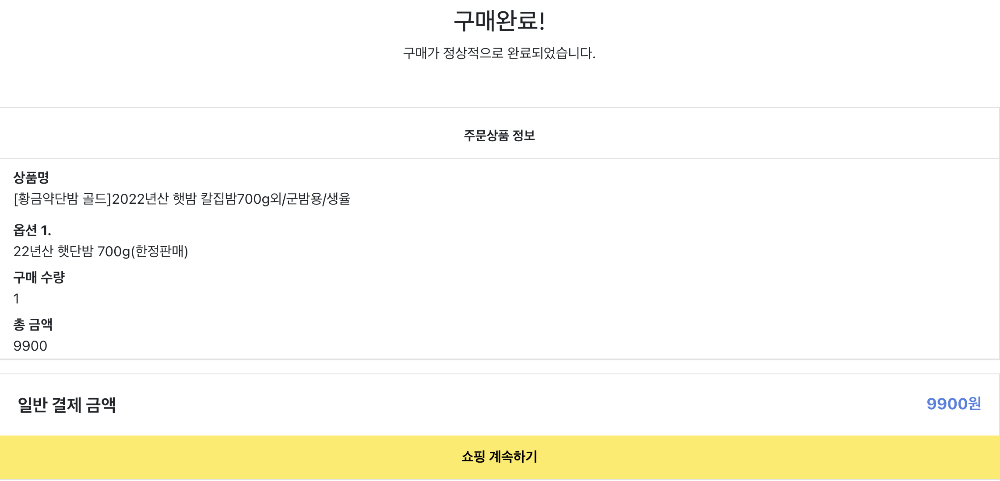

# 화면설계 →  API 매칭
## 기능 별 필요 API

----------

## 화면 별 필요 API
 

### 화면 1. 회원가입 페이지

> **필요한 기능: 회원가입  
필요한 HTTP 메서드: POST  
서버에 데이터를 전송하는 순간: 회원가입 버튼을 누를 때  
서버에 필요한 데이터(body)**:
> 
> - 이메일
> - 이름
> - 비밀번호
> 
> **클라이언트가 필요한 API**: 회원가입 API -> `/join`
> 

> **필요한 기능: 이메일 중복 확인  
필요한 HTTP 메서드: POST  
서버에 데이터를 전송하는 순간: 이메일 중복 확인 버튼을 누를 때  
서버에 필요한 데이터(body)**:
> 
> - 이메일
> 
> **클라이언트가 필요한 API**: 이메일 중복 확인 API -> `/check`
> 
 

### 화면 2. 로그인 페이지

> **필요한 기능: 로그인  
필요한 HTTP 메서드: POST  
서버에 데이터를 전송하는 순간: 로그인 버튼을 누를 때  
서버에 필요한 데이터(body)**:
> 
> - 이메일
> - 비밀번호
> 
> **클라이언트가 필요한 API**: 로그인 API -> `/login`
> 
 

### 화면 3. 로그아웃

> **필요한 기능: 로그아웃  
필요한 HTTP** : **POST  
서버에서 데이터를 전송받는 순간: 로그아웃 버튼 클릭 시  
서버에 필요한 데이터(header)**:
> 
> - 사용자 토큰
> 
> 클라이언트가 필요한 API: 로그아웃 API -> `/logout`
> 
 

### 화면 4. 인덱스 페이지

> **필요한 기능: 제품 목록 및 데이터  
필요한 HTTP 메서드: GET  
서버에서 데이터를 전송받는 순간: 화면 로딩 시  
화면을 구성하는데 필요한 데이터(response)**:
> 
> - 제품명
> - 제품 사진
> - 제품 가격(톡별가)
> 
> **클라이언트가 필요한 API**: 전체 상품 목록 조회 API -> `/products`
> 
 

### 화면 5. 상품 상세 페이지

> **필요한 기능: 제품 상세 데이터  
필요한 HTTP** : **GET  
서버에서 데이터를 전송받는 순간: 화면 로딩 시  
화면을 구성하는데 필요한 데이터(response):**
> 
> - 제품명
> - 제품 사진
> - 제품 가격(톡딜가)
> - 옵션 이름
> - 옵션 가격
> 
> 클라이언트가 필요한 API: 개별 상품 상세 조회 API -> `/products/{product_id}`
> 
 

> **필요한 기능: 장바구니 담기  
필요한 HTTP** : **POST  
서버에서 데이터를 전송받는 순간: 장바구니 버튼 클릭 시  
서버에 필요한 데이터(header)**:
> 
> - 사용자 토큰
> 
> **서버에** **필요한 데이터(body):**
> 
> - 옵션 ID
> - 수량
> 
> 클라이언트가 필요한 API: 장바구니 담기 API ->  `/carts/add`
> 
 

### 화면 6. 장바구니 페이지

> **필요한 기능: 장바구니 데이터  
필요한 HTTP** : **GET  
서버에서 데이터를 전송받는 순간: 화면 로딩 시  
서버에 필요한 데이터(header)**:
> 
> - 사용자 토큰
> 
> **화면을 구성하는데 필요한 데이터(response):**
> 
> - 제품 이름
> - 옵션 이름
> - 옵션 수량
> - 옵션 가격
> - 총 가격
> 
> 클라이언트가 필요한 API: 장바구니 조회 API -> `/carts`
> 

> **필요한 기능: 장바구니 수정  
필요한 HTTP** : **POST  
서버에서 데이터를 전송받는 순간: 주문하기 클릭 시  
서버에 필요한 데이터(header)**:
> 
> - 사용자 토큰
> 
> **서버에 필요한 데이터(body):**
> 
> - 장바구니 ID
> - 수량
> 
> 클라이언트가 필요한 API: 장바구니 조회 API -> `/carts/update`
> 
 

### 화면 7. 결제 페이지

> **필요한 기능: 장바구니 데이터  
필요한 HTTP** : **GET  
서버에서 데이터를 전송받는 순간: 화면 로딩 시  
서버에 필요한 데이터(header)**:
> 
> - 사용자 토큰
> 
> **화면을 구성하는데 필요한 데이터(response):**
> 
> - 제품 이름
> - 옵션 이름
> - 옵션 수량
> - 옵션 가격
> - 총 가격
> 
> 클라이언트가 필요한 API: 장바구니 조회 API -> `/carts`
> 

> **필요한 기능: 주문 저장  
필요한 HTTP** : **POST  
서버에서 데이터를 전송받는 순간: 결제하기 클릭 시  
서버에 필요한 데이터(header)**:
> 
> - 사용자 토큰
> 
> 클라이언트가 필요한 API: 결제하기 API -> `orders/save`
> 
 

### 화면 8. 주문 결과 확인 페이지

> **필요한 기능: 주문 데이터  
필요한 HTTP** : **GET  
서버에서 데이터를 전송받는 순간: 화면 로딩 시  
서버에 필요한 데이터(header)**:
> 
> - 사용자 토큰
> 
> **화면을 구성하는데 필요한 데이터(response):**
> 
> - 제품 이름
> - 옵션 이름
> - 수량
> - 옵션 가격
> - 총 가격
> 
> 클라이언트가 필요한 API: 주문 조회 API -> `/orders/{order_Id}`
>