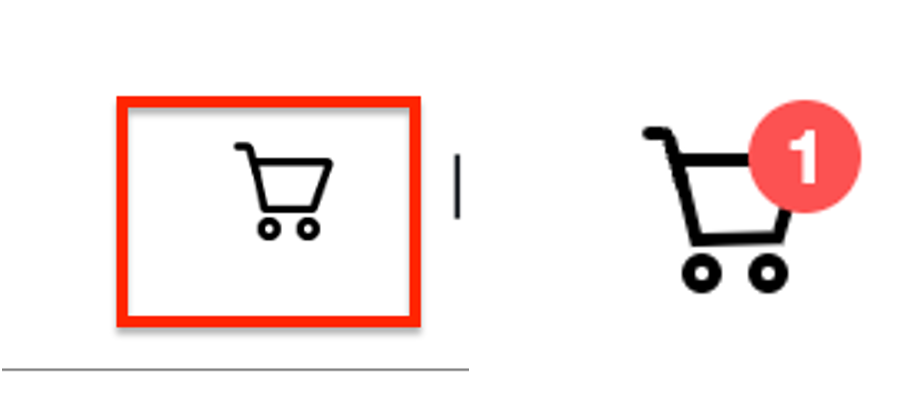
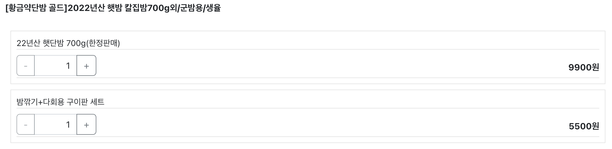
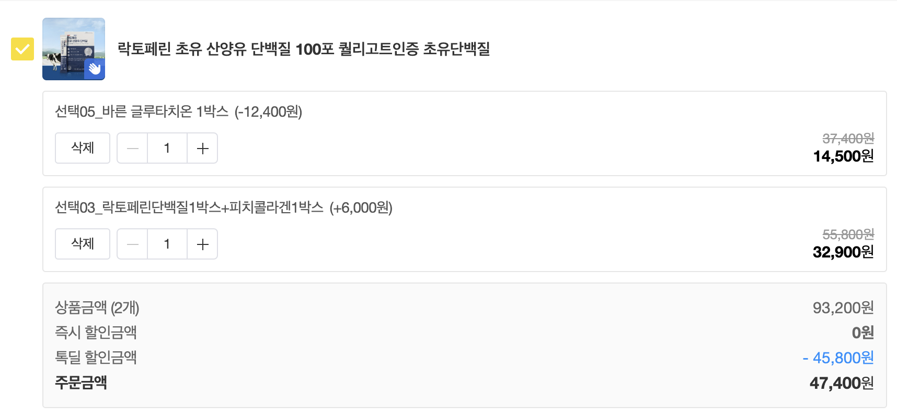
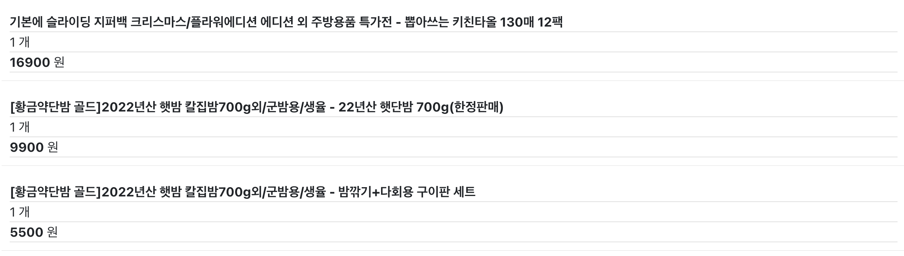
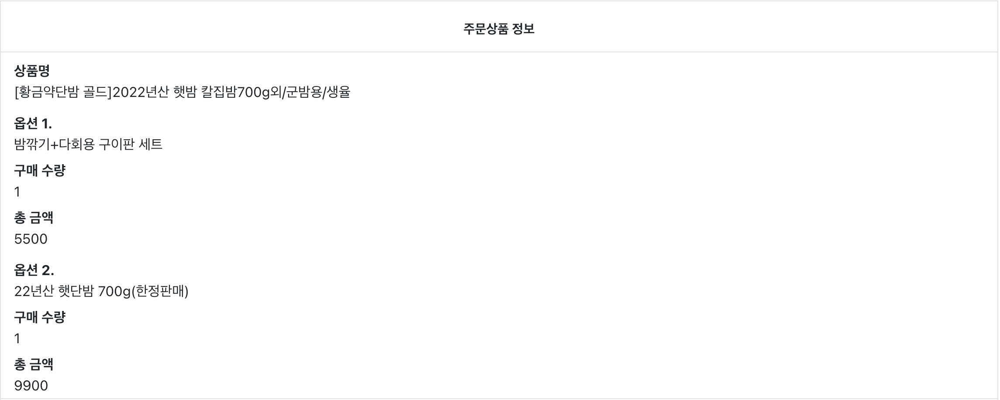
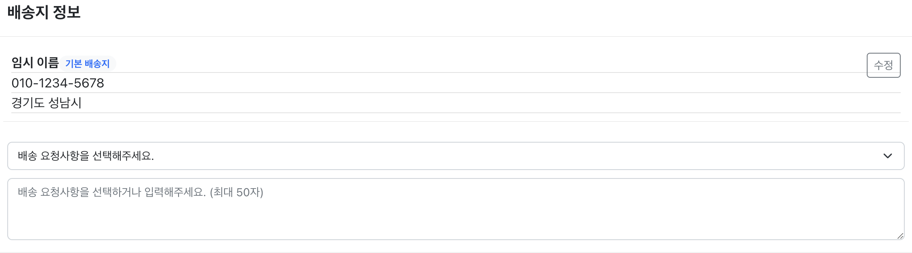

# 응답 데이터 보충

### 1. 공통

- 유저의 장바구니 물품 수를 알림으로 알려주기 위해 응답 데이터에 장바구니 물품 수를 추가로 제공해야한다.

</br> 각각 테스트와 실제 서버


</br>
</br>

### 2. 장바구니 조회

- 현재 데이터에서는 물품(product)별 총 가격을 제공하지 않고 전체 가격만 제공을 한다.


</br>

```json
{
    "id": 2,
    "productName": "[황금약단밤 골드]2022년산 햇밤 칼집밤700g외/군밤용/생율",
    "carts": [
        {
            "id": 9,
            "option": {
                "id": 6,
                "optionName": "22년산 햇단밤 700g(한정판매)",
                "price": 9900
            },
            "quantity": 1,
            "price": 9900
        },
        {
            "id": 2,
            "option": {
                "id": 8,
                "optionName": "밤깎기+다회용 구이판 세트",
                "price": 5500
            },
            "quantity": 1,
            "price": 5500
        }
    ]
},
```

- 실제 카카오 쇼핑하기 서비스에서는 물품 별 전체 가격을 제공하고 있다.


</br>
</br>

### 3. 주문하기 (장바구니 수정)

- 주문하기 페이지에서 장바구니 수정 후 응답 데이터에는 물품 제목이 없지만 프론트엔드에서는 물품 제목이 필요로 한다.
- 그래서 SQL 로그를 확인하니 현재는 장바구니 수정 후 다시 장바구니 조회를 이용해 프론트엔드에 데이터를 전달하고 있다.

```json
"carts": [
  {
      "cartId": 2,
      "optionId": 8,
      "optionName": "밤깎기+다회용 구이판 세트",
      "quantity": 1,
      "price": 5500
  },
  {
      "cartId": 3,
      "optionId": 4,
      "optionName": "뽑아쓰는 키친타올 130매 12팩",
      "quantity": 1,
      "price": 16900
  },
...
]
```

</br> 프론트 엔드에서 확인한 장바구니 데이터


</br>
</br>

### 4. 결제하기 (주문 생성) 및 주문 조회

- 결제시 주문 데이터가 생성된다.
    
    
    주문 정보 데이터 중 일부
</br>

- 하지만, 실서비스에서는 결제하기에 있던 배송지 정보도 같이 있어야 한다고 생각된다.
    
    결제하기 페이지에 있던 배송지 정보

</br>

- 추가로 주문시각도 응답 데이터에 보충해야 한다고 생각한다.