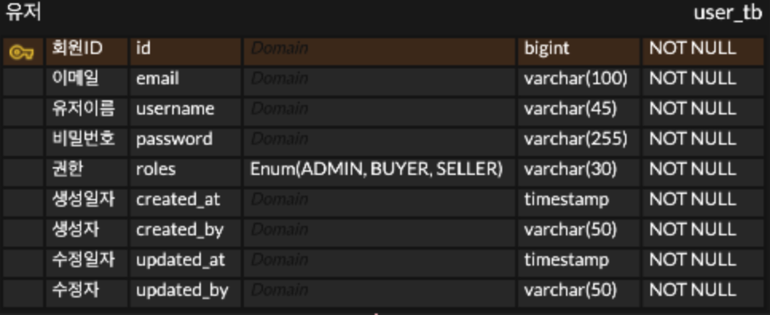
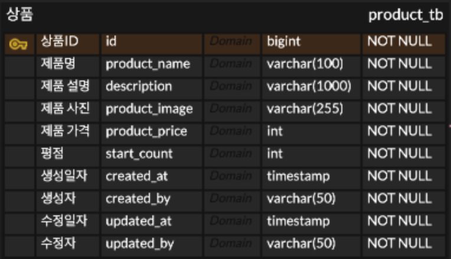

# 데이터 베이스 ERD 구현

## 전체 ERD

--------

## 공통

- 공통적으로 모든 테이블에 대해서 생성일자, 수정일자, 생성자, 수정자를 추가했습니다.
- 이는 특정 실제 서비스를 운영할 때 반드시 필요한 데이터라고 생각합니다.
- 주문, 영수증과 같이 돈이 관련된다면 더욱 필요하다고 생각합니다.

 

## 1. 사용자(User)

 

- API에 어드민 기능이 있는 것을 미루어 보아 권한이 필요해 보였습니다.
- 현재는 역할에 포함된 SELLER의 경우 실제 구현한다면 사업자 등록증, 회사등이 포함된 다른 테이블 사용할 듯 합니다.

 

## 2. 상품(Product)

 

- API나 화면설계상 해당하는 컬럼만 존재하면 될 듯 합니다.

 

## 3. 옵션(Option)

 

- 옵션의 경우 상품ID를 외래키로 가집니다.
- 현재 선택한 것은 상품이 만들어지면 무조건 옵션도 한 개 이상 존재한다는 조건의 연관관계를 설정했습니다.
- 이는 화면 설계서이나 API 문서에 맞춘 테이블입니다.
- 하지만 실제 서비스에는 다음과 같이 옵션이 없는 경우도 존재합니다.
    
    
  
   

- 위 경우에서는 상품이 존재해도 옵션이 없을 수 있게 조건을 변경해줘야 합니다.
- 그러나 이렇게 되면 이후 장바구니, 주문 상품이 옵션 테이블을 의존하는 상황에서 API가 제대로 나오지 않게 됩니다.
- 옵션 테이블이 이후 다른 테이블에 많은 영향을 미치기 때문에 섣불리 구조를 변경한다면 주어진 API 맞게 나오지 않을 가능성이 높아 보입니다.
- **이러한 상황에서는 어떻게 해결하는 것이 좋을지 궁금합니다.**

 

## 4. 장바구니(Cart)

 

- 장바구니 테이블은 유저 ID와 옵션 ID를 외래키로 가집니다.
- 이때, 유저와 옵션이 있더라도 장바구니는 없을 수 있기 때문에 위와 같은 연관관계 연결을 했습니다.
- **만약 장바구니 가격 컬럼이 존재한다면, 옵션의 가격이 변경됐을때 옵션ID에 해당하는 모든 장바구니 가격 데이터가 수정되어야 하는 상황이 발생할 것 같아 제외했습니다.**

 

## 5. 주문 & 주문 상품

 

- 현재 서비스 로직 상 주문이 생성될 때 장바구니 데이터를 비우게 됩니다.
- 그렇기에 주문한 상품들에 대해서 저장할 다른 테이블이 필요하게 됩니다.
- 장바구니 테이블의 컬럼들과 거의 같은 item 테이블을 만들어 이를 해결했습니다.
- 이때, 장바구니 가격 컬럼처럼 옵션 가격 변경 시 옵션ID에 해당하는 모든 주문 상품 가격 데이터를 수정할 필요가 없다고 판단됩니다.
- 이는 주문 조회 시 주문한 상품의 가격이 변동되면 사용자가 오히려 혼란을 느낄 가능성이 크다고 생각되어 한번 주문 시 옵션의 가격에 영향받지 않도록 했습니다.