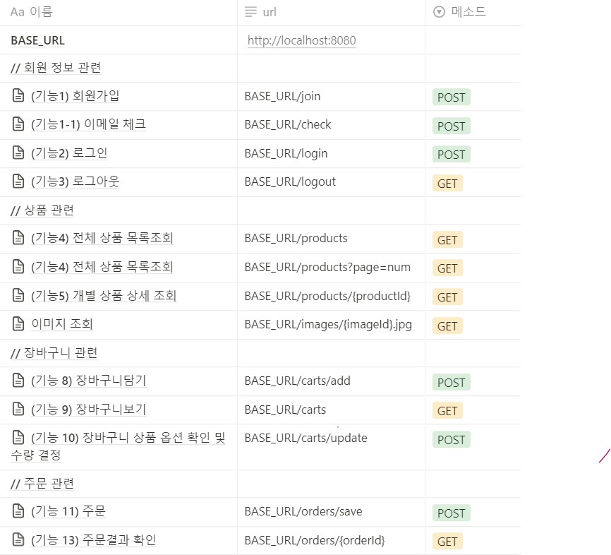
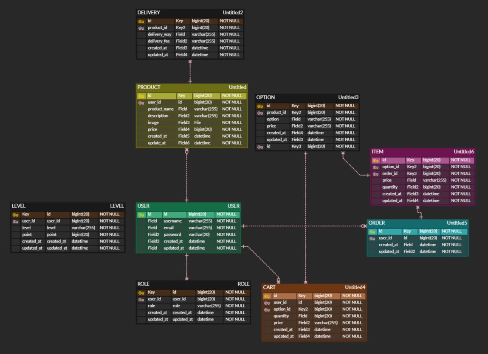

# Step-2.-Week-1
카카오 테크 캠퍼스 2단계 - BE - 1주차 클론 과제 제출(남원정)
</br>
</br>

## **과제명**
```
1. 요구사항분석/API요청 및 응답 시나리오 분석
2. 요구사항 추가 반영 및 테이블 설계도
```

## **목차**
[과제1 - 부족한 기능](#부족한-기능)

[과제2 - API 명세서](#api-명세서)

- [회원가입](#기능1-회원가입)

- [이메일체크](#기능1-1-이메일-체크)

- [로그인](#기능2-로그인)

- [로그아웃](#기능3-로그아웃)

- [전체 상품 목록 조회](#기능4-전체-상품-목록조회)

- [페이지별 전체 상품 목록 조회](#기능4-1-페이지별-전체-상품-목록조회)

- [개별 상품 상세 조회](#기능5-개별-상품-상세-조회)

- [장바구니 담기](#기능8-장바구니-담기)

- [장바구니 보기](#기능9-장바구니-보기)

- [장바구니 상품 옵션 확인 및 수량 결정](#기능10-장바구니-상품-옵션-확인-및-수량-결정)
    
- [주문](#기능11-주문)
    
- [주문결과 확인](#기능13-주문결과-확인)

[과제3 - 부족한 데이터](#부족한-데이터)

[과제4 - ERD](#er-diagram)


## **부족한 기능**
1. 상품 등록
    >- 판매자, 소비자 역할 분류 필요
    >- 상품 등록 API 생성

2. 사용자가 장바구니를 직접 삭제

3. 회원탈퇴


## **API 명세서**


### (기능1) 회원가입 
- API: **BASE_URL/join**
- **Body**
    - raw, JSON
    ```json
    {
        "username": "meta",
        "email": "meta@nate.com",
        "password": "meta1234"
    }
    ```
- **Success Response**
    - **Code**: 200
    - **Body**
        ```json
        {
            "success": true,
            "response": null,
            "error": null
        }
        ```
- **제약 조건**
    - 이메일(아이디) 유효성 검사
        - `(영문+숫자)@(영문+숫자).(영문+숫자)`
    - 비밀번호 유효성 검사
        - 영문, 숫자, 특수문자 포함
        - 공백 없음
        - 8~20자
- **에러 나는 경우**
    - 이메일, 비밀번호 제약조건 미충족
    - username, email, password 중 하나라도 비어있을 경우
    - 이미 존재하는 email일 경우


### (기능1-1) 이메일 체크 
- API: **BASE_URL/check**
- **Body**
    - raw, JSON
    ```json
    {
        "email": "meta@nate.com"
    }
    ```
- **Success Response**
    - **Code**: 200
    - **Body**
        ```json
        {
            "success": true,
            "response": null,
            "error": null
        }
        ```
- **에러 나는 경우**
    - 이메일 제약조건 미충족
    - 이미 존재하는 이메일일 경우

### (기능2) 로그인
- API: **BASE_URL/login**
- **Body**
    - raw, JSON
    ```json
    {
        "email": "ssar@nate.com",
        "password": "meta1234!"
    }
    ```
- **Success Response**
    - **Code**: 200
    - **Body**
        ```json
        {
            "success": true,
            "response": null,
            "error": null
        }
        ```
- **에러 나는 경우**
    - 이메일, 비밀번호 제약조건 미충족
    - 존재하지 않는 user일 경우

### (기능3) 로그아웃
- API: **BASE_URL/logout**
- **Auth**
    - **Type**: Bearer Token
    - **Token**: `{{token}}`
- **Success Response**
    - **Code**: 200
    - **Body**
        ```json
        {
            "success": true,
            "response": null,
            "error": null
        }
        ```
- **에러 나는 경우**
    - 토큰이 잘못된 경우


### (기능4) 전체 상품 목록조회
- API: **BASE_URL/products**
- **Success Response**
    - **Code**: 200
    - **Body**
        ```json
        {
            "success": true,
            "response": [
                {
                    "id": 1,
                    "productName": "기본에 슬라이딩 지퍼백 크리스마스/플라워에디션 에디션 외 주방용품 특가전",
                    "description": "",
                    "image": "/images/1.jpg",
                    "price": 1000
                },
                {
                    "id": 2,
                    "productName": "[황금약단밤 골드]2022년산 햇밤 칼집밤700g외/군밤용/생율",
                    "description": "",
                    "image": "/images/2.jpg",
                    "price": 2000
                }
            ],
            "error": null
        }
        ```

### (기능4-1) 페이지별 전체 상품 목록조회
- API: **BASE_URL/products?page=number**
- **URL Params**
    - key: page, value: number
- **Success Response**
    - **Code**: 200
    - **Body**
        ```json
        {
            "success": true,
            "response": [
                {
                    "id": 1,
                    "productName": "기본에 슬라이딩 지퍼백 크리스마스/플라워에디션 에디션 외 주방용품 특가전",
                    "description": "",
                    "image": "/images/1.jpg",
                    "price": 1000
                },
                {
                    "id": 2,
                    "productName": "[황금약단밤 골드]2022년산 햇밤 칼집밤700g외/군밤용/생율",
                    "description": "",
                    "image": "/images/2.jpg",
                    "price": 2000
                }
            ],
            "error": null
        }
        ```
### (기능5) 개별 상품 상세 조회
- API: **BASE_URL/products/{productId}**
- **Success Response**
    - **Code**: 200
    - **Body**
        ```json
        {
            "success": true,
            "response": {
                "id": 1,
                "productName": "기본에 슬라이딩 지퍼백 크리스마스/플라워에디션 에디션 외 주방용품 특가전",
                "description": "",
                "image": "/images/1.jpg",
                "price": 1000,
                "starCount": 5,
                "options": [
                    {
                        "id": 1,
                        "optionName": "01. 슬라이딩 지퍼백 크리스마스에디션 4종",
                        "price": 10000
                    },
                    {
                        "id": 2,
                        "optionName": "02. 슬라이딩 지퍼백 플라워에디션 5종",
                        "price": 10900
                    },
                    {
                        "id": 3,
                        "optionName": "고무장갑 베이지 S(소형) 6팩",
                        "price": 9900
                    },
                    {
                        "id": 4,
                        "optionName": "뽑아쓰는 키친타올 130매 12팩",
                        "price": 16900
                    },
                    {
                        "id": 5,
                        "optionName": "2겹 식빵수세미 6매",
                        "price": 8900
                    }
                ]
            },
            "error": null
        }
        ```
- **에러 나는 경우**
    - productId가 존재하지 않는 경우
    - productId가 숫자가 아닌 경우


### (기능8) 장바구니 담기
- API: **BASE_URL/carts/add**
- **Auth**
    - **Type**: Bearer Token
    - **Token**: `{{token}}`
- **Body**
    - raw, JSON
    ```json
    [
        {
            "optionId":1,
            "quantity":5
        },
        {
            "optionId":2,
            "quantity":5
        }
    ]
    ```
- **Success Response**
    - **Code**: 200
    - **Body**
        ```json
        {
            "success": true,
            "response": null,
            "error": null
        }
        ```
- **에러 나는 경우**
    - optionId가 잘못된 경우
    - 동일한 option을 넣은 경우

### (기능9) 장바구니 보기
- API: **BASE_URL/carts**
- **Auth**
    - **Type**: Bearer Token
    - **Token**: `{{token}}`
- **Success Response**
    - **Code**: 200
    - **Body**
        ```json
        {
            "success": true,
            "response": {
                "products": [
                    {
                        "id": 1,
                        "productName": "기본에 슬라이딩 지퍼백 크리스마스/플라워에디션 에디션 외 주방용품 특가전",
                        "carts": [
                            {
                                "id": 2,
                                "option": {
                                    "id": 1,
                                    "optionName": "01. 슬라이딩 지퍼백 크리스마스에디션 4종",
                                    "price": 10000
                                },
                                "quantity": 5,
                                "price": 50000
                            },
                            {
                                "id": 3,
                                "option": {
                                    "id": 2,
                                    "optionName": "02. 슬라이딩 지퍼백 플라워에디션 5종",
                                    "price": 10900
                                },
                                "quantity": 5,
                                "price": 54500
                            }
                        ]
                    }
                ],
                "totalPrice": 104500
            },
            "error": null
        }
        ```
- **에러 나는 경우**
    - 토큰이 잘못된 경우


### (기능10) 장바구니 상품 옵션 확인 및 수량 결정
- API: **BASE_URL/carts/update**
- **Auth**
    - **Type**: Bearer Token
    - **Token**: `{{token}}`
- **Body**
    - raw, JSON
    ```json
    [
        {
        "cartId":1,
        "quantity":1
        },
        {
        "cartId":2,
        "quantity":1
        }
    ]
    ```
- **Success Response**
    - **Code**: 200
    - **Body**
        ```json
        {
            "success": true,
            "response": {
                "carts": [
                    {
                        "cartId": 1,
                        "optionId": 1,
                        "optionName": "01. 슬라이딩 지퍼백 크리스마스에디션 4종",
                        "quantity": 1,
                        "price": 10000
                    },
                    {
                        "cartId": 2,
                        "optionId": 2,
                        "optionName": "02. 슬라이딩 지퍼백 플라워에디션 5종",
                        "quantity": 1,
                        "price": 10900
                    }
                ],
                "totalPrice": 20900
            },
            "error": null
        }
        ```
- **에러 나는 경우**
    - 장바구니에 없는 내용 주문할 경우


### (기능11) 주문
- API: **BASE_URL/orders/save**
- **Auth**
    - **Type**: Bearer Token
    - **Token**: `{{token}}`
- **Success Response**
    - **Code**: 200
    - **Body**
        ```json
        {
            "success": true,
            "response": {
                "id": 1,
                "products": [
                    {
                        "productName": "기본에 슬라이딩 지퍼백 크리스마스/플라워에디션 에디션 외 주방용품 특가전",
                        "items": [
                            {
                                "id": 1,
                                "optionName": "01. 슬라이딩 지퍼백 크리스마스에디션 4종",
                                "quantity": 1,
                                "price": 10000
                            },
                            {
                                "id": 2,
                                "optionName": "02. 슬라이딩 지퍼백 플라워에디션 5종",
                                "quantity": 1,
                                "price": 10900
                            }
                        ]
                    }
                ],
                "totalPrice": 20900
            },
            "error": null
        }
        ```

### (기능13) 주문결과 확인
- API: **BASE_URL/orders/{orderId}**
- **Auth**
    - **Type**: Bearer Token
    - **Token**: `{{token}}`
- **Success Response**
    - **Code**: 200
    - **Body**
        ```json
        {
            "success": true,
            "response": {
                "id": 1,
                "products": [
                    {
                        "productName": "기본에 슬라이딩 지퍼백 크리스마스/플라워에디션 에디션 외 주방용품 특가전",
                        "items": [
                            {
                                "id": 1,
                                "optionName": "01. 슬라이딩 지퍼백 크리스마스에디션 4종",
                                "quantity": 1,
                                "price": 10000
                            },
                            {
                                "id": 2,
                                "optionName": "02. 슬라이딩 지퍼백 플라워에디션 5종",
                                "quantity": 1,
                                "price": 10900
                            }
                        ]
                    }
                ],
                "totalPrice": 20900
            },
            "error": null
        }
        ```


## **부족한 데이터**
```
배송 관련 데이터
: 개별 상품 상세 조회 시 배송방법, 배송비
```

## **ER-Diagram**

