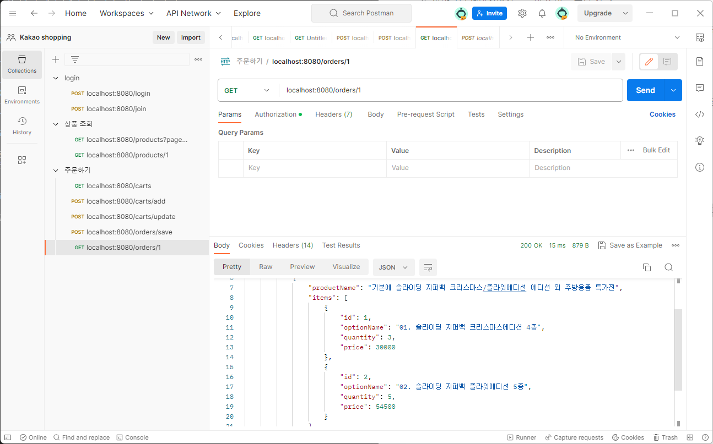
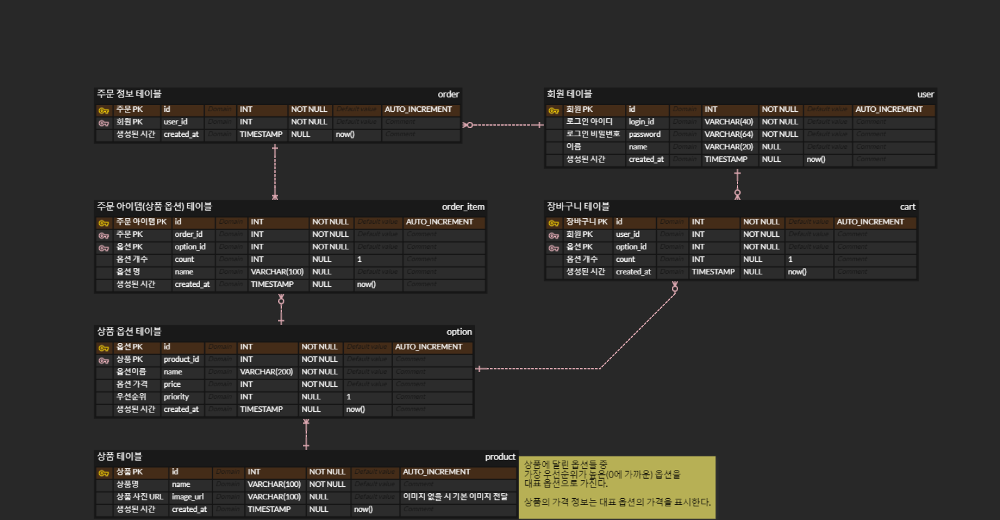

# step2-BE-kakao-shop
카카오 테크 캠퍼스 2단계 카카오 쇼핑하기 백엔드 클론 프로젝트 레포지토리입니다.

<details>
    <summary><h2>1주차</h2></summary>

카카오 테크 캠퍼스 2단계 - BE - 1주차 클론 과제

<details>
    <summary><h3>과제 설명</h3></summary>

#### **과제명**
```
1. 요구사항분석/API요청 및 응답 시나리오 분석
2. 요구사항 추가 반영 및 테이블 설계도
```

#### **과제 설명**
```
1. 요구사항 시나리오를 보고 부족해 보이는 기능을 하나 이상 체크하여 README에 내용을 작성하시오.
2. 제시된 화면설계를 보고 해당 화면설계와 배포된 기존 서버의 API주소를 매칭하여 README에 내용을 작성하시오. (카카오 화면설계 시나리오가 있음)
3. 배포된 서버에 모든 API를 POSTMAN으로 요청해본 뒤 응답되는 데이터를 확인하고 부족한 데이터가 무엇인지 체크하여 README에 내용을 작성하시오.
4. 테이블 설계를 하여 README에 ER-Diagram을 추가하여 제출하시오.
```

</br>

#### **과제 상세 : 수강생들이 과제를 진행할 때, 유념해야할 것**
아래 항목은 반드시 포함하여 과제 수행해주세요!
>- 부족한 기능에 대한 요구사항을 미리 예상할 수 있는가? (예를 들면 상품등록 api가 기존 요구사항에는 없는데 추후 필요하지는 않을지, 이런 부분들을 생각하였는지) 
>- 요구사항에 맞는 API를 분석하고 사용자 시나리오를 설계하였는가? (예를 들어 배포된 서버와 화면 설계를 제시해줄 예정인데, 특정 버튼을 클릭했을 때 어떤 API가 호출되어야 할지를 아는지)
>- 응답되는 데이터가 프론트앤드 화면에 모두 반영될 수 있는지를 체크하였는가?(예를 들어 배송관련 비용이 있는데, 이런것들이 API에는 없는데 이런 부분을 캐치할 수 있는지)
>- 테이블 설계가 모든 API를 만족할 수 있게 나왔는가? (테이블이 효율적으로 나왔는가 보다는 해당 테이블로 요구사항을 만족할 수 있는지에 대한 여부만)
>- 테이블명이 이해하기 쉽게 만들어졌는가? (상품테이블이 product이면 이해하기 쉽지만, material이라고 하면 이해하기 어렵기 때문)

</br>

#### **코드리뷰 관련: PR시, 아래 내용을 포함하여 코멘트 남겨주세요.**
**1. PR 제목과 내용을 아래와 같이 작성 해주세요.**

>- PR 제목 : 부산대BE_라이언_1주차 과제

</br>

**2. PR 내용 :**

>- 코드 작성하면서 어려웠던 점
>- 코드 리뷰 시, 멘토님이 중점적으로 리뷰해줬으면 하는 부분

</details>

### 과제1

**요구사항 시나리오를 보고 부족해 보이는 기능을 하나 이상 체크하여 README에 내용을 작성하시오.**

- 회원정보 변경이 없음
- 장바구니에서 물품삭제(0개로 만들기)가 안됨
- 결제 내역 확인

> 현재 쇼핑몰의 구조는 구매자에게만 치중되어 있고 판매자(or 쇼핑몰 관리자)에 대한 UI가 존재하지 않는다.  
> 변동이 되기 쉬운 상품 가격 수정, 새로운 상품 등록, 상품 품절 처리 등을 할 수 있게 하는 관리자 페이지가 필요 할 것이다.  
> 관리자가 프로그래머라면 직접 db에 조작을 할 수 있겠지만, db에 직접 query를 보내는 일은 매우 위험하고 부적절한 행위로 가능하다면 관리자용 api도 만드는 편이 낫다.

### 과제2

**제시된 화면설계를 보고 해당 화면설계와 배포된 기존 서버의 API주소를 매칭하여 README에 내용을 작성하시오. (카카오 화면설계 시나리오가 있음)**

> 제시된 화면 설계의 작업명에 필요한 api 주소를 매칭하였다.

- **(기능 1) 회원 가입**
    - 회원가입 버튼 클릭 시->
    - `POST` /join
- **(기능 2) 로그인**
    - 로그인 버튼 클릭 시 ->
    - `POST` /login
- **(기능 3) 로그아웃**
    - 로그아웃에 대한 api는 따로 존재하지 않는데 front에서 저장하고 있는 JWT 토큰을 삭제하면 된다.
- **(기능 4) 전체 상품 목록 조회**
    - 메인 페이지(상품 목록 페이지) 접근 시 ->
    - -> `GET` /products
- **(기능 5) 개별 상품 상세 조회**
    - 개별 상품 클릭 or 개별 상품 페이지 접근 시 ->
    - `GET` /products/{product_id}
- **(기능 6) 상품 옵션 선택**
    - (기능 5)에서 상품 정보와 상품에 맞는 옵션까지 반환 했으므로 client는 추가로 api를 요청하지 않고 옵션을 선택할 수 있다.
- **(기능 7) 옵션 확인 및 수량 결정**
    - 이미 선택한 옵션은 client에서 보관되며 아직 서버로 넘어오지 않아 api가 필요하지 않다.
- **(기능 8) 장바구니 담기**
    - 장바구니 클릭 시 ->
    - `POST` /carts/add
- **(기능 9) 장바구니 보기**
    - 장바구니 페이지 접근 시 ->
    - `GET` /carts
- **(기능 10) 장바구니 상품 옵션 확인 및 수량 결정**
    - `상품 페이지의 옵션 확인 및 수량 결정`과 동일하게 변경한 정보는 client에만 존재하고 아직 서버로 넘어가지 않는다.
- **(기능 11) 주문**
    - 장바구니 페이지에서 주문하기 버튼 클릭 시 ->
    - `POST` /carts/update
        - 옵션 정보를 바탕으로 장바구니를 업데이트하며 결제페이지로 넘어간다.
    - **※참고※** api 문서에서는 `장바구니 수정`으로 되어 있음
- **(기능 12) 결제**
    - 주문 및 결제 페이지에서 결제하기 버튼 클릭 시 ->
    - `POST` /orders/save
        - 장바구니(cart) 테이블에서 정보가 삭제되며 order테이블에 동일한 정보가 기록된다.
    - **※참고※** api 문서에서는 `주문하기`로 되어 있음
- **(기능 13) 주문 결과 확인**
    - 결제하기 버튼을 클릭하여 `POST` /orders/save가 성공적으로 이루어졌을 시 ->
    - `GET` /orders/{order_id}

### 과제3

**배포된 서버에 모든 API를 POSTMAN으로 요청해본 뒤 응답되는 데이터를 확인하고 부족한 데이터가 무엇인지 체크하여 README에 내용을 작성하시오.**



- `POST` /carts/update에서 상품 이름의 정보가 존재하지 않는다.
    - 아래는 `POST` /carts/update의 예시 response body이다.  
    ```
    {
        "success": true,
        "response": {
            "carts": [
                {
                    "cartId": 3,
                    "optionId": 1,
                    "optionName": "01. 슬라이딩 지퍼백 크리스마스에디션 4종",
                    "quantity": 3,
                    "price": 30000
                },
                {
                    "cartId": 4,
                    "optionId": 2,
                    "optionName": "02. 슬라이딩 지퍼백 플라워에디션 5종",
                    "quantity": 5,
                    "price": 54500
                }
            ],
            "totalPrice": 84500
        },
        "error": null
    }
    ```
    - cart 테이블에 있는 내용만 돌려주고 있어 제품명을 알 수가 없다.
    - 이는 불필요한 다수의 api 요청을 유발시킨다.
    - `주문하기` 버튼을 눌러 `결제 화면`으로 넘어 오면서 제품명에 대한 정보와 함께 각 제품에 할당되는 옵션 정보로 묶어서 보내주어야 사용자에게 친화적인 UI를 나타낼 수 있을 것이다.
    - 현재의 response로는 어떤 옵션이 어떤 제품의 옵션인지 알 수 없고, 단순히 옵션들의 리스트가 화면에 뿌려지게 될 것이다.

### 과제4

**테이블 설계를 하여 README에 ER-Diagram을 추가하여 제출하시오.**



- 상품 테이블에 상품 가격이 필요할까??
    - 상품은 1개 이상의 옵션을 가지고 있고 실제 판매되는 것은 옵션이다.
    - 따라서 상품이 price를 가지게 되면 이는 어떤 한 옵션의 price가 된다.
    - 이는 데이터의 중복으로 오류로 인해 서로 다른 값을 가지게 되는 경우가 발생할 수 있다.
    - 따라서 가격 정보를 상품 테이블에서 삭제한 후, 옵션 테이블에 `priority` 속성을 부여했다.
    - 상품은 우선순위를 바탕으로 옵션들 중 대표 옵션을 찾을 수 있고 대표 옵션의 가격을 상품의 가격으로 제공된다.

### 추가 - pdf 과제

[`docs/1주차 - 테이블 설계하기 (문제 풀이 - 부산대BE_안혜준)`](https://github.com/jagaldol/step2-BE-kakao-shop/blob/feat-anhyejun/docs/1주차-테이블_설계하기.pdf)로 pdf 첨부 하였습니다.

</details>

<details open>
    <summary><h2>2주차</h2></summary>

카카오 테크 캠퍼스 2단계 - BE - 2주차 클론 과제

<details>
    <summary><h3>과제설명<h3></summary>

#### **과제명**
```
1. 전체 API 주소 설계
2. Mock API Controller 구현
```

#### **과제 설명**
```
1. API주소를 설계하여 README에 내용을 작성하시오.
2. 가짜 데이터를 설계하여 응답하는 스프링부트 컨트롤러를 작성하고 소스코드를 업로드하시오.
```

</br>

#### **과제 상세 : 수강생들이 과제를 진행할 때, 유념해야할 것**
아래 항목은 반드시 포함하여 과제 수행해주세요!
>- User 도메인을 제외한 전체 API 주소 설계가 RestAPI 맞게 설계되었는가?  POST와 GET으로만 구현되어 있어도 됨.	
>- 가짜 데이터를 설계하여 Mock API를 잘 구현하였는가? (예를 들어 DB연결없이 컨트롤러만 만들어서 배포된 서버의 응답과 동일한 형태로 데이터가 응답되는지 여부)
>- DTO에 타입은 올바르게 지정되었는가?
>- DTO에 이름은 일관성이 있는가? (예를 들어 어떤 것은 JoinDTO, 어떤 것은 joinDto, 어떤 것은 DtoJoin 이런식으로 되어 있으면 일관성이 없는것이다)
>- DTO를 공유해서 쓰면 안된다 (동일한 데이터가 응답된다 하더라도, 화면은 수시로 변경될 수 있기 때문에 DTO를 공유하고 있으면 배점을 받지 못함)
</br>

#### **코드리뷰 관련: PR시, 아래 내용을 포함하여 코멘트 남겨주세요.**
**1. PR 제목과 내용을 아래와 같이 작성 해주세요.**

>- PR 제목 : 부산대BE_라이언_2주차 과제

</br>

**2. PR 내용 :**

>- 코드 작성하면서 어려웠던 점
>- 코드 리뷰 시, 멘토님이 중점적으로 리뷰해줬으면 하는 부분

</details>

### 1. API주소를 설계하여 README에 내용을 작성하시오.

현재 API는 총 9개로 다음과 같습니다.

* POST /login
* POST /join
* GET /products
* GET /products/{id}
* GET /carts
* POST /carts/add
* POST /carts/update
* POST /orders/save
* GET /orders/{id}

이 중 RestAPI 설계 상 옳지 않은 API 주소는 3개입니다.

* POST /carts/add
* POST /carts/update
* POST /orders/save

이는 전통적인 GET과 POST만 사용하는 url 방식으로, 현재는 GET/POST/PUT/DELETE의 메서드를 사용해 url에 동사(행위)를 적지 않는 Rest형식이 권장되고 있습니다.

따라서 위의 3개를 아래와 같이 바꿔볼 수 있습니다.

* POST /carts
* PUT /carts
* POST /orders

이렇게 하면 행위는 메서드 타입으로 알 수 있으며, url은 명사만을 가지게 되어 보다 직관적인 url이 되게 됩니다.

따라서 최종 API 주소 설계는 다음과 같습니다.

```
POST /login
POST /join
GET /products
GET /products/{id}
GET /carts
POST /carts
PUT /carts
POST /orders
GET /orders/{id}
```


### 2. 가짜 데이터를 설계하여 응답하는 스프링부트 컨트롤러를 작성하고 소스코드를 업로드하시오.

주어진 소스코드를 바탕으로 API 문서엔 존재하지만 API가 만들어져있지 않은 부분을 구현하였습니다.

* POST /carts/add
* POST /carts/update
* POST /orders/save
* GET /orders/{id}

위의 총 4개의 API가 존재하지않았고, 각각에 대한 requestDTO와 responseDTO를 제작하였습니다.

</details>

<details>
    <summary><h2>3주차</h2></summary>

카카오 테크 캠퍼스 2단계 - BE - 3주차 클론 과제
</br>
</br>

### **과제명**
```
1. 레포지토리 단위테스트
```

### **과제 설명**
```
1. 레포지토리 단위테스트를 구현하여 소스코드를 제출하시오.
2. 쿼리를 테스트하면서 가장 좋은 쿼리를 작성해보시오.
```

</br>

### **과제 상세 : 수강생들이 과제를 진행할 때, 유념해야할 것**
아래 항목은 반드시 포함하여 과제 수행해주세요!
>- 레포지토리 단위테스트가 구현되었는가?
>- 테스트 메서드끼리 유기적으로 연결되지 않았는가? (테스트는 격리성이 필요하다)
>- Persistene Context를 clear하여서 테스트가 구현되었는가? (더미데이터를 JPA를 이용해서 insert 할 예정인데, 레포지토리 테스트시에 영속화된 데이터 때문에 쿼리를 제대로 보지 못할 수 있기 때문에)
>- 테스트 코드의 쿼리 관련된 메서드가 너무 많은 select를 유발하지 않는지? (적절한 한방쿼리, 효율적인 in query, N+1 문제 등이 해결된 쿼리)
>- BDD 패턴으로 구현되었는가? given, when, then
</br>

### **코드리뷰 관련: PR시, 아래 내용을 포함하여 코멘트 남겨주세요.**
**1. PR 제목과 내용을 아래와 같이 작성 해주세요.**

>- PR 제목 : 부산대BE_라이언_3주차 과제

</br>

**2. PR 내용 :**

>- 코드 작성하면서 어려웠던 점
>- 코드 리뷰 시, 멘토님이 중점적으로 리뷰해줬으면 하는 부분

</details>

<details>
    <summary><h2>4주차</h2></summary>

카카오 테크 캠퍼스 2단계 - BE - 4주차 클론 과제
</br>
</br>

### **과제명**
```
1. 컨트롤러 단위 테스트
```

### **과제 설명**
```
1. 컨트롤러 단위테스트를 작성한뒤 소스코드를 업로드하시오.
2. stub을 구현하시오.
```

</br>

### **과제 상세 : 수강생들이 과제를 진행할 때, 유념해야할 것**
아래 항목은 반드시 포함하여 과제 수행해주세요!
>- 컨트롤러 단위테스트가 구현되었는가?
>- Mockito를 이용하여 stub을 구현하였는가?
>- 인증이 필요한 컨트롤러를 테스트할 수 있는가?
>- 200 ok만 체크한 것은 아닌가? (해당 컨트롤러에서 제일 필요한 데이터에 대한 테스트가 구현되었는가?)
>- 모든 요청과 응답이 json으로 처리되어 있는가?
</br>

### **코드리뷰 관련: PR시, 아래 내용을 포함하여 코멘트 남겨주세요.**
**1. PR 제목과 내용을 아래와 같이 작성 해주세요.**

>- PR 제목 : 부산대BE_라이언_4주차 과제 

</br>

**2. PR 내용 :**

>- 코드 작성하면서 어려웠던 점
>- 코드 리뷰 시, 멘토님이 중점적으로 리뷰해줬으면 하는 부분

</details>

<details>
    <summary><h2>5주차</h2></summary>

카카오 테크 캠퍼스 2단계 - BE - 5주차 클론 과제
</br>
</br>

### **과제명**
```
1. 실패 단위 테스트
```

### **과제 설명**
```
1. 컨트롤러 단위테스트를 구현하는데, 실패 테스트 코드를 구현하시오.
2. 어떤 문제가 발생할 수 있을지 모든 시나리오를 생각해본 뒤, 실패에 대한 모든 테스트를 구현하시오.
```

</br>

### **과제 상세 : 수강생들이 과제를 진행할 때, 유념해야할 것**
아래 항목은 반드시 포함하여 과제 수행해주세요!
>- 실패 단위 테스트가 구현되었는가?
>- 모든 예외에 대한 실패 테스트가 구현되었는가?
>- 예외에 대한 처리를 ControllerAdvice or RestControllerAdvice로 구현하였는가?
>- Validation 라이브러리를 사용하여 유효성 검사가 되었는가?
>- 테스트는 격리되어 있는가?
</br>

### **코드리뷰 관련: PR시, 아래 내용을 포함하여 코멘트 남겨주세요.**
**1. PR 제목과 내용을 아래와 같이 작성 해주세요.**

>- PR 제목 : 부산대BE_라이언_5주차 과제

</br>

**2. PR 내용 :**

>- 코드 작성하면서 어려웠던 점
>- 코드 리뷰 시, 멘토님이 중점적으로 리뷰해줬으면 하는 부분

</details>

<details>
    <summary><h2>6주차</h2></summary>

카카오 테크 캠퍼스 2단계 - BE - 6주차 클론 과제
</br>
</br>

### **과제명**
```
1. 카카오 클라우드 배포
```

### **과제 설명**
```
1. 통합테스트를 구현하시오.
2. API문서를 구현하시오. (swagger, restdoc, word로 직접 작성, 공책에 적어서 제출 등 모든 방법이 다 가능합니다)
3. 프론트앤드에 입장을 생각해본뒤 어떤 문서를 가장 원할지 생각해본뒤 API문서를 작성하시오.
4. 카카오 클라우드에 배포하시오.
```

</br>

### **과제 상세 : 수강생들이 과제를 진행할 때, 유념해야할 것**
아래 항목은 반드시 포함하여 과제 수행해주세요!
>- 통합테스트가 구현되었는가?
>- API문서가 구현되었는가?
>- 배포가 정상적으로 되었는가?
>- 프로그램이 정상 작동되고 있는가?
>- API 문서에 실패 예시가 작성되었는가?
</br>

## **코드리뷰 관련: PR시, 아래 내용을 포함하여 코멘트 남겨주세요.**
**1. PR 제목과 내용을 아래와 같이 작성 해주세요.**

>- PR 제목 : 부산대BE_라이언_6주차 과제

</br>

**2. PR 내용 :**

>- 코드 작성하면서 어려웠던 점
>- 코드 리뷰 시, 멘토님이 중점적으로 리뷰해줬으면 하는 부분

</details>