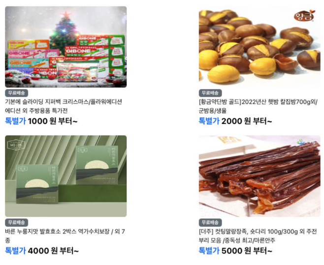

# 1주차 과제

### 과제명

```
1. 요구사항분석/API요청 및 응답 시나리오 분석
2. 요구사항 추가 반영 및 테이블 설계도
```

### **과제 설명**

```
1. 요구사항 시나리오를 보고 부족해 보이는 기능을 하나 이상 체크하여 README에 내용을 작성하시오.
2. 제시된 화면설계를 보고 해당 화면설계와 배포된 기존 서버의 API주소를 매칭하여 README에 내용을 작성하시오. (카카오 화면설계 시나리오가 있음)
3. 배포된 서버에 모든 API를 POSTMAN으로 요청해본 뒤 응답되는 데이터를 확인하고 부족한 데이터가 무엇인지 체크하여 README에 내용을 작성하시오.
4. 테이블 설계를 하여 README에 ER-Diagram을 추가하여 제출하시오.
```

### 과제 상세

```
- 부족한 기능에 대한 요구사항을 미리 예상할 수 있는가? (예를 들면 상품등록 api가 기존 요구사항에는 없는데 추후 필요하지는 않을지, 이런 부분들을 생각하였는지)
- 요구사항에 맞는 API를 분석하고 사용자 시나리오를 설계하였는가? (예를 들어 배포된 서버와 화면 설계를 제시해줄 예정인데, 특정 버튼을 클릭했을 때 어떤 API가 호출되어야 할지를 아는지)
- 응답되는 데이터가 프론트앤드 화면에 모두 반영될 수 있는지를 체크하였는가?(예를 들어 배송관련 비용이 있는데, 이런것들이 API에는 없는데 이런 부분을 캐치할 수 있는지)
- 테이블 설계가 모든 API를 만족할 수 있게 나왔는가? (테이블이 효율적으로 나왔는가 보다는 해당 테이블로 요구사항을 만족할 수 있는지에 대한 여부만)
- 테이블명이 이해하기 쉽게 만들어졌는가? (상품테이블이 product이면 이해하기 쉽지만, material이라고 하면 이해하기 어렵기 때문)
```

<br>

# **요구사항**

<p align="center"></p>

| 회원 | 상품 | 장바구니 | 주문/결제 |
| --- | --- | --- | --- |
| 회원가입 | 전체 상품 목록 조회 | 장바구니 담기 | 주문 |
| 로그인 | 개별 상품 상세 조회 | 장바구니 보기 | 결제 |
| 로그아웃 | 상품 옵션 선택 | 장바구니 상품 옵션 확인 및 수량 결정 | 주문 결과 확인 |
|  | 옵션 확인 및 수량 결정 |  |  |

<br><br>

## 1. 부족한/추가될 수 있는 요구사항


장바구니

- 옵션 삭제
- 상품 삭제

상품

- 할인 정보 제공
- 배송 정보 제공
- 상품 등록, 수정, 삭제
- 상품 검색, 정렬

주문/결제

- 배송지, 연락처 등의 개인정보 입력
- 결제 시 필수 정보 기입과 약관 동의 확인
- 주문 취소

고객 개인 페이지 제공

- 개인 주문 내역 조회
- 월별 지출 금액 조회
- 배송지 관리


<br><br>

## 2. 서버의 API 주소와 화면 매칭

### 1. **전체 상품 목록 조회**

<p align="center"></p>


- Local URL : [http://localhost:8080/products](http://localhost:8080/products)
- 페이지로 전체 상품 목록 조회
    - Local URL : [http://localhost:8080/products?page=1](http://localhost:8080/products?page=1)(페이지 번호)

### 2. **개별 상품 상세 조회**


<p align="center"></p>

- Local URL : [http://localhost:8080/products/1](http://localhost:8080/products/1)(제품 ID)

### 3. **회원가입**


<p align="center"></p>

- Local URL : [http://localhost:8080/join](http://localhost:8080/join)

### 4. 로그인

<p align="center"></p>

- Local URL : [http://localhost:8080/login](http://localhost:8080/login)

### 5. 장바구니 담기

<p align="center"></p>

- Local URL : [http://localhost:8080/carts/add](http://localhost:8080/carts/add)

### 6. 장바구니 조회

<p align="center"></p>

<p align="center"></p>

- Local URL : [http://localhost:8080/carts](http://localhost:8080/carts)

### 7. 장바구니 수정

<p align="center"></p>


- Local URL : [http://localhost:8080/carts/update](http://localhost:8080/carts/update)

### 8. 결제하기

<p align="center"></p>

- Local URL : [http://localhost:8080/orders/save](http://localhost:8080/orders/save)

### 9. 주문 결과 확인

<p align="center"></p>

- Local URL : [http://localhost:8080/orders/1](http://localhost:8080/orders/1)(주문번호)

<br><br>

## 3. Response Data 확인, 부족한 데이터 추가

| 기능 | URL Path | Method | Request | Response |
| --- | --- | --- | --- | --- |
| 전체상품목록조회 | /products | GET |  | id<br>productName<br>description<br>image<br>price |
| 개별상품상세조회 | /products/# | GET |  | id<br>productName<br>description<br>image<br>price<br>starCount<br>options<br>　id<br>　optionName<br>　price |
| 회원가입 | /join | POST | username<br>email<br>password |  |
| 로그인 | /login | POST | email<br>password |  |
| 장바구니 담기 | /carts/add | POST | optionId<br>quantity |  |
| 장바구니 조회 | /carts | GET |  | products<br>　id<br>　productName<br>　carts<br>　　id<br>　　option<br>　　　id<br>　　　optionName<br>　　　price<br>　　quantity<br>　　price<br>totalPrice |
| 장바구니 수정 | /carts/update | POST | cartId<br>quantity | carts<br>　cartId<br>　optionId<br>　optionName<br>　quantity<br>　price<br>totalPrice |
| 결제하기 | /orders/save | POST |  | id<br>products<br>　productName<br>　items<br>　　id<br>　　optionName<br>　　quantity<br>　　price<br>totalPrice |
| 주문결과확인 | /orders/# | GET |  | id<br>products<br>　productName<br>　items<br>　　id<br>　　optionName<br>　　quantity<br>　　price<br>totalPrice |
<br>

### 응답되는 데이터를 화면과 대조하여 부족한 데이터 탐색

- 배송 전체 상품 목록 조회, 개별 상품 상세 조회에 배송정보가 있으나 요구사항에 없으므로 따로 추가할 필요 없어 보인다.
    
<p align="center"></p>
<p align="center"></p>


- 결제하기에서 상품명 없이 옵션명만 있으므로 productName 제외해도 될 것으로 보인다.
    
    <p align="center"></p>
    
- 주문 결과 확인에서 옵션 하나만이 반영되므로 첫번째 옵션 외의 다른 옵션을 제외해도 될 것으로 보인다.
    
    <p align="center"></p>    
        
<br><br>

## 4. ERD 그리기

