# step2-BE-kakao-shop
카카오 테크 캠퍼스 2단계 카카오 쇼핑하기 백엔드 클론 프로젝트 레포지토리입니다.

# 1주차

카카오 테크 캠퍼스 2단계 - BE - 1주차 클론 과제
</br>
</br>

## **과제명**
```
1. 요구사항분석/API요청 및 응답 시나리오 분석
2. 요구사항 추가 반영 및 테이블 설계도
```

## **과제 설명**
```
1. 요구사항 시나리오를 보고 부족해 보이는 기능을 하나 이상 체크하여 README에 내용을 작성하시오.
2. 제시된 화면설계를 보고 해당 화면설계와 배포된 기존 서버의 API주소를 매칭하여 README에 내용을 작성하시오. (카카오 화면설계 시나리오가 있음)
3. 배포된 서버에 모든 API를 POSTMAN으로 요청해본 뒤 응답되는 데이터를 확인하고 부족한 데이터가 무엇인지 체크하여 README에 내용을 작성하시오.
4. 테이블 설계를 하여 README에 ER-Diagram을 추가하여 제출하시오.
```

</br>

## **과제 상세 : 수강생들이 과제를 진행할 때, 유념해야할 것**
아래 항목은 반드시 포함하여 과제 수행해주세요!
>- 부족한 기능에 대한 요구사항을 미리 예상할 수 있는가? (예를 들면 상품등록 api가 기존 요구사항에는 없는데 추후 필요하지는 않을지, 이런 부분들을 생각하였는지) 
>- 요구사항에 맞는 API를 분석하고 사용자 시나리오를 설계하였는가? (예를 들어 배포된 서버와 화면 설계를 제시해줄 예정인데, 특정 버튼을 클릭했을 때 어떤 API가 호출되어야 할지를 아는지)
>- 응답되는 데이터가 프론트앤드 화면에 모두 반영될 수 있는지를 체크하였는가?(예를 들어 배송관련 비용이 있는데, 이런것들이 API에는 없는데 이런 부분을 캐치할 수 있는지)
>- 테이블 설계가 모든 API를 만족할 수 있게 나왔는가? (테이블이 효율적으로 나왔는가 보다는 해당 테이블로 요구사항을 만족할 수 있는지에 대한 여부만)
>- 테이블명이 이해하기 쉽게 만들어졌는가? (상품테이블이 product이면 이해하기 쉽지만, material이라고 하면 이해하기 어렵기 때문)

</br>

## **코드리뷰 관련: PR시, 아래 내용을 포함하여 코멘트 남겨주세요.**
**1. PR 제목과 내용을 아래와 같이 작성 해주세요.**

>- PR 제목 : 부산대BE_라이언_1주차 과제

</br>

**2. PR 내용 :**

>- 코드 작성하면서 어려웠던 점
>- 코드 리뷰 시, 멘토님이 중점적으로 리뷰해줬으면 하는 부분

# 2주차

카카오 테크 캠퍼스 2단계 - BE - 2주차 클론 과제
</br>
</br>

## **과제명**
```
1. 전체 API 주소 설계
2. Mock API Controller 구현
```

## **과제 설명**
```
1. API주소를 설계하여 README에 내용을 작성하시오.
2. 가짜 데이터를 설계하여 응답하는 스프링부트 컨트롤러를 작성하고 소스코드를 업로드하시오.
```

</br>

## **과제 상세 : 수강생들이 과제를 진행할 때, 유념해야할 것**
아래 항목은 반드시 포함하여 과제 수행해주세요!
>- User 도메인을 제외한 전체 API 주소 설계가 RestAPI 맞게 설계되었는가?  POST와 GET으로만 구현되어 있어도 됨.	
>- 가짜 데이터를 설계하여 Mock API를 잘 구현하였는가? (예를 들어 DB연결없이 컨트롤러만 만들어서 배포된 서버의 응답과 동일한 형태로 데이터가 응답되는지 여부)
>- DTO에 타입은 올바르게 지정되었는가?
>- DTO에 이름은 일관성이 있는가? (예를 들어 어떤 것은 JoinDTO, 어떤 것은 joinDto, 어떤 것은 DtoJoin 이런식으로 되어 있으면 일관성이 없는것이다)
>- DTO를 공유해서 쓰면 안된다 (동일한 데이터가 응답된다 하더라도, 화면은 수시로 변경될 수 있기 때문에 DTO를 공유하고 있으면 배점을 받지 못함)
</br>

## **코드리뷰 관련: PR시, 아래 내용을 포함하여 코멘트 남겨주세요.**
**1. PR 제목과 내용을 아래와 같이 작성 해주세요.**

>- PR 제목 : 부산대BE_라이언_2주차 과제

</br>

**2. PR 내용 :**

>- 코드 작성하면서 어려웠던 점
>- 코드 리뷰 시, 멘토님이 중점적으로 리뷰해줬으면 하는 부분

# 3주차

카카오 테크 캠퍼스 2단계 - BE - 3주차 클론 과제
</br>
</br>

## **과제명**
```
1. 레포지토리 단위테스트
```

## **과제 설명**
```
1. 레포지토리 단위테스트를 구현하여 소스코드를 제출하시오.
2. 쿼리를 테스트하면서 가장 좋은 쿼리를 작성해보시오.
```

</br>

## **과제 상세 : 수강생들이 과제를 진행할 때, 유념해야할 것**
아래 항목은 반드시 포함하여 과제 수행해주세요!
>- 레포지토리 단위테스트가 구현되었는가?
>- 테스트 메서드끼리 유기적으로 연결되지 않았는가? (테스트는 격리성이 필요하다)
>- Persistene Context를 clear하여서 테스트가 구현되었는가? (더미데이터를 JPA를 이용해서 insert 할 예정인데, 레포지토리 테스트시에 영속화된 데이터 때문에 쿼리를 제대로 보지 못할 수 있기 때문에)
>- 테스트 코드의 쿼리 관련된 메서드가 너무 많은 select를 유발하지 않는지? (적절한 한방쿼리, 효율적인 in query, N+1 문제 등이 해결된 쿼리)
>- BDD 패턴으로 구현되었는가? given, when, then
</br>

## **코드리뷰 관련: PR시, 아래 내용을 포함하여 코멘트 남겨주세요.**
**1. PR 제목과 내용을 아래와 같이 작성 해주세요.**

>- PR 제목 : 부산대BE_라이언_3주차 과제

</br>

**2. PR 내용 :**

>- 코드 작성하면서 어려웠던 점
>- 코드 리뷰 시, 멘토님이 중점적으로 리뷰해줬으면 하는 부분

# 4주차

카카오 테크 캠퍼스 2단계 - BE - 4주차 클론 과제
</br>
</br>

## **과제명**
```
1. 컨트롤러 단위 테스트
```

## **과제 설명**
```
1. 컨트롤러 단위테스트를 작성한뒤 소스코드를 업로드하시오.
2. stub을 구현하시오.
```

</br>

## **과제 상세 : 수강생들이 과제를 진행할 때, 유념해야할 것**
아래 항목은 반드시 포함하여 과제 수행해주세요!
>- 컨트롤러 단위테스트가 구현되었는가?
>- Mockito를 이용하여 stub을 구현하였는가?
>- 인증이 필요한 컨트롤러를 테스트할 수 있는가?
>- 200 ok만 체크한 것은 아닌가? (해당 컨트롤러에서 제일 필요한 데이터에 대한 테스트가 구현되었는가?)
>- 모든 요청과 응답이 json으로 처리되어 있는가?
</br>

## **코드리뷰 관련: PR시, 아래 내용을 포함하여 코멘트 남겨주세요.**
**1. PR 제목과 내용을 아래와 같이 작성 해주세요.**

>- PR 제목 : 부산대BE_라이언_4주차 과제 

</br>

**2. PR 내용 :**

>- 코드 작성하면서 어려웠던 점
>- 코드 리뷰 시, 멘토님이 중점적으로 리뷰해줬으면 하는 부분

# 5주차

카카오 테크 캠퍼스 2단계 - BE - 5주차 클론 과제
</br>
</br>

## **과제명**
```
코드 리팩토링
```

## **과제 설명**
```
카카오 쇼핑 프로젝트 전체 코드를 리팩토링한다
 - AOP로 유효성검사 적용하기
 - 구현하기
 - 장바구니 담GlobalExceptionHanlder 기 -> 예외 처리하기
 - 장바구니 수정(주문하기) -> 예외처리하기
 - 결재하기 기능 구현 (장바구니가 꼭 초기화 되어야함)
 - 주문결과 확인 기능 구현
```

</br>

## **과제 상세 : 수강생들이 과제를 진행할 때, 유념해야할 것**
아래 항목은 반드시 포함하여 과제 수행해주세요!
>- AOP가 적용되었는가?
>- GlobalExceptionHandler가 적용되었는가?
>- 장바구니 담기시 모든 예외가 처리 완료되었는가?
>- 장바구니 수정시 모든 예외가 처리 완료되었는가?
>- 결재하기와 주문결과 확인 코드가 완료되었는가?
</br>

## **코드리뷰 관련: PR시, 아래 내용을 포함하여 코멘트 남겨주세요.**
**1. PR 제목과 내용을 아래와 같이 작성 해주세요.**

>- PR 제목 : 부산대BE_라이언_5주차 과제

</br>

**2. PR 내용 :**

>- 코드 작성하면서 어려웠던 점
>- 코드 리뷰 시, 멘토님이 중점적으로 리뷰해줬으면 하는 부분

## 5주차 과제수행
카카오 쇼핑 프로젝트 전체 코드를 리팩토링한다
이번 과제는 정해진 API에 따라 request 데이터의 예외처리를 하고, 데이터를 효율적으로 전송하고,
정해진 layer에 따라 구현하는 것이다. aop와 exception handler 부분, product와 user, cart부분은 강사님과 함께 만들었고, 입맛에 맞게 수정하였다. order부분은 직접 구현하였다.

### 바뀐 부분

**Product**
Product부분은 get api밖에 없고 강사님과 같이 진행했었다.

- findById -> 상품의 정보와 상세정보를 동시에 불러온다.  
    - repository
    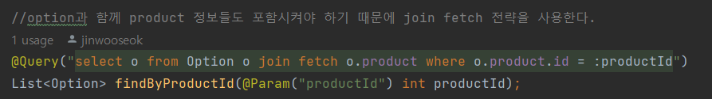
    해당 쿼리를 join fetch로 바꾸었다. findByProductId는 상품의 상세정보를 불러오는 repository로 상품 데이터와
    옵션 데이터가 모두 필요하기 때문이다.

        - 실제 쿼리
        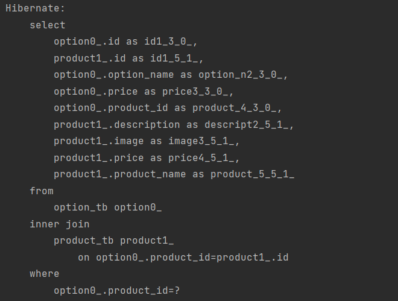
        option테이블과 product테이블의 inner join으로 한번에 데이터를 불러왔다.

        - postman 화면
        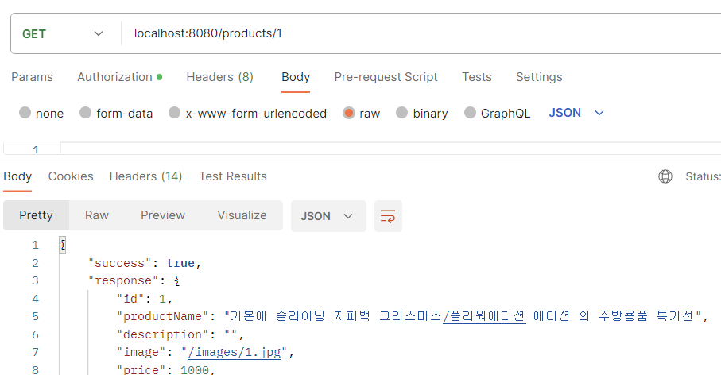
        정상적으로 데이터가 출력되었다.


**Cart**

- **findAll** -> 유저의 장바구니 데이터를 GET한다.
    - request & response DTO
        - request - X (GET)
        - response
            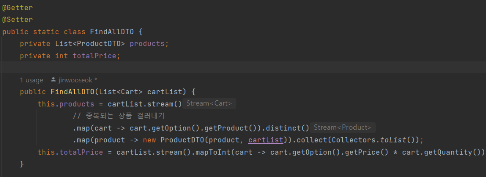
        <br/> 
    - controller
        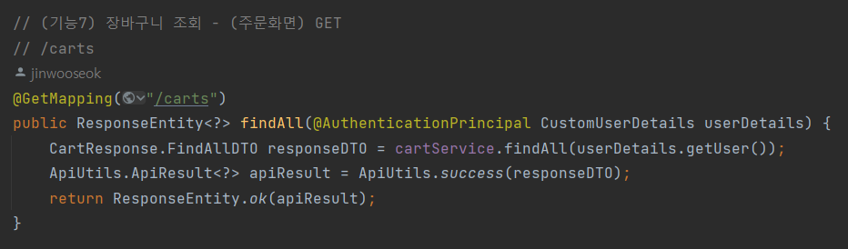
        - 사용자 인증 필수 ->  @AuthenticationPrincipal userDetail로 해결
        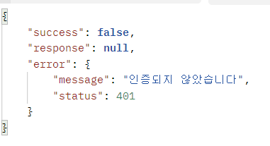
        - service 의존성을 주입한다.  
        <br/>
    - service
        로직수행
        1. user 본인의 현재 장바구니를 조회하는 service
        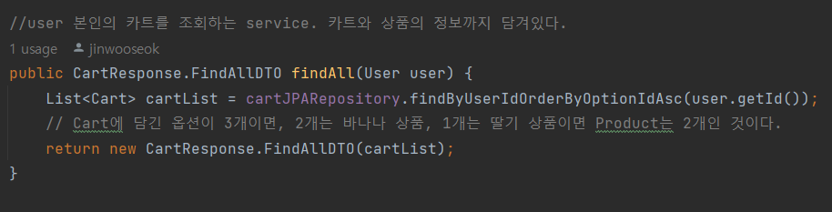
        repository를 통해 현재 자신의 장바구니에 있는 상품들의 정보를 등록한 순서대로 받아온다.
        <br/>
        - postman 실행결과
            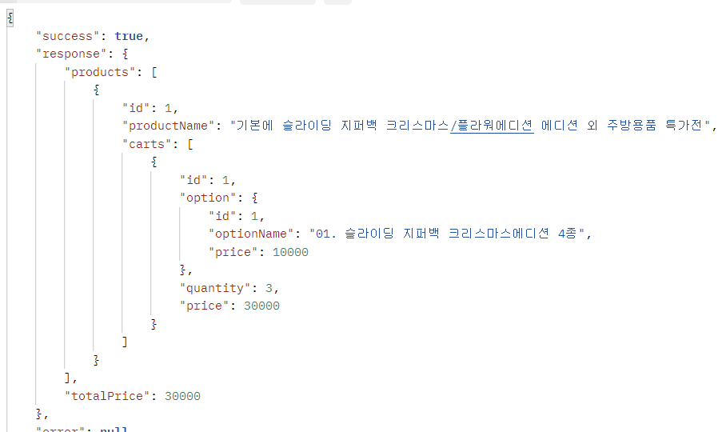
        <br/>
    - repository
        - 사용쿼리
        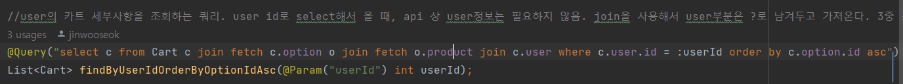
        user의 카트 세부사항을 조회하는 쿼리이다. user id로 select해서 올 때, api 상 user정보는 필요하지 않기 때문에 join을 사용해서 user부분은 ?로 남겨두고 가져온다. join fetch를 통해 option은 한번에 호출한다.
        - 실제쿼리
        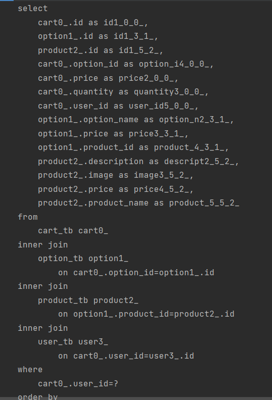
        굉장히 길지만 한번에 쿼리를 출력할 수 있었고, 필요하지 않은 user정보는 ?처리된 것을 알 수 있다.
        <br/>
- **addCartList** -> 유저의 장바구니 데이터를 추가한다.
    - request & response DTO
        - request
        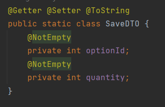
        cart에 저장할 dto로 optionId와 quantity를 받아온다.
        예시 : {"optionId":1,"quantity":5}
        - response
        response : null
        <br/>
    - controller
        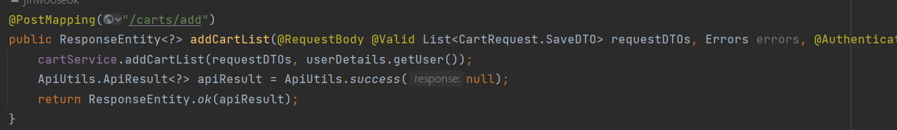
        - 유효성 검사 -> AOP방식으로 GlobalValidationHandler를 만들어 PostMapping 컨트롤러 작동 전에 유효성 검사를 실시하게 했다. 
        - 사용자 인증 필수 ->  @AuthenticationPrincipal userDetail로 해결
        
        - service 의존성을 주입한다.
        <br/>
    - service
        로직수행
        1. 똑같은 optionId가 여러번 들어오면 예외처리
            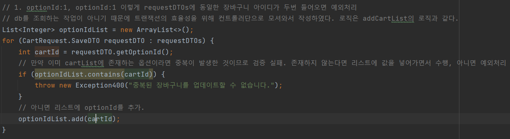
            <br/>
            - postman 실행결과
            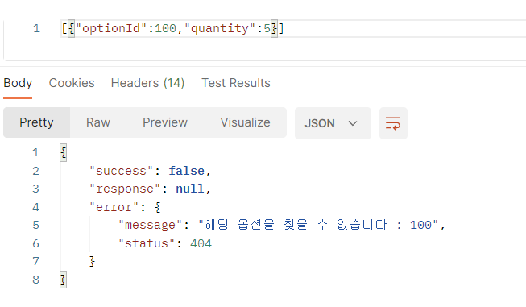
        2. user가 소유하지 않는 option를 요청했을 때 처리 -> 소유하지 않고 있을 때, save로직 작동, 소유하고 있다면 update로직 작동
            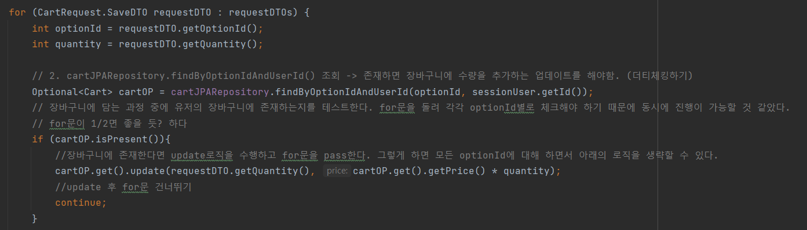
            - 실행쿼리  
            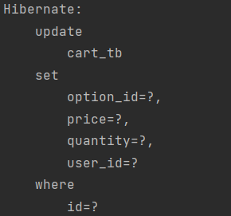
        3. save로직
            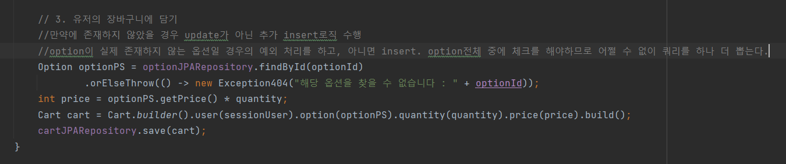
            <br/>
            - postman 실행결과
            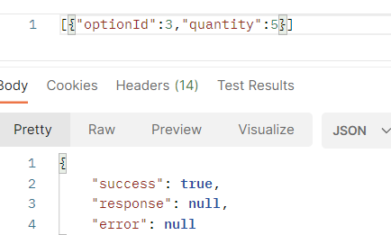
            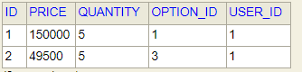

            
        <br/>
    - repository
        - 사용 쿼리
        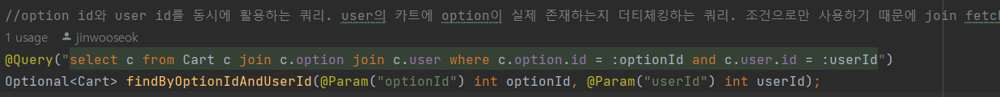
        유저의 소유여부를 검증할때(2번 로직) 카트테이블의 옵션과 유저가 정확히 일치하는지 검증하기 위한 쿼리이다. 조건일치만 확인하기 때문에 join전략으로 하고 user, option은 프록시객체로 남겨둔다.

        - 실제 쿼리
        
        save하기 위해 option과 user는 조건으로만 활용한다.
        <br/>
- **update** -> 유저의 장바구니 데이터를 업데이트하고, 주문을 하기 위한 페이지로 이동한다.
    - request & response DTO
        - request
        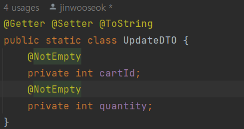
        NotEmpty 어노테이션을 통해 값이 전달되지 않을 가능성을 배제했다. cartId, quantity를 전달받는다.
        예시 : {"cartId":1,"quantity":5}

        - response
        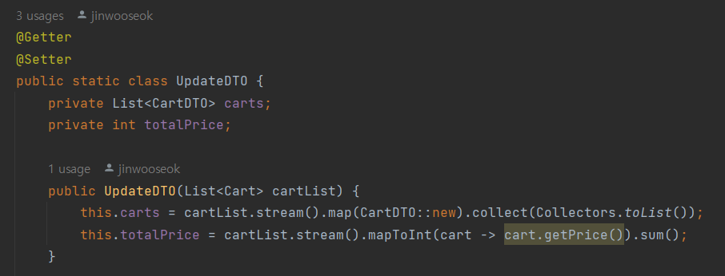
        <br/>
    - controller
        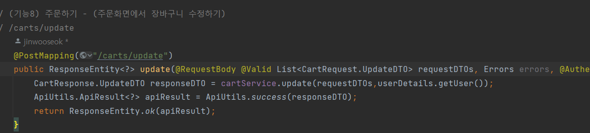
        - 유효성 검사 -> AOP방식으로 GlobalValidationHandler를 만들어 PostMapping 컨트롤러 작동 전에 유효성 검사를 실시하게 했다. 
        - 사용자 인증 필수 ->  @AuthenticationPrincipal userDetail로 해결
        
        - service 의존성을 주입한다.
        <br/>
    - service
        로직수행
        1. 장바구니에 아무것도 없을 때 업데이트는 없데이트이므로 예외처리 
            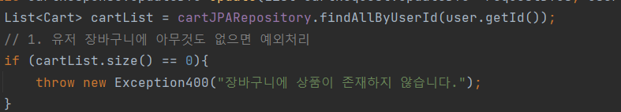
            if문을 활용해 예외를 처리하였다.
            <br/>
            - postman 실행결과
            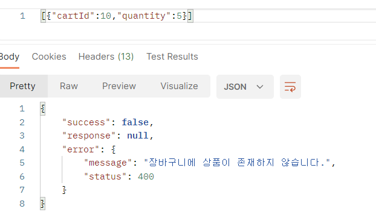

        2. 똑같은 cartId가 여러번 들어오면 예외처리
            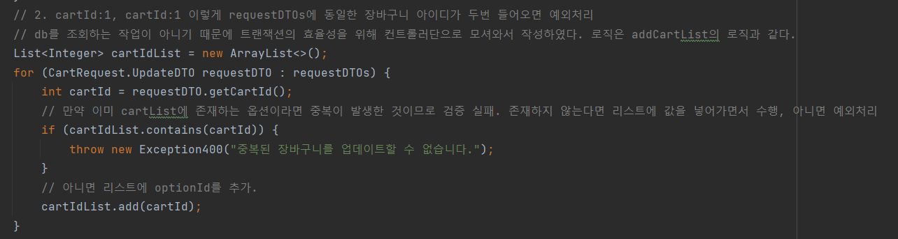
            <br/>
            - postman 실행결과
            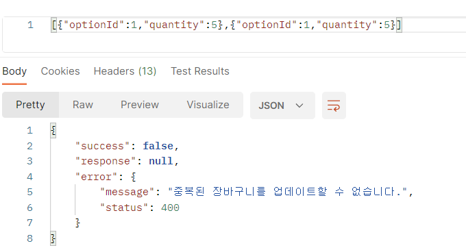
        3. 자신과 연관이 없는 cart의 업데이트를 시도하는 경우
            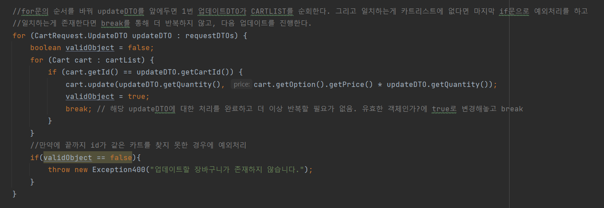
            해당하는 
            <br/>
            - postman 실행결과
            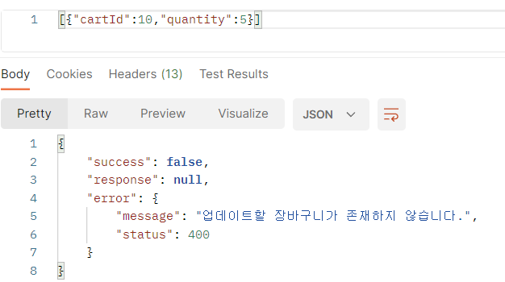
    - repository
        - 사용쿼리
        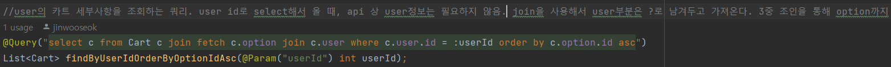    
        user의 카트 세부사항을 조회하는 쿼리이다. user id로 select해서 올 때, api 상 user정보는 필요하지 않기 때문에 join을 사용해서 user부분은 ?로 남겨두고 가져온다. join fetch를 통해 option은 한번에 호출한다. cartList를 dto화 할때, option과 product는 필요하다.
        - 실제쿼리
        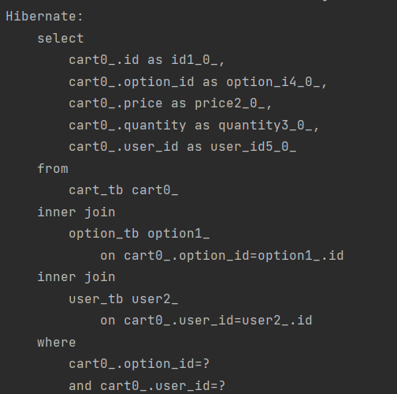
        <br/>

**Order**
- **save** -> 장바구니의 데이터를 그대로 주문하고, 장바구니 데이터는 삭제한다.
    - request & response DTO
        - request - X (GET)
        - response
            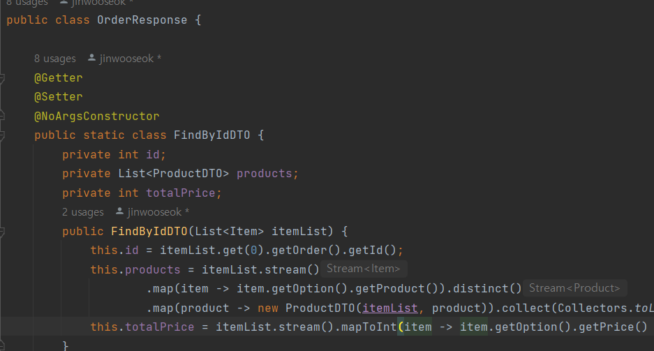
    - controller
        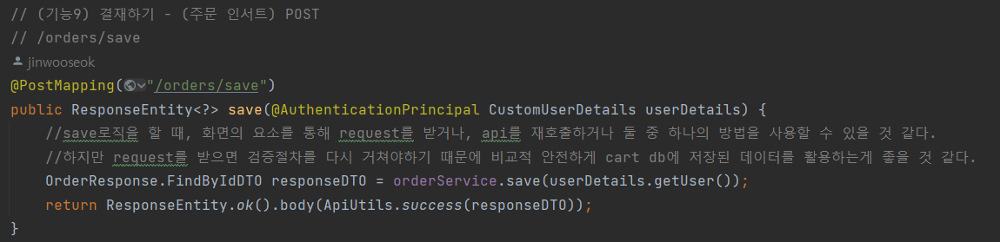
        - 유효성 검사 -> cart테이블의 항목들을 가져와 사용하므로 입력을 받지 않는다.
        - 사용자 인증 필수 ->  @AuthenticationPrincipal userDetail로 해결
        
        - service 의존성을 주입한다.
    - service
        1. 텅 빈 장바구니를 주문하는 경우
            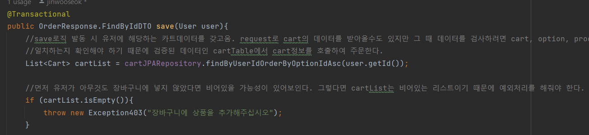
            여기에서 걸려서 주문이 안될 것이다.
            <br/>
            - postman 실행결과
            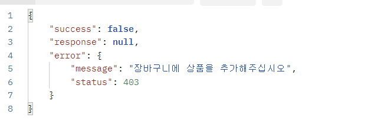

        2. 정상작동
            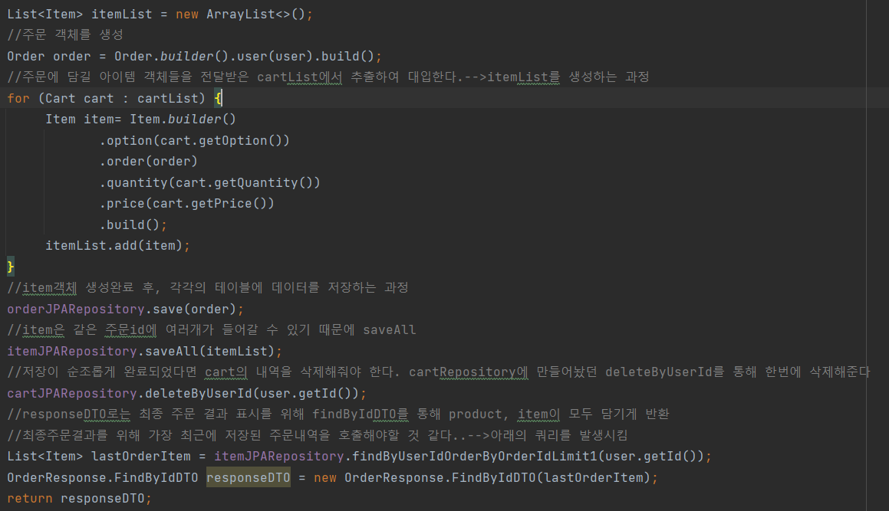
            예외처리에 성공했다면 장바구니의 데이터들을 item, order테이블에 각각 save한 후, 장바구니 테이블에서는 제거한다. 그 후에 결과를 return해서 보여주고 싶은데 이는 유저의 가장 최근 주문내역을 호출하였다.
            <br/>
            - postman 실행결과
            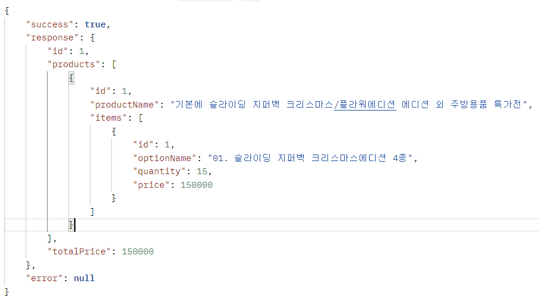
            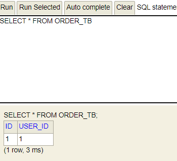
            최근 주문내역이 response로 반환된다.
    - repository
        - 사용쿼리
        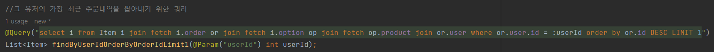
        해당 쿼리는 order, option, product를 한번에 엮어서 해당 유저id를 기준으로 주문번호 순으로 정렬한 다음 가장 최근 데이터를 추출한다.
        한번에 하려다 보니 너무 많은 것들이 join fetch되었다. limit 1을 통해 가장 최신의 것을 뽑으려고 했는데 limit 1은 native query여야 쓸 수 있음
        - 실제쿼리
        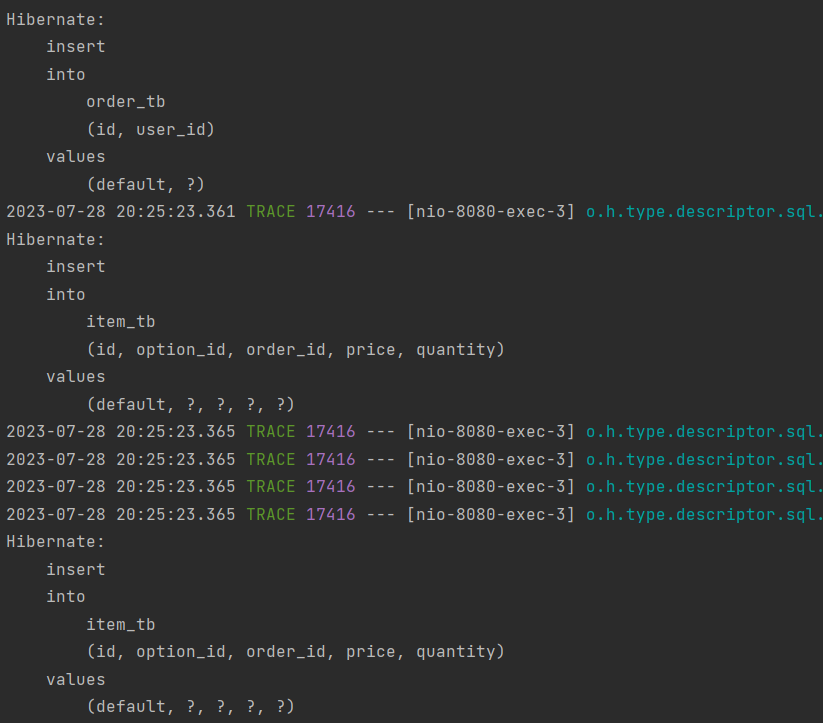
        먼저 order, item 테이블에 2번의 삽입, cart테이블에 1건의 삭제쿼리가 전송되었다.
        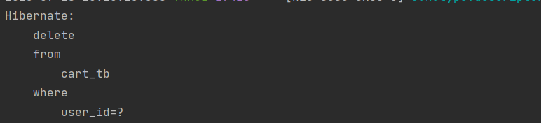
        bulk쿼리로 한번에 삭제한다.
        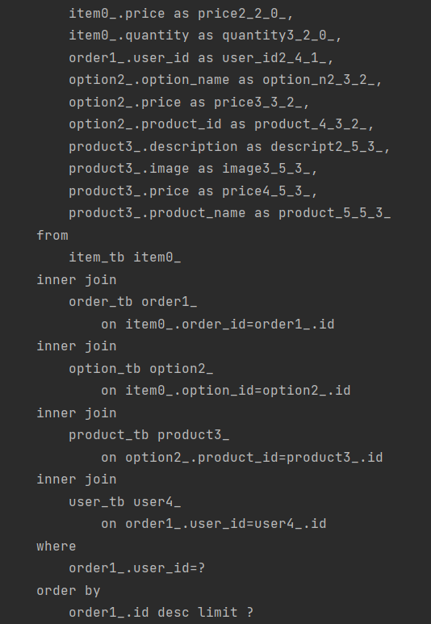
        join을 한 user테이블을 제외하고 나머지 필요한 정보들은 모두 fetch join하여 하나의 쿼리로 요청했다.
        <br/>
- **findById** -> 주문id에 따라 주문내역을 찾을 수 있다.
    - request & response DTO
        - request - X (GET)
        - response
            

    - controller
        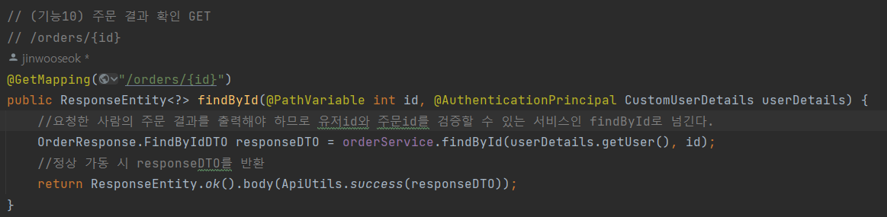
        - 유효성 검사 -> request Body를 받지 않음 
        - 사용자 인증 필수 ->  @AuthenticationPrincipal userDetail로 해결
        
        - service 의존성을 주입한다.

    - service
        1. 본인이 아닌 다른 사람의 주문내역에 접근하거나 주문내역이 존재하지 않는 경우
            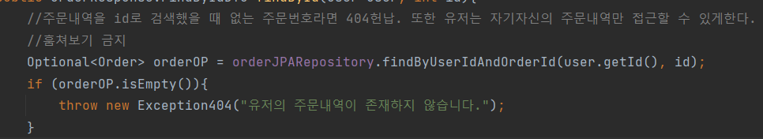
            해당 유저에게 주문내역이 없으면 404에러를 띄우도록 하였다.
            <br/>
            - postman 실행결과
            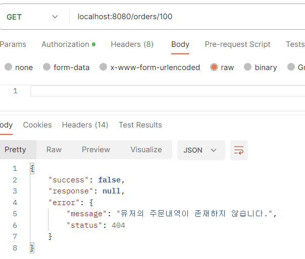
        2. 정상작동
            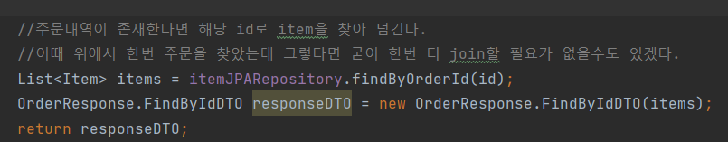
            <br/>
            - postman 실행결과
            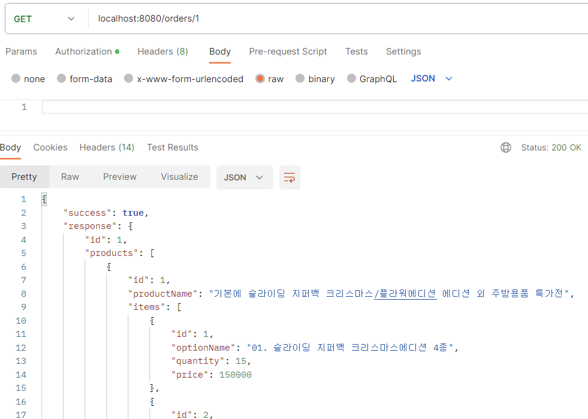

    - repository
        - 사용쿼리
        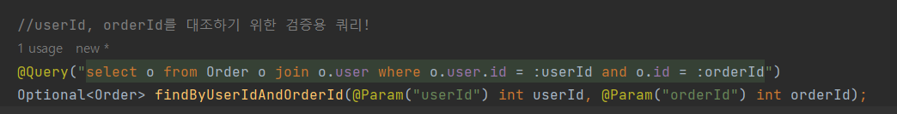
        이 repository는 접근하고자 하는 주문이 현재 유저가 소유하고있는 주문이 맞는지 확인하기 위한 쿼리를 제공한다.
        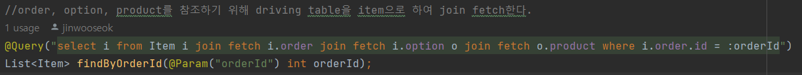

        - 실제쿼리
        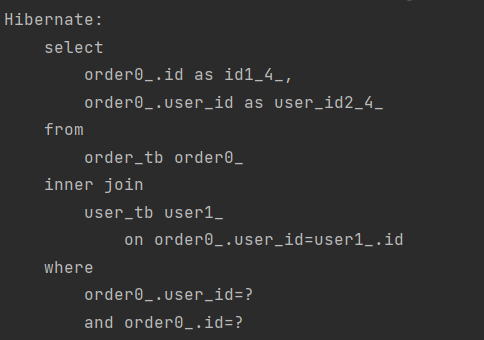
        service-1에서 검증을 위해 활용했던 쿼리
        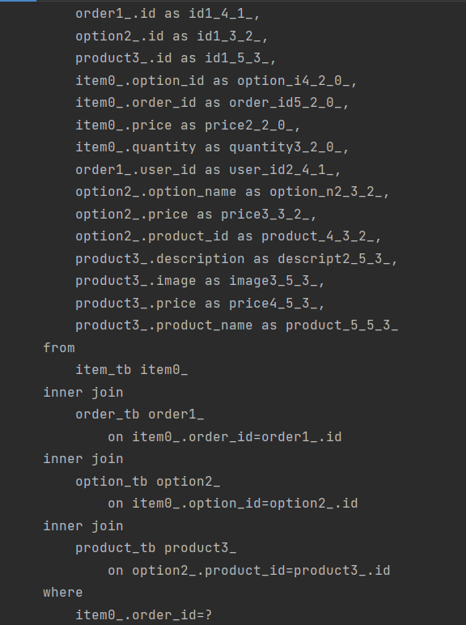
        데이터를 가져오는 쿼리
        *용도가 다르기 때문에 두개를 합치는게 고민이 된다.


# 6주차

카카오 테크 캠퍼스 2단계 - BE - 6주차 클론 과제
</br>
</br>

## **과제명**
```
1. 카카오 클라우드 배포
```

## **과제 설명**
```
1. 통합테스트를 구현하시오.
2. API문서를 구현하시오. (swagger, restdoc, word로 직접 작성, 공책에 적어서 제출 등 모든 방법이 다 가능합니다)
3. 프론트앤드에 입장을 생각해본뒤 어떤 문서를 가장 원할지 생각해본뒤 API문서를 작성하시오.
4. 카카오 클라우드에 배포하시오.
```

</br>

## **과제 상세 : 수강생들이 과제를 진행할 때, 유념해야할 것**
아래 항목은 반드시 포함하여 과제 수행해주세요!
>- 통합테스트가 구현되었는가?
>- API문서가 구현되었는가?
>- 배포가 정상적으로 되었는가?
>- 프로그램이 정상 작동되고 있는가?
>- API 문서에 실패 예시가 작성되었는가?
</br>

## **코드리뷰 관련: PR시, 아래 내용을 포함하여 코멘트 남겨주세요.**
**1. PR 제목과 내용을 아래와 같이 작성 해주세요.**

>- PR 제목 : 부산대BE_라이언_6주차 과제

</br>

**2. PR 내용 :**

>- 코드 작성하면서 어려웠던 점
>- 코드 리뷰 시, 멘토님이 중점적으로 리뷰해줬으면 하는 부분