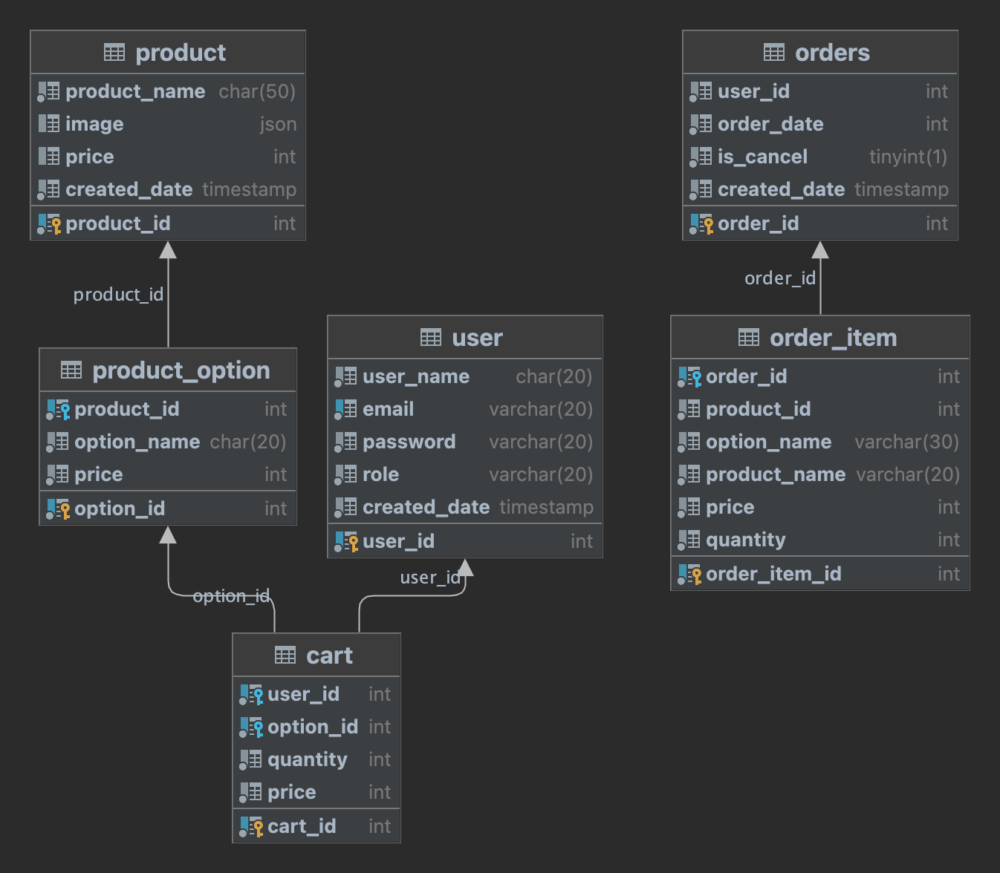

# step2-BE-kakao-shop

카카오 테크 캠퍼스 2단계 카카오 쇼핑하기 백엔드 클론 프로젝트 레포지토리입니다.

# 1주차

카카오 테크 캠퍼스 2단계 - BE - 1주차 클론 과제

## **과제명**

```
1. 요구사항분석/API요청 및 응답 시나리오 분석
2. 요구사항 추가 반영 및 테이블 설계도
```

## **과제 설명**

```
1. 요구사항 시나리오를 보고 부족해 보이는 기능을 하나 이상 체크하여 README에 내용을 작성하시오.
2. 제시된 화면설계를 보고 해당 화면설계와 배포된 기존 서버의 API주소를 매칭하여 README에 내용을 작성하시오. (카카오 화면설계 시나리오가 있음)
3. 배포된 서버에 모든 API를 POSTMAN으로 요청해본 뒤 응답되는 데이터를 확인하고 부족한 데이터가 무엇인지 체크하여 README에 내용을 작성하시오.
4. 테이블 설계를 하여 README에 ER-Diagram을 추가하여 제출하시오.
```

## **과제 상세 : 수강생들이 과제를 진행할 때, 유념해야할 것**

아래 항목은 반드시 포함하여 과제 수행해주세요!
> - 부족한 기능에 대한 요구사항을 미리 예상할 수 있는가? (예를 들면 상품등록 api가 기존 요구사항에는 없는데 추후 필요하지는 않을지, 이런 부분들을 생각하였는지)
>- 요구사항에 맞는 API를 분석하고 사용자 시나리오를 설계하였는가? (예를 들어 배포된 서버와 화면 설계를 제시해줄 예정인데, 특정 버튼을 클릭했을 때 어떤 API가 호출되어야 할지를 아는지)
>- 응답되는 데이터가 프론트앤드 화면에 모두 반영될 수 있는지를 체크하였는가?(예를 들어 배송관련 비용이 있는데, 이런것들이 API에는 없는데 이런 부분을 캐치할 수 있는지)
>- 테이블 설계가 모든 API를 만족할 수 있게 나왔는가? (테이블이 효율적으로 나왔는가 보다는 해당 테이블로 요구사항을 만족할 수 있는지에 대한 여부만)
>- 테이블명이 이해하기 쉽게 만들어졌는가? (상품테이블이 product이면 이해하기 쉽지만, material이라고 하면 이해하기 어렵기 때문)

## **코드리뷰 관련: PR시, 아래 내용을 포함하여 코멘트 남겨주세요.**

**1. PR 제목과 내용을 아래와 같이 작성 해주세요.**

> - PR 제목 : 부산대BE_라이언_1주차 과제

## 1. 요구사항 시나리오를 보고 부족해보이는 기능

---

* (기능2) 로그인
    * 비밀번호 찾기 기능
    * Refresh Token
        * 6.28일에 accesstoken의 `````"exp" : 1688089308`````  약 3일정도 판단.
        * 그럼 3일마다 로그인을 새로 해줘야 한다는 뜻인데, accesstoken의 유효기간을 짧게 가져가야 한다고 판단하면 refreshtoken도 필요할 듯
* (기능4) 전체 상품 목록 조회
    * Response에 배송비 관련한 없음 => 배송비 기능
    * 상품 등록 기능은 없음
    * 한 페이지당 정해진 개수의 상품을 반환하고 있음
      => 클라이언트 디바이스가 다양해지면 각 클라이언트마다 원하는 상품 개수가 다르다고 생각하여
      => 클라이언트 디바이스가 원하는 상품 개수마다 상품을 조회할 수 있는 기능
* (기능5) 개별 상품 상세 조회
    * 각 옵션마다 상품 잔여량을 보여주는 기능
    * 톡딜가로 구매하기 기능
    * 선택한 옵션을 아예 선택 안 함으로 변경하는 기능
* (기능10) 장바구니 상품 옵션 확인 및 수량 결정
    * 선택한 특정 상품을 아예 선택 안 함으로 변경하는 기능
    * 선택한 특정 옵션을 아예 선택 안 함으로 변경하는 기능
* (기능12) 결제
    * (FE) 배송지 변경 기능

## 2. 화면설계와 배포된 API주소 매핑

---

### 이메일 중복 체크

Method : Post
Local URL : http://localhost:8080/check

서버 API는 있지만 화면 설계는 없음

### 회원 가입

Method : Post
Local URL : http://localhost:8080/join

### 로그인

Method : Post
Local URL : http://localhost:8080/login

### 로그아웃

현재 인증/인가 작업이 Access Token으로 되어있는데
Token은 만료기간이 따로 설정되어 있기에(payload의 exp) 서버에서 로그아웃을 관리할 수는 없다.

따라서 해당 서버 단에서 로그아웃을 위한 API는 필요없다고 판단

다만 이건 프론트에서 localstorage에 저장되어 있는 토큰을 지우면 로그아웃이 기능이 구현될 것이라고 생각함

### 전체 상품 목록 조회

Method : Get
Local URL : http://localhost:8080/products

* 무료배송 여부
* 특딜가 여부
* 무한 스크롤

### 개별 상품 상세 조회

Method : Get
Local URL : http://localhost:8080/products

* 특딜가 여부
* 배송비 여부

### 장바구니 담기

Method : Post
Local URL : http://localhost:8080/carts/add

- [ ] restful api 규칙 추가하기 add부분 물어보기

* 배송지 등록 API
* 배송지 조회 API
* 해당 상품 배송지 확정 API

### 장바구니 보기

Method : Get
Local URL : http://localhost:8080/carts

### 장바구니 수정

Method : Post
Local URL : http://localhost:8080/carts/update

### 결제하기

Method : Post
Local URL : http://localhost:8080/orders/save

-[ ] 이 부분도 마찬가지로 restful api 관련해서 여쭤보기

### 주문 결과 확인

Method : Get
Local URL : http://localhost:8080/orders/1

## 3. 배포된 서버 API Respnose의 부족한 데이터 판단하기

---

### 전체 상품 목록 조회

Method : Get
Local URL : http://localhost:8080/products

[추가할 응답사항]

* 배송비
    * 무료배송여부
* 특딜가 여부
* 페이징 처리로 인해 지금까지 반환한 상품 및 요청한 페이지 개수

```json
{
  "success": true,
  "response": [
    {
      "id": 1,
      "productName": "기본에 슬라이딩 지퍼백 크리스마스/플라워에디션 에디션 외 주방용품 특가전",
      "description": "",
      "image": "/images/1.jpg",
      "price": 1000
    },
    {
      "id": 2,
      "productName": "[황금약단밤 골드]2022년산 햇밤 칼집밤700g외/군밤용/생율",
      "description": "",
      "image": "/images/2.jpg",
      "price": 2000
    },
    {
      "id": 3,
      "productName": "삼성전자 JBL JR310 외 어린이용/성인용 헤드셋 3종!",
      "description": "",
      "image": "/images/3.jpg",
      "price": 30000
    },
    {
      "id": 4,
      "productName": "바른 누룽지맛 발효효소 2박스 역가수치보장 / 외 7종",
      "description": "",
      "image": "/images/4.jpg",
      "price": 4000
    },
    {
      "id": 5,
      "productName": "[더주] 컷팅말랑장족, 숏다리 100g/300g 외 주전부리 모음 /중독성 최고/마른안주",
      "description": "",
      "image": "/images/5.jpg",
      "price": 5000
    },
    {
      "id": 6,
      "productName": "굳지않는 앙금절편 1,050g 2팩 외 우리쌀떡 모음전",
      "description": "",
      "image": "/images/6.jpg",
      "price": 15900
    },
    {
      "id": 7,
      "productName": "eoe 이너딜리티 30포, 오렌지맛 고 식이섬유 보충제",
      "description": "",
      "image": "/images/7.jpg",
      "price": 26800
    },
    {
      "id": 8,
      "productName": "제나벨 PDRN 크림 2개. 피부보습/진정 케어",
      "description": "",
      "image": "/images/8.jpg",
      "price": 25900
    },
    {
      "id": 9,
      "productName": "플레이스테이션 VR2 호라이즌 번들. 생생한 몰입감",
      "description": "",
      "image": "/images/9.jpg",
      "price": 797000
    }
  ],
  "error": null
}
```

### 개별 상품 상세 조회

Method : Get
Local URL : http://localhost:8080/products

[부족한 데이터]

* 특딜가 적용 여부
* 베송비

```json        
{
    "success": true,
    "response": {
        "id": 1,
        "productName": "기본에 슬라이딩 지퍼백 크리스마스/플라워에디션 에디션 외 주방용품 특가전",
        "description": "",
        "image": "/images/1.jpg",
        "price": 1000,
        "starCount": 5,
        "options": [
            {
                "id": 1,
                "optionName": "01. 슬라이딩 지퍼백 크리스마스에디션 4종",
                "price": 10000
            },
            {
                "id": 2,
                "optionName": "02. 슬라이딩 지퍼백 플라워에디션 5종",
                "price": 10900
            },
            {
                "id": 3,
                "optionName": "고무장갑 베이지 S(소형) 6팩",
                "price": 9900
            },
            {
                "id": 4,
                "optionName": "뽑아쓰는 키친타올 130매 12팩",
                "price": 16900
            },
            {
                "id": 5,
                "optionName": "2겹 식빵수세미 6매",
                "price": 8900
            }
        ]
    },
    "error": null
}
```

### 장바구니 담기

Method : Post
Local URL : http://localhost:8080/carts/add

[부족한 request data]

사용자가 해당 상품을 조회했을 때의 가격과 <u>사용자가 상품을 장바구니에 넣는 시점의 가격이 달라질 수 있다</u>

따라서 사용자가 장바구니에 넣기를 request할 때 사용자가 알고있는 각 옵션의 가격을 같이 넘겨주고

만약 사용자가 알고있는 옵션의 가격과 저장되어 있는 옵션의 가격이 다를 때 경고 응답을 보내줄 수 있도록 하면 좋을 것 같다.

```json
[
  {
    "quantity": 5
  },
  {
    "optionId": 2,
    "quantity": 5
  }
]
```

### 장바구니 보기

Method : Get
Local URL : http://localhost:8080/carts

[부족한 데이터]

* 각 상품마다 배송비
* 장바구니에 담은 모든 상품을 구매할 시 전체 배송비

```json
{
  "success": true,
  "response": {
    "products": [
      {
        "id": 1,
        "productName": "기본에 슬라이딩 지퍼백 크리스마스/플라워에디션 에디션 외 주방용품 특가전",
        "carts": [
          {
            "id": 1,
            "option": {
              "id": 1,
              "optionName": "01. 슬라이딩 지퍼백 크리스마스에디션 4종",
              "price": 10000
            },
            "quantity": 3,
            "price": 30000
          },
          {
            "id": 2,
            "option": {
              "id": 2,
              "optionName": "02. 슬라이딩 지퍼백 플라워에디션 5종",
              "price": 10900
            },
            "quantity": 4,
            "price": 43600
          }
        ]
      }
    ],
    "totalPrice": 73600
  },
  "error": null
}
```

### 장바구니 수정

Method : Post
Local URL : http://localhost:8080/carts/update

[부족한 request data]

사용자가 해당 상품을 조회했을 때의 가격과 <u>사용자가 상품을 장바구니에서 상품의 개수를 변경하는 시점의 가격이 달라질 수 있다</u>

따라서 사용자가 장바구니 수정을 request할 때 사용자가 알고있는 각 옵션의 가격을 같이 넘겨주고

만약 사용자가 알고있는 옵션의 가격과 저장되어 있는 옵션의 가격이 다를 때 경고 응답을 보내줄 수 있도록 하면 좋을 것 같다.

추가적으로 배송비에도 적용할 수 있을 것 같다.

```json
[
  {
    "cartId": 4,
    "quantity": 10
  },
  {
    "cartId": 5,
    "quantity": 10
  }
]
```

### 결제하기

Method : Post
Local URL : http://localhost:8080/orders/save

[부족한 request 데이터]

여기는 정말로 "결제"와 관련이 있기에 사용자가 알고 있는 상품의 가격과 실제 상품의 가격이 차이가 있는지 확인해야 한다고 생각한다.

사용자는 1000원으로 알고 결제를 하려고 했지만, 그 사이에 상품의 가격이 변경되어서 10000원이 된다면 사용자는 예상치 못한 큰 금액을 결제하게 되는 것이기 때문이다.

따라서 request할 때 사용자가 알고 있는 각 옵션의 가격는 필연적으로 보내야 한다고 생각한다.

+) 배송비에도 적용

현재는 장바구니에 있는 모든 상품을 구매한다.

하지만, 장바구니에 있는 특정 상품만 구매하고 싶을 수도 있다.

따라서 request로 사용자가 구매를 원하는 장바구니_id도 전달받아야 한다고 생각한다.

[에러 response]

사용자가 상품을 결제하려고 한 순간에는 상품이 존재했을 수도 있지만, 진짜 결제를 시도하는 순간 재고가 존재하지 않을 수도 있다.

따라서 재고 부족으로 인한 상품 결제 실패 응답 또한 존재해야 한다.
(특정 상품의 특정 옵션이 재고가 부족하다

## 4. ER-Diagram 추가

---


```sql
create table user
(
    user_id      INT AUTO_INCREMENT NOT NULL,
    user_name    CHAR(20)    NOT NULL,
    email        VARCHAR(20) NOT NULL,
    password     VARCHAR(20) NOT NULL,
    role         VARCHAR(20) NOT NULL,
    created_date TIMESTAMP   NOT NULL,
    PRIMARY KEY (user_id),
    CONSTRAINT unique_email UNIQUE KEY (email)
);


create table product
(
    product_id   INT AUTO_INCREMENT NOT NULL,
    product_name CHAR(50)  NOT NULL,
    image        JSON,
    price        INT,
    created_date TIMESTAMP NOT NULL,
    PRIMARY KEY (product_id)
);

create table product_option
(
    option_id   INT AUTO_INCREMENT NOT NULL,
    product_id  INT      NOT NULL,
    option_name CHAR(20) NOT NULL,
    price       INT      NOT NULL,
    PRIMARY KEY (option_id),
    CONSTRAINT idx_option_product_id FOREIGN KEY (product_id) REFERENCES product (product_id)
);

create table cart
(
    cart_id   int AUTO_INCREMENT NOT NULL,
    user_id   int NOT NULL,
    option_id int NOT NULL,
    quantity  int NOT NULL,
    price     int NOT NULL,
    PRIMARY KEY (cart_id),
    CONSTRAINT unique_user_option_id UNIQUE KEY (user_id, option_id),
    CONSTRAINT idx_cart_user_id FOREIGN KEY (user_id) REFERENCES user (user_id),
    CONSTRAINT idx_cart_option_id FOREIGN KEY (option_id) REFERENCES product_option (option_id)
);

create table orders
(
    order_id     int AUTO_INCREMENT NOT NULL,
    user_id      int       NOT NULL,
    order_date   int       NOT NULL,
    is_cancel    boolean   NOT NULL,
    created_date TIMESTAMP NOT NULL,
    PRIMARY KEY (order_id)
);

create table order_item
(
    order_item_id int AUTO_INCREMENT NOT NULL,
    order_id      int         NOT NULL,
    product_id    int         NOT NULL,
    option_name   VARCHAR(30) NOT NULL,
    product_name  VARCHAR(20) NOT NULL,
    price         int         NOT NULL,
    quantity      int         NOT NULL,
    PRIMARY KEY (order_item_id),
    CONSTRAINT idx_orders_id FOREIGN KEY (order_id) REFERENCES orders (order_id)
);
```

### 회원

- 회원 번호 (PK)
  - PK를 이메일로 충분히 사용할 수 있고, 이메일로 사용한다면 이메일이 클러스터링 인덱스가 되기 때문에 조회 성능 이점이 있겠다. 
    라고 생각하여 의미없는 데이터를 새로 생성하지 말고, 이메일을 PK로 사용할까? 라는 생각을 했습니다.
  - 하지만, 이때의 문제점은 이메일이 변경되지 않는다는 제약사항이 언제 변할지 모른다는 것이였습니다.
  - 따라서 회원 번호는 ```인조키를 사용해야 한다``` 로 결론지었습니다.
- 이메일
- 비밀번호
- 이름
- 회원 Role

### 상품

- 상품 번호 (PK)
  - DB가 여러 대를 사용한다면 AUTO_INCREMENT로 PK조건을 걸면 PK가 UNIQUE하지 않을 수 있겠다 라는 생각이 들었습니다.
  - 그래서 UUID로 제약조건을 걸까? 라는 생각이 들었는데 UUID로 할 시 삽입을 진행할 때마다 reordering작업이 일어나 insert속도가 느려짐을 알게 되었습니다.
  - 결론적으로 AUTO_INCREMENT를 사용했을 때 이러한 문제점도 발생할 수 있다. 라는 것만 인지한 채로 AUTO_INCREMENT를 사용해 개발하기로 결정했습니다.
- 상품명
- 등록일자
- 상품 이미지
    - 화면 설계상에는 단 한개의 이미지만 존재합니다. 하지만 하나의 상품에 여러 가지 이미지가 존재할 수 있다고 생각합니다.
    - 하지만 해당 칼럼은 제1정규화인 원자성을 지키지 않을 것입니다.
    - 왜냐하면 이미지 테이블을 별도로 두면 각 상품에 맞는 이미지를 가져오기 위해 이미지 테이블과 join연산이 들어갑니다.
    - 또한 별도의 이미지 테이블을 두었다고 해서 그 이미지 테이블로 할 수 있는 비즈니스 로직이 따로 없습니다.
    - 저는 여기서 이미지 테이블은 단지 이미지 여러 개를 저장하는 용도로 생각했습니다.
    - 따라서 원자성을 지키지 않고 한 칼럼에 이미지 여러 개를 저장할 것이다.
    - 그럼 상품 이미지 타입은 뭘로 정해야 할까?
        - JSON vs TEXT
            - JSON : 특정 필드만 변경가능, TEXT : 일부분만 변경하려고 해도 통째로 업데이트 해야한다.

### 옵션

- 옵션 번호 (PK)
  - 인조성 데이터 말고, 의미있는 데이터로 PK를 만들고 싶다는 생각에 상품번호 + UUID로 해당 PK를 구성할까? 라는 생각을 했습니다.
  - 특정 범위 이내의 상품 번호에 해당하는 옵션들만 가져와~ 인 상황인데요.
  - 이렇게 했을 때 장점은 인덱스 풀 스캔이 아니라 인덱스 레인지 스캔으로 일을 처리할 수 있을 것 같다. 라는 생각이였습니다.
  1. 이런 요구사항이 발생할 것 같지 않음
  2. 상품 번호 또한 AUTO_INCREMENT가 아닌 의미있는 데이터여야 함
  - 따라서 이 부분도 AUTO_INCREMENT가 아닌 PK를 생성하는 다른 제약을 고려해 본걸로 의의를 두기로 했습니다.
- 옵션명
- 옵션 가격
- 잔여량
- 상품 번호(FK) : 상품을 유일하게 식별할 수 있는 숫자

### 장바구니

- 장바구니 번호(PK)
- 회원 번호(FK)
- 옵션 번호(FK)
- 옵션 개수
- 생성일자

### 주문

- 주문 번호(PK) : 주문을 유일하게 식별할 수 있는 숫자
- 회원 번호(FK)
- 주문 일자
- 취소 유무
    - 주문 테이블은 로그성 테이블이라고 생각한다.
    - 즉, 사용자가 해당 주문을 취소했어도 delete하지 않고 남겨놓아야 한다고 생각함
      ~~- 총 주문 가격~~
    - 기존에는 각 주문 아이템의 가격이 변경되지 않을 것이기 때문에 총 주문 수량을 별도의 테이블에 저장하려고 했다.
    - 그러나 주문 후 취소를 하게 된다면, 주문 아이템 뿐만 아니라 주문 테이블까지 데이터를 변경해주어야 한다.
    - 이 부분은 데이터 일관성이 중요하다고 생각하여 별도의 필드로 빼지 않는 것으로 결정

### 주문 아이템

- 주문 아이템 번호(PK)
- 주문 번호(FK)
- ~~옵션 번호(FK)~~
- 옵션 번호
    - FK로 연결하지 않는다.
- 옵션 이름
    - 사용자가 주문을 한 시점의 옵션 이름을 기억하고 싶음
- 옵션 가격
    - 사용자가 주문을 한 시점의 가격을 기억하고 싶음
    - 주문 번호(FK)만으로도 주문 가격을 가지고 올 수 있지만 주문 가격이 update되면 사용자가 주문을 한 시점의 가격을 알지 못하기 때문에 따로 주문 가격 필드를 저장함
- 주문 수량
- 주문 가격

**2. PR 내용 :**

> - 코드 작성하면서 어려웠던 점
>- 코드 리뷰 시, 멘토님이 중점적으로 리뷰해줬으면 하는 부분

# 2주차

카카오 테크 캠퍼스 2단계 - BE - 2주차 클론 과제

## **과제명**

```
1. 전체 API 주소 설계
2. Mock API Controller 구현
```

## **과제 설명**

```
1. API주소를 설계하여 README에 내용을 작성하시오.
2. 가짜 데이터를 설계하여 응답하는 스프링부트 컨트롤러를 작성하고 소스코드를 업로드하시오.
```

## **과제 상세 : 수강생들이 과제를 진행할 때, 유념해야할 것**

아래 항목은 반드시 포함하여 과제 수행해주세요!
> - 전체 API 주소 설계가 RestAPI 맞게 설계되었는가? (예를 들어 배포된 서버는 POST와 GET으로만 구현되었는데, 학생들은 PUT과 DELETE도 배울 예정이라 이부분이 반영되었고, 주소가
    RestAPI에 맞게 설계되었는지)
>- 가짜 데이터를 설계하여 Mock API를 잘 구현하였는가? (예를 들어 DB연결없이 컨트롤러만 만들어서 배포된 서버의 응답과 동일한 형태로 데이터가 응답되는지 여부)
   </br>

## **코드리뷰 관련: PR시, 아래 내용을 포함하여 코멘트 남겨주세요.**

**1. PR 제목과 내용을 아래와 같이 작성 해주세요.**

> - PR 제목 : 부산대BE_라이언_2주차 과제


**2. PR 내용 :**

> - 코드 작성하면서 어려웠던 점
>- 코드 리뷰 시, 멘토님이 중점적으로 리뷰해줬으면 하는 부분

# 3주차

카카오 테크 캠퍼스 2단계 - BE - 3주차 클론 과제

## **과제명**

```
1. 레포지토리 단위테스트
```

## **과제 설명**

```
1. 레포지토리 단위테스트를 구현하여 소스코드를 제출하시오.
2. 쿼리를 테스트하면서 가장 좋은 쿼리를 작성해보시오.
```

## **과제 상세 : 수강생들이 과제를 진행할 때, 유념해야할 것**

아래 항목은 반드시 포함하여 과제 수행해주세요!
> - 레포지토리 단위테스트가 구현되었는가?
>- 테스트 메서드끼리 유기적으로 연결되지 않았는가? (테스트는 격리성이 필요하다)
>- Persistene Context를 clear하여서 테스트가 구현되었는가? (더미데이터를 JPA를 이용해서 insert 할 예정인데, 레포지토리 테스트시에 영속화된 데이터 때문에 쿼리를 제대로 보지 못할 수
   있기 때문에)
>- 테스트 코드의 쿼리 관련된 메서드가 너무 많은 select를 유발하지 않는지? (적절한 한방쿼리, 효율적인 in query, N+1 문제 등이 해결된 쿼리)
   </br>

## **코드리뷰 관련: PR시, 아래 내용을 포함하여 코멘트 남겨주세요.**

**1. PR 제목과 내용을 아래와 같이 작성 해주세요.**

> - PR 제목 : 부산대BE_라이언_3주차 과제


**2. PR 내용 :**

> - 코드 작성하면서 어려웠던 점
>- 코드 리뷰 시, 멘토님이 중점적으로 리뷰해줬으면 하는 부분

# 4주차

카카오 테크 캠퍼스 2단계 - BE - 4주차 클론 과제

## **과제명**

```
1. 컨트롤러 단위 테스트
```

## **과제 설명**

```
1. 컨트롤러 단위테스트를 작성한뒤 소스코드를 업로드하시오.
2. stub을 구현하시오.
```

## **과제 상세 : 수강생들이 과제를 진행할 때, 유념해야할 것**

아래 항목은 반드시 포함하여 과제 수행해주세요!
> - 컨트롤러 단위테스트가 구현되었는가?
>- Mockito를 이용하여 stub을 구현하였는가?
>- 인증이 필요한 컨트롤러를 테스트할 수 있는가?
>- 200 ok만 체크한 것은 아닌가? (해당 컨트롤러에서 제일 필요한 데이터에 대한 테스트가 구현되었는가?)

## **코드리뷰 관련: PR시, 아래 내용을 포함하여 코멘트 남겨주세요.**

**1. PR 제목과 내용을 아래와 같이 작성 해주세요.**

> - PR 제목 : 부산대BE_라이언_4주차 과제


**2. PR 내용 :**

> - 코드 작성하면서 어려웠던 점
>- 코드 리뷰 시, 멘토님이 중점적으로 리뷰해줬으면 하는 부분

# 5주차

카카오 테크 캠퍼스 2단계 - BE - 5주차 클론 과제

## **과제명**

```
1. 실패 단위 테스트
```

## **과제 설명**

```
1. 컨트롤러 단위테스트를 구현하는데, 실패 테스트 코드를 구현하시오.
2. 어떤 문제가 발생할 수 있을지 모든 시나리오를 생각해본 뒤, 실패에 대한 모든 테스트를 구현하시오.
```

## **과제 상세 : 수강생들이 과제를 진행할 때, 유념해야할 것**

아래 항목은 반드시 포함하여 과제 수행해주세요!
> - 실패 단위 테스트가 구현되었는가?
>- 모든 예외에 대한 실패 테스트가 구현되었는가?
   </br>

## **코드리뷰 관련: PR시, 아래 내용을 포함하여 코멘트 남겨주세요.**

**1. PR 제목과 내용을 아래와 같이 작성 해주세요.**

> - PR 제목 : 부산대BE_라이언_5주차 과제


**2. PR 내용 :**

> - 코드 작성하면서 어려웠던 점
>- 코드 리뷰 시, 멘토님이 중점적으로 리뷰해줬으면 하는 부분

# 6주차

카카오 테크 캠퍼스 2단계 - BE - 6주차 클론 과제

## **과제명**

```
1. 카카오 클라우드 배포
```

## **과제 설명**

```
1. 통합테스트를 구현하시오.
2. API문서를 구현하시오. (swagger, restdoc, word로 직접 작성, 공책에 적어서 제출 등 모든 방법이 다 가능합니다)
3. 프론트앤드에 입장을 생각해본뒤 어떤 문서를 가장 원할지 생각해본뒤 API문서를 작성하시오.
4. 카카오 클라우드에 배포하시오.
5. 배포한 뒤 서비스 장애가 일어날 수 있으니, 해당 장애에 대처할 수 있게 로그를 작성하시오. (로그는 DB에 넣어도 되고, 외부 라이브러리를 사용해도 되고, 파일로 남겨도 된다 - 단 장애 발생시 확인을 할 수 있어야 한다)
```

## **과제 상세 : 수강생들이 과제를 진행할 때, 유념해야할 것**

아래 항목은 반드시 포함하여 과제 수행해주세요!
> - 통합테스트가 구현되었는가?
>- API문서가 구현되었는가?
>- 배포가 정상적으로 되었는가?
>- 서비스에 문제가 발생했을 때, 로그를 통해 문제를 확인할 수 있는가?
   </br>

## **코드리뷰 관련: PR시, 아래 내용을 포함하여 코멘트 남겨주세요.**

**1. PR 제목과 내용을 아래와 같이 작성 해주세요.**

> - PR 제목 : 부산대BE_라이언_6주차 과제


**2. PR 내용 :**

> - 코드 작성하면서 어려웠던 점
>- 코드 리뷰 시, 멘토님이 중점적으로 리뷰해줬으면 하는 부분
