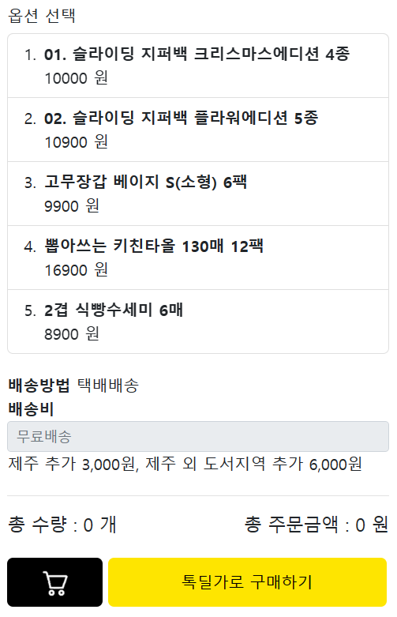
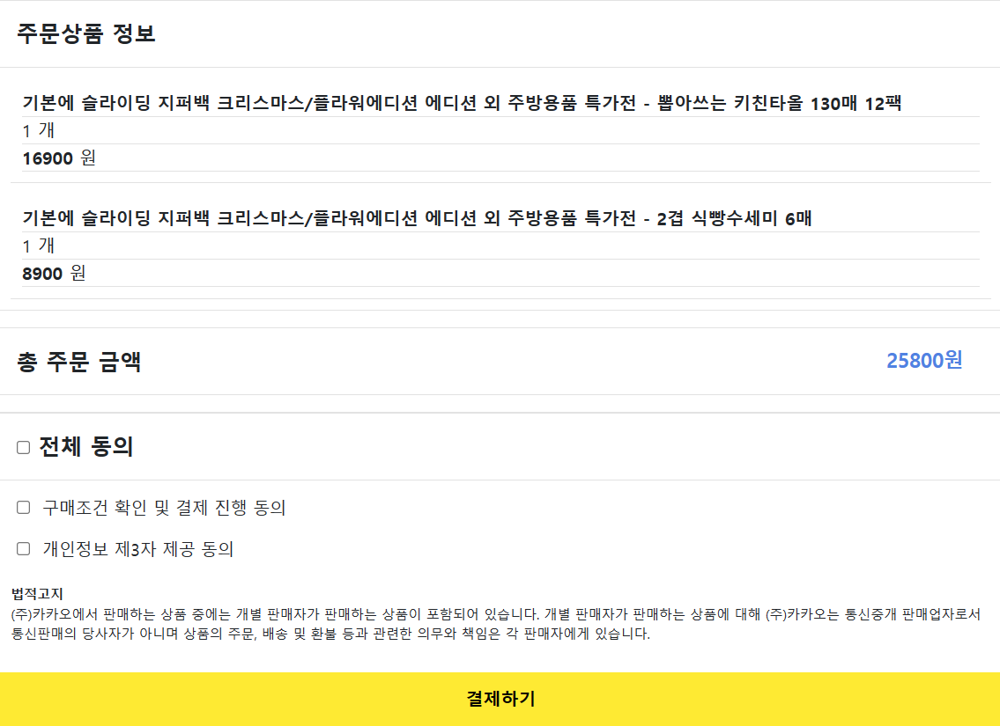
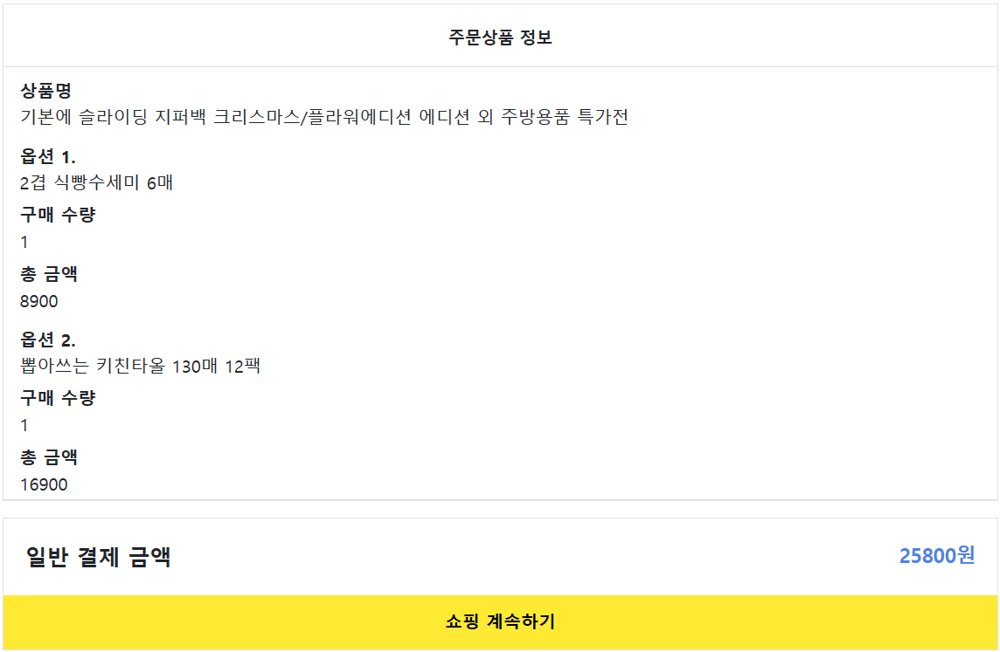
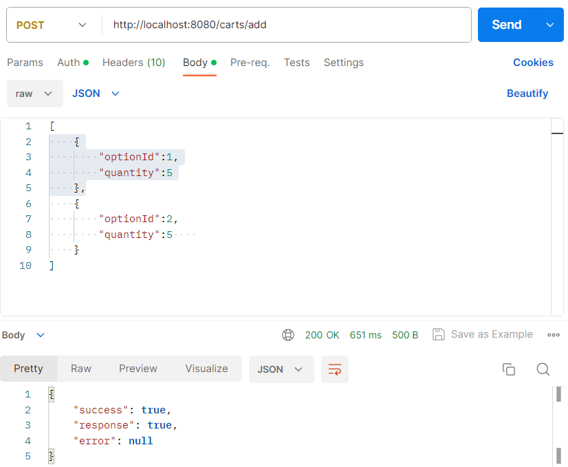
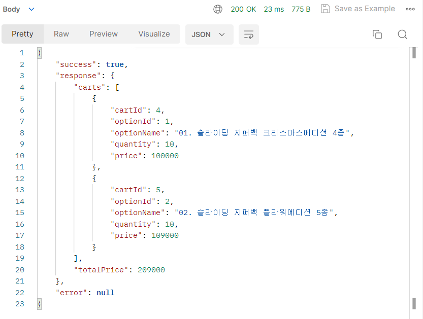
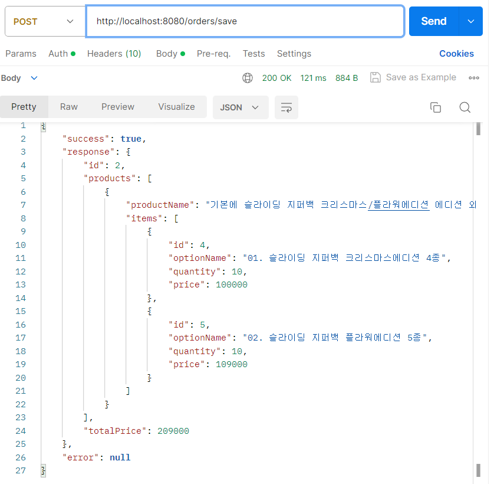
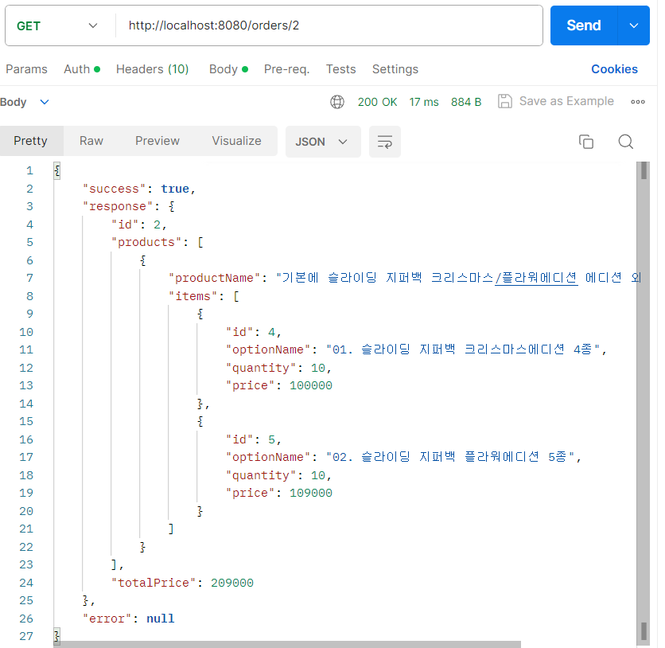
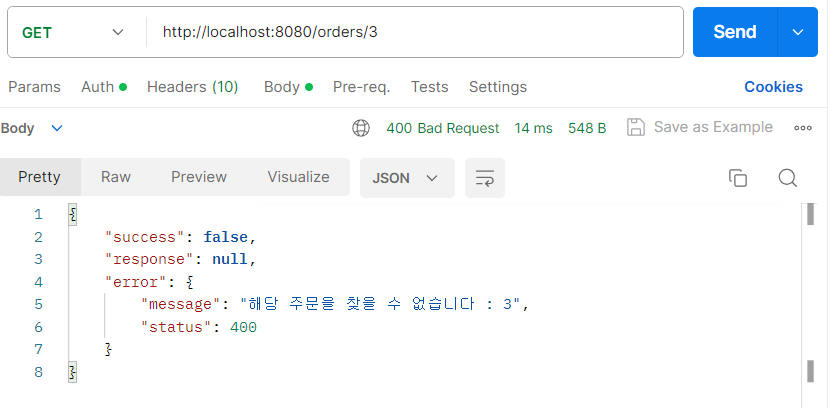

# step2-BE-kakao-shop
카카오 테크 캠퍼스 2단계 카카오 쇼핑하기 백엔드 클론 프로젝트 레포지토리입니다.

## 목차

- [1주차](#week1)
  - [과제](#task1)
    - [기능 추가](#add-function)
    - [API 매핑](#api-scenario)
    - [ER-Diagram](#er-diagram)
    - [테이블 설계](#table-design)
  
- [2주차](#week2)
  - [과제](#task2)
    - [REST API 설계](#rest-api)
    - [요청-응답 확인](#response)

- [3주차](#week3)

- [4주차](#week4)

- [5주차](#week5)

- [6주차](#week6)

# Week1

카카오 테크 캠퍼스 2단계 - BE - 1주차 클론 과제

<br>

## **과제명**
```text
1. 요구사항분석/API요청 및 응답 시나리오 분석
2. 요구사항 추가 반영 및 테이블 설계도
```

## **과제 설명**
```text
1. 요구사항 시나리오를 보고 부족해 보이는 기능을 하나 이상 체크하여 README에 내용을 작성하시오.
2. 제시된 화면설계를 보고 해당 화면설계와 배포된 기존 서버의 API주소를 매칭하여 README에 내용을 작성하시오. (카카오 화면설계 시나리오가 있음)
3. 배포된 서버에 모든 API를 POSTMAN으로 요청해본 뒤 응답되는 데이터를 확인하고 부족한 데이터가 무엇인지 체크하여 README에 내용을 작성하시오.
4. 테이블 설계를 하여 README에 ER-Diagram을 추가하여 제출하시오.
```
<br>

## **과제 상세 : 수강생들이 과제를 진행할 때, 유념해야할 것**
아래 항목은 반드시 포함하여 과제 수행해주세요!
>- 부족한 기능에 대한 요구사항을 미리 예상할 수 있는가? (예를 들면 상품등록 api가 기존 요구사항에는 없는데 추후 필요하지는 않을지, 이런 부분들을 생각하였는지) 
>- 요구사항에 맞는 API를 분석하고 사용자 시나리오를 설계하였는가? (예를 들어 배포된 서버와 화면 설계를 제시해줄 예정인데, 특정 버튼을 클릭했을 때 어떤 API가 호출되어야 할지를 아는지)
>- 응답되는 데이터가 프론트앤드 화면에 모두 반영될 수 있는지를 체크하였는가?(예를 들어 배송관련 비용이 있는데, 이런것들이 API에는 없는데 이런 부분을 캐치할 수 있는지)
>- 테이블 설계가 모든 API를 만족할 수 있게 나왔는가? (테이블이 효율적으로 나왔는가 보다는 해당 테이블로 요구사항을 만족할 수 있는지에 대한 여부만)
>- 테이블명이 이해하기 쉽게 만들어졌는가? (상품테이블이 product이면 이해하기 쉽지만, material이라고 하면 이해하기 어렵기 때문)

<br>

## **코드리뷰 관련: PR시, 아래 내용을 포함하여 코멘트 남겨주세요.**
**1. PR 제목과 내용을 아래와 같이 작성 해주세요.**

>- PR 제목 : 부산대BE_라이언_1주차 과제

<br>

**2. PR 내용 :**

>- 코드 작성하면서 어려웠던 점
>- 코드 리뷰 시, 멘토님이 중점적으로 리뷰해줬으면 하는 부분

<br>

## Task1

---

### Add function

- **회원 가입 파트**
   1. 회원 가입 시 사용자 유형 구분
      1. 소비자
      2. 판매자
         1. 상품 등록
         2. 브랜드 등록
      3. 관리자


- **상품 목록 파트**
   1. 카테고리 추가


- **개별 상품 파트**
  1. 리뷰
  2. 찜하기
  3. 문의하기


- **장바구니 파트**
  1. 해당 상품 다른 옵션 선택 기능 추가


- **주문 정보 파트**
   1. 구매 내역 확인
   2. 주문 상태 - 상품 준비, 배송 준비, 배송 중 등


- **추가 고려할 만한 기능**
  1. 배송 관련
  2. 할인, 프로모션, 이벤트 관련
  3. 고객센터
  4. 마이 페이지
     1. 회원 상세 정보 추가 → 회원 가입 시 상세 정보를 기입하는 회원 가입과 필수 정보만 기입하는 간편 가입 구분

<br>

---

### API Scenario

**회원 가입**


- 로그인 페이지 내 회원 가입 버튼 클릭 시
    - Local URL : localhost:8080/join
    - METHOD : POST


- Request Body
```json
{
  "username":"mata",
  "email":"meta@nate.com",
  "password":"meta1234!"
}
```
- Response Body
```json
{
  "success": true,
  "response": null,
  "error": null
}
```
<br>

**로그인**


- 메인 페이지 내 로그인 버튼 클릭 시
    - Local URL : localhost:8080/login
    - METHOD : POST


- Request Body
```json
{
  "email" : "ssar@nate.com",
  "password" : "meta1234!"
}
```
- Response Body
```json
{
  "success": true,
  "response": null,
  "error": null
}
```
<br>

**전체 상품 목록 조회**


- 로그인 후 메인 페이지
    - Local URL : localhost:8080/products
    - METHOD : GET


- Response Body
```json
{
  "success": true,
  "response": [
    {
      "id": 1,
      "productName": "기본에 슬라이딩 지퍼백 크리스마스/플라워에디션 에디션 외 주방용품 특가전",
      "description": "",
      "image": "/images/1.jpg",
      "price": 1000
    },
    {
      "id": 2,
      "productName": "[황금약단밤 골드]2022년산 햇밤 칼집밤700g외/군밤용/생율",
      "description": "",
      "image": "/images/2.jpg",
      "price": 2000
    },
    {
      "id": 3,
      "productName": "삼성전자 JBL JR310 외 어린이용/성인용 헤드셋 3종!",
      "description": "",
      "image": "/images/3.jpg",
      "price": 30000
    },
    {
      "id": 4,
      "productName": "바른 누룽지맛 발효효소 2박스 역가수치보장 / 외 7종",
      "description": "",
      "image": "/images/4.jpg",
      "price": 4000
    },
    {
      "id": 5,
      "productName": "[더주] 컷팅말랑장족, 숏다리 100g/300g 외 주전부리 모음 /중독성 최고/마른안주",
      "description": "",
      "image": "/images/5.jpg",
      "price": 5000
    },
    {
      "id": 6,
      "productName": "굳지않는 앙금절편 1,050g 2팩 외 우리쌀떡 모음전",
      "description": "",
      "image": "/images/6.jpg",
      "price": 15900
    },
    {
      "id": 7,
      "productName": "eoe 이너딜리티 30포, 오렌지맛 고 식이섬유 보충제",
      "description": "",
      "image": "/images/7.jpg",
      "price": 26800
    },
    {
      "id": 8,
      "productName": "제나벨 PDRN 크림 2개. 피부보습/진정 케어",
      "description": "",
      "image": "/images/8.jpg",
      "price": 25900
    },
    {
      "id": 9,
      "productName": "플레이스테이션 VR2 호라이즌 번들. 생생한 몰입감",
      "description": "",
      "image": "/images/9.jpg",
      "price": 797000
    }
  ],
  "error": null
}
```
<br>

**개별 상품 목록 조회**


- 전체 상품 목록 조회에서 특정 상품 클릭 시
    - Local URL : localhost:3000/products/{productId}
    - METHOD : GET


- Response Body
```json
{
    "success": true,
    "response": {
        "id": 2,
        "productName": "[황금약단밤 골드]2022년산 햇밤 칼집밤700g외/군밤용/생율",
        "description": "",
        "image": "/images/2.jpg",
        "price": 2000,
        "starCount": 5,
        "options": [
            {
                "id": 6,
                "optionName": "22년산 햇단밤 700g(한정판매)",
                "price": 9900
            },
            {
                "id": 7,
                "optionName": "22년산 햇단밤 1kg(한정판매)",
                "price": 14500
            },
            {
                "id": 8,
                "optionName": "밤깎기+다회용 구이판 세트",
                "price": 5500
            }
        ]
    },
    "error": null
}
```
<br>

**장바구니 담기**



- 개별 상품 상세 조회 페이지 내 옵션 선택 후 하단의 장바구니 버튼 클릭 시
    - Local URL : localhost:8080/carts/add
    - METHOD : POST


- Request Body
```json
[
  {
    "optionId":6,
    "quantity":2
  },
  {
    "optionId":7,
    "quantity":1
  }
]
```
- Response Body
```json
{
  "success": true,
  "response": null,
  "error": null
}
```
<br>

**장바구니 조회**


- 네비게이션 바 오른쪽 상단의 장바구니 버튼 클릭 시
    - Local URL : localhost:8080/carts
    - METHOD : GET


- Response Body
```json
{
  "success": true,
  "response": {
    "products": [
      {
        "id": 2,
        "productName": "[황금약단밤 골드]2022년산 햇밤 칼집밤700g외/군밤용/생율",
        "carts": [
          {
            "id": 1,
            "option": {
              "id": 6,
              "optionName": "22년산 햇단밤 700g(한정판매)",
              "price": 9900
            },
            "quantity": 2,
            "price": 19800
          },
          {
            "id": 2,
            "option": {
              "id": 7,
              "optionName": "22년산 햇단밤 1kg(한정판매)",
              "price": 14500
            },
            "quantity": 1,
            "price": 14500
          }
        ]
      }
    ],
    "totalPrice": 34300
  },
  "error": null
}
```
<br>

**주문하기**



- 장바구니 페이지 내 주문하기 버튼 클릭 시
    - Local URL : localhost:8080/carts/update
    - METHOD : POST


- Request Body
```json
[
  {
    "cartId" : 1,
    "quantity" : 1
  }
]
```
- Response Body
```json
{
  "success": true,
  "response": {
    "carts": [
      {
        "cartId": 1,
        "optionId": 6,
        "optionName": "22년산 햇단밤 700g(한정판매)",
        "quantity": 2,
        "price": 19800
      },
      {
        "cartId": 2,
        "optionId": 7,
        "optionName": "22년산 햇단밤 1kg(한정판매)",
        "quantity": 1,
        "price": 14500
      }
    ],
    "totalPrice": 34300
  },
  "error": null
}
```
<br>

**주문 결과 확인**



- 주문 페이지 내 결제하기 버튼 클릭 시
    - Local URL : localhost:8080/orders/{order_id}
    - METHOD : GET


- Response Body
```json
{
  "success": true,
  "response": {
    "id" : 1,
    "products": [
      {
        "productName": "[황금약단밤 골드]2022년산 햇밤 칼집밤700g외/군밤용/생율",
        "items": [
          {
            "id": 6,
            "optionName": "22년산 햇단밤 700g(한정판매)",
            "quantity": 2,
            "price": 19800
          },
          {
            "id": 7,
            "optionName": "22년산 햇단밤 1kg(한정판매)",
            "quantity": 1,
            "price": 14500
          }
        ]
      }
    ],
    "totalPrice": 34300
  },
  "error": null
}
```
<br>

#### Incomplete Data
- **개별 물품 상세 조회 관련**
  1. 별점 관련 데이터
  2. 재고 관련 데이터
  3. 배송 관련 API
  4. 바로 구매하기 API


- **장바구니 관련**
  1. 상품을 구매한 소비자의 ID
  2. 장바구니 동일 상품 추가 API
  3. 장바구니 담기 취소 API
  4. 선택 구매하기 API

<br>

---

### ER-Diagram

</img>

#### Table Design

```mysql
CREATE TABLE `user_tb` (
                           `id` INT AUTO_INCREMENT PRIMARY KEY,
                           `userName` VARCHAR(15) NOT NULL,
                           `nickname` VARCHAR(15) NOT NULL UNIQUE,
                           `email` VARCHAR(30) NOT NULL UNIQUE,
                           `password` VARCHAR(20) NOT NULL,
                           CONSTRAINT `chk_password_length` CHECK (LENGTH(`password`) >= 8 AND LENGTH(`password`) <= 20)
);

CREATE TABLE `product_tb` (
                              `id` INT AUTO_INCREMENT PRIMARY KEY,
                              `productName` VARCHAR(100) NOT NULL,
                              `description` VARCHAR(255) DEFAULT ' ',
                              `image` VARCHAR(100) NOT NULL,
                              `price` INT NOT NULL,
                              `starCount` INT DEFAULT 0,
                              `optionId` INT NOT NULL,
                              CHECK (`price` >= 0)
);

CREATE TABLE `option_tb` (
                             `id` INT AUTO_INCREMENT PRIMARY KEY,
                             `productId` INT NOT NULL,
                             `optionName` VARCHAR(100) NOT NULL,
                             `price` INT NOT NULL,
                             CHECK (`price` >= 0)
);

CREATE TABLE `cart_tb` (
                           `id` INT AUTO_INCREMENT PRIMARY KEY,
                           `userId` INT NOT NULL,
                           `optionId` INT NOT NULL,
                           `quantity` INT NOT NULL,
                           `price` INT NOT NULL,
                           UNIQUE (userId, optionId),
                           CHECK (`quantity` >= 1),
		                   CHECK (`price` >= 0)
);

CREATE TABLE `order_tb` (
                            `id` INT AUTO_INCREMENT PRIMARY KEY,
                            `userId` INT NOT NULL,
                            `price` INT NOT NULL,
                            CHECK (`price` >= 0)
);

CREATE TABLE `order_item_tb` (
                                 `id` INT AUTO_INCREMENT PRIMARY KEY,
                                 `orderId` INT NOT NULL,
                                 `optionId` INT NOT NULL,
                                 `quantity` INT NOT NULL,
                                 `price` INT NOT NULL,
                                 CHECK (`quantity` >= 1),
                                 CHECK (`price` >= 0)
);

ALTER TABLE `product_tb` ADD CONSTRAINT `product_option_id` FOREIGN KEY (`optionId`) REFERENCES `option_tb`(`id`);
ALTER TABLE `option_tb` ADD CONSTRAINT `option_product_id` FOREIGN KEY (`productId`) REFERENCES `product_tb` (`id`);
ALTER TABLE `cart_tb` ADD CONSTRAINT `cart_user_id` FOREIGN KEY (`userId`) REFERENCES `user_tb` (`id`);
ALTER TABLE `cart_tb` ADD CONSTRAINT `cart_option_id` FOREIGN KEY (`optionId`) REFERENCES `option_tb` (`id`);
ALTER TABLE `order_tb` ADD CONSTRAINT `order_user_id` FOREIGN KEY (`userId`) REFERENCES `user_tb` (`id`);
ALTER TABLE `order_item_tb` ADD CONSTRAINT `oi_order_id` FOREIGN KEY (`orderId`) REFERENCES `order_tb` (`id`);
ALTER TABLE `order_item_tb` ADD CONSTRAINT `oi_option_id` FOREIGN KEY (`optionId`) REFERENCES `option_tb` (`id`);

CREATE INDEX `idx_option_product_id` ON `option_tb` (`productId`);
CREATE INDEX `idx_cart_user_id` ON `cart_tb` (`userId`);
CREATE INDEX `idx_cart_option_id` ON `cart_tb` (`optionId`);
CREATE INDEX `idx_order_user_id` ON `order_tb` (`userId`);
CREATE INDEX `idx_oi_order_id` ON `order_item_tb` (`orderId`);
CREATE INDEX `idx_oi_option_id` ON `order_item_tb` (`optionId`);
```

---

# Week2

카카오 테크 캠퍼스 2단계 - BE - 2주차 클론 과제

<br>

## **과제명**
```
1. 전체 API 주소 설계
2. Mock API Controller 구현
```

## **과제 설명**
```
1. API주소를 설계하여 README에 내용을 작성하시오.
2. 가짜 데이터를 설계하여 응답하는 스프링부트 컨트롤러를 작성하고 소스코드를 업로드하시오.
```

<br>

## **과제 상세 : 수강생들이 과제를 진행할 때, 유념해야할 것**
아래 항목은 반드시 포함하여 과제 수행해주세요!
>- 전체 API 주소 설계가 RestAPI 맞게 설계되었는가? (예를 들어 배포된 서버는 POST와 GET으로만 구현되었는데, 학생들은 PUT과 DELETE도 배울 예정이라 이부분이 반영되었고, 주소가 RestAPI에 맞게 설계되었는지)
>- 가짜 데이터를 설계하여 Mock API를 잘 구현하였는가? (예를 들어 DB연결없이 컨트롤러만 만들어서 배포된 서버의 응답과 동일한 형태로 데이터가 응답되는지 여부)
</br>

## **코드리뷰 관련: PR시, 아래 내용을 포함하여 코멘트 남겨주세요.**
**1. PR 제목과 내용을 아래와 같이 작성 해주세요.**

>- PR 제목 : 부산대BE_라이언_2주차 과제

<br>

**2. PR 내용 :**

>- 코드 작성하면서 어려웠던 점
>- 코드 리뷰 시, 멘토님이 중점적으로 리뷰해줬으면 하는 부분

<br>

## Task2

---

### REST API

<br>

- 전체 상품 목록 조회

  *GET /products*


- 개별 상품 상세 조회

  *GET /products/{productId}*


- 이메일 중복 체크

  *POST /check -> POST /check/email*


- 회원가입

  *POST /join -> POST /users*


- 로그인

  *POST /login*


- 장바구니 담기

  *POST /carts/add -> POST /carts*


- 장바구니 조회

  *GET /carts*


- 장바구니 수정

  *POST /carts/update -> PUT /carts*


- 주문하기

  *POST /orders/save -> POST /orders*


- 주문 확인

  *GET /orders/{orderId}*

### Response

**/carts/add**



**/carts/update**




**/orders/save**



**/orders/2**



**/orders/3**




# Week3

카카오 테크 캠퍼스 2단계 - BE - 3주차 클론 과제

<br>

## **과제명**
```
1. 레포지토리 단위테스트
```

## **과제 설명**
```
1. 레포지토리 단위테스트를 구현하여 소스코드를 제출하시오.
2. 쿼리를 테스트하면서 가장 좋은 쿼리를 작성해보시오.
```

<br>

## **과제 상세 : 수강생들이 과제를 진행할 때, 유념해야할 것**
아래 항목은 반드시 포함하여 과제 수행해주세요!
>- 레포지토리 단위테스트가 구현되었는가?
>- 테스트 메서드끼리 유기적으로 연결되지 않았는가? (테스트는 격리성이 필요하다)
>- Persistene Context를 clear하여서 테스트가 구현되었는가? (더미데이터를 JPA를 이용해서 insert 할 예정인데, 레포지토리 테스트시에 영속화된 데이터 때문에 쿼리를 제대로 보지 못할 수 있기 때문에)
>- 테스트 코드의 쿼리 관련된 메서드가 너무 많은 select를 유발하지 않는지? (적절한 한방쿼리, 효율적인 in query, N+1 문제 등이 해결된 쿼리)
</br>

## **코드리뷰 관련: PR시, 아래 내용을 포함하여 코멘트 남겨주세요.**
**1. PR 제목과 내용을 아래와 같이 작성 해주세요.**

>- PR 제목 : 부산대BE_라이언_3주차 과제

<br>

**2. PR 내용 :**

>- 코드 작성하면서 어려웠던 점
>- 코드 리뷰 시, 멘토님이 중점적으로 리뷰해줬으면 하는 부분

# Week4

카카오 테크 캠퍼스 2단계 - BE - 4주차 클론 과제

<br>

## **과제명**
```
1. 컨트롤러 단위 테스트
```

## **과제 설명**
```
1. 컨트롤러 단위테스트를 작성한뒤 소스코드를 업로드하시오.
2. stub을 구현하시오.
```

<br>

## **과제 상세 : 수강생들이 과제를 진행할 때, 유념해야할 것**
아래 항목은 반드시 포함하여 과제 수행해주세요!
>- 컨트롤러 단위테스트가 구현되었는가?
>- Mockito를 이용하여 stub을 구현하였는가?
>- 인증이 필요한 컨트롤러를 테스트할 수 있는가?
>- 200 ok만 체크한 것은 아닌가? (해당 컨트롤러에서 제일 필요한 데이터에 대한 테스트가 구현되었는가?)
</br>

## **코드리뷰 관련: PR시, 아래 내용을 포함하여 코멘트 남겨주세요.**
**1. PR 제목과 내용을 아래와 같이 작성 해주세요.**

>- PR 제목 : 부산대BE_라이언_4주차 과제 

<br>

**2. PR 내용 :**

>- 코드 작성하면서 어려웠던 점
>- 코드 리뷰 시, 멘토님이 중점적으로 리뷰해줬으면 하는 부분

# Week5

카카오 테크 캠퍼스 2단계 - BE - 5주차 클론 과제

<br>

## **과제명**
```
1. 실패 단위 테스트
```

## **과제 설명**
```
1. 컨트롤러 단위테스트를 구현하는데, 실패 테스트 코드를 구현하시오.
2. 어떤 문제가 발생할 수 있을지 모든 시나리오를 생각해본 뒤, 실패에 대한 모든 테스트를 구현하시오.
```

<br>

## **과제 상세 : 수강생들이 과제를 진행할 때, 유념해야할 것**
아래 항목은 반드시 포함하여 과제 수행해주세요!
>- 실패 단위 테스트가 구현되었는가?
>- 모든 예외에 대한 실패 테스트가 구현되었는가?
</br>

## **코드리뷰 관련: PR시, 아래 내용을 포함하여 코멘트 남겨주세요.**
**1. PR 제목과 내용을 아래와 같이 작성 해주세요.**

>- PR 제목 : 부산대BE_라이언_5주차 과제

<br>

**2. PR 내용 :**

>- 코드 작성하면서 어려웠던 점
>- 코드 리뷰 시, 멘토님이 중점적으로 리뷰해줬으면 하는 부분

# Week6

카카오 테크 캠퍼스 2단계 - BE - 6주차 클론 과제

<br>

## **과제명**
```
1. 카카오 클라우드 배포
```

## **과제 설명**
```
1. 통합테스트를 구현하시오.
2. API문서를 구현하시오. (swagger, restdoc, word로 직접 작성, 공책에 적어서 제출 등 모든 방법이 다 가능합니다)
3. 프론트앤드에 입장을 생각해본뒤 어떤 문서를 가장 원할지 생각해본뒤 API문서를 작성하시오.
4. 카카오 클라우드에 배포하시오.
5. 배포한 뒤 서비스 장애가 일어날 수 있으니, 해당 장애에 대처할 수 있게 로그를 작성하시오. (로그는 DB에 넣어도 되고, 외부 라이브러리를 사용해도 되고, 파일로 남겨도 된다 - 단 장애 발생시 확인을 할 수 있어야 한다)
```

<br>

## **과제 상세 : 수강생들이 과제를 진행할 때, 유념해야할 것**
아래 항목은 반드시 포함하여 과제 수행해주세요!
>- 통합테스트가 구현되었는가?
>- API문서가 구현되었는가?
>- 배포가 정상적으로 되었는가?
>- 서비스에 문제가 발생했을 때, 로그를 통해 문제를 확인할 수 있는가?
</br>

## **코드리뷰 관련: PR시, 아래 내용을 포함하여 코멘트 남겨주세요.**
**1. PR 제목과 내용을 아래와 같이 작성 해주세요.**

>- PR 제목 : 부산대BE_라이언_6주차 과제

<br>

**2. PR 내용 :**

>- 코드 작성하면서 어려웠던 점
>- 코드 리뷰 시, 멘토님이 중점적으로 리뷰해줬으면 하는 부분
