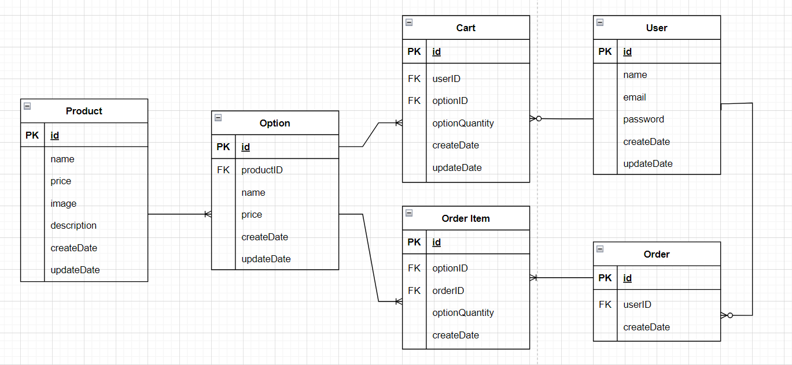

# step2-BE-kakao-shop
카카오 테크 캠퍼스 2단계 카카오 쇼핑하기 백엔드 클론 프로젝트 레포지토리입니다.

# 1주차

카카오 테크 캠퍼스 2단계 - BE - 1주차 클론 과제
</br>
</br>

## **과제명**
```
1. 요구사항분석/API요청 및 응답 시나리오 분석
2. 요구사항 추가 반영 및 테이블 설계도
```

## **과제 설명**
```
1. 요구사항 시나리오를 보고 부족해 보이는 기능을 하나 이상 체크하여 README에 내용을 작성하시오.
2. 제시된 화면설계를 보고 해당 화면설계와 배포된 기존 서버의 API주소를 매칭하여 README에 내용을 작성하시오. (카카오 화면설계 시나리오가 있음)
3. 배포된 서버에 모든 API를 POSTMAN으로 요청해본 뒤 응답되는 데이터를 확인하고 부족한 데이터가 무엇인지 체크하여 README에 내용을 작성하시오.
4. 테이블 설계를 하여 README에 ER-Diagram을 추가하여 제출하시오.
```

</br>

## **과제 상세 : 수강생들이 과제를 진행할 때, 유념해야할 것**
아래 항목은 반드시 포함하여 과제 수행해주세요!
>- 부족한 기능에 대한 요구사항을 미리 예상할 수 있는가? (예를 들면 상품등록 api가 기존 요구사항에는 없는데 추후 필요하지는 않을지, 이런 부분들을 생각하였는지) 
>- 요구사항에 맞는 API를 분석하고 사용자 시나리오를 설계하였는가? (예를 들어 배포된 서버와 화면 설계를 제시해줄 예정인데, 특정 버튼을 클릭했을 때 어떤 API가 호출되어야 할지를 아는지)
>- 응답되는 데이터가 프론트앤드 화면에 모두 반영될 수 있는지를 체크하였는가?(예를 들어 배송관련 비용이 있는데, 이런것들이 API에는 없는데 이런 부분을 캐치할 수 있는지)
>- 테이블 설계가 모든 API를 만족할 수 있게 나왔는가? (테이블이 효율적으로 나왔는가 보다는 해당 테이블로 요구사항을 만족할 수 있는지에 대한 여부만)
>- 테이블명이 이해하기 쉽게 만들어졌는가? (상품테이블이 product이면 이해하기 쉽지만, material이라고 하면 이해하기 어렵기 때문)

</br>

## **과제 내용**
**1. 요구사항 시나리오를 보고 부족해 보이는 기능을 하나 이상 체크하여 README에 내용을 작성하시오.** 

- 회원 정보 수정 기능  
회원 정보(비밀번호, 이메일 등)를 수정할 수 있는 기능이 필요하다.

- 장바구니 삭제 기능  
장바구니에 담은 상품을 삭제할 수 있는 기능이 필요하다.

- 상품 등록과 정보 수정 및 삭제  
상품 정보를 입력해 상품을 등록할 수 있는 기능이 필요하다. 또한 등록된 상품 정보를 수정하거나 상품을 삭제할 수 있는 기능이 필요하다. 이 기능은 특정 권한이 있는 사용자들만 이용이 가능하게 해야 한다.


 </br>
 </br>

**2. 제시된 화면설계를 보고 해당 화면설계와 배포된 기존 서버의 API주소를 매칭하여 README에 내용을 작성하시오.**

| 기능 | 사용자 입력 | 도메인 | 메소드 |
| --- | --- | --- | --- |
| 회원 가입 | 올바른 형식의 이메일, 이름, 비밀번호 입력 후 회원가입 버튼 클릭 | /join | POST |
| 로그인 | 올바른 이메일, 비밀번호 입력 후 로그인 버튼 클릭 | /login | POST |
| 로그아웃 | 로그아웃 버튼 클릭 | front에서 처리 | - |
| 전체 상품 목록 조회 | 로그인 후 또는 쇼핑하기 로고 클릭 | /products | GET |
| 개별 상품 상세 조회 | 전체 상품 목록 중 특정 상품 클릭 | /products/{productID} | GET |
| 상품 옵션 선택 및 수량 결정 | 상품 옵션 리스트에서 원하는 옵션 클릭 후 수량 결정 | front에서 처리 | - |
| 장바구니 담기 | 장바구니 담기 버튼 클릭 | /carts/add | POST |
| 장바구니 조회 | 상단의 장바구니 아이콘 클릭 | /carts | GET |
| 장바구니 수정 | +/- 버튼으로 상품 옵션의 수량 수정 | front에서 처리 | - |
| 장바구니 주문 | 주문하기 버튼 클릭 | /carts/update | POST |
| 결제 | 전체 동의 후 결제하기 버튼 클릭 | /orders/save | POST |
| 주문 결과 확인 | 결제 후 구매 완료 페이지 | /orders/{ordersID} | GET |

</br>
</br>

**3. 배포된 서버에 모든 API를 POSTMAN으로 요청해본 뒤 응답되는 데이터를 확인하고 부족한 데이터가 무엇인지 체크하여 README에 내용을 작성하시오.**

- 전체 상품을 조회할 때 GET 요청에 대한 response에 각 상품이 무료배송인지 유료배송인지 나타내는 데이터(delivery)가 필요하다.
- 배송 정보를 담을 delivery 테이블이 필요하다. (배송지 이름, 전화번호, 주소, 사용자 id fk, 주문 id fk)
- 주문 결과를 확인할 때 결제 금액을 계산하기 위해 Order item 테이블에서 구매한 상품들을 조회하고 수량과 가격을 조회하고 전체 결제 금액을 계산하는데, Order 테이블에 totalPrice를 추가해 전체 결제 금액을 바로 조회할 수 있게 한다.

</br>
</br>

**4. 테이블 설계를 하여 README에 ER-Diagram을 추가하여 제출하시오.**



- User
```
CREATE TABLE User (
    userID INT PRIMARY KEY AUTO_INCREMENT,
    userName VARCHAR(255) NOT NULL,
    email VARCHAR(255) NOT NULL,
    password VARCHAR(255) NOT NULL,
    createDate TIMESTAMP DEFAULT NOT NULL CURRENT_TIMESTAMP,
    updateDate TIMESTAMP DEFAULT NOT NULL CURRENT_TIMESTAMP ON UPDATE CURRENT_TIMESTAMP,
);
```
- Product
```
CREATE TABLE Product (
    productID INT PRIMARY KEY AUTO_INCREMENT,
    productName VARCHAR(255) NOT NULL,
    price INT NOT NULL,
    image VARCHAR(255),
    description TEXT,
    createDate TIMESTAMP DEFAULT NOT NULL CURRENT_TIMESTAMP,
    updateDate TIMESTAMP DEFAULT NOT NULL CURRENT_TIMESTAMP ON UPDATE CURRENT_TIMESTAMP
);
```
- Option
```
CREATE TABLE Option (
    optionID INT PRIMARY KEY AUTO_INCREMENT,
    productID INT,
    optionName VARCHAR(255) NOT NULL,
    price INT NOT NULL,
    createDate TIMESTAMP DEFAULT NOT NULL CURRENT_TIMESTAMP,
    updateDate TIMESTAMP DEFAULT NOT NULL CURRENT_TIMESTAMP ON UPDATE CURRENT_TIMESTAMP,
    FOREIGN KEY (productID) REFERENCES Product(productID)
);
```
- Cart
```
CREATE TABLE Cart (
  cartID INT PRIMARY KEY AUTO_INCREMENT,
  userID INT NOT NULL,
  optionID INT NOT NULL,
  optionQuantity INT NOT NULL,
  createDate TIMESTAMP DEFAULT NOT NULL CURRENT_TIMESTAMP,
  updateDate TIMESTAMP DEFAULT NOT NULL CURRENT_TIMESTAMP ON UPDATE CURRENT_TIMESTAMP,
  FOREIGN KEY (userID) REFERENCES User(userID),
  FOREIGN KEY (optionID) REFERENCES Option(optionID)
);
```
- Order
```
CREATE TABLE `Order` (
  orderID INT PRIMARY KEY AUTO_INCREMENT,
  userID INT,
  createDate TIMESTAMP DEFAULT NOT NULL CURRENT_TIMESTAMP,
  FOREIGN KEY (userID) REFERENCES User(userID),
);
```
- Order Item
```
CREATE TABLE OrderItem (
  itemID INT PRIMARY KEY AUTO_INCREMENT,
  optionID INT NOT NULL,
  orderId INT NOT NULL,
  quantity INT NOT NULL,
  createDate TIMESTAMP DEFAULT NOT NULL CURRENT_TIMESTAMP,
  FOREIGN KEY (orderID) REFERENCES `Order`(orderID),
  FOREIGN KEY (optionID) REFERENCES Option(optionID)
);
```

</br>
</br>
</br>
 

# 2주차

카카오 테크 캠퍼스 2단계 - BE - 2주차 클론 과제
</br>
</br>

## **과제명**
```
1. 전체 API 주소 설계
2. Mock API Controller 구현
```

## **과제 설명**
```
1. API주소를 설계하여 README에 내용을 작성하시오.
2. 가짜 데이터를 설계하여 응답하는 스프링부트 컨트롤러를 작성하고 소스코드를 업로드하시오.
```

</br>

## **과제 상세 : 수강생들이 과제를 진행할 때, 유념해야할 것**
아래 항목은 반드시 포함하여 과제 수행해주세요!
>- User 도메인을 제외한 전체 API 주소 설계가 RestAPI 맞게 설계되었는가?  POST와 GET으로만 구현되어 있어도 됨.	
>- 가짜 데이터를 설계하여 Mock API를 잘 구현하였는가? (예를 들어 DB연결없이 컨트롤러만 만들어서 배포된 서버의 응답과 동일한 형태로 데이터가 응답되는지 여부)
>- DTO에 타입은 올바르게 지정되었는가?
>- DTO에 이름은 일관성이 있는가? (예를 들어 어떤 것은 JoinDTO, 어떤 것은 joinDto, 어떤 것은 DtoJoin 이런식으로 되어 있으면 일관성이 없는것이다)
>- DTO를 공유해서 쓰면 안된다 (동일한 데이터가 응답된다 하더라도, 화면은 수시로 변경될 수 있기 때문에 DTO를 공유하고 있으면 배점을 받지 못함)
</br>

## **과제 내용**

**1. API주소를 설계하여 README에 내용을 작성하시오.** 

| 기능 | 도메인 | method |
| --- | --- | --- |
| 회원 가입 | /auth/join | POST |
| 로그인 | /auth/login | POST |
| 로그아웃 | front에서 처리 | - |
| 전체 상품 목록 조회 | /products | GET |
| 개별 상품 상세 조회 | /products/{productID} | GET |
| 장바구니 담기 | /carts | POST |
| 장바구니 조회 | /carts | GET |
| 장바구니 수정 | /carts | PATCH |
| 장바구니 주문 | /carts/update | POST |
| 결제 | /orders | POST |
| 주문 결과 확인 | /orders/{ordersID} | GET |

- 장바구니 담기 url은 /add (행위)를 제외하고 method로 구별 가능하게 했습니다.
- 장바구니 수정은 일부 정보만 수정하므로 PATCH method를 사용했습니다. 
- 결제하기에서도 마찬가지로 /save 를 제외했습니다.   

</br>
</br>

**2. 가짜 데이터를 설계하여 응답하는 스프링부트 컨트롤러를 작성하고 소스코드를 업로드하시오.**

요청, 응답 DTO를 사용해 가짜 데이터를 만들고 응답하는 controller를 작성했습니다. (week2 폴더 안)

</br>
</br>
</br>

# 3주차

카카오 테크 캠퍼스 2단계 - BE - 3주차 클론 과제
</br>
</br>

## **과제명**
```
1. 레포지토리 단위테스트
```

## **과제 설명**
```
1. 레포지토리 단위테스트를 구현하여 소스코드를 제출하시오.
2. 쿼리를 테스트하면서 가장 좋은 쿼리를 작성해보시오.
```

</br>

## **과제 상세 : 수강생들이 과제를 진행할 때, 유념해야할 것**
아래 항목은 반드시 포함하여 과제 수행해주세요!
>- 레포지토리 단위테스트가 구현되었는가?
>- 테스트 메서드끼리 유기적으로 연결되지 않았는가? (테스트는 격리성이 필요하다)
>- Persistene Context를 clear하여서 테스트가 구현되었는가? (더미데이터를 JPA를 이용해서 insert 할 예정인데, 레포지토리 테스트시에 영속화된 데이터 때문에 쿼리를 제대로 보지 못할 수 있기 때문에)
>- 테스트 코드의 쿼리 관련된 메서드가 너무 많은 select를 유발하지 않는지? (적절한 한방쿼리, 효율적인 in query, N+1 문제 등이 해결된 쿼리)
>- BDD 패턴으로 구현되었는가? given, when, then
</br>
</br>


# 4주차

카카오 테크 캠퍼스 2단계 - BE - 4주차 클론 과제
</br>
</br>

## **과제명**
```
1. 컨트롤러 단위 테스트
```

## **과제 설명**
```
1. 컨트롤러 단위테스트를 작성한뒤 소스코드를 업로드하시오.
2. stub을 구현하시오.
```

</br>

## **과제 상세 : 수강생들이 과제를 진행할 때, 유념해야할 것**
아래 항목은 반드시 포함하여 과제 수행해주세요!
>- 컨트롤러 단위테스트가 구현되었는가?
>- Mockito를 이용하여 stub을 구현하였는가?
>- 인증이 필요한 컨트롤러를 테스트할 수 있는가?
>- 200 ok만 체크한 것은 아닌가? (해당 컨트롤러에서 제일 필요한 데이터에 대한 테스트가 구현되었는가?)
>- 모든 요청과 응답이 json으로 처리되어 있는가?
</br>

## **과제 내용**

### controller 단위 테스트 ###

- **ProductRestControllerTest**
   - findAll_test: 전체 상품 목록 조회 test
   - findAll_page_test: 페이지로 전체 상품 목록 조회 test
   - findAll_page_fail_test: 페이지로 전체 상품 목록 조회 실패 test (존재하지 않는 페이지 조회 시 404 에러)
   - findById_test: 개별 상품 상세 조회 test
   - findById_fail_test: 개별 상품 상세 조회 실패 test (존재하지 않는 상품 조회 시 404 에러)

- **CartRestControllerTest**  
인증된 상태로 테스트 진행하기 위해 @WithMockUser 사용
  - add_test: 장바구니 추가 test
  - findAll_test: 장바구니 보기 test
  - update_test: 주문하기(장바구니 업데이트) test
  - clear_test: 장바구니 비우기 test

- **OrderRestControllerTest**  
인증된 상태로 테스트 진행하기 위해 @WithMockUser 사용
  - save_test: 결제 test
  - findById_test: 주문 결과 확인 test
  - findById_fail_test: 주문 결과 확인 실패 test (존재하지 않는 주문 조회 시 404 에러)

</br>
</br>


# 5주차

카카오 테크 캠퍼스 2단계 - BE - 5주차 클론 과제
</br>
</br>

## **과제명**
```
1. 실패 단위 테스트
```

## **과제 설명**
```
1. 컨트롤러 단위테스트를 구현하는데, 실패 테스트 코드를 구현하시오.
2. 어떤 문제가 발생할 수 있을지 모든 시나리오를 생각해본 뒤, 실패에 대한 모든 테스트를 구현하시오.
```

</br>

## **과제 상세 : 수강생들이 과제를 진행할 때, 유념해야할 것**
아래 항목은 반드시 포함하여 과제 수행해주세요!
>- 실패 단위 테스트가 구현되었는가?
>- 모든 예외에 대한 실패 테스트가 구현되었는가?
>- 예외에 대한 처리를 ControllerAdvice or RestControllerAdvice로 구현하였는가?
>- Validation 라이브러리를 사용하여 유효성 검사가 되었는가?
>- 테스트는 격리되어 있는가?
</br>

## **코드리뷰 관련: PR시, 아래 내용을 포함하여 코멘트 남겨주세요.**
**1. PR 제목과 내용을 아래와 같이 작성 해주세요.**

>- PR 제목 : 부산대BE_라이언_5주차 과제

</br>

**2. PR 내용 :**

>- 코드 작성하면서 어려웠던 점
>- 코드 리뷰 시, 멘토님이 중점적으로 리뷰해줬으면 하는 부분

# 6주차

카카오 테크 캠퍼스 2단계 - BE - 6주차 클론 과제
</br>
</br>

## **과제명**
```
1. 카카오 클라우드 배포
```

## **과제 설명**
```
1. 통합테스트를 구현하시오.
2. API문서를 구현하시오. (swagger, restdoc, word로 직접 작성, 공책에 적어서 제출 등 모든 방법이 다 가능합니다)
3. 프론트앤드에 입장을 생각해본뒤 어떤 문서를 가장 원할지 생각해본뒤 API문서를 작성하시오.
4. 카카오 클라우드에 배포하시오.
```

</br>

## **과제 상세 : 수강생들이 과제를 진행할 때, 유념해야할 것**
아래 항목은 반드시 포함하여 과제 수행해주세요!
>- 통합테스트가 구현되었는가?
>- API문서가 구현되었는가?
>- 배포가 정상적으로 되었는가?
>- 프로그램이 정상 작동되고 있는가?
>- API 문서에 실패 예시가 작성되었는가?
</br>

## **코드리뷰 관련: PR시, 아래 내용을 포함하여 코멘트 남겨주세요.**
**1. PR 제목과 내용을 아래와 같이 작성 해주세요.**

>- PR 제목 : 부산대BE_라이언_6주차 과제

</br>

**2. PR 내용 :**

>- 코드 작성하면서 어려웠던 점
>- 코드 리뷰 시, 멘토님이 중점적으로 리뷰해줬으면 하는 부분
