# step2-BE-kakao-shop
카카오 테크 캠퍼스 2단계 카카오 쇼핑하기 백엔드 클론 프로젝트 레포지토리입니다.

<details>
<summary>1주차</summary>

# 1주차

## 카카오 테크 캠퍼스 2단계 - BE - 1주차 클론 과제

[pdf 과제물](./assets/%EB%B6%80%EC%82%B0%EB%8C%80_BE_%EA%B9%80%ED%83%9C%ED%98%B8_1%EC%A3%BC%EC%B0%A8_%ED%85%8C%EC%9D%B4%EB%B8%94_%EC%84%A4%EA%B3%84%ED%95%98%EA%B8%B0.pdf) 
<details>
<summary>과제 설명</summary>

## **과제명**
```
1. 요구사항분석/API요청 및 응답 시나리오 분석
2. 요구사항 추가 반영 및 테이블 설계도
```

## **과제 설명**
```
1. 요구사항 시나리오를 보고 부족해 보이는 기능을 하나 이상 체크하여 README에 내용을 작성하시오.
2. 제시된 화면설계를 보고 해당 화면설계와 배포된 기존 서버의 API주소를 매칭하여 README에 내용을 작성하시오. (카카오 화면설계 시나리오가 있음)
3. 배포된 서버에 모든 API를 POSTMAN으로 요청해본 뒤 응답되는 데이터를 확인하고 부족한 데이터가 무엇인지 체크하여 README에 내용을 작성하시오.
4. 테이블 설계를 하여 README에 ER-Diagram을 추가하여 제출하시오.
```

</br>

## **과제 상세 : 수강생들이 과제를 진행할 때, 유념해야할 것**
아래 항목은 반드시 포함하여 과제 수행해주세요!
>- 부족한 기능에 대한 요구사항을 미리 예상할 수 있는가? (예를 들면 상품등록 api가 기존 요구사항에는 없는데 추후 필요하지는 않을지, 이런 부분들을 생각하였는지) 
>- 요구사항에 맞는 API를 분석하고 사용자 시나리오를 설계하였는가? (예를 들어 배포된 서버와 화면 설계를 제시해줄 예정인데, 특정 버튼을 클릭했을 때 어떤 API가 호출되어야 할지를 아는지)
>- 응답되는 데이터가 프론트앤드 화면에 모두 반영될 수 있는지를 체크하였는가?(예를 들어 배송관련 비용이 있는데, 이런것들이 API에는 없는데 이런 부분을 캐치할 수 있는지)
>- 테이블 설계가 모든 API를 만족할 수 있게 나왔는가? (테이블이 효율적으로 나왔는가 보다는 해당 테이블로 요구사항을 만족할 수 있는지에 대한 여부만)
>- 테이블명이 이해하기 쉽게 만들어졌는가? (상품테이블이 product이면 이해하기 쉽지만, material이라고 하면 이해하기 어렵기 때문)

</details>


<details>
<summary> 과제1 요구사항 보충</summary>

### 로그아웃 api 부족

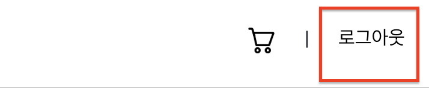

- 현재 로그아웃 버튼은 존재하지만 클라이언트에서 서버로 api를 요청하진 않습니다.
- 하지만 RefreshToken등을 추가한다면 api로 만드는 것이 좋아 보입니다.

</br>
</br>

### 회원 정보 수정, 회원 탈퇴 api 부족

- 현재 회원 기능 중 로그인, 회원 가입은 구현되어 있지만 회원 정보를 수정하는 기능은 없습니다.
- 또한 카카오와 같은 카카오톡 아이디로 모든 서비스들을 로그인할 수 있는 시스템이 아니라면 회원 탈퇴기능도 구현해야합니다.

</br>
</br>

### 장바구니 삭제 api 부족

- 현재 api 설계상에는 한번 장바구니 물품을 넣으면 제거할 수 없는 구조입니다.
    
    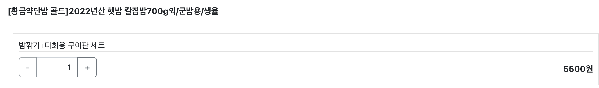
    
    삭제 버튼이 없고 수량을 0으로 만들 수 없습니다.
    
- 하지만 실제 서비스(카카오 쇼핑몰)에는 장바구니 삭제 기능이 포함되어 있습니다.
    
    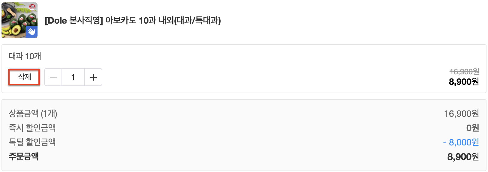

</br>
</br>    

### 배송지 관련 api 부족

- 현재 배송지에 대한 정보를 입력할 순 있지만 서버에 저장되지 않습니다.
- 사용자가 설정한 배송지를 저장할 수 있어야합니다.

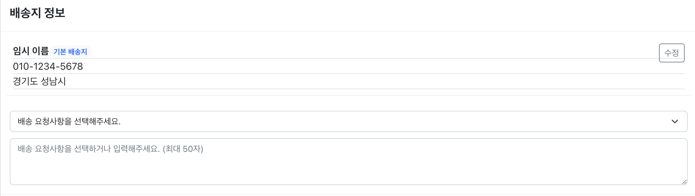

</br>
</br>

### 환불(주문 삭제) api 부족

- 특정 상황에서는 환불 요청을 할 수 있어야 합니다.
- 하지만, 현재 제공하는 api 문서에서는 해당 기능이 없습니다.

</br>
</br>

### 검색 API 부족

- 현재 상품을 접근할 수 있는 방법이 인덱스 페이지인 전체 상품 목록을 통해서만 가능합니다.
- 하지만 상품의 갯수가 늘어나면 해당 방법으로는 사용자가 상품을 찾기 매우 어려워 집니다.
- 그렇기에 검색 기능이 필요해보입니다.

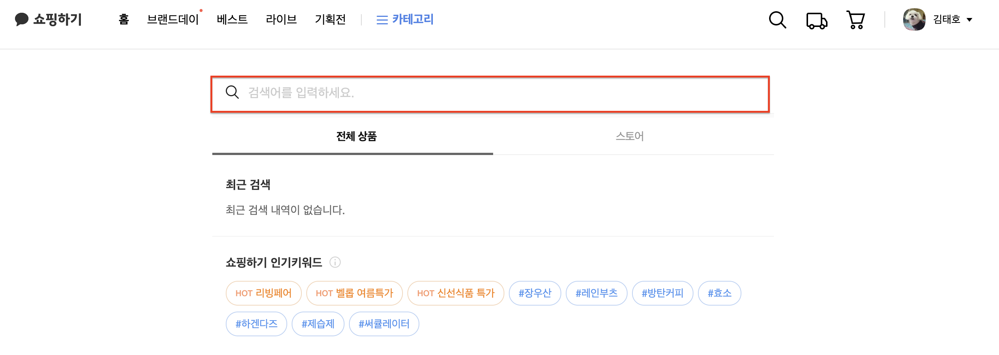

</br>
</br>

### 판매자 관련 API가 필요하지 않은 이유

- 처음에는 당연하게도 쇼핑하기에서 판매자와 관련된 API를 제공해야한다고 생각했습니다.

</br>

- 분명 과제에서도 아래와 같은 문구를 통해서 판매자 관련 API가 필요할 것이라고 언급을 합니다.
    > 부족한 기능에 대한 요구사항을 미리 예상할 수 있는가? (예를 들면 상품등록 api가 기존 요구사항에는 없는데 추후 필요하지는 않을지, 이런 부분들을 생각하였는지) 

</br>

- **하지만, 다시 한번 생각해보니 판매자 API를 만들지 않는 이유는 구매(쇼핑)사이트와 판매 사이트를 분리해 각각 다른 서버에서 운영하기 위함인 것 같습니다.**

</br>

- 이렇게 생각한 이유에는 다음과 같습니다.
    1. 판매자의 경우 사업자등록증과 같은 별도의 데이터 혹은 기능을 추가로 요구할 것 같습니다.

        - 즉, 판매자는 구매자와는 다른 회원가입을 제공해야 합니다.
        - 또한 판매자는 상품 등록과 관련된 API뿐 아니라 구매 동향, 제품 별 판매량과 같은 통계적인 부분을 대시보드로 제공해야 합니다.
        - 이를 하나의 사이트나 앱에서 구현하면 화면 복잡도가 커질 것 같고, 유지보수가 힘들어질 것 같습니다.

    
    </br>
    
    2.  구매, 판매를 나눔으로써 구매와 판매의 업무 분담이 가능해집니다.
        - 이 둘을 나눔으로써 각 업무를 분담할 수 있을 뿐만 아니라 각 서비스에 대해서만 권한을 줌으로써 데이터 접근 권한을 세분화 할 수 있을 것 같습니다.
    
    </br>

    3. 구매, 판매 서비스를 하나의 사이트로 관리한다면 파격 할인과 같은 이유로 구매에 대규모 트래픽이 발생해 서버 접속이 불가능해졌을 때 판매 서비스 또한 사용이 불가능해집니다.
        - 구매 서비스가 불가능한 것은 구매자가 잠시 쇼핑 기능과 주문을 확인할 수 없어지는 상황만이 발생합니다. 이것도 큰 문제 상황이긴 합니다.
        - 하지만 판매자와 관련된 서비스가 불가능한 것은 매우 큰 문제가 발생할 수 있을 것이라고 생각했습니다. 만약 1시간 동안 서비스가 제공되지 않는다면 판매 회사는 그 동안 업무가 마비될 것 같습니다. 이는 곧 판매 회사에 막대한 손해를 입히는 것과 다름이 없고 카카오 쇼핑 측은 구매자에 비해 해결해야하는 절차나 보상의 수준이 달라질 수 있을 것 같습니다.
        - 따라서, 구매 서버의 트래픽과 같은 요소가 판매 서버에 영향을 미쳐선 안된다고 생각했습니다.

</br>

- 위와 같은 이유들로 인해 `카카오 쇼핑하기`에서는 판매관련 API를 제공하지 않아도 된다고 생각합니다.

- `카카오 쇼핑하기 for 판매자`와 같은 사이트에서 판매관련 API를 제공할 듯 합니다.

</details>

<details>
<summary> 과제2 화면설계 API 매칭</summary>

## 기능 별 필요 API
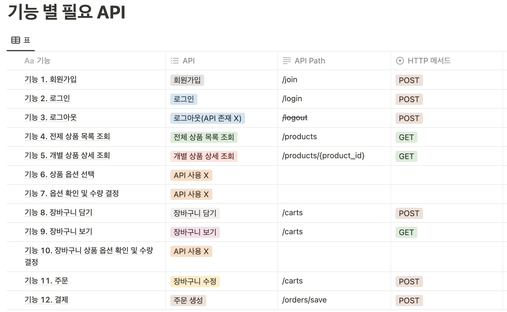

----------

## 화면 별 필요 API
</br>

### 화면 1. 회원가입 페이지

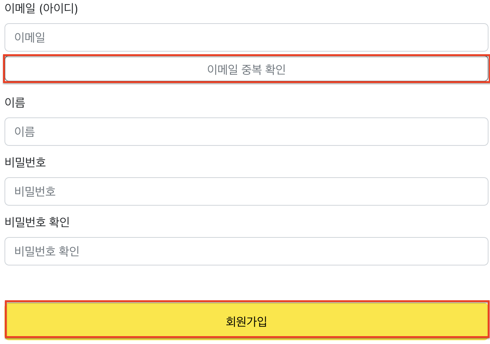

> **필요한 기능: 회원가입 </br>
필요한 HTTP 메서드: POST </br>
서버에 데이터를 전송하는 순간: 회원가입 버튼을 누를 때 </br>
서버에 필요한 데이터(body)**:
> 
> - 이메일
> - 이름
> - 비밀번호
> 
> **클라이언트가 필요한 API**: 회원가입 API -> `/join`
> 

> **필요한 기능: 이메일 중복 확인 </br>
필요한 HTTP 메서드: POST </br>
서버에 데이터를 전송하는 순간: 이메일 중복 확인 버튼을 누를 때 </br>
서버에 필요한 데이터(body)**:
> 
> - 이메일
> 
> **클라이언트가 필요한 API**: 이메일 중복 확인 API -> `/check`
> 
</br>

### 화면 2. 로그인 페이지

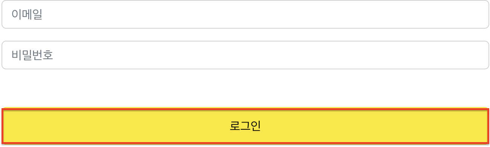

> **필요한 기능: 로그인 </br>
필요한 HTTP 메서드: POST </br>
서버에 데이터를 전송하는 순간: 로그인 버튼을 누를 때 </br>
서버에 필요한 데이터(body)**:
> 
> - 이메일
> - 비밀번호
> 
> **클라이언트가 필요한 API**: 로그인 API -> `/login`
> 
</br>

### 화면 3. 로그아웃

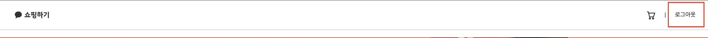

> **필요한 기능: 로그아웃 </br>
필요한 HTTP** : **POST </br>
서버에서 데이터를 전송받는 순간: 로그아웃 버튼 클릭 시 </br>
서버에 필요한 데이터(header)**:
> 
> - 사용자 토큰
> 
> 클라이언트가 필요한 API: 로그아웃 API -> `/logout`
> 
</br>

### 화면 4. 인덱스 페이지


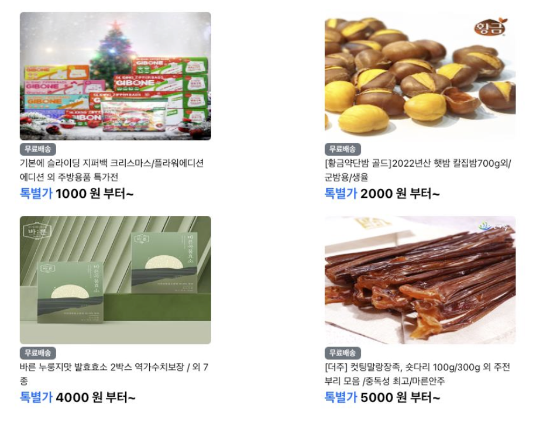

> **필요한 기능: 제품 목록 및 데이터 </br>
필요한 HTTP 메서드: GET </br>
서버에서 데이터를 전송받는 순간: 화면 로딩 시 </br>
화면을 구성하는데 필요한 데이터(response)**:
> 
> - 제품명
> - 제품 사진
> - 제품 가격(톡별가)
> 
> **클라이언트가 필요한 API**: 전체 상품 목록 조회 API -> `/products`
> 
</br>

### 화면 5. 상품 상세 페이지

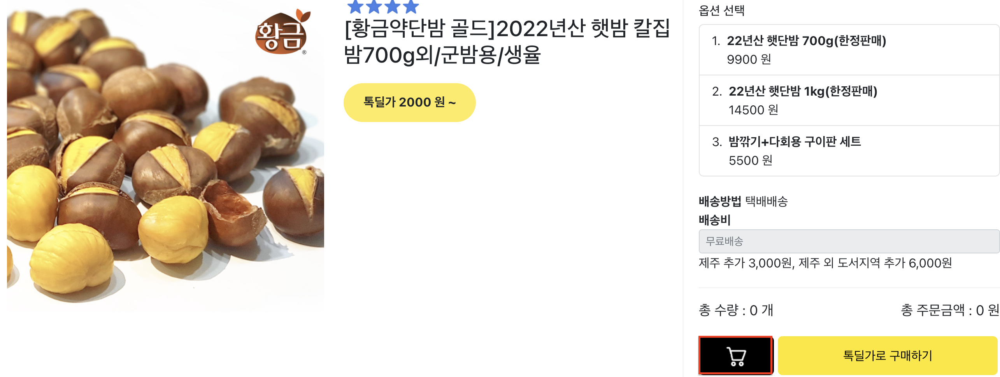

> **필요한 기능: 제품 상세 데이터 </br>
필요한 HTTP** : **GET </br>
서버에서 데이터를 전송받는 순간: 화면 로딩 시 </br>
화면을 구성하는데 필요한 데이터(response):**
> 
> - 제품명
> - 제품 사진
> - 제품 가격(톡딜가)
> - 옵션 이름
> - 옵션 가격
> 
> 클라이언트가 필요한 API: 개별 상품 상세 조회 API -> `/products/{product_id}`
> 
</br>

> **필요한 기능: 장바구니 담기 </br>
필요한 HTTP** : **POST </br>
서버에서 데이터를 전송받는 순간: 장바구니 버튼 클릭 시 </br>
서버에 필요한 데이터(header)**:
> 
> - 사용자 토큰
> 
> **서버에** **필요한 데이터(body):**
> 
> - 옵션 ID
> - 수량
> 
> 클라이언트가 필요한 API: 장바구니 담기 API ->  `/carts/add`
> 
</br>

### 화면 6. 장바구니 페이지

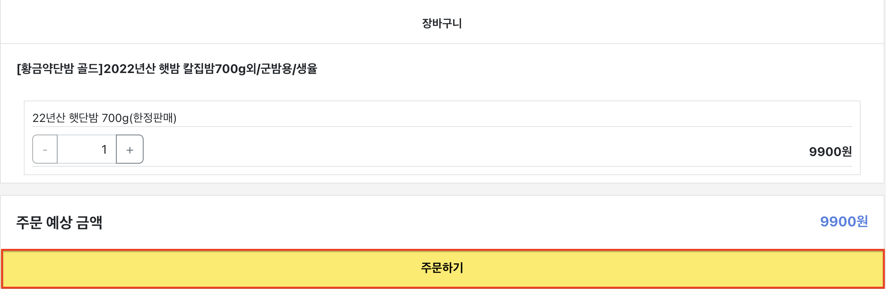

> **필요한 기능: 장바구니 데이터 </br>
필요한 HTTP** : **GET </br>
서버에서 데이터를 전송받는 순간: 화면 로딩 시 </br>
서버에 필요한 데이터(header)**:
> 
> - 사용자 토큰
> 
> **화면을 구성하는데 필요한 데이터(response):**
> 
> - 제품 이름
> - 옵션 이름
> - 옵션 수량
> - 옵션 가격
> - 총 가격
> 
> 클라이언트가 필요한 API: 장바구니 조회 API -> `/carts`
> 

> **필요한 기능: 장바구니 수정 </br>
필요한 HTTP** : **POST </br>
서버에서 데이터를 전송받는 순간: 주문하기 클릭 시 </br>
서버에 필요한 데이터(header)**:
> 
> - 사용자 토큰
> 
> **서버에 필요한 데이터(body):**
> 
> - 장바구니 ID
> - 수량
> 
> 클라이언트가 필요한 API: 장바구니 조회 API -> `/carts/update`
> 
</br>

### 화면 7. 결제 페이지

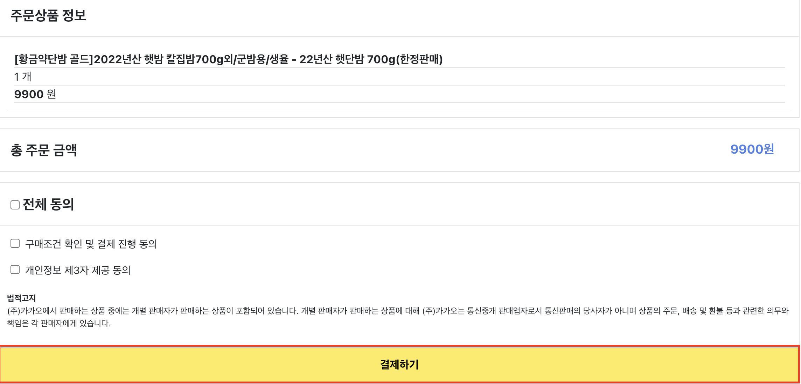

> **필요한 기능: 장바구니 데이터 </br>
필요한 HTTP** : **GET </br>
서버에서 데이터를 전송받는 순간: 화면 로딩 시 </br>
서버에 필요한 데이터(header)**:
> 
> - 사용자 토큰
> 
> **화면을 구성하는데 필요한 데이터(response):**
> 
> - 제품 이름
> - 옵션 이름
> - 옵션 수량
> - 옵션 가격
> - 총 가격
> 
> 클라이언트가 필요한 API: 장바구니 조회 API -> `/carts`
> 

> **필요한 기능: 주문 저장 </br>
필요한 HTTP** : **POST </br>
서버에서 데이터를 전송받는 순간: 결제하기 클릭 시 </br>
서버에 필요한 데이터(header)**:
> 
> - 사용자 토큰
> 
> 클라이언트가 필요한 API: 결제하기 API -> `orders/save`
> 
</br>

### 화면 8. 주문 결과 확인 페이지

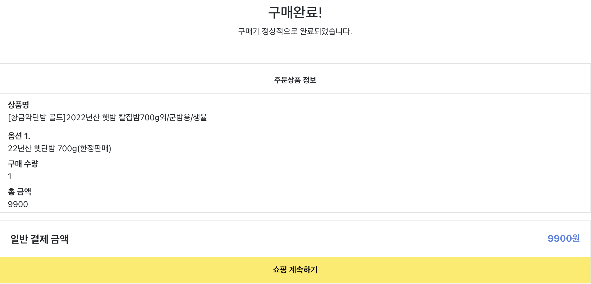

> **필요한 기능: 주문 데이터 </br>
필요한 HTTP** : **GET </br>
서버에서 데이터를 전송받는 순간: 화면 로딩 시 </br>
서버에 필요한 데이터(header)**:
> 
> - 사용자 토큰
> 
> **화면을 구성하는데 필요한 데이터(response):**
> 
> - 제품 이름
> - 옵션 이름
> - 수량
> - 옵션 가격
> - 총 가격
> 
> 클라이언트가 필요한 API: 주문 조회 API -> `/orders/{order_Id}`
>

</details>

<details>
<summary> 과제3. 응답 데이터 보충 </summary>

### 1. 공통

- 유저의 장바구니 물품 수를 알림으로 알려주기 위해 응답 데이터에 장바구니 물품 수를 추가로 제공해야합니다.
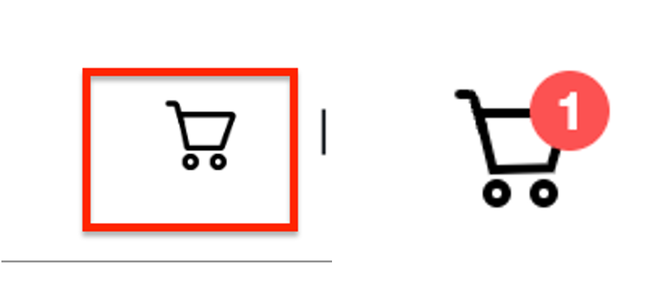
</br> 각각 테스트와 실제 서버


</br>
</br>

### 2. 장바구니 조회

- 현재 데이터에서는 물품(product)별 총 가격을 제공하지 않고 전체 가격만 제공을 합니다.

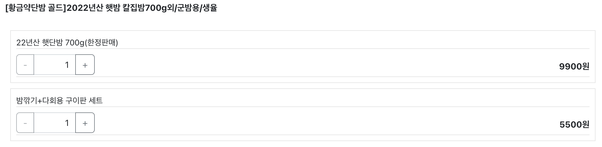
</br>

```json
{
    "id": 2,
    "productName": "[황금약단밤 골드]2022년산 햇밤 칼집밤700g외/군밤용/생율",
    "carts": [
        {
            "id": 9,
            "option": {
                "id": 6,
                "optionName": "22년산 햇단밤 700g(한정판매)",
                "price": 9900
            },
            "quantity": 1,
            "price": 9900
        },
        {
            "id": 2,
            "option": {
                "id": 8,
                "optionName": "밤깎기+다회용 구이판 세트",
                "price": 5500
            },
            "quantity": 1,
            "price": 5500
        }
    ]
},
```

- 실제 카카오 쇼핑하기 서비스에서는 물품 별 전체 가격을 제공하고 있습니다.
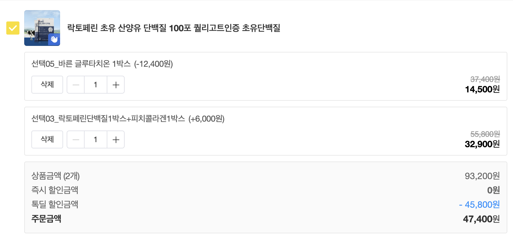

- 또한 가격을 전부 `price`로 통일했기에 carts의 가격인지 option의 가격인지 알기 어려운 것 같습니다.
- 이를 각각 cartPrice, optionPrice로 변경해서 전달하면 좋을 듯합니다.

</br>
</br>

### 3. 주문하기 (장바구니 수정)

- 주문하기 페이지에서 장바구니 수정 후 응답 데이터에는 물품 제목이 없지만 프론트엔드에서는 물품 제목이 필요로 합니다.
- 그래서 SQL 로그를 확인하니 현재는 장바구니 수정 후 다시 장바구니 조회를 이용해 프론트엔드에 데이터를 전달하고 있습니다.

```json
"carts": [
  {
      "cartId": 2,
      "optionId": 8,
      "optionName": "밤깎기+다회용 구이판 세트",
      "quantity": 1,
      "price": 5500
  },
  {
      "cartId": 3,
      "optionId": 4,
      "optionName": "뽑아쓰는 키친타올 130매 12팩",
      "quantity": 1,
      "price": 16900
  },
...
]
```

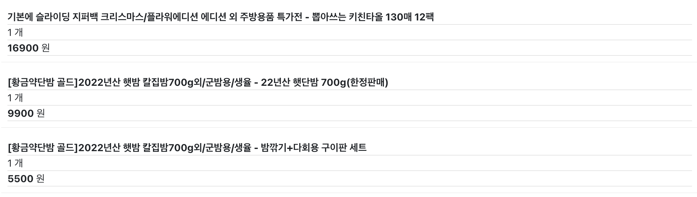</br> 프론트 엔드에서 확인한 장바구니 데이터


</br>
</br>

### 4. 결제하기 (주문 생성) 및 주문 조회

- 결제시 주문 데이터가 생성됩니다.
    
    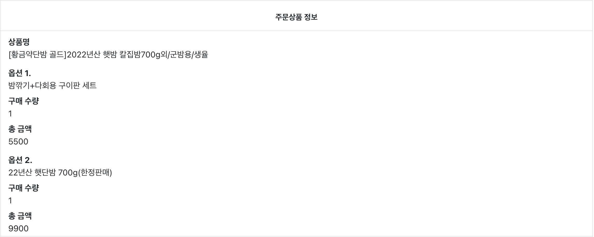
    주문 정보 데이터 중 일부
</br>

- 하지만, 실서비스에서는 결제하기에 있던 배송지 정보도 같이 있어야 한다고 생각됩니다.
    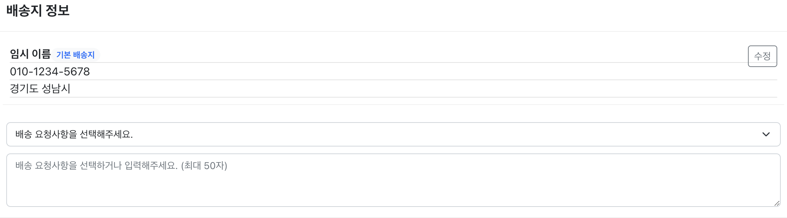
    결제하기 페이지에 있던 배송지 정보

</br>

- 추가로 주문시각도 응답 데이터에 보충해야 한다고 생각합니다.
</details>


<details>
<summary> 과제4. 데이터 베이스 ERD 작성</summary>

## 전체 ERD

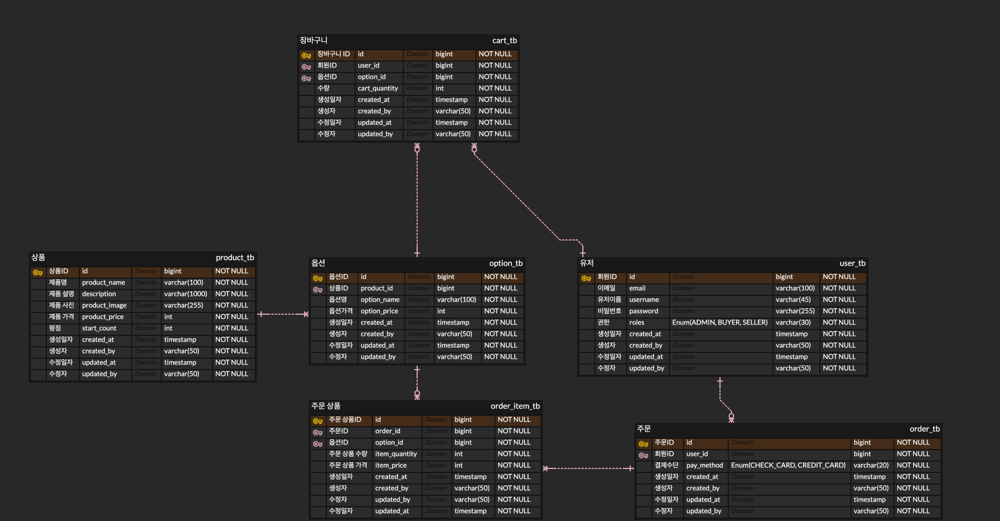

--------

## 공통

- 공통적으로 모든 테이블에 대해서 생성일자, 수정일자, 생성자, 수정자를 추가했습니다.
- 이는 특정 실제 서비스를 운영할 때 반드시 필요한 데이터라고 생각합니다.
- 주문, 영수증과 같이 돈이 관련된다면 더욱 필요하다고 생각합니다.

</br>

## 1. 사용자(User)

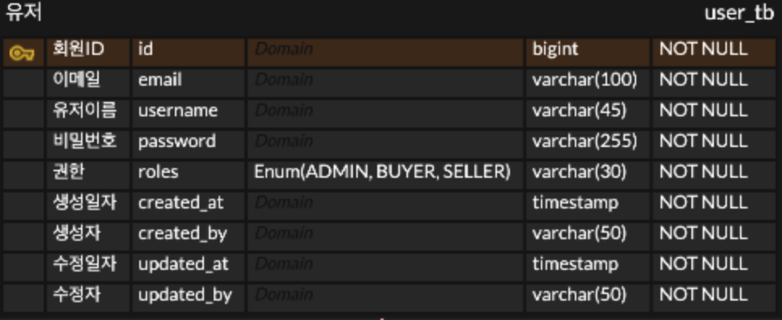

</br>

- API에 어드민 기능이 있는 것을 미루어 보아 권한이 필요해 보였습니다.
- 현재는 역할에 포함된 SELLER의 경우 실제 구현한다면 사업자 등록증, 회사등이 포함된 다른 테이블 사용할 듯 합니다.

</br>

## 2. 상품(Product)

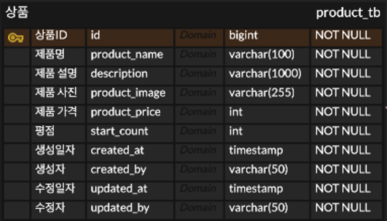

</br>

- API나 화면설계상 해당하는 컬럼만 존재하면 될 듯 합니다.

</br>

## 3. 옵션(Option)

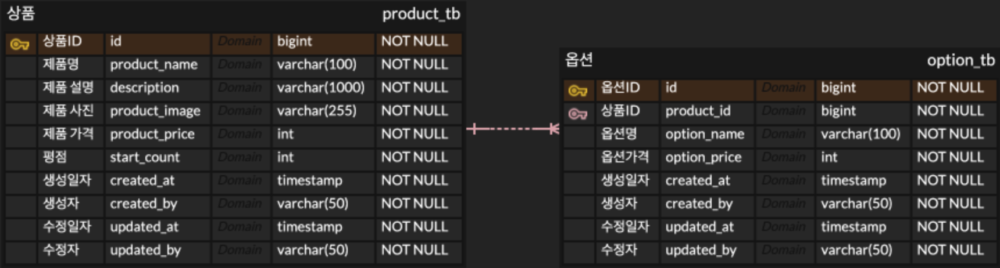

</br>

- 옵션의 경우 상품ID를 외래키로 가집니다.
- 현재 선택한 것은 상품이 만들어지면 무조건 옵션도 한 개 이상 존재한다는 조건의 연관관계를 설정했습니다.
- 이는 화면 설계서이나 API 문서에 맞춘 테이블입니다.
- 하지만 실제 서비스에는 다음과 같이 옵션이 없는 경우도 존재합니다.
    
    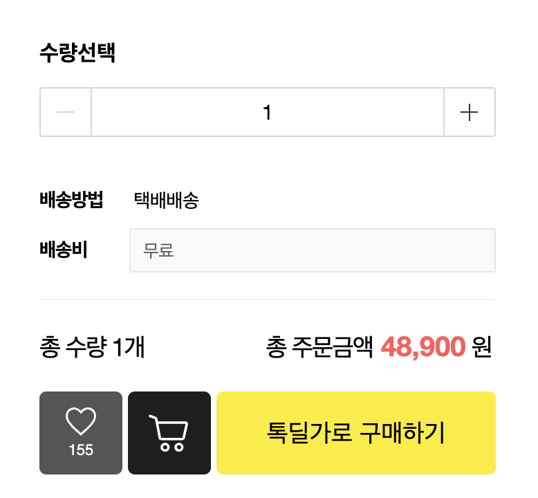
  
  </br>

- 위 경우에서는 상품이 존재해도 옵션이 없을 수 있게 조건을 변경해줘야 합니다.
- 그러나 이렇게 되면 이후 장바구니, 주문 상품이 옵션 테이블을 의존하는 상황에서 API가 제대로 나오지 않게 됩니다.
- 옵션 테이블이 이후 다른 테이블에 많은 영향을 미치기 때문에 섣불리 구조를 변경한다면 주어진 API 맞게 나오지 않을 가능성이 높아 보입니다.
- **이러한 상황에서는 어떻게 해결하는 것이 좋을지 궁금합니다.**

</br>

## 4. 장바구니(Cart)

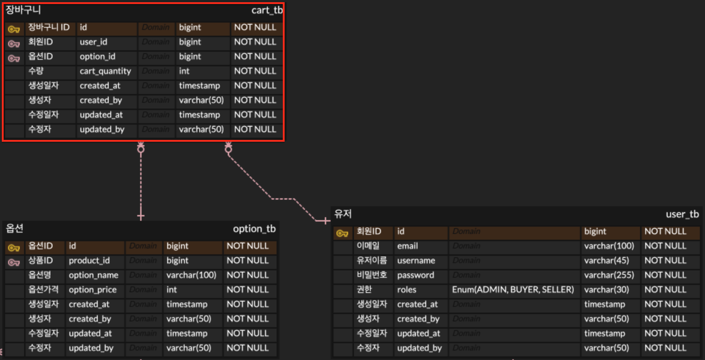

</br>

- 장바구니 테이블은 유저 ID와 옵션 ID를 외래키로 가집니다.
- 이때, 유저와 옵션이 있더라도 장바구니는 없을 수 있기 때문에 위와 같은 연관관계 연결을 했습니다.
- **만약 장바구니 가격 컬럼이 존재한다면, 옵션의 가격이 변경됐을때 옵션ID에 해당하는 모든 장바구니 가격 데이터가 수정되어야 하는 상황이 발생할 것 같아 제외했습니다.**

</br>

## 5. 주문 & 주문 상품

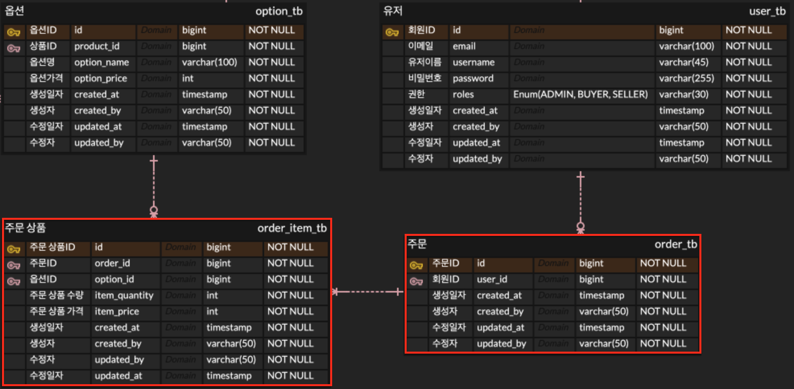

</br>

- 현재 서비스 로직 상 주문이 생성될 때 장바구니 데이터를 비우게 됩니다.
- 그렇기에 주문한 상품들에 대해서 저장할 다른 테이블이 필요하게 됩니다.
- 장바구니 테이블의 컬럼들과 거의 같은 item 테이블을 만들어 이를 해결했습니다.
- 이때, 장바구니 가격 컬럼처럼 옵션 가격 변경 시 옵션ID에 해당하는 모든 주문 상품 가격 데이터를 수정할 필요가 없다고 판단됩니다.
- 이는 주문 조회 시 주문한 상품의 가격이 변동되면 사용자가 오히려 혼란을 느낄 가능성이 크다고 생각되어 한번 주문 시 옵션의 가격에 영향받지 않도록 했습니다.

</details>

</details>

---

<!-- <details>

<summary> 2주차 </summary> -->

# 2주차

카카오 테크 캠퍼스 2단계 - BE - 2주차 클론 과제
</br>
</br>

<details>
<summary>과제 설명</summary>

## **과제명**
```
1. 전체 API 주소 설계
2. Mock API Controller 구현
```

## **과제 설명**
```
1. API주소를 설계하여 README에 내용을 작성하시오.
2. 가짜 데이터를 설계하여 응답하는 스프링부트 컨트롤러를 작성하고 소스코드를 업로드하시오.
```

</br>

## **과제 상세 : 수강생들이 과제를 진행할 때, 유념해야할 것**
아래 항목은 반드시 포함하여 과제 수행해주세요!
>- 전체 API 주소 설계가 RestAPI 맞게 설계되었는가? (예를 들어 배포된 서버는 POST와 GET으로만 구현되었는데, 학생들은 PUT과 DELETE도 배울 예정이라 이부분이 반영되었고, 주소가 RestAPI에 맞게 설계되었는지)
>- 가짜 데이터를 설계하여 Mock API를 잘 구현하였는가? (예를 들어 DB연결없이 컨트롤러만 만들어서 배포된 서버의 응답과 동일한 형태로 데이터가 응답되는지 여부)
</br>

## **코드리뷰 관련: PR시, 아래 내용을 포함하여 코멘트 남겨주세요.**
**1. PR 제목과 내용을 아래와 같이 작성 해주세요.**

>- PR 제목 : 부산대BE_라이언_2주차 과제

</br>

**2. PR 내용 :**

>- 코드 작성하면서 어려웠던 점
>- 코드 리뷰 시, 멘토님이 중점적으로 리뷰해줬으면 하는 부분
</details>

<details>
<summary>전체 API 주소 설계</summary>

### 1. 이메일 중복 체크
- Method : `POST`
- URI : `/auth/check`

</br>

### 2. 회원가입
- Method : `POST`
- URI : `/auth/join`

</br>

### 3. 로그인
- Method : `POST`
- URI : `/auth/login`

</br>

### 4. 데이터 리셋
- Method : `DELETE`
- URI : `/admin/reset`

</br>

### 5. 전체 상품 목록 조회
- Method : `GET`
- URI : `/products`

</br>

### 6. 개별 상품 목록 조회
- Method : `GET`
- URI : `/products/{product-id}`

</br>

### 7. 장바구니 담기
- Method : `POST`
- URI : `/carts`

</br>

### 8. 장바구니 수정
- Method : `PATCH`
- URI : `/carts`

</br>

### 9. 장바구니 조회
- Method : `GET`
- URI : `/carts`

</br>

### 10. 주문하기
- Method : `POST`
- URI : `/orders`

</br>

### 11. 주문결과 확인
- Method : `GET`
- URI : `orders/{order-id}`

</details>


<!-- </details> -->

---

<details>

<summary> 3주차 </summary>

# 3주차

카카오 테크 캠퍼스 2단계 - BE - 3주차 클론 과제
</br>
</br>

## **과제명**
```
1. 레포지토리 단위테스트
```

## **과제 설명**
```
1. 레포지토리 단위테스트를 구현하여 소스코드를 제출하시오.
2. 쿼리를 테스트하면서 가장 좋은 쿼리를 작성해보시오.
```

</br>

## **과제 상세 : 수강생들이 과제를 진행할 때, 유념해야할 것**
아래 항목은 반드시 포함하여 과제 수행해주세요!
>- 레포지토리 단위테스트가 구현되었는가?
>- 테스트 메서드끼리 유기적으로 연결되지 않았는가? (테스트는 격리성이 필요하다)
>- Persistene Context를 clear하여서 테스트가 구현되었는가? (더미데이터를 JPA를 이용해서 insert 할 예정인데, 레포지토리 테스트시에 영속화된 데이터 때문에 쿼리를 제대로 보지 못할 수 있기 때문에)
>- 테스트 코드의 쿼리 관련된 메서드가 너무 많은 select를 유발하지 않는지? (적절한 한방쿼리, 효율적인 in query, N+1 문제 등이 해결된 쿼리)
</br>

## **코드리뷰 관련: PR시, 아래 내용을 포함하여 코멘트 남겨주세요.**
**1. PR 제목과 내용을 아래와 같이 작성 해주세요.**

>- PR 제목 : 부산대BE_라이언_3주차 과제

</br>

**2. PR 내용 :**

>- 코드 작성하면서 어려웠던 점
>- 코드 리뷰 시, 멘토님이 중점적으로 리뷰해줬으면 하는 부분

</details>


<details>

<summary> 4주차 </summary>

# 4주차

카카오 테크 캠퍼스 2단계 - BE - 4주차 클론 과제
</br>
</br>

## **과제명**
```
1. 컨트롤러 단위 테스트
```

## **과제 설명**
```
1. 컨트롤러 단위테스트를 작성한뒤 소스코드를 업로드하시오.
2. stub을 구현하시오.
```

</br>

## **과제 상세 : 수강생들이 과제를 진행할 때, 유념해야할 것**
아래 항목은 반드시 포함하여 과제 수행해주세요!
>- 컨트롤러 단위테스트가 구현되었는가?
>- Mockito를 이용하여 stub을 구현하였는가?
>- 인증이 필요한 컨트롤러를 테스트할 수 있는가?
>- 200 ok만 체크한 것은 아닌가? (해당 컨트롤러에서 제일 필요한 데이터에 대한 테스트가 구현되었는가?)
</br>

## **코드리뷰 관련: PR시, 아래 내용을 포함하여 코멘트 남겨주세요.**
**1. PR 제목과 내용을 아래와 같이 작성 해주세요.**

>- PR 제목 : 부산대BE_라이언_4주차 과제 

</br>

**2. PR 내용 :**

>- 코드 작성하면서 어려웠던 점
>- 코드 리뷰 시, 멘토님이 중점적으로 리뷰해줬으면 하는 부분

</details>

<details>

<summary> 5주차 </summary>

# 5주차

카카오 테크 캠퍼스 2단계 - BE - 5주차 클론 과제
</br>
</br>

## **과제명**
```
1. 실패 단위 테스트
```

## **과제 설명**
```
1. 컨트롤러 단위테스트를 구현하는데, 실패 테스트 코드를 구현하시오.
2. 어떤 문제가 발생할 수 있을지 모든 시나리오를 생각해본 뒤, 실패에 대한 모든 테스트를 구현하시오.
```

</br>

## **과제 상세 : 수강생들이 과제를 진행할 때, 유념해야할 것**
아래 항목은 반드시 포함하여 과제 수행해주세요!
>- 실패 단위 테스트가 구현되었는가?
>- 모든 예외에 대한 실패 테스트가 구현되었는가?
</br>

## **코드리뷰 관련: PR시, 아래 내용을 포함하여 코멘트 남겨주세요.**
**1. PR 제목과 내용을 아래와 같이 작성 해주세요.**

>- PR 제목 : 부산대BE_라이언_5주차 과제

</br>

**2. PR 내용 :**

>- 코드 작성하면서 어려웠던 점
>- 코드 리뷰 시, 멘토님이 중점적으로 리뷰해줬으면 하는 부분

</details>

<details>

<summary> 6주차 </summary>

# 6주차

카카오 테크 캠퍼스 2단계 - BE - 6주차 클론 과제
</br>
</br>

## **과제명**
```
1. 카카오 클라우드 배포
```

## **과제 설명**
```
1. 통합테스트를 구현하시오.
2. API문서를 구현하시오. (swagger, restdoc, word로 직접 작성, 공책에 적어서 제출 등 모든 방법이 다 가능합니다)
3. 프론트앤드에 입장을 생각해본뒤 어떤 문서를 가장 원할지 생각해본뒤 API문서를 작성하시오.
4. 카카오 클라우드에 배포하시오.
5. 배포한 뒤 서비스 장애가 일어날 수 있으니, 해당 장애에 대처할 수 있게 로그를 작성하시오. (로그는 DB에 넣어도 되고, 외부 라이브러리를 사용해도 되고, 파일로 남겨도 된다 - 단 장애 발생시 확인을 할 수 있어야 한다)
```

</br>

## **과제 상세 : 수강생들이 과제를 진행할 때, 유념해야할 것**
아래 항목은 반드시 포함하여 과제 수행해주세요!
>- 통합테스트가 구현되었는가?
>- API문서가 구현되었는가?
>- 배포가 정상적으로 되었는가?
>- 서비스에 문제가 발생했을 때, 로그를 통해 문제를 확인할 수 있는가?
</br>

## **코드리뷰 관련: PR시, 아래 내용을 포함하여 코멘트 남겨주세요.**
**1. PR 제목과 내용을 아래와 같이 작성 해주세요.**

>- PR 제목 : 부산대BE_라이언_6주차 과제

</br>

**2. PR 내용 :**

>- 코드 작성하면서 어려웠던 점
>- 코드 리뷰 시, 멘토님이 중점적으로 리뷰해줬으면 하는 부분

</details>