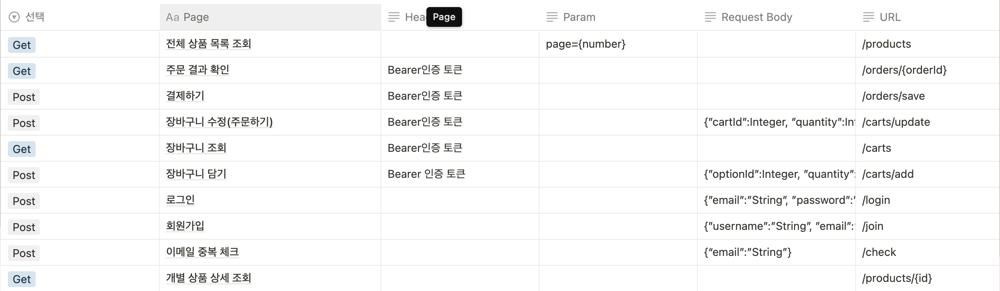
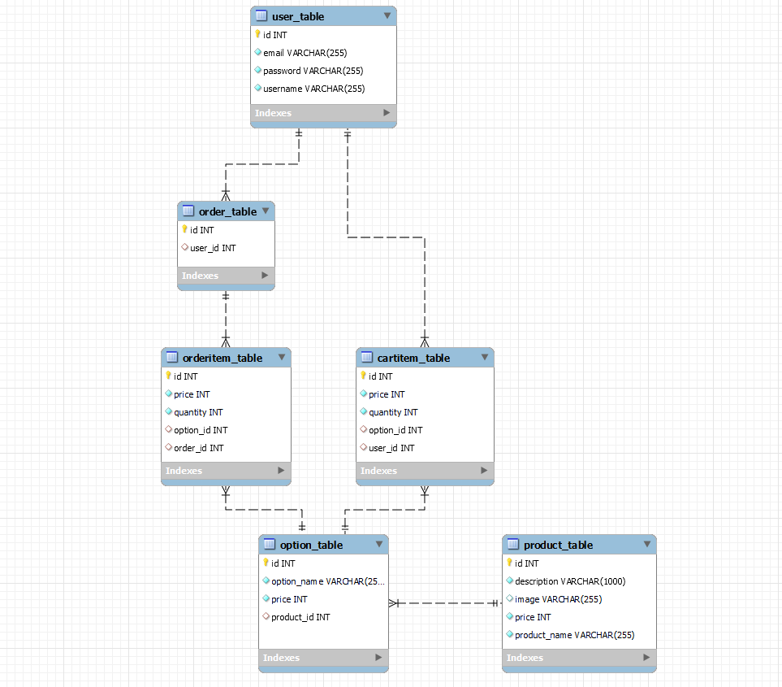
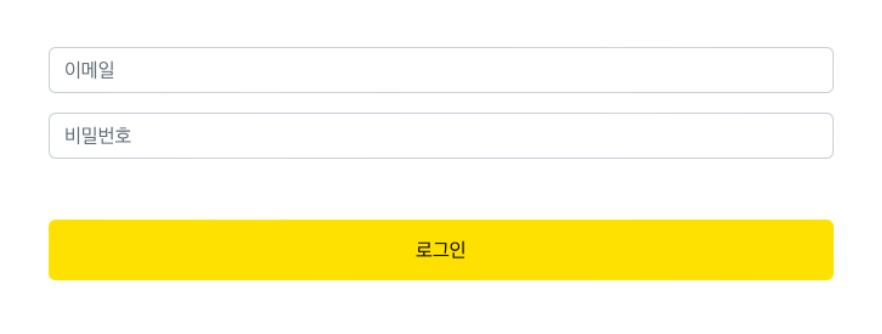
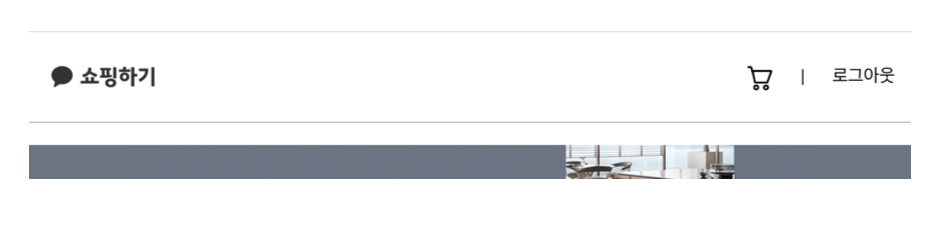
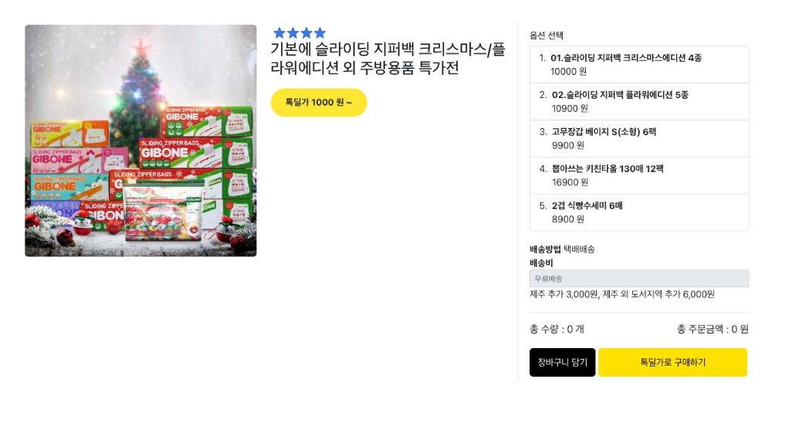
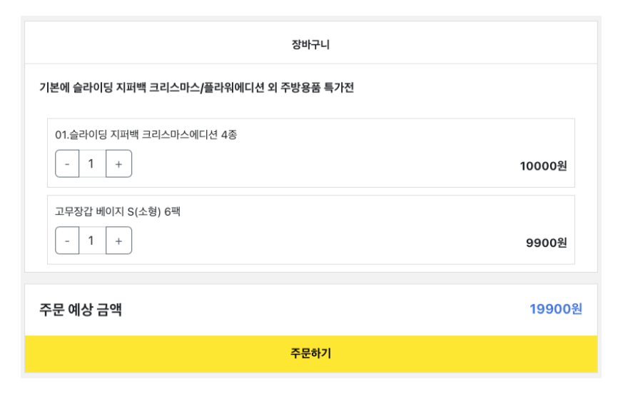
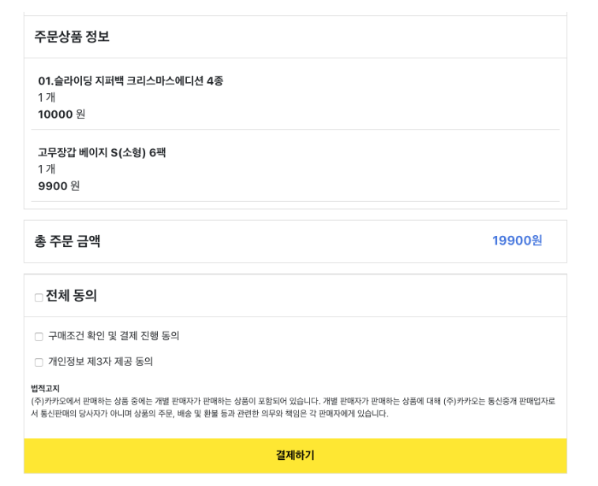
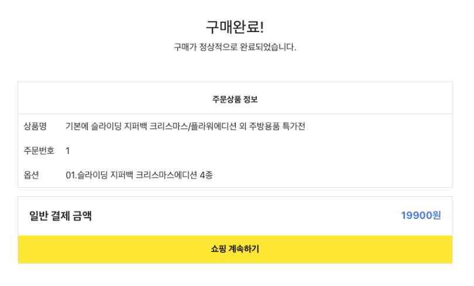

# step2-BE-kakao-shop
카카오 테크 캠퍼스 2단계 카카오 쇼핑하기 백엔드 클론 프로젝트 레포지토리입니다.

# 1주차

카카오 테크 캠퍼스 2단계 - BE - 1주차 클론 과제
</br>
</br>

## **과제명**
```
1. 요구사항분석/API요청 및 응답 시나리오 분석
2. 요구사항 추가 반영 및 테이블 설계도
```

</br>

### **과제 1. 요구사항 시나리오를 보고 부족해 보이는 기능을 하나 이상 체크하여 README에 내용을 작성하시오.**
1. 회원가입 
    - 이메일 중복 체크 API는 있지만 버튼이 없음
    - 이메일 인증 기능
2. 전체 상품 목록 조회
    - 상품 등록, 삭제 기능
3. 개별 상품 상세 조회
    - 상품 수정, 옵션 등록, 옵션 삭제, 옵션 수정 기능(상품 올린 사람만)
    - 특딜가로 구매 버튼 API 추가 필요
4. 장바구니 조회
    - 담은 항목 삭제 기능
    - 선택 상품만 결제 기능
5. 로그아웃
    - 프론트에서 관리한다 했지만, 리프레시 토큰 만료를 띄워야 하는데 왜 백엔드에 요청을 주지 않는지 모르겠습니다..(코드리뷰 부탁해야 함!)
6. 주문 결과 확인
    - 계속 쇼핑하기 버튼을 누르면 전체 상품 목록 조회 페이지로 넘어가는지, 이전 페이지로 가는지 명확하게 나와있지 않음

</br>

### **과제 2. 제시된 화면설계를 보고 해당 화면설계와 배포된 기존 서버의 API주소를 매칭하여 README에 내용을 작성하시오. (카카오 화면설계 시나리오가 있음)**
        
기존 서버의 API 주소를 정리해 놓은 것은 위와 같다.      

        
(기능 1) 회원가입       
회원가입 버튼을 누르면 /join URL에 Post Method로 이메일, 이름, 비밀번호를 담은 요청이 날아가게 된다.        

        
(기능 2) 로그인     
로그인 버튼을 누르면 /login URL에 POST Method로 이메일, 비밀번호를 담은 요청이 날아가게 된다.       

        
(기능 3) 로그아웃       
로그아웃 버튼을 누르면 /logout URL에 POST Method로 Bearer 토큰을 담은 요청이 날아가게 된다(이론 상. 강사님이 필요없다 하셨는데... 코드리뷰 요청 해야겠다...)

        
(기능 4) 전체 상품 목록 조회        
먼저, 전체 상품 목록 조회 버튼을 누르면 /products URL에 GET Method로 page 번호를 parameter로 가진 요청이 날아가게 된다.     
그리고, 해당 상품을 클릭하면 /products/{id} URL에 GET Method로 요청이 간다. 이 때 pathVariable로 상품 id를 넘겨주게 된다.

        
(기능 5) 개별 상품 상세 조회        
옵션을 선택하면 옵션 리스트 하단 바에 선택한 옵션과, 수량을 조절할 수 있는 칸이 나오게 된다(프론트가 구현)      
장바구니 담기 버튼을 누르면 carts/add URL에 POST Method로 Bearer 인증 토큰헤더와 optionId, quantity 바디를 가진 요청이 날아가게 된다.       
톡딜가로 구매하기 버튼은 구현하지 않을 예정이지만, 주문하기와 동일한 버튼이라고 생각했을 때 carts/update URL로 Bearer 인증 토큰 헤더와 optionId, quantity 바디를 가진 POST Method 요청이 날아가게 된다.

        
(기능 9) 장바구니 보기      
먼저 장바구니 조회 버튼을 클릭하면 /carts URL에 GET Method로 Bearer 인증 토큰 헤더를 가진 요청이 날아가게 된다.     
그 이후에 주문하기 버튼을 누르면 carts/update URL로 Bearer 인증 토큰 헤더와 optionId, quantity 바디를 가진 POST Method 요청이 날아가게 된다.

        
(기능 12) 결제      
결제하기 버튼을 누르면, /orders/save URL에 POST Method로 Bearer 인증 토큰 헤더를 담은 요청이 날아가게 된다.

        
(기능 13) 주문 결과 확인        
주문 결과 확인 버튼을 누르면, /orders/{orderId} URL에 GET Method로 Bearer 인증 토큰 헤더를 담은 요청이 날아가게 된다.       

### **과제 4. 테이블 설계를 하여 README에 ER-Diagram을 추가하여 제출하시오.** 

먼저, ERD를 그리기 전에 그린 UML 클래스 다이어그램입니다.         


그 뒤, UML 클래스 다이어그램을 토대로 Intellij를 이용해 Entity를 만들고, H2 서버에 임시로 띄운 뒤 생성한 ER 다이어그램입니다.


# 2주차

카카오 테크 캠퍼스 2단계 - BE - 2주차 클론 과제
</br>
</br>

## **과제명**
```
1. 전체 API 주소 설계
2. Mock API Controller 구현
```

## **과제 설명**
```
1. API주소를 설계하여 README에 내용을 작성하시오.
2. 가짜 데이터를 설계하여 응답하는 스프링부트 컨트롤러를 작성하고 소스코드를 업로드하시오.
```

</br>

## **과제 상세 : 수강생들이 과제를 진행할 때, 유념해야할 것**
아래 항목은 반드시 포함하여 과제 수행해주세요!
>- 전체 API 주소 설계가 RestAPI 맞게 설계되었는가? (예를 들어 배포된 서버는 POST와 GET으로만 구현되었는데, 학생들은 PUT과 DELETE도 배울 예정이라 이부분이 반영되었고, 주소가 RestAPI에 맞게 설계되었는지)
>- 가짜 데이터를 설계하여 Mock API를 잘 구현하였는가? (예를 들어 DB연결없이 컨트롤러만 만들어서 배포된 서버의 응답과 동일한 형태로 데이터가 응답되는지 여부)
</br>

## **코드리뷰 관련: PR시, 아래 내용을 포함하여 코멘트 남겨주세요.**
**1. PR 제목과 내용을 아래와 같이 작성 해주세요.**

>- PR 제목 : 부산대BE_라이언_2주차 과제

</br>

**2. PR 내용 :**

>- 코드 작성하면서 어려웠던 점
>- 코드 리뷰 시, 멘토님이 중점적으로 리뷰해줬으면 하는 부분

# 3주차

카카오 테크 캠퍼스 2단계 - BE - 3주차 클론 과제
</br>
</br>

## **과제명**
```
1. 레포지토리 단위테스트
```

## **과제 설명**
```
1. 레포지토리 단위테스트를 구현하여 소스코드를 제출하시오.
2. 쿼리를 테스트하면서 가장 좋은 쿼리를 작성해보시오.
```

</br>

## **과제 상세 : 수강생들이 과제를 진행할 때, 유념해야할 것**
아래 항목은 반드시 포함하여 과제 수행해주세요!
>- 레포지토리 단위테스트가 구현되었는가?
>- 테스트 메서드끼리 유기적으로 연결되지 않았는가? (테스트는 격리성이 필요하다)
>- Persistene Context를 clear하여서 테스트가 구현되었는가? (더미데이터를 JPA를 이용해서 insert 할 예정인데, 레포지토리 테스트시에 영속화된 데이터 때문에 쿼리를 제대로 보지 못할 수 있기 때문에)
>- 테스트 코드의 쿼리 관련된 메서드가 너무 많은 select를 유발하지 않는지? (적절한 한방쿼리, 효율적인 in query, N+1 문제 등이 해결된 쿼리)
</br>

## **코드리뷰 관련: PR시, 아래 내용을 포함하여 코멘트 남겨주세요.**
**1. PR 제목과 내용을 아래와 같이 작성 해주세요.**

>- PR 제목 : 부산대BE_라이언_3주차 과제

</br>

**2. PR 내용 :**

>- 코드 작성하면서 어려웠던 점
>- 코드 리뷰 시, 멘토님이 중점적으로 리뷰해줬으면 하는 부분

# 4주차

카카오 테크 캠퍼스 2단계 - BE - 4주차 클론 과제
</br>
</br>

## **과제명**
```
1. 컨트롤러 단위 테스트
```

## **과제 설명**
```
1. 컨트롤러 단위테스트를 작성한뒤 소스코드를 업로드하시오.
2. stub을 구현하시오.
```

</br>

## **과제 상세 : 수강생들이 과제를 진행할 때, 유념해야할 것**
아래 항목은 반드시 포함하여 과제 수행해주세요!
>- 컨트롤러 단위테스트가 구현되었는가?
>- Mockito를 이용하여 stub을 구현하였는가?
>- 인증이 필요한 컨트롤러를 테스트할 수 있는가?
>- 200 ok만 체크한 것은 아닌가? (해당 컨트롤러에서 제일 필요한 데이터에 대한 테스트가 구현되었는가?)
</br>

## **코드리뷰 관련: PR시, 아래 내용을 포함하여 코멘트 남겨주세요.**
**1. PR 제목과 내용을 아래와 같이 작성 해주세요.**

>- PR 제목 : 부산대BE_라이언_4주차 과제 

</br>

**2. PR 내용 :**

>- 코드 작성하면서 어려웠던 점
>- 코드 리뷰 시, 멘토님이 중점적으로 리뷰해줬으면 하는 부분

# 5주차

카카오 테크 캠퍼스 2단계 - BE - 5주차 클론 과제
</br>
</br>

## **과제명**
```
1. 실패 단위 테스트
```

## **과제 설명**
```
1. 컨트롤러 단위테스트를 구현하는데, 실패 테스트 코드를 구현하시오.
2. 어떤 문제가 발생할 수 있을지 모든 시나리오를 생각해본 뒤, 실패에 대한 모든 테스트를 구현하시오.
```

</br>

## **과제 상세 : 수강생들이 과제를 진행할 때, 유념해야할 것**
아래 항목은 반드시 포함하여 과제 수행해주세요!
>- 실패 단위 테스트가 구현되었는가?
>- 모든 예외에 대한 실패 테스트가 구현되었는가?
</br>

## **코드리뷰 관련: PR시, 아래 내용을 포함하여 코멘트 남겨주세요.**
**1. PR 제목과 내용을 아래와 같이 작성 해주세요.**

>- PR 제목 : 부산대BE_라이언_5주차 과제

</br>

**2. PR 내용 :**

>- 코드 작성하면서 어려웠던 점
>- 코드 리뷰 시, 멘토님이 중점적으로 리뷰해줬으면 하는 부분

# 6주차

카카오 테크 캠퍼스 2단계 - BE - 6주차 클론 과제
</br>
</br>

## **과제명**
```
1. 카카오 클라우드 배포
```

## **과제 설명**
```
1. 통합테스트를 구현하시오.
2. API문서를 구현하시오. (swagger, restdoc, word로 직접 작성, 공책에 적어서 제출 등 모든 방법이 다 가능합니다)
3. 프론트앤드에 입장을 생각해본뒤 어떤 문서를 가장 원할지 생각해본뒤 API문서를 작성하시오.
4. 카카오 클라우드에 배포하시오.
5. 배포한 뒤 서비스 장애가 일어날 수 있으니, 해당 장애에 대처할 수 있게 로그를 작성하시오. (로그는 DB에 넣어도 되고, 외부 라이브러리를 사용해도 되고, 파일로 남겨도 된다 - 단 장애 발생시 확인을 할 수 있어야 한다)
```

</br>

## **과제 상세 : 수강생들이 과제를 진행할 때, 유념해야할 것**
아래 항목은 반드시 포함하여 과제 수행해주세요!
>- 통합테스트가 구현되었는가?
>- API문서가 구현되었는가?
>- 배포가 정상적으로 되었는가?
>- 서비스에 문제가 발생했을 때, 로그를 통해 문제를 확인할 수 있는가?
</br>

## **코드리뷰 관련: PR시, 아래 내용을 포함하여 코멘트 남겨주세요.**
**1. PR 제목과 내용을 아래와 같이 작성 해주세요.**

>- PR 제목 : 부산대BE_라이언_6주차 과제

</br>

**2. PR 내용 :**

>- 코드 작성하면서 어려웠던 점
>- 코드 리뷰 시, 멘토님이 중점적으로 리뷰해줬으면 하는 부분
