# step2-BE-kakao-shop
카카오 테크 캠퍼스 2단계 카카오 쇼핑하기 백엔드 클론 프로젝트 레포지토리입니다.

# 1주차

카카오 테크 캠퍼스 2단계 - BE - 1주차 클론 과제
</br>
</br>

## **과제명**
```
1. 요구사항분석/API요청 및 응답 시나리오 분석
2. 요구사항 추가 반영 및 테이블 설계도
```

## **과제 설명**
```
1. 요구사항 시나리오를 보고 부족해 보이는 기능을 하나 이상 체크하여 README에 내용을 작성하시오.
2. 제시된 화면설계를 보고 해당 화면설계와 배포된 기존 서버의 API주소를 매칭하여 README에 내용을 작성하시오. (카카오 화면설계 시나리오가 있음)
3. 배포된 서버에 모든 API를 POSTMAN으로 요청해본 뒤 응답되는 데이터를 확인하고 부족한 데이터가 무엇인지 체크하여 README에 내용을 작성하시오.
4. 테이블 설계를 하여 README에 ER-Diagram을 추가하여 제출하시오.
```

</br>

## **과제 상세 : 수강생들이 과제를 진행할 때, 유념해야할 것**
아래 항목은 반드시 포함하여 과제 수행해주세요!
>- 부족한 기능에 대한 요구사항을 미리 예상할 수 있는가? (예를 들면 상품등록 api가 기존 요구사항에는 없는데 추후 필요하지는 않을지, 이런 부분들을 생각하였는지) 
>- 요구사항에 맞는 API를 분석하고 사용자 시나리오를 설계하였는가? (예를 들어 배포된 서버와 화면 설계를 제시해줄 예정인데, 특정 버튼을 클릭했을 때 어떤 API가 호출되어야 할지를 아는지)
>- 응답되는 데이터가 프론트앤드 화면에 모두 반영될 수 있는지를 체크하였는가?(예를 들어 배송관련 비용이 있는데, 이런것들이 API에는 없는데 이런 부분을 캐치할 수 있는지)
>- 테이블 설계가 모든 API를 만족할 수 있게 나왔는가? (테이블이 효율적으로 나왔는가 보다는 해당 테이블로 요구사항을 만족할 수 있는지에 대한 여부만)
>- 테이블명이 이해하기 쉽게 만들어졌는가? (상품테이블이 product이면 이해하기 쉽지만, material이라고 하면 이해하기 어렵기 때문)

</br>

## **코드리뷰 관련: PR시, 아래 내용을 포함하여 코멘트 남겨주세요.**
**1. PR 제목과 내용을 아래와 같이 작성 해주세요.**

>- PR 제목 : 부산대BE_라이언_1주차 과제

</br>

**2. PR 내용 :**

>- 코드 작성하면서 어려웠던 점
>- 코드 리뷰 시, 멘토님이 중점적으로 리뷰해줬으면 하는 부분


### 1. 요구사항 시나리오를 보고 부족해 보이는 기능을 하나 이상 체크하여 README에 내용을 작성하시오.

### 장바구니 삭제

장바구니에 물건 담으면 삭제가 안됨

무조건 구매해야 함;

- 프론트 화면

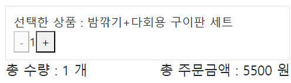


- 실제 화면


- 프론트 화면


- 실제 카톡쇼핑 화면


상품 옵션에서 삭제

장바구니 조회에서 삭제

가 필요함

### 장바구니에 있는 물건 다시 추가하면 추가 안됨


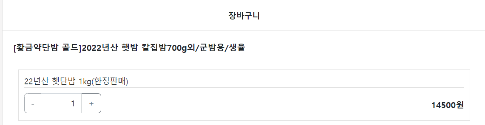

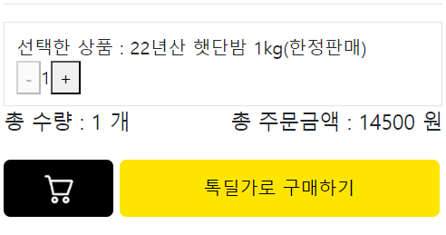
추가 안됨

로직에서 장바구니에 있으면 quantity++

### 상품 등록

이거는 유저에 따라 좀 다를 거 같은데 

유저에 role을 부여해서 판매자일 때만 상품 등록이 가능해야 함

아니면 모든 유저가 구매, 상품 가능하게 하던가

근데 클론 코딩인데, 본인 카카오톡 쇼핑하기에는 그런 거 없음

admin 페이지 고려

### 찜하기

테이블을 하나 더 만들어서 user랑 product를 fk로 받는 게 맞나?

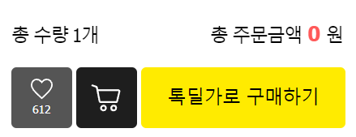

→관계 테이블로 구성

### 상품 리뷰

댓글처럼 구현 - comment 테이블

- 실제 카톡 쇼핑 화면


starcount 필요

### 문의 하기

게시판 - 댓글 방식으로 구현


### 2. 제시된 화면설계를 보고 해당 화면설계와 배포된 기존 서버의 API주소를 매칭하여 README에 내용을 작성하시오. (카카오 화면설계 시나리오가 있음)

## 1. 전체 상품 목록 조회

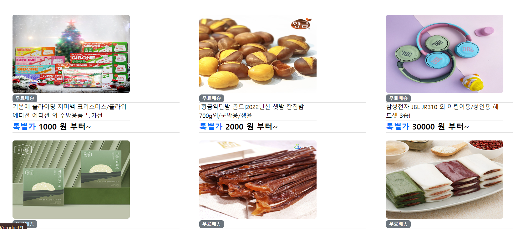

- method : Get
- Local URL : localhost:8080/products

## 2. 개별 상품 조회

상품 클릭 시 이동

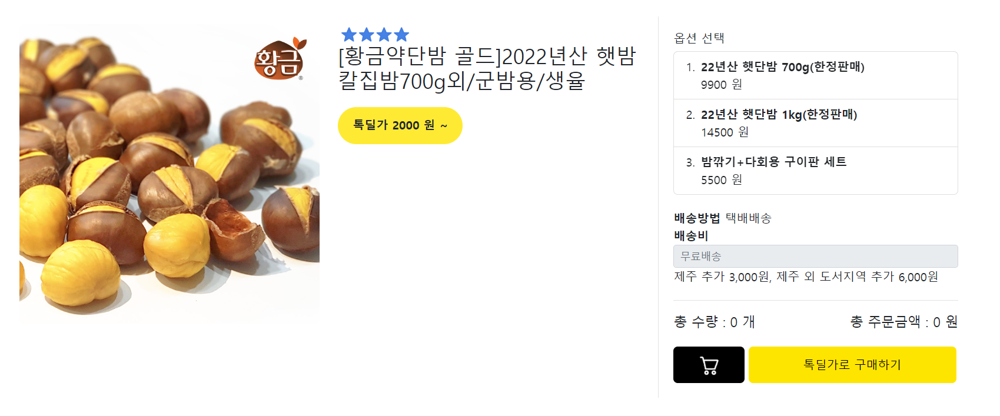

## 3. 회원가입


이메일 형식 aaa@aaa.com 입력 후 중복 확인

이름, 비밀번호 (8~20자, 영문, 숫자, 특수 기호 포함)

회원가입 클릭 시 회원가입 완료

## 4. 로그인


회원가입 한 내용으로 로그인 로그인 버튼 클릭 시 jwt 헤더로 반환, 로그인 완료

## 5. 옵션 선택


옵션 선택 시 선택한 상품으로 나옴


+버튼 클릭하면 개수 증가, 총 주문금액 증가


장바구니 버튼 클릭 시 장바구니로 이동,

톡 딜가로 구매하기 클릭 시에도 장바구니로 이동 알림 띄우고 이동해야 할 듯

## 6. 장바구니


우측 상단의 카트 모양 클릭 시 장바구니로 이동

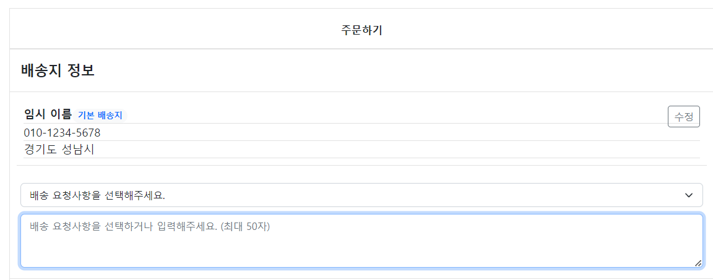

주문하기 클릭 시 주문 화면으로 이동

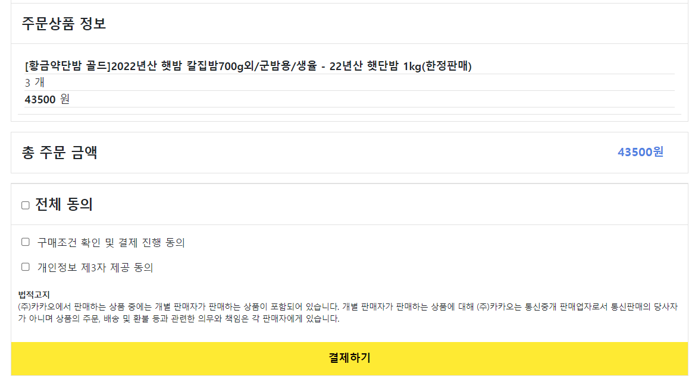

배송 정보도 구축 되어야 할 듯

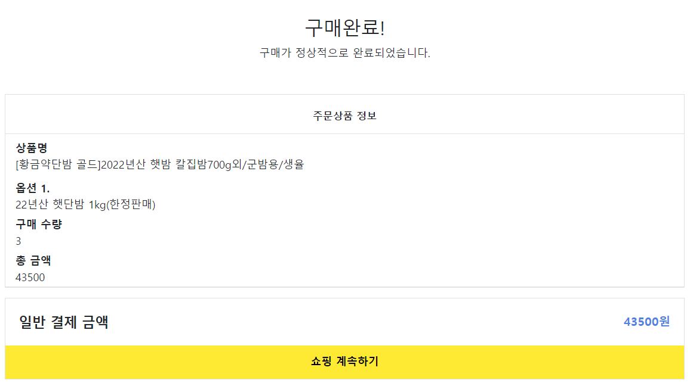

주문 정보와 주문 금액, 동의 체크를 하고 결제하기를 클릭하면 결제화면으로 이동


구매 화면, 쇼핑 계속하기를 클릭하면 products 화면으로 이동

## 7. 로그아웃

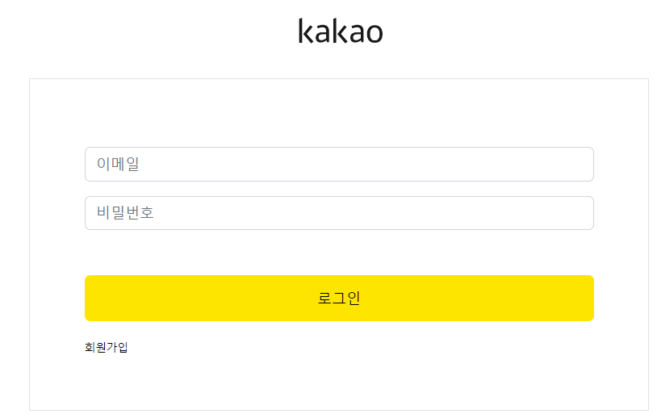

로그아웃을 클릭하면 로그아웃되고, 로그인 화면으로 이동


### 3. 배포된 서버에 모든 API를 POSTMAN으로 요청해본 뒤 응답되는 데이터를 확인하고 부족한 데이터가 무엇인지 체크하여 README에 내용을 작성하시오.

## 1. 전체 상품 조회

- method : GET
- local URL : localhost:8080/products
- Param : page = {number}

```json
"response": [
        {
            "id": 1,
            "productName": "기본에 슬라이딩 지퍼백 크리스마스/플라워에디션 에디션 외 주방용품 특가전",
            "description": "",
            "image": "/images/1.jpg",
            "price": 1000
        },
        {
            "id": 2,
            "productName": "[황금약단밤 골드]2022년산 햇밤 칼집밤700g외/군밤용/생율",
            "description": "",
            "image": "/images/2.jpg",
            "price": 2000
        },
```

product_id, name, description, image, price가 나옴

## 2. 개별 상품 조회

- method : GET
- local URL : localhost:8080/products/1

```json
"success": true,
    "response": {
        "id": 1,
        "productName": "기본에 슬라이딩 지퍼백 크리스마스/플라워에디션 에디션 외 주방용품 특가전",
        "description": "",
        "image": "/images/1.jpg",
        "price": 1000,
        "starCount": 5,
        "options": [
            {
                "id": 1,
                "optionName": "01. 슬라이딩 지퍼백 크리스마스에디션 4종",
                "price": 10000
            },
            {
                "id": 2,
                "optionName": "02. 슬라이딩 지퍼백 플라워에디션 5종",
                "price": 10900
            },
```

해당 product의 id를 요청

product의 option_id, name, price가 들어있는 array 반환

product 별로 option_id가 1,2,3.. 순이 아니라 상품이 달라도 option_id가 다름

→ option_id로 pk가 있는 테이블 구성 가능

## 3. 이메일 중복 체크

- Method : Post
- Local URL : [localhost:8080/check](http://localhost:8080/check)
- Request Body

```json
{
	"email":"meta@nate.com"
}
```

- Response Body

```json
{
	"success": true,
	"response": null,
	"error": null
}
```

## 3-1 이메일 중복 체크 실패

### 1. 동일한 이메일

- Response Body

```json
{
	"success": false,
	"response": null,
	"error": {
		"message": "동일한 이메일이 존재합니다 : ssar@nate.com",
		"status": 400
	}
}
```

에러 메세지와 status 반환

### 2. 형식 에러

- Response Body

```json
{
	"success": false,
	"response": null,
	"error": {
		"message": "이메일 형식으로 작성해주세요 : email",
		"status": 400
	}
}
```

에러 메세지와 status 반환

## 4. 회원가입

- Method : Post
- Local URL : [localhost:8080/](http://localhost:8080/check)join
- Request Body

```json
{
	"username":"mata",
	"email":"meta@nate.com",
	"password":"meta1234!"
}
```

이메일을 아이디로 지정하는 건 사실 사용자 입장에서 싫을 거 같긴 함

이름, 이메일 , 패스워드를 보냄

- Response Body

```json
{
	"success": true,
	"response": null,
	"error": null
}
```

## 4-1 회원가입 실패 예시

### 1. 이메일 형식 오류(aaa@aaa.com)

```json
{
	"success" : false,
	"response" : null,
	"error" : {
		"message" : "이메일 형식으로 작성해주세요:email",
		"status" : 400
		}
}
```

### 1. 비밀번호 제약 조건 오류 (영문, 숫자, 특수기호 포함 8~20자리)

```json
{
	"success" : false,
	"response" : null,
	"error" : {
		"message" : "영문, 숫자, 특수문자가 포함되어야하고 공백이 포함될 수 없습니다.:password",
		"status" : 400
		}
}
```

### 2. 동일한 이메일 → 이메일 중복 확인에서 거르는데 또 나옴

## 5. 로그인

- Method : Post
- Local URL : [localhost:8080/](http://localhost:8080/check)login
- Request Body

```json
{
	"email":"ssar@nate.com",
	"password":"meta1234!"
}
```

- Response Header

```json
Bearer
eyJ0eXAiOiJKV1QiLCJhbGciOiJIUzUxMiJ9.eyJzdWIiOiJzc2FyQG5hdGUuY29tIiwicm9sZSI6Il
JPTEVfVVNFUiIsImlkIjoxLCJleHAiOjE2ODcwNTM5MzV9.fXlD0NZQXYYfPHV8rokRJTM86nhS869L
Z1KIGi7_qvPOcVbXgvyZLKvnlLxomIiS3YFnQRLzXAJ2G41yI_AmGg
```

header에 jwt토큰을 반환해 로그인 확인

- Response Body

```json
{
	"success": true,
	"response": null,
	"error": null
}
```

## 5-1 로그인 실패 예시

### 1. 이메일 형식 아이디

```json
{
	"success": false,
	"response": null,
	"error": {
		"message": "이메일 형식으로 작성해주세요:email",
		"status": 400
		}
}
```

### 2. 패스워드 오류(”영문, 숫자, 특수문자가 포함되어야하고 공백이 포함될 수 없습니다.:password”)

```json
{
	"success": false,
	"response": null,
	"error": {
		"message": "영문, 숫자, 특수문자가 포함되어야하고 공백이 포함될 수 없습니다.:password",
		"status": 400
		}
}
```

### 3. 회원가입 되지 않은 아이디

```json
{
	"success": false,
	"response": null,
	"error": {
		"message": "인증되지 않았습니다",
		"status": 401
		}
}
```

### 4. 패스워드 오류 ("8에서 20자 이내여야 합니다”)

```json
{
	"success": false,
	"response": null,
	"error": {
		"message": "8에서 20자 이내여야 합니다.:password",
		"status": 400
		}
}
```

## 6. 장바구니 담기

- Method : Post
- Local URL : [localhost:8080/](http://localhost:8080/check)login
- Request Header

→ 로그인 헤더

- Request Body

```json
[
    {
        "optionId":1,
        "quantity":5
    },
    {
        "optionId":2,
        "quantity":5
    }
]
```

옵션 아이디와 개수로 해당 옵션 장바구니로 이동

그런데 같은 옵션 아이디로 다른 개수를 보내면 오류 발생

```json
{
    "success": false,
    "response": null,
    "error": {
        "message": "장바구니 담기 중에 오류가 발생했습니다 : could not execute statement; SQL [n/a]; constraint [\"PUBLIC.UK_CART_OPTION_USER_INDEX_4 ON PUBLIC.CART_TB(USER_ID NULLS FIRST, OPTION_ID NULLS FIRST) VALUES ( /* key:1 */ 1, 1)\"; SQL statement:\ninsert into cart_tb (id, option_id, price, quantity, user_id) values (default, ?, ?, ?, ?) [23505-214]]; nested exception is org.hibernate.exception.ConstraintViolationException: could not execute statement",
        "status": 500
    }
}
```

왜지 ..

서비스 로직에서 수정 필요함

## 7. 장바구니 조회

- Method : GET
- Local URL : [localhost:8080/](http://localhost:8080/check)carts
- Request Header

→ 로그인 헤더 

- Response Body

```json
{
    "success": true,
    "response": {
        "products": [
            {
                "id": 1,
                "productName": "기본에 슬라이딩 지퍼백 크리스마스/플라워에디션 에디션 외 주방용품 특가전",
                "carts": [
                    {
                        "id": 1,
                        "option": {
                            "id": 1,
                            "optionName": "01. 슬라이딩 지퍼백 크리스마스에디션 4종",
                            "price": 10000
                        },
                        "quantity": 5,
                        "price": 50000
                    },
                    {
                        "id": 2,
                        "option": {
                            "id": 2,
                            "optionName": "02. 슬라이딩 지퍼백 플라워에디션 5종",
                            "price": 10900
                        },
                        "quantity": 5,
                        "price": 54500
                    }
                ]
            }
        ],
        "totalPrice": 104500
    },
    "error": null
}
```

product의 name과 id, option의 id, name, price, quantity, 를 통해 해당 장바구니의 옵션의 price 반환 배열로 구분해 totalprice를 반환

배열 구분은 cartId

## 8. 주문하기 - (장바구니 수정)

- Method : POST
- Local URL : [localhost:8080/](http://localhost:8080/check)carts/update
- Request Header
    
    → 로그인 헤더
    
- Request body

```json
[
    {
        "cartId":1,
        "quantity":10
    },
    {
        "cartId":2,
        "quantity":10
    }
]
```

cartid와 최종 개수를 받아 배열로 전송

- response body

```json
{
    "success": true,
    "response": {
        "carts": [
            {
                "cartId": 1,
                "optionId": 1,
                "optionName": "01. 슬라이딩 지퍼백 크리스마스에디션 4종",
                "quantity": 10,
                "price": 100000
            },
            {
                "cartId": 2,
                "optionId": 2,
                "optionName": "02. 슬라이딩 지퍼백 플라워에디션 5종",
                "quantity": 10,
                "price": 109000
            }
        ],
        "totalPrice": 209000
    },
    "error": null
}
```

주문하기를 눌렀을 때 장바구니의 carts를 반환, totalprice 계산을 반환

## 9. 결재하기 - (주문 인서트)

- Method : POST
- Local URL : [localhost:8080/](http://localhost:8080/check)orders/save
- Request Header
    
    → 로그인 헤더
    
- Response body

근데 Request가 없는데 왜 POST인지

```json
{
    "success": true,
    "response": {
        "id": 1,
        "products": [
            {
                "productName": "기본에 슬라이딩 지퍼백 크리스마스/플라워에디션 에디션 외 주방용품 특가전",
                "items": [
                    {
                        "id": 1,
                        "optionName": "01. 슬라이딩 지퍼백 크리스마스에디션 4종",
                        "quantity": 10,
                        "price": 100000
                    },
                    {
                        "id": 2,
                        "optionName": "02. 슬라이딩 지퍼백 플라워에디션 5종",
                        "quantity": 10,
                        "price": 109000
                    }
                ]
            }
        ],
        "totalPrice": 209000
    },
    "error": null
}
```

order 테이블에 들어갈 내용들, products, option 내용이 들어감

## 10. 주문 결과 확인

결재 후 order_item 확인

- Method : POST
- Local URL : [localhost:8080/](http://localhost:8080/check)orders/1
- Request Header
    
    → 로그인 헤더
    
- Response body

```json
{
    "success": true,
    "response": {
        "id": 1,
        "products": [
            {
                "productName": "기본에 슬라이딩 지퍼백 크리스마스/플라워에디션 에디션 외 주방용품 특가전",
                "items": [
                    {
                        "id": 1,
                        "optionName": "01. 슬라이딩 지퍼백 크리스마스에디션 4종",
                        "quantity": 10,
                        "price": 100000
                    },
                    {
                        "id": 2,
                        "optionName": "02. 슬라이딩 지퍼백 플라워에디션 5종",
                        "quantity": 10,
                        "price": 109000
                    }
                ]
            }
        ],
        "totalPrice": 209000
    },
    "error": null
}
```

order_item_id 로 구분

구매한 products의 option내용과 total price

배송 내역이 나중에 들어가면 좋겠다


### 4. 테이블 설계를 하여 README에 ER-Diagram을 추가하여 제출하시오.

### 테이블 구현

| user (유저) | product(상품) | option (상품 옵션) | cart (장바구니) | order (주문) | order_item (주문 목록?) |
| --- | --- | --- | --- | --- | --- |
| user_id(pk) | product_id(pk) | option_id(pk) | cart_id(pk) | order_id(pk) | order_item_id(pk) |
| username | product_name | option_name | option_id(fk) | user_id(fk) | oreder_id(pk) |
| email | description | price | user_id(fk) | date | user_id(fk) |
| passward | image | date | date |  | option_id(fk) |
| create_time | date | product_id(fk) | quantity |  | date |
|  |  |  |  |  | price |

### 관계 설정

상품 - 옵션 = 1-N

유저 - 장바구니 = 1-N

장바구니 - 옵션 = N-1

옵션 - 주문아이템 = 1-N

주문 - 주문아이템 = 1-N

유저 - 주문아이템 = 1-N

유저 - 주문 = 1-N


### 추가 기능 고려한 테이블

| user_tb (유저) | product_tb(제품) | option_tb (제품 옵션) | cart_tb (장바구니) | order_tb (주문) | order_item_tb (주문 목록?) | like_tb (찜하기) | comment_tb (제품 리뷰) |
| --- | --- | --- | --- | --- | --- | --- | --- |
| user_id(pk) | product_id(pk) | option_id(pk) | cart_id(pk) | order_id(pk) | order_item_id(pk) | like_id(pk) | comment_id(pk) |
| username | product_name | option_name | option_id(fk) | user_id(fk) | oreder_id(pk) | user_id(fk) | product_id(fk) |
| email | description | price | user_id(fk) | date | user_id(fk) | product_id(fk) | user_id(fk) |
| passward | image | date | date |  | option_id(fk) | starcount | content |
| date | date | product_id(fk) | quantity |  | date |  | date |
| role | price | price |  |  | price |  |  |

### 관계 설정

### 제품

제품 - 옵션 = 1-N

### 장바구니

유저 - 장바구니 = 1-N

장바구니 - 옵션 = N-1

### 주문아이템

옵션 - 주문아이템 = 1-N

주문 - 주문아이템 = 1-N

유저 - 주문아이템 = 1-N

### 주문

유저 - 주문 = 1-N

### 찜하기

유저 - 찜하기 = 1-N

제품 - 찜하기 = 1-1

### 제품 리뷰

제품 - 리뷰 = 1-N

유저 - 리뷰 = 1-1

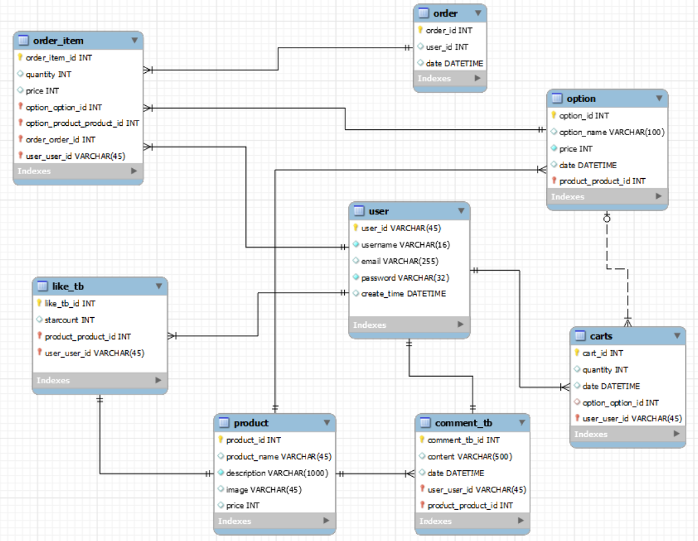


# 2주차

카카오 테크 캠퍼스 2단계 - BE - 2주차 클론 과제
</br>
</br>

## **과제명**
```
1. 전체 API 주소 설계
2. Mock API Controller 구현
```

## **과제 설명**
```
1. API주소를 설계하여 README에 내용을 작성하시오.
2. 가짜 데이터를 설계하여 응답하는 스프링부트 컨트롤러를 작성하고 소스코드를 업로드하시오.
```

</br>

## **과제 상세 : 수강생들이 과제를 진행할 때, 유념해야할 것**
아래 항목은 반드시 포함하여 과제 수행해주세요!
>- 전체 API 주소 설계가 RestAPI 맞게 설계되었는가? (예를 들어 배포된 서버는 POST와 GET으로만 구현되었는데, 학생들은 PUT과 DELETE도 배울 예정이라 이부분이 반영되었고, 주소가 RestAPI에 맞게 설계되었는지)
>- 가짜 데이터를 설계하여 Mock API를 잘 구현하였는가? (예를 들어 DB연결없이 컨트롤러만 만들어서 배포된 서버의 응답과 동일한 형태로 데이터가 응답되는지 여부)
</br>

## **코드리뷰 관련: PR시, 아래 내용을 포함하여 코멘트 남겨주세요.**
**1. PR 제목과 내용을 아래와 같이 작성 해주세요.**

>- PR 제목 : 부산대BE_라이언_2주차 과제

</br>

**2. PR 내용 :**

>- 코드 작성하면서 어려웠던 점
>- 코드 리뷰 시, 멘토님이 중점적으로 리뷰해줬으면 하는 부분

## 과제 2-1

## 기존 API

### 상품조회

- method : GET
- URL : localhost:8080/products

### 개별 상품 조회

- method : GET
- URL : [localhost:8080/product](http://localhost:8080/products/1)s/{id}

### 이메일 중복 체크

- method : POST
- URL : [localhost:8080/](http://localhost:8080/products/1)check

### 회원가입

- method : POST
- URL : [localhost:8080/](http://localhost:8080/products/1)join

### 로그인

- method : POST
- URL : [localhost:8080/](http://localhost:8080/products/1)login

### 장바구니 담기

- method : POST
- URL : [localhost:8080/](http://localhost:8080/products/1)carts/add

### 장바구니 조회

- method : GET
- URL : [localhost:8080/](http://localhost:8080/products/1)carts/add

### API Method

1. GET : 리소스 조회
2. POST : 요청 데이터 처리
3. PUT : 리소스 대체(덮어쓰기)
4. PETCH : 리소스 부분 변경
5. DELETE : 리소스 제거

## API설계

### 상품

| Description | URI | Method | Params |
| --- | --- | --- | --- |
| 전체 상품 조회 | /products | GET | page |
| 개별 상품 조회 | /products/{product_id} | GET |  |

### 인증

| Description | URI | Method |
| --- | --- | --- |
| 회원가입 | auth/join | POST |
| 로그인 | auth/login | POST |
| 이메일 중복 체크 | auth/check | POST |

모듈화를 위해서 인증 과정은 prefix로 auth/

### 장바구니

| Description | URI | Method |
| --- | --- | --- |
| 장바구니 조회 | /carts | GET |
| 장바구니 담기 | /carts/add | POST |
| 장바구니 수정 | /carts/update | PETCH |
| 장바구니 삭제 | /carts/delete | DELETE |

수정은 부분 수정이 가능한 PETCH로 작성

삭제는 DELETE

### 주문
| Description | URI | Method |
| --- | --- | --- |
| 결재하기 | orders/save | POST |
| 주문 결과 확인 | orders/{order_id} | GET |


## 과제2-2
API 명세서 기준으로 응답데이터를 똑같이 만들어 구현

팀원이 올려준 json 파일을 토대로 mock api를 구현해서 동일한 형태로 데이터가 응답되는지 확인


1. 회원가입

   

2. 로그인

   

3. 전체 상품 목록 조회

   

4. 개별 상품 조회

   

5. 장바구니 담기

   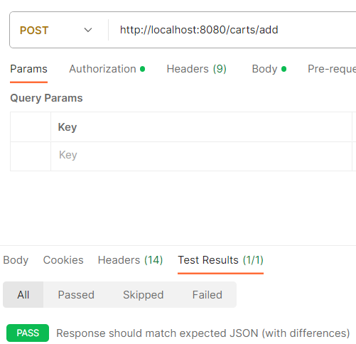

6. 장바구니 조회

   

7. 장바구니 수정

   

8. 결재하기

   

9. 주문 결과 확인

   

# 3주차

카카오 테크 캠퍼스 2단계 - BE - 3주차 클론 과제
</br>
</br>

## **과제명**
```
1. 레포지토리 단위테스트
```

## **과제 설명**
```
1. 레포지토리 단위테스트를 구현하여 소스코드를 제출하시오.
2. 쿼리를 테스트하면서 가장 좋은 쿼리를 작성해보시오.
```

</br>

## **과제 상세 : 수강생들이 과제를 진행할 때, 유념해야할 것**
아래 항목은 반드시 포함하여 과제 수행해주세요!
>- 레포지토리 단위테스트가 구현되었는가?
>- 테스트 메서드끼리 유기적으로 연결되지 않았는가? (테스트는 격리성이 필요하다)
>- Persistene Context를 clear하여서 테스트가 구현되었는가? (더미데이터를 JPA를 이용해서 insert 할 예정인데, 레포지토리 테스트시에 영속화된 데이터 때문에 쿼리를 제대로 보지 못할 수 있기 때문에)
>- 테스트 코드의 쿼리 관련된 메서드가 너무 많은 select를 유발하지 않는지? (적절한 한방쿼리, 효율적인 in query, N+1 문제 등이 해결된 쿼리)
</br>

## **코드리뷰 관련: PR시, 아래 내용을 포함하여 코멘트 남겨주세요.**
**1. PR 제목과 내용을 아래와 같이 작성 해주세요.**

>- PR 제목 : 부산대BE_라이언_3주차 과제

</br>

**2. PR 내용 :**

>- 코드 작성하면서 어려웠던 점
>- 코드 리뷰 시, 멘토님이 중점적으로 리뷰해줬으면 하는 부분

# 4주차

카카오 테크 캠퍼스 2단계 - BE - 4주차 클론 과제
</br>
</br>

## **과제명**
```
1. 컨트롤러 단위 테스트
```

## **과제 설명**
```
1. 컨트롤러 단위테스트를 작성한뒤 소스코드를 업로드하시오.
2. stub을 구현하시오.
```

</br>

## **과제 상세 : 수강생들이 과제를 진행할 때, 유념해야할 것**
아래 항목은 반드시 포함하여 과제 수행해주세요!
>- 컨트롤러 단위테스트가 구현되었는가?
>- Mockito를 이용하여 stub을 구현하였는가?
>- 인증이 필요한 컨트롤러를 테스트할 수 있는가?
>- 200 ok만 체크한 것은 아닌가? (해당 컨트롤러에서 제일 필요한 데이터에 대한 테스트가 구현되었는가?)
</br>

## **코드리뷰 관련: PR시, 아래 내용을 포함하여 코멘트 남겨주세요.**
**1. PR 제목과 내용을 아래와 같이 작성 해주세요.**

>- PR 제목 : 부산대BE_라이언_4주차 과제 

</br>

**2. PR 내용 :**

>- 코드 작성하면서 어려웠던 점
>- 코드 리뷰 시, 멘토님이 중점적으로 리뷰해줬으면 하는 부분

# 5주차

카카오 테크 캠퍼스 2단계 - BE - 5주차 클론 과제
</br>
</br>

## **과제명**
```
1. 실패 단위 테스트
```

## **과제 설명**
```
1. 컨트롤러 단위테스트를 구현하는데, 실패 테스트 코드를 구현하시오.
2. 어떤 문제가 발생할 수 있을지 모든 시나리오를 생각해본 뒤, 실패에 대한 모든 테스트를 구현하시오.
```

</br>

## **과제 상세 : 수강생들이 과제를 진행할 때, 유념해야할 것**
아래 항목은 반드시 포함하여 과제 수행해주세요!
>- 실패 단위 테스트가 구현되었는가?
>- 모든 예외에 대한 실패 테스트가 구현되었는가?
</br>

## **코드리뷰 관련: PR시, 아래 내용을 포함하여 코멘트 남겨주세요.**
**1. PR 제목과 내용을 아래와 같이 작성 해주세요.**

>- PR 제목 : 부산대BE_라이언_5주차 과제

</br>

**2. PR 내용 :**

>- 코드 작성하면서 어려웠던 점
>- 코드 리뷰 시, 멘토님이 중점적으로 리뷰해줬으면 하는 부분

# 6주차

카카오 테크 캠퍼스 2단계 - BE - 6주차 클론 과제
</br>
</br>

## **과제명**
```
1. 카카오 클라우드 배포
```

## **과제 설명**
```
1. 통합테스트를 구현하시오.
2. API문서를 구현하시오. (swagger, restdoc, word로 직접 작성, 공책에 적어서 제출 등 모든 방법이 다 가능합니다)
3. 프론트앤드에 입장을 생각해본뒤 어떤 문서를 가장 원할지 생각해본뒤 API문서를 작성하시오.
4. 카카오 클라우드에 배포하시오.
5. 배포한 뒤 서비스 장애가 일어날 수 있으니, 해당 장애에 대처할 수 있게 로그를 작성하시오. (로그는 DB에 넣어도 되고, 외부 라이브러리를 사용해도 되고, 파일로 남겨도 된다 - 단 장애 발생시 확인을 할 수 있어야 한다)
```

</br>

## **과제 상세 : 수강생들이 과제를 진행할 때, 유념해야할 것**
아래 항목은 반드시 포함하여 과제 수행해주세요!
>- 통합테스트가 구현되었는가?
>- API문서가 구현되었는가?
>- 배포가 정상적으로 되었는가?
>- 서비스에 문제가 발생했을 때, 로그를 통해 문제를 확인할 수 있는가?
</br>

## **코드리뷰 관련: PR시, 아래 내용을 포함하여 코멘트 남겨주세요.**
**1. PR 제목과 내용을 아래와 같이 작성 해주세요.**

>- PR 제목 : 부산대BE_라이언_6주차 과제

</br>

**2. PR 내용 :**

>- 코드 작성하면서 어려웠던 점
>- 코드 리뷰 시, 멘토님이 중점적으로 리뷰해줬으면 하는 부분
