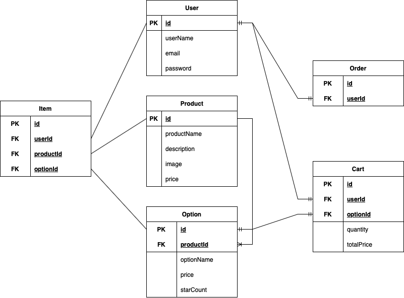

# step2-BE-kakao-shop

카카오 테크 캠퍼스 2단계 카카오 쇼핑하기 백엔드 클론 프로젝트 레포지토리입니다.

# 1주차

카카오 테크 캠퍼스 2단계 - BE - 1주차 클론 과제
</br>
</br>

## **과제명**

```
1. 요구사항분석/API요청 및 응답 시나리오 분석
2. 요구사항 추가 반영 및 테이블 설계도
```

## **과제 설명**

```
1. 요구사항 시나리오를 보고 부족해 보이는 기능을 하나 이상 체크하여 README에 내용을 작성하시오.
2. 제시된 화면설계를 보고 해당 화면설계와 배포된 기존 서버의 API주소를 매칭하여 README에 내용을 작성하시오. (카카오 화면설계 시나리오가 있음)
3. 배포된 서버에 모든 API를 POSTMAN으로 요청해본 뒤 응답되는 데이터를 확인하고 부족한 데이터가 무엇인지 체크하여 README에 내용을 작성하시오.
4. 테이블 설계를 하여 README에 ER-Diagram을 추가하여 제출하시오.
```

</br>

## **과제 상세 : 수강생들이 과제를 진행할 때, 유념해야할 것**

아래 항목은 반드시 포함하여 과제 수행해주세요!

> - 부족한 기능에 대한 요구사항을 미리 예상할 수 있는가? (예를 들면 상품등록 api가 기존 요구사항에는 없는데 추후 필요하지는 않을지, 이런 부분들을 생각하였는지)
> - 요구사항에 맞는 API를 분석하고 사용자 시나리오를 설계하였는가? (예를 들어 배포된 서버와 화면 설계를 제시해줄 예정인데, 특정 버튼을 클릭했을 때 어떤 API가 호출되어야 할지를 아는지)
> - 응답되는 데이터가 프론트앤드 화면에 모두 반영될 수 있는지를 체크하였는가?(예를 들어 배송관련 비용이 있는데, 이런것들이 API에는 없는데 이런 부분을 캐치할 수 있는지)
> - 테이블 설계가 모든 API를 만족할 수 있게 나왔는가? (테이블이 효율적으로 나왔는가 보다는 해당 테이블로 요구사항을 만족할 수 있는지에 대한 여부만)
> - 테이블명이 이해하기 쉽게 만들어졌는가? (상품테이블이 product이면 이해하기 쉽지만, material이라고 하면 이해하기 어렵기 때문)

</br>

---

#### **1\. 요구사항 시나리오를 보고 부족해 보이는 기능을 하나 이상 체크하여 README에 내용을 작성하시오.**

- 화면 UI에 있는 톡딜가로 구매하기 기능
- 회원정보를 수정하는 기능
- 개별 상품마다 별점을 표기하는 기능
- (매진임박일때) 각 옵션별 남은 수량, 품절여부를 보여주는 기능
- 상품을 카테고리 형태로 볼 수 있는 기능
- 장바구니 조회 (수량 결정)에서 상품을 삭제하거나 특정 옵션을 삭제하는 기능
- 배송 관련 기능
- 결제하기 단계에서 쿠폰이나 상품권을 사용할 수 있는 기능

---

#### **2\. 제시된 화면 설계를 보고 해당 화면설계와 배포된 기존 서버의 API주소를 매칭하여 README에 내용을 작성하시오.**

**● (기능 1) 회원 가입**

- 회원가입 버튼 클릭 시 : (/join) POST 요청
- 이메일 중복 체크를 해줘야 한다. (/check) POST 요청

**● (기능 2) 로그인**

- 로그인 버튼 클릭 시 : (/login) POST 요청
- 회원 정보를 저장해둔 데이터베이스를 검색하여 해당 사용자가 유효한 사용자인지 판단하고 유효한 사용자일 경우 JWT Token을 반환한다.

**● (기능 3) 로그아웃**

- 로그아웃은 프론트에서 처리

**● (기능 4) 전체 상품 목록 조회**

- (/products?page={number}) GET 요청
- 전체 상품 목록 페이지에 들어가면 API를 호출하여 page값에 따라 상품의 데이터를 보여준다.
- 추후에 판매자가 새로운 상품을 등록하고 싶을 때 상품등록 API가 필요할 것 같다.

**● (기능 5) 개별 상품 상세 조회**

- (/products/{id}) GET 요청
- 개별 상품 페이지에 들어가면 해당 API를 호출하여 상품의 데이터를 보여준다.

**● (기능 6) 상품 옵션 선택**

이미 선택된 옵션은 다시 선택이 불가능하게 해야한다.

**● (기능 7) 옵션 확인 및 수량 결정**

선택한 상품 옵션을 재확인하고 수량을 결정한다. 선택한 옵션과 수량에 따라 합계 금액이 출력된다.

**● (기능 8) 장바구니 담기**

- (/carts/add) POST 요청
- 장바구니 담기 버튼 클릭 시 옵션의 id와 갯수가 저장된다.

**● (기능 9) 장바구니 보기 (조회)**

- (/carts) GET 요청
- 장바구니에 담았던 상품들의 옵션과 갯수 정보를 출력하는 API를 호출한다.

**● (기능 10) 장바구니 상품 옵션 확인 및 수량 결정 (주문하기 - 장바구니 수정)**

- (/carts/update) POST 요청
- 장바구니에 담았던 옵션들의 수량을 수정할 수 있다.

**● (기능 11) 결제**

- (/orders/save) POST 요청
- 결제하기 버튼을 누르면 장바구니에 있는 물품들이 삭제된다. 그리고 주문아이템 테이블에 채워진다.

**● (기능 12) 주문 결과 확인**

- (/orders/{order_id}) GET 요청
- 결제가 된 상품명, 주문번호, 옵션 이름을 출력하는 API를 호출한다.

---

#### **3\. 응답 데이터 확인하면서 시나리오에 부족한 데이터 확인**

**[/carts/update](http://localhost:8080/carts/update) (POST)**

- 주문하기 - (장바구니 수정)에서 장바구니에 담겨있는 물품들 수량 업데이트(줄이거나 늘리거나)할 때 이전에 6. 장바구니 담기 에서 담았던 물품들과의 cartId가 다르면 안된다.

(담았던 물품에 존재하지 않는 cartId를 수정하려고 했을 때)

```
{
    "success": false,
    "response": null,
    "error": {
        "message": "장바구니에 없는 상품은 주문할 수 없습니다 : 3",
        "status": 400
    }
}
```

- 주문하기 - (장바구니 수정)에서 두 물품의 cartId가 같은 경우

```
{
    "success": false,
    "response": null,
    "error": {
        "message": "동일한 장바구니 아이디를 주문할 수 없습니다",
        "status": 400
    }
}
```

**[/orders/save](http://localhost:8080/orders/save) (POST)**

- 결제하기 (주문 인서트)에서 장바구니에 있던 물품들을 모두 결제하고 (POST 요청 보냄) 또 다시 요청을 보내면 장바구니에 아무 내역이 존재하지 않는다는 시나리오가 필요하다.

```
{
    "success": false,
    "response": null,
    "error": {
        "message": "장바구니에 아무 내역도 존재하지 않습니다",
        "status": 404
    }
}
```

**[/orders/1](http://localhost:8080/orders/1) (GET)**

- 주문 결과 확인 에서 없는 주문을 요청하면 주문을 찾을 수 없다는 에러 메세지

```
{
    "success": false,
    "response": null,
    "error": {
        "message": "해당 주문을 찾을 수 없습니다 : 3",
        "status": 404
    }
}
```

---

#### **4. 테이블 설계를 하여 README에 ER-Diagram을 추가하여 제출하시오.**



\-- -----------------------------------------------------  
\-- Table \`kakao_shop\`.\`user\`  
\-- -----------------------------------------------------  
CREATE TABLE IF NOT EXISTS \`kakao_shop\`.\`user\` (  
  \`id\` INT NOT NULL AUTO_INCREMENT,  
  \`username\` VARCHAR(45) NOT NULL,  
  \`email\` VARCHAR(45) NOT NULL,  
  \`password\` VARCHAR(45) NOT NULL,  
  \`date\` DATETIME NULL DEFAULT NULL,  
  PRIMARY KEY (\`id\`))

\-- -----------------------------------------------------  
\-- Table \`kakao_shop\`.\`product\`  
\-- -----------------------------------------------------  
CREATE TABLE IF NOT EXISTS \`kakao_shop\`.\`product\` (  
  \`id\` INT NOT NULL AUTO_INCREMENT,  
  \`name\` VARCHAR(45) NOT NULL,  
  \`image\` VARCHAR(45) NULL,  
  \`price\` INT NULL DEFAULT NULL,  
  \`date\` DATETIME NULL DEFAULT NULL,  
  PRIMARY KEY (\`id\`))

\-- -----------------------------------------------------  
\-- Table \`kakao_shop\`.\`options\`  
\-- -----------------------------------------------------  
CREATE TABLE IF NOT EXISTS \`kakao_shop\`.\`options\` (  
  \`id\` INT NOT NULL,  
  \`name\` VARCHAR(45) NOT NULL,  
  \`price\` INT NOT NULL,  
  \`date\` DATETIME NULL DEFAULT NULL,  
  PRIMARY KEY (\`id\`),  
  CONSTRAINT \`product_id\`  
    FOREIGN KEY (\`id\`)  
    REFERENCES \`kakao_shop\`.\`product\` (\`id\`))

\-- -----------------------------------------------------  
\-- Table \`kakao_shop\`.\`cart\`  
\-- -----------------------------------------------------  
CREATE TABLE IF NOT EXISTS \`kakao_shop\`.\`cart\` (  
  \`cart_id\` INT NOT NULL AUTO_INCREMENT,  
  \`quantity\` VARCHAR(45) NOT NULL,  
  \`user_id\` INT NOT NULL,  
  \`options_id\` INT NOT NULL,  
  PRIMARY KEY (\`cart_id\`),  
  INDEX \`fk_cart_user1_idx\` (\`user_id\` ASC) VISIBLE,  
  INDEX \`fk_cart_options1_idx\` (\`options_id\` ASC) VISIBLE,  
  CONSTRAINT \`fk_cart_user1\`  
    FOREIGN KEY (\`user_id\`)  
    REFERENCES \`kakao_shop\`.\`user\` (\`id\`)  
    ON DELETE NO ACTION  
    ON UPDATE NO ACTION,  
  CONSTRAINT \`fk_cart_options1\`  
    FOREIGN KEY (\`options_id\`)  
    REFERENCES \`kakao_shop\`.\`options\` (\`id\`)  
    ON DELETE NO ACTION  
    ON UPDATE NO ACTION)

\-- -----------------------------------------------------  
\-- Table \`kakao_shop\`.\`order\`  
\-- -----------------------------------------------------  
CREATE TABLE IF NOT EXISTS \`kakao_shop\`.\`order\` (  
  \`id\` INT NOT NULL AUTO_INCREMENT,  
  \`user_id\` INT NOT NULL,  
  PRIMARY KEY (\`id\`),  
  INDEX \`fk_order_user1_idx\` (\`user_id\` ASC) VISIBLE,  
  CONSTRAINT \`fk_order_user1\`  
    FOREIGN KEY (\`user_id\`)  
    REFERENCES \`kakao_shop\`.\`user\` (\`id\`)  
    ON DELETE NO ACTION  
    ON UPDATE NO ACTION)

\-- -----------------------------------------------------  
\-- Table \`kakao_shop\`.\`order_item\`  
\-- -----------------------------------------------------  
CREATE TABLE IF NOT EXISTS \`kakao_shop\`.\`order_item\` (  
  \`id\` INT NOT NULL,  
  \`quantity\` INT NOT NULL,  
  \`price\` INT NOT NULL,  
  PRIMARY KEY (\`id\`),  
  CONSTRAINT \`fk_option_id\`  
    FOREIGN KEY (\`id\`)  
    REFERENCES \`kakao_shop\`.\`options\` (\`id\`),  
  CONSTRAINT \`fk_order_id\`  
    FOREIGN KEY (\`id\`)  
   REFERENCES \`kakao_shop\`.\`order\` (\`id\`))

---

# 2주차

카카오 테크 캠퍼스 2단계 - BE - 2주차 클론 과제
</br>
</br>

## **과제명**

```
1. 전체 API 주소 설계
2. Mock API Controller 구현
```

## **과제 설명**

```
1. API주소를 설계하여 README에 내용을 작성하시오.
2. 가짜 데이터를 설계하여 응답하는 스프링부트 컨트롤러를 작성하고 소스코드를 업로드하시오.
```

</br>

## **과제 상세 : 수강생들이 과제를 진행할 때, 유념해야할 것**

아래 항목은 반드시 포함하여 과제 수행해주세요!

> - 전체 API 주소 설계가 RestAPI 맞게 설계되었는가? (예를 들어 배포된 서버는 POST와 GET으로만 구현되었는데, 학생들은 PUT과 DELETE도 배울 예정이라 이부분이 반영되었고, 주소가 RestAPI에 맞게 설계되었는지)
> - 가짜 데이터를 설계하여 Mock API를 잘 구현하였는가? (예를 들어 DB연결없이 컨트롤러만 만들어서 배포된 서버의 응답과 동일한 형태로 데이터가 응답되는지 여부)
>   </br>

## **코드리뷰 관련: PR시, 아래 내용을 포함하여 코멘트 남겨주세요.**

**1. PR 제목과 내용을 아래와 같이 작성 해주세요.**

> - PR 제목 : 부산대BE\_라이언\_2주차 과제

</br>

**2. PR 내용 :**

> - 코드 작성하면서 어려웠던 점
> - 코드 리뷰 시, 멘토님이 중점적으로 리뷰해줬으면 하는 부분

# 3주차

카카오 테크 캠퍼스 2단계 - BE - 3주차 클론 과제
</br>
</br>

## **과제명**

```
1. 레포지토리 단위테스트
```

## **과제 설명**

```
1. 레포지토리 단위테스트를 구현하여 소스코드를 제출하시오.
2. 쿼리를 테스트하면서 가장 좋은 쿼리를 작성해보시오.
```

</br>

## **과제 상세 : 수강생들이 과제를 진행할 때, 유념해야할 것**

아래 항목은 반드시 포함하여 과제 수행해주세요!

> - 레포지토리 단위테스트가 구현되었는가?
> - 테스트 메서드끼리 유기적으로 연결되지 않았는가? (테스트는 격리성이 필요하다)
> - Persistene Context를 clear하여서 테스트가 구현되었는가? (더미데이터를 JPA를 이용해서 insert 할 예정인데, 레포지토리 테스트시에 영속화된 데이터 때문에 쿼리를 제대로 보지 못할 수 있기 때문에)
> - 테스트 코드의 쿼리 관련된 메서드가 너무 많은 select를 유발하지 않는지? (적절한 한방쿼리, 효율적인 in query, N+1 문제 등이 해결된 쿼리)
>   </br>

## **코드리뷰 관련: PR시, 아래 내용을 포함하여 코멘트 남겨주세요.**

**1. PR 제목과 내용을 아래와 같이 작성 해주세요.**

> - PR 제목 : 부산대BE\_라이언\_3주차 과제

</br>

**2. PR 내용 :**

> - 코드 작성하면서 어려웠던 점
> - 코드 리뷰 시, 멘토님이 중점적으로 리뷰해줬으면 하는 부분

# 4주차

카카오 테크 캠퍼스 2단계 - BE - 4주차 클론 과제
</br>
</br>

## **과제명**

```
1. 컨트롤러 단위 테스트
```

## **과제 설명**

```
1. 컨트롤러 단위테스트를 작성한뒤 소스코드를 업로드하시오.
2. stub을 구현하시오.
```

</br>

## **과제 상세 : 수강생들이 과제를 진행할 때, 유념해야할 것**

아래 항목은 반드시 포함하여 과제 수행해주세요!

> - 컨트롤러 단위테스트가 구현되었는가?
> - Mockito를 이용하여 stub을 구현하였는가?
> - 인증이 필요한 컨트롤러를 테스트할 수 있는가?
> - 200 ok만 체크한 것은 아닌가? (해당 컨트롤러에서 제일 필요한 데이터에 대한 테스트가 구현되었는가?)
>   </br>

## **코드리뷰 관련: PR시, 아래 내용을 포함하여 코멘트 남겨주세요.**

**1. PR 제목과 내용을 아래와 같이 작성 해주세요.**

> - PR 제목 : 부산대BE\_라이언\_4주차 과제

</br>

**2. PR 내용 :**

> - 코드 작성하면서 어려웠던 점
> - 코드 리뷰 시, 멘토님이 중점적으로 리뷰해줬으면 하는 부분

# 5주차

카카오 테크 캠퍼스 2단계 - BE - 5주차 클론 과제
</br>
</br>

## **과제명**

```
1. 실패 단위 테스트
```

## **과제 설명**

```
1. 컨트롤러 단위테스트를 구현하는데, 실패 테스트 코드를 구현하시오.
2. 어떤 문제가 발생할 수 있을지 모든 시나리오를 생각해본 뒤, 실패에 대한 모든 테스트를 구현하시오.
```

</br>

## **과제 상세 : 수강생들이 과제를 진행할 때, 유념해야할 것**

아래 항목은 반드시 포함하여 과제 수행해주세요!

> - 실패 단위 테스트가 구현되었는가?
> - 모든 예외에 대한 실패 테스트가 구현되었는가?
>   </br>

## **코드리뷰 관련: PR시, 아래 내용을 포함하여 코멘트 남겨주세요.**

**1. PR 제목과 내용을 아래와 같이 작성 해주세요.**

> - PR 제목 : 부산대BE\_라이언\_5주차 과제

</br>

**2. PR 내용 :**

> - 코드 작성하면서 어려웠던 점
> - 코드 리뷰 시, 멘토님이 중점적으로 리뷰해줬으면 하는 부분

# 6주차

카카오 테크 캠퍼스 2단계 - BE - 6주차 클론 과제
</br>
</br>

## **과제명**

```
1. 카카오 클라우드 배포
```

## **과제 설명**

```
1. 통합테스트를 구현하시오.
2. API문서를 구현하시오. (swagger, restdoc, word로 직접 작성, 공책에 적어서 제출 등 모든 방법이 다 가능합니다)
3. 프론트앤드에 입장을 생각해본뒤 어떤 문서를 가장 원할지 생각해본뒤 API문서를 작성하시오.
4. 카카오 클라우드에 배포하시오.
5. 배포한 뒤 서비스 장애가 일어날 수 있으니, 해당 장애에 대처할 수 있게 로그를 작성하시오. (로그는 DB에 넣어도 되고, 외부 라이브러리를 사용해도 되고, 파일로 남겨도 된다 - 단 장애 발생시 확인을 할 수 있어야 한다)
```

</br>

## **과제 상세 : 수강생들이 과제를 진행할 때, 유념해야할 것**

아래 항목은 반드시 포함하여 과제 수행해주세요!

> - 통합테스트가 구현되었는가?
> - API문서가 구현되었는가?
> - 배포가 정상적으로 되었는가?
> - 서비스에 문제가 발생했을 때, 로그를 통해 문제를 확인할 수 있는가?
>   </br>

## **코드리뷰 관련: PR시, 아래 내용을 포함하여 코멘트 남겨주세요.**

**1. PR 제목과 내용을 아래와 같이 작성 해주세요.**

> - PR 제목 : 부산대BE\_라이언\_6주차 과제

</br>

**2. PR 내용 :**

> - 코드 작성하면서 어려웠던 점
> - 코드 리뷰 시, 멘토님이 중점적으로 리뷰해줬으면 하는 부분
