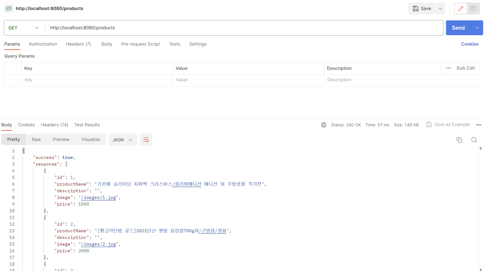
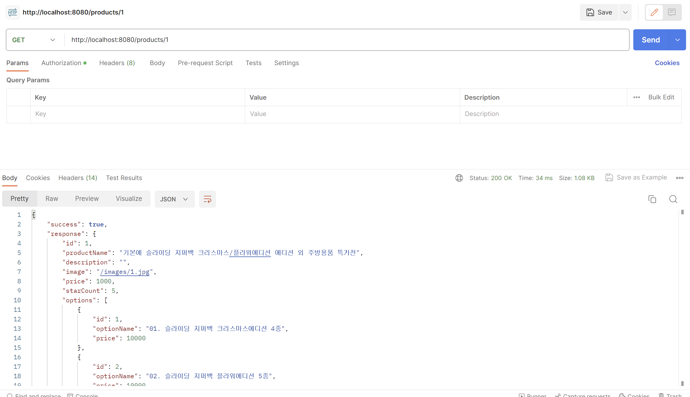

iii# step2-BE-kakao-shop
카카오 테크 캠퍼스 2단계 카카오 쇼핑하기 백엔드 클론 프로젝트 레포지토리입니다.

# 1주차

카카오 테크 캠퍼스 2단계 - BE - 1주차 클론 과제
</br>
</br>

## **과제명**
```
1. 요구사항분석/API요청 및 응답 시나리오 분석
2. 요구사항 추가 반영 및 테이블 설계도
```

## **과제 설명**
```
1. 요구사항 시나리오를 보고 부족해 보이는 기능을 하나 이상 체크하여 README에 내용을 작성하시오.
2. 제시된 화면설계를 보고 해당 화면설계와 배포된 기존 서버의 API주소를 매칭하여 README에 내용을 작성하시오. (카카오 화면설계 시나리오가 있음)
3. 배포된 서버에 모든 API를 POSTMAN으로 요청해본 뒤 응답되는 데이터를 확인하고 부족한 데이터가 무엇인지 체크하여 README에 내용을 작성하시오.
4. 테이블 설계를 하여 README에 ER-Diagram을 추가하여 제출하시오.
```

</br>

## **과제 상세 : 수강생들이 과제를 진행할 때, 유념해야할 것**
아래 항목은 반드시 포함하여 과제 수행해주세요!
>- 부족한 기능에 대한 요구사항을 미리 예상할 수 있는가? (예를 들면 상품등록 api가 기존 요구사항에는 없는데 추후 필요하지는 않을지, 이런 부분들을 생각하였는지) 
>- 요구사항에 맞는 API를 분석하고 사용자 시나리오를 설계하였는가? (예를 들어 배포된 서버와 화면 설계를 제시해줄 예정인데, 특정 버튼을 클릭했을 때 어떤 API가 호출되어야 할지를 아는지)
>- 응답되는 데이터가 프론트앤드 화면에 모두 반영될 수 있는지를 체크하였는가?(예를 들어 배송관련 비용이 있는데, 이런것들이 API에는 없는데 이런 부분을 캐치할 수 있는지)
>- 테이블 설계가 모든 API를 만족할 수 있게 나왔는가? (테이블이 효율적으로 나왔는가 보다는 해당 테이블로 요구사항을 만족할 수 있는지에 대한 여부만)
>- 테이블명이 이해하기 쉽게 만들어졌는가? (상품테이블이 product이면 이해하기 쉽지만, material이라고 하면 이해하기 어렵기 때문)

</br>

## **코드리뷰 관련: PR시, 아래 내용을 포함하여 코멘트 남겨주세요.**
**1. PR 제목과 내용을 아래와 같이 작성 해주세요.**

>- PR 제목 : 부산대BE_라이언_1주차 과제

</br>

---

## 1번 : 요구사항 시나리오를 보고 부족해 보이는 기능을 하나 이상 체크하여 README에 내용을 작성

>- 부족한 기능에 대한 요구사항을 미리 예상할 수 있는가? (예를 들면 상품등록 api가 기존 요구사항에는 없는데 추후 필요하지는 않을지, 이런 부분들을 생각하였는지)

1. 상품 등록 기능
2. 판매자가 현재 배송중인 / 판매가 된 상품들을 관리할 수 있는 기능
3. 구매자가 특정 브랜드의 상품만 볼 수 있도록 하는 기능 ( 브랜드별 )
4. 상품 카테고리 정렬 기능 ( 상품 종류 별 )
5. 상품 검색 기능

#### 예시 ( 쿠팡, 카카오 쇼핑하기 비교 )
<p></img></p>
<p></img></p>

#### 쿠팡처럼 검색기능, 카테고리 선택 기능 등 여러 기능들을 추가하면 좋을 것이라 생각했습니다.

---

## 2번 : 제시된 화면설계를 보고 해당 화면설계와 배포된 기존 서버의 API 주소를 매칭하여 README 에 내용 작성하기

>- 요구사항에 맞는 API를 분석하고 사용자 시나리오를 설계하였는가? (예를 들어 배포된 서버와 화면 설계를 제시해줄 예정인데, 특정 버튼을 클릭했을 때 어떤 API가 호출되어야 할지를 아는지)

( 기능 1 )
>- 3번 이메일 중복 체크 : http://localhost:8080/check 
>- 4번 회원가입 : http://localhost:8080/join

( 기능 2 )
>- 5번 로그인 : http://localhost:8080/login

( 기능 3 )
>- 1번 메인페이지 : http://localhost:8080/products

( 기능 4 )
>- 1번 메인페이지 : http://localhost:8080/products

( 기능 5 )
>- 2번 개별 상품 목록 조회 : http://localhost:8080/products/1

( 기능 6, 기능 7, 기능 8 )
>- 6번 장바구니 담기 : http://localhost:8080/carts/add

( 기능 9 )
>- 7번 장바구니 조회 : http://localhost:8080/carts

( 기능 10, 11 )
>- 8번 주문하기 - 장바구니 수정 : http://localhost:8080/carts/update

( 기능 12 )
>- 9번 결재 : http://localhost:8080/orders/save

( 기능 13 )
>- 10번 주문 결과 확인 : http://localhost:8080/orders/1

---

## 3번 : 배포된 서버에 모든 API를 POSTMAN으로 요청해본 뒤 응답되는 데이터를 확인하고 부족한 데이터가 무엇인지 체크하여 README에 내용을 작성하시오.

>- 응답되는 데이터가 프론트앤드 화면에 모두 반영될 수 있는지를 체크하였는가?(예를 들어 배송관련 비용이 있는데, 이런것들이 API에는 없는데 이런 부분을 캐치할 수 있는지)

### 전체 상품 목록 조회 : 없음
<p></img></p>

#### Param 을 사용하여 전체 상품 목록 조회 : 없음
<p></img></p>

### 개별 상품 상세 조회 : 배송과 관련된 데이터가 없음
<p></img></p>

### 이메일 중복 체크 : 없음
<p></img></p>

### 회원가입 : 없음
여기서 같은 이름도 잡을 필요가 있는지? 하고 잠깐 생각을 해봤는데, 동명이인도 있을 수 있으니 필요 없다고 생각했습니다.
<p></img></p>

### 로그인 : 없음
<p></img></p>

### 장바구니 담기 : 없음
<p></img></p>

### 장바구니 조회 : 여기서 배송비가 붙어서 주문 예상 금액에 반영되면 좋을 것 같습니다.
<p></img></p>

### 주문하기 - ( 장바구니 수정 ) : 없음
<p></img></p>

### 결재하기 - ( 주문 인서트 ) : 없음
<p></img></p>

### 주문 결과 확인 : 없음
<p></img></p>

---

## 4번 : 테이블 설계를 하여 README에 ER-Diagram을 추가하여 제출하시오.

>- 테이블 설계가 모든 API를 만족할 수 있게 나왔는가? (테이블이 효율적으로 나왔는가 보다는 해당 테이블로 요구사항을 만족할 수 있는지에 대한 여부만)
>- 테이블명이 이해하기 쉽게 만들어졌는가? (상품테이블이 product이면 이해하기 쉽지만, material이라고 하면 이해하기 어렵기 때문)

<p></img></p>

## 제약사항

### User

user_id : INT PK, AUTO_INCREMENT

userName : VARCHAR(100) NOT NULL

email : VARCHAR(100) UNIQUE NOT NULL

password : VARCHAR(100) NOT NULL

position : VARCHAR(100), NOT NULL

createdAt : DATE, NOT NULL

### Product

product_id : PK AUTO_INCREMENT

productName VARCHAR(100) NOT NULL

description : VARCHAR(100)

image VARCHAR(100)

price INT, NOT NULL

createdAt DATE, NOT NULL

### Option

option_id : PK, AUTO_INCREMENT

product_id : FK

optionName VARCHAR(100), NOT NULL

price INT, NOT NULL

createdAt : DATE, NOT NULL

### Cart

cart_id : PK, AUTO_INCREMENT

option_id : FK

user_id : FK

quantity : INT, NOT NULL

price : INT, NOT NULL

createdAt : DATE, NOT NULL

### Order

order_id : PK, AUTO_INCREMENT

user_id : FK

### Item

item_id : PK, AUTO INCREMENT

option_id : FK

order_id : FK

quantity : INT, NOT NULL

price : INT, NOT NULL

---

# 2주차

카카오 테크 캠퍼스 2단계 - BE - 2주차 클론 과제
</br>
</br>

## **과제명**
```
1. 전체 API 주소 설계
2. Mock API Controller 구현
```

## **과제 설명**
```
1. API주소를 설계하여 README에 내용을 작성하시오.
2. 가짜 데이터를 설계하여 응답하는 스프링부트 컨트롤러를 작성하고 소스코드를 업로드하시오.
```

</br>

## **과제 상세 : 수강생들이 과제를 진행할 때, 유념해야할 것**
아래 항목은 반드시 포함하여 과제 수행해주세요!
>- 전체 API 주소 설계가 RestAPI 맞게 설계되었는가? (예를 들어 배포된 서버는 POST와 GET으로만 구현되었는데, 학생들은 PUT과 DELETE도 배울 예정이라 이부분이 반영되었고, 주소가 RestAPI에 맞게 설계되었는지)
>- 가짜 데이터를 설계하여 Mock API를 잘 구현하였는가? (예를 들어 DB연결없이 컨트롤러만 만들어서 배포된 서버의 응답과 동일한 형태로 데이터가 응답되는지 여부)
>- DTO에 타입은 올바르게 지정되었는가?
>- DTO에 이름은 일관성이 있는가? (예를 들어 어떤 것은 JoinDTO, 어떤 것은 joinDto, 어떤 것은 DtoJoin 이런식으로 되어 있으면 일관성이 없는것이다)
>- DTO를 공유해서 쓰면 안된다 (동일한 데이터가 응답된다 하더라도, 화면은 수시로 변경될 수 있기 때문에 DTO를 공유하고 있으면 배점을 받지 못함)
</br>

## **코드리뷰 관련: PR시, 아래 내용을 포함하여 코멘트 남겨주세요.**
**1. PR 제목과 내용을 아래와 같이 작성 해주세요.**

>- PR 제목 : 부산대BE_라이언_2주차 과제

</br>

**2. PR 내용 :**

>- 코드 작성하면서 어려웠던 점
>- 코드 리뷰 시, 멘토님이 중점적으로 리뷰해줬으면 하는 부분

---

## 1번 : 전체 API 주소 설계

### 참고 : API주소를 설계하여 README에 내용을 작성하시오.

1. 제품 관리 API ( carts )
- 전체 상품 목록 조회 : GET /products <p></img></p>

- 개별 상품 상세 조회 : GET / products/{product_id} <p></img></p>

2. 사용자 관리 API ( user )
- 이메일 중복 체크 : POST /check -> user 코드에 존재하지 않아서, 따로 사진 첨부하지 않았음

- 회원가입 : POST /join <p></img></p>

- 로그인 : POST /login <p></img></p> <p></img></p>

3. 쇼핑 카트 관리 API ( carts )
- 장바구니 담기 : POST /carts/add <p></img></p>

- 장바구니 조회 : POST /carts <p></img></p>

- 장바구니 수정 : POST /carts/update <p></img></p>

4. 주문 관리 API ( order )
- 결제하기 : POST /orders/save <p></img></p>

- 주문 결과 확인 : GET /orders/{user_id} <p></img></p>
    결제를 하고 나서, 주문 결과를 확인했을 때 같은 값이 나오도록 설정

## 2번. Mock API Controller 구현

### 참고 : 가짜 데이터를 설계하여 응답하는 스프링부트 컨트롤러를 작성하고 소스코드를 업로드하시오.

변수명을 제외한 나머지 부분이 API 의 결괏값과 동일한 값이 나오도록 설계했습니다.