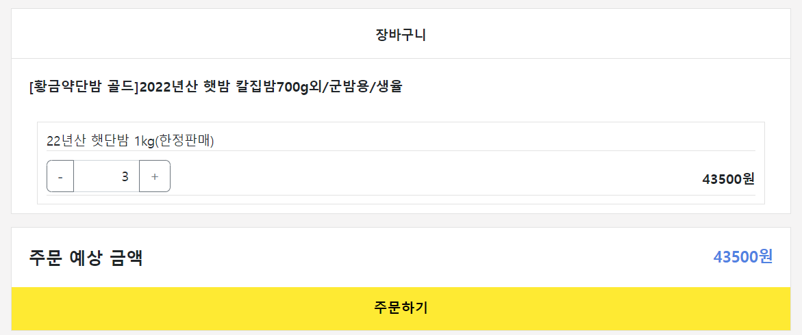

### 1. 요구사항 시나리오를 보고 부족해 보이는 기능을 하나 이상 체크하여 README에 내용을 작성하시오.

### 장바구니 삭제

장바구니에 물건 담으면 삭제가 안됨

무조건 구매해야 함;

- 프론트 화면


- 실제 화면


- 프론트 화면


- 실제 카톡쇼핑 화면


상품 옵션에서 삭제

장바구니 조회에서 삭제

가 필요함

### 장바구니에 있는 물건 다시 추가하면 추가 안됨


추가 안됨

로직에서 장바구니에 있으면 quantity++

### 상품 등록

이거는 유저에 따라 좀 다를 거 같은데 

유저에 role을 부여해서 판매자일 때만 상품 등록이 가능해야 함

아니면 모든 유저가 구매, 상품 가능하게 하던가

근데 클론 코딩인데, 본인 카카오톡 쇼핑하기에는 그런 거 없음

admin 페이지 고려

### 찜하기

테이블을 하나 더 만들어서 user랑 product를 fk로 받는 게 맞나?


→관계 테이블로 구성

### 상품 리뷰

댓글처럼 구현 - comment 테이블

- 실제 카톡 쇼핑 화면


starcount 필요

### 문의 하기

게시판 - 댓글 방식으로 구현


### 2. 제시된 화면설계를 보고 해당 화면설계와 배포된 기존 서버의 API주소를 매칭하여 README에 내용을 작성하시오. (카카오 화면설계 시나리오가 있음)

## 1. 전체 상품 목록 조회


- method : Get
- Local URL : localhost:8080/products

## 2. 개별 상품 조회

상품 클릭 시 이동


## 3. 회원가입


이메일 형식 aaa@aaa.com 입력 후 중복 확인

이름, 비밀번호 (8~20자, 영문, 숫자, 특수 기호 포함)

회원가입 클릭 시 회원가입 완료

## 4. 로그인


회원가입 한 내용으로 로그인 로그인 버튼 클릭 시 jwt 헤더로 반환, 로그인 완료

## 5. 옵션 선택


옵션 선택 시 선택한 상품으로 나옴


+버튼 클릭하면 개수 증가, 총 주문금액 증가


장바구니 버튼 클릭 시 장바구니로 이동,

톡 딜가로 구매하기 클릭 시에도 장바구니로 이동 알림 띄우고 이동해야 할 듯

## 6. 장바구니



우측 상단의 카트 모양 클릭 시 장바구니로 이동


주문하기 클릭 시 주문 화면으로 이동


배송 정보도 구축 되어야 할 듯


주문 정보와 주문 금액, 동의 체크를 하고 결제하기를 클릭하면 결제화면으로 이동


구매 화면, 쇼핑 계속하기를 클릭하면 products 화면으로 이동

## 7. 로그아웃


로그아웃을 클릭하면 로그아웃되고, 로그인 화면으로 이동


### 3. 배포된 서버에 모든 API를 POSTMAN으로 요청해본 뒤 응답되는 데이터를 확인하고 부족한 데이터가 무엇인지 체크하여 README에 내용을 작성하시오.

## 1. 전체 상품 조회

- method : GET
- local URL : localhost:8080/products
- Param : page = {number}

```json
"response": [
        {
            "id": 1,
            "productName": "기본에 슬라이딩 지퍼백 크리스마스/플라워에디션 에디션 외 주방용품 특가전",
            "description": "",
            "image": "/images/1.jpg",
            "price": 1000
        },
        {
            "id": 2,
            "productName": "[황금약단밤 골드]2022년산 햇밤 칼집밤700g외/군밤용/생율",
            "description": "",
            "image": "/images/2.jpg",
            "price": 2000
        },
```

product_id, name, description, image, price가 나옴

## 2. 개별 상품 조회

- method : GET
- local URL : localhost:8080/products/1

```json
"success": true,
    "response": {
        "id": 1,
        "productName": "기본에 슬라이딩 지퍼백 크리스마스/플라워에디션 에디션 외 주방용품 특가전",
        "description": "",
        "image": "/images/1.jpg",
        "price": 1000,
        "starCount": 5,
        "options": [
            {
                "id": 1,
                "optionName": "01. 슬라이딩 지퍼백 크리스마스에디션 4종",
                "price": 10000
            },
            {
                "id": 2,
                "optionName": "02. 슬라이딩 지퍼백 플라워에디션 5종",
                "price": 10900
            },
```

해당 product의 id를 요청

product의 option_id, name, price가 들어있는 array 반환

product 별로 option_id가 1,2,3.. 순이 아니라 상품이 달라도 option_id가 다름

→ option_id로 pk가 있는 테이블 구성 가능

## 3. 이메일 중복 체크

- Method : Post
- Local URL : [localhost:8080/check](http://localhost:8080/check)
- Request Body

```json
{
	"email":"meta@nate.com"
}
```

- Response Body

```json
{
	"success": true,
	"response": null,
	"error": null
}
```

## 3-1 이메일 중복 체크 실패

### 1. 동일한 이메일

- Response Body

```json
{
	"success": false,
	"response": null,
	"error": {
		"message": "동일한 이메일이 존재합니다 : ssar@nate.com",
		"status": 400
	}
}
```

에러 메세지와 status 반환

### 2. 형식 에러

- Response Body

```json
{
	"success": false,
	"response": null,
	"error": {
		"message": "이메일 형식으로 작성해주세요 : email",
		"status": 400
	}
}
```

에러 메세지와 status 반환

## 4. 회원가입

- Method : Post
- Local URL : [localhost:8080/](http://localhost:8080/check)join
- Request Body

```json
{
	"username":"mata",
	"email":"meta@nate.com",
	"password":"meta1234!"
}
```

이메일을 아이디로 지정하는 건 사실 사용자 입장에서 싫을 거 같긴 함

이름, 이메일 , 패스워드를 보냄

- Response Body

```json
{
	"success": true,
	"response": null,
	"error": null
}
```

## 4-1 회원가입 실패 예시

### 1. 이메일 형식 오류(aaa@aaa.com)

```json
{
	"success" : false,
	"response" : null,
	"error" : {
		"message" : "이메일 형식으로 작성해주세요:email",
		"status" : 400
		}
}
```

### 1. 비밀번호 제약 조건 오류 (영문, 숫자, 특수기호 포함 8~20자리)

```json
{
	"success" : false,
	"response" : null,
	"error" : {
		"message" : "영문, 숫자, 특수문자가 포함되어야하고 공백이 포함될 수 없습니다.:password",
		"status" : 400
		}
}
```

### 2. 동일한 이메일 → 이메일 중복 확인에서 거르는데 또 나옴

## 5. 로그인

- Method : Post
- Local URL : [localhost:8080/](http://localhost:8080/check)login
- Request Body

```json
{
	"email":"ssar@nate.com",
	"password":"meta1234!"
}
```

- Response Header

```json
Bearer
eyJ0eXAiOiJKV1QiLCJhbGciOiJIUzUxMiJ9.eyJzdWIiOiJzc2FyQG5hdGUuY29tIiwicm9sZSI6Il
JPTEVfVVNFUiIsImlkIjoxLCJleHAiOjE2ODcwNTM5MzV9.fXlD0NZQXYYfPHV8rokRJTM86nhS869L
Z1KIGi7_qvPOcVbXgvyZLKvnlLxomIiS3YFnQRLzXAJ2G41yI_AmGg
```

header에 jwt토큰을 반환해 로그인 확인

- Response Body

```json
{
	"success": true,
	"response": null,
	"error": null
}
```

## 5-1 로그인 실패 예시

### 1. 이메일 형식 아이디

```json
{
	"success": false,
	"response": null,
	"error": {
		"message": "이메일 형식으로 작성해주세요:email",
		"status": 400
		}
}
```

### 2. 패스워드 오류(”영문, 숫자, 특수문자가 포함되어야하고 공백이 포함될 수 없습니다.:password”)

```json
{
	"success": false,
	"response": null,
	"error": {
		"message": "영문, 숫자, 특수문자가 포함되어야하고 공백이 포함될 수 없습니다.:password",
		"status": 400
		}
}
```

### 3. 회원가입 되지 않은 아이디

```json
{
	"success": false,
	"response": null,
	"error": {
		"message": "인증되지 않았습니다",
		"status": 401
		}
}
```

### 4. 패스워드 오류 ("8에서 20자 이내여야 합니다”)

```json
{
	"success": false,
	"response": null,
	"error": {
		"message": "8에서 20자 이내여야 합니다.:password",
		"status": 400
		}
}
```

## 6. 장바구니 담기

- Method : Post
- Local URL : [localhost:8080/](http://localhost:8080/check)login
- Request Header

→ 로그인 헤더

- Request Body

```json
[
    {
        "optionId":1,
        "quantity":5
    },
    {
        "optionId":2,
        "quantity":5
    }
]
```

옵션 아이디와 개수로 해당 옵션 장바구니로 이동

그런데 같은 옵션 아이디로 다른 개수를 보내면 오류 발생

```json
{
    "success": false,
    "response": null,
    "error": {
        "message": "장바구니 담기 중에 오류가 발생했습니다 : could not execute statement; SQL [n/a]; constraint [\"PUBLIC.UK_CART_OPTION_USER_INDEX_4 ON PUBLIC.CART_TB(USER_ID NULLS FIRST, OPTION_ID NULLS FIRST) VALUES ( /* key:1 */ 1, 1)\"; SQL statement:\ninsert into cart_tb (id, option_id, price, quantity, user_id) values (default, ?, ?, ?, ?) [23505-214]]; nested exception is org.hibernate.exception.ConstraintViolationException: could not execute statement",
        "status": 500
    }
}
```

왜지 ..

서비스 로직에서 수정 필요함

## 7. 장바구니 조회

- Method : GET
- Local URL : [localhost:8080/](http://localhost:8080/check)carts
- Request Header

→ 로그인 헤더 

- Response Body

```json
{
    "success": true,
    "response": {
        "products": [
            {
                "id": 1,
                "productName": "기본에 슬라이딩 지퍼백 크리스마스/플라워에디션 에디션 외 주방용품 특가전",
                "carts": [
                    {
                        "id": 1,
                        "option": {
                            "id": 1,
                            "optionName": "01. 슬라이딩 지퍼백 크리스마스에디션 4종",
                            "price": 10000
                        },
                        "quantity": 5,
                        "price": 50000
                    },
                    {
                        "id": 2,
                        "option": {
                            "id": 2,
                            "optionName": "02. 슬라이딩 지퍼백 플라워에디션 5종",
                            "price": 10900
                        },
                        "quantity": 5,
                        "price": 54500
                    }
                ]
            }
        ],
        "totalPrice": 104500
    },
    "error": null
}
```

product의 name과 id, option의 id, name, price, quantity, 를 통해 해당 장바구니의 옵션의 price 반환 배열로 구분해 totalprice를 반환

배열 구분은 cartId

## 8. 주문하기 - (장바구니 수정)

- Method : POST
- Local URL : [localhost:8080/](http://localhost:8080/check)carts/update
- Request Header

    → 로그인 헤더

- Request body

```json
[
    {
        "cartId":1,
        "quantity":10
    },
    {
        "cartId":2,
        "quantity":10
    }
]
```

cartid와 최종 개수를 받아 배열로 전송

- response body

```json
{
    "success": true,
    "response": {
        "carts": [
            {
                "cartId": 1,
                "optionId": 1,
                "optionName": "01. 슬라이딩 지퍼백 크리스마스에디션 4종",
                "quantity": 10,
                "price": 100000
            },
            {
                "cartId": 2,
                "optionId": 2,
                "optionName": "02. 슬라이딩 지퍼백 플라워에디션 5종",
                "quantity": 10,
                "price": 109000
            }
        ],
        "totalPrice": 209000
    },
    "error": null
}
```

주문하기를 눌렀을 때 장바구니의 carts를 반환, totalprice 계산을 반환

## 9. 결재하기 - (주문 인서트)

- Method : POST
- Local URL : [localhost:8080/](http://localhost:8080/check)orders/save
- Request Header

    → 로그인 헤더

- Response body

근데 Request가 없는데 왜 POST인지

```json
{
    "success": true,
    "response": {
        "id": 1,
        "products": [
            {
                "productName": "기본에 슬라이딩 지퍼백 크리스마스/플라워에디션 에디션 외 주방용품 특가전",
                "OrderItemDTO": [
                    {
                        "id": 1,
                        "optionName": "01. 슬라이딩 지퍼백 크리스마스에디션 4종",
                        "quantity": 10,
                        "price": 100000
                    },
                    {
                        "id": 2,
                        "optionName": "02. 슬라이딩 지퍼백 플라워에디션 5종",
                        "quantity": 10,
                        "price": 109000
                    }
                ]
            }
        ],
        "totalPrice": 209000
    },
    "error": null
}
```

order 테이블에 들어갈 내용들, products, option 내용이 들어감

## 10. 주문 결과 확인

결재 후 order_item 확인

- Method : POST
- Local URL : [localhost:8080/](http://localhost:8080/check)orders/1
- Request Header

    → 로그인 헤더

- Response body

```json
{
    "success": true,
    "response": {
        "id": 1,
        "products": [
            {
                "productName": "기본에 슬라이딩 지퍼백 크리스마스/플라워에디션 에디션 외 주방용품 특가전",
                "OrderItemDTO": [
                    {
                        "id": 1,
                        "optionName": "01. 슬라이딩 지퍼백 크리스마스에디션 4종",
                        "quantity": 10,
                        "price": 100000
                    },
                    {
                        "id": 2,
                        "optionName": "02. 슬라이딩 지퍼백 플라워에디션 5종",
                        "quantity": 10,
                        "price": 109000
                    }
                ]
            }
        ],
        "totalPrice": 209000
    },
    "error": null
}
```

order_item_id 로 구분

구매한 products의 option내용과 total price

배송 내역이 나중에 들어가면 좋겠다


### 4. 테이블 설계를 하여 README에 ER-Diagram을 추가하여 제출하시오.

### 테이블 구현

| user (유저) | product(상품) | option (상품 옵션) | cart (장바구니) | order (주문) | order_item (주문 목록?) |
| --- | --- | --- | --- | --- | --- |
| user_id(pk) | product_id(pk) | option_id(pk) | cart_id(pk) | order_id(pk) | order_item_id(pk) |
| username | product_name | option_name | option_id(fk) | user_id(fk) | oreder_id(pk) |
| email | description | price | user_id(fk) | date | user_id(fk) |
| passward | image | date | date |  | option_id(fk) |
| create_time | date | product_id(fk) | quantity |  | date |
|  |  |  |  |  | price |

### 관계 설정

상품 - 옵션 = 1-N

유저 - 장바구니 = 1-N

장바구니 - 옵션 = N-1

옵션 - 주문아이템 = 1-N

주문 - 주문아이템 = 1-N

유저 - 주문아이템 = 1-N

유저 - 주문 = 1-N


### 추가 기능 고려한 테이블

| user_tb (유저) | product_tb(제품) | option_tb (제품 옵션) | cart_tb (장바구니) | order_tb (주문) | order_item_tb (주문 목록?) | like_tb (찜하기) | comment_tb (제품 리뷰) |
| --- | --- | --- | --- | --- | --- | --- | --- |
| user_id(pk) | product_id(pk) | option_id(pk) | cart_id(pk) | order_id(pk) | order_item_id(pk) | like_id(pk) | comment_id(pk) |
| username | product_name | option_name | option_id(fk) | user_id(fk) | oreder_id(pk) | user_id(fk) | product_id(fk) |
| email | description | price | user_id(fk) | date | user_id(fk) | product_id(fk) | user_id(fk) |
| passward | image | date | date |  | option_id(fk) | starcount | content |
| date | date | product_id(fk) | quantity |  | date |  | date |
| role | price | price |  |  | price |  |  |

### 관계 설정

### 제품

제품 - 옵션 = 1-N

### 장바구니

유저 - 장바구니 = 1-N

장바구니 - 옵션 = N-1

### 주문아이템

옵션 - 주문아이템 = 1-N

주문 - 주문아이템 = 1-N

유저 - 주문아이템 = 1-N

### 주문

유저 - 주문 = 1-N

### 찜하기

유저 - 찜하기 = 1-N

제품 - 찜하기 = 1-1

### 제품 리뷰

제품 - 리뷰 = 1-N

유저 - 리뷰 = 1-1


