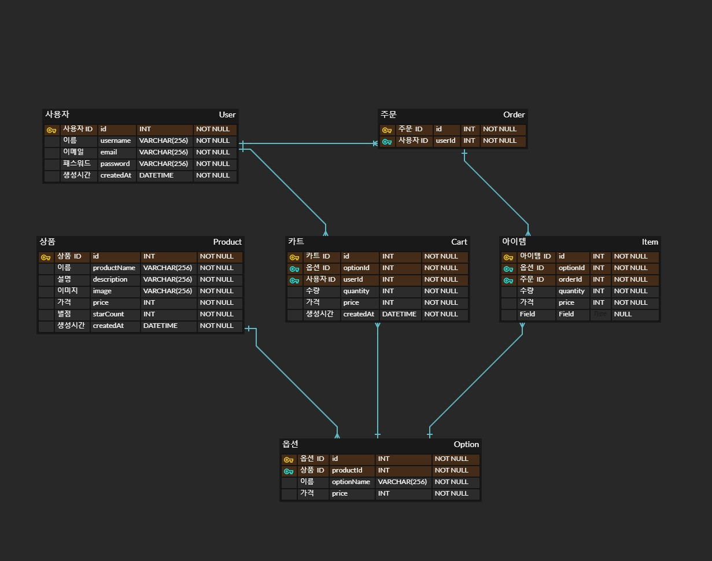

# 카카오 테크 캠퍼스 2단계 - BE - 1주차 클론 과제

### 1. 요구사항분석/API요청 및 응답 시나리오 분석

- (기능번호) 설계 문서 상의 기능 이름  
  - HttpMethod Endpoint 
  - (Optional) event: API 호출을 발생시키는 이벤트 추측
  - 개요 및 설명
  - 예외: 예외 처리
  - (Optional) 더 필요할 것으로 예상되는 내용
  
 

- (기능1) 회원가입
  - POST /check  
    - event: 이메일 입력 필드에서 커서가 벗어난 경우(입력이 완료되었다고 판단)
    - 폼에 작성된 이메일을 받아서 중복 여부를 반환한다.
    - 예외: 이메일 중복, 이메일 형식 오류
  - POST /join
    - 이름, 이메일, 비밀번호를 받아서 회원 계정을 생성하고 결과를 반환한다.
    - 예외: 이메일 중복, 이메일 형식 오류, 비밀번호 유효성 검사
  - 이메일 소유자 인증
  
 
  
- (기능2) 로그인 
  - POST /login
    - 이메일, 비밀번호를 입력받아 토큰을 반환한다.
    - 예외: 이메일 및 비밀번호 형식 오류, 이메일이 존재하지 않는 경우, 비밀번호가 일치하지 않는 경우

 
    
- (기능3) 로그아웃 
  - 연결된 API 없음.
  - 필요하다면 토큰을 입력받아서 블랙리스트를 구현하는 시도 등을 할 수 있겠다.

   

- (기능4) 전체 상품 목록 조회
  - GET /products?page={number}
  - 번호에 해당하는 페이지의 상품 목록을 반환한다.
  - PK 기반 페이지네이션으로 구현하려는 경우, page 가 아닌 product-id 를 받아야 할 것 같다.

 

- (기능5) 개별 상품 상세 조회
  - GET /products/{product-id}
  - 해당 상품의 옵션들을 반환한다.

 

- (기능6) 상품 옵션 선택
- (기능7) 옵션 확인 및 수량 결정
  - 클라이언트 상에서 처리되는 부분으로 보인다.

 

- (기능8) 장바구니 담기
  - POST /carts/add
  - 옵션 아이템과 수량, 토큰을 함께 전달하여, 유저의 장바구니를 업데이트한다.

 

- (기능9) 장바구니 보기
  - GET /carts
  - 토큰을 전달하여 유저의 장바구니를 조회한다.

 

- (기능10) 장바구니 상품 옵션 확인 및 수량 결정
  - POST /carts/update
  - 변경하고자 하는 옵션 ID 와 수량을 입력받아 장바구니를 업데이트한다. 
  - 예외: 장바구니에 없는 옵션 ID, 수량이 0 이하인 경우

 

- (기능11) 주문
  - POST /orders/save
  - 유저의 장바구니 정보를 기반으로 주문을 생성하고 장바구니를 비운다.
  - 예외: 장바구니가 비어있는 경우

 

- (기능12) 결제
  - 생략

 

- (기능13) 주문 결과 확인
  - GET /orders/{order-id}
  - 주문 ID 를 입력받아서 주문 정보를 반환한다.
  - 주문 완료 후 자동으로 보여지는 구매 결과 확인 페이지로 확인된다.

 

- (기능14) 주문 내역 확인
  - GET /orders 
  - 토큰을 입력받아서 해당 유저의 주문 내역을 반환한다. 날짜 등을 입력할 수 있고 페이지네이션도 고려해볼 수 있겠다.

상품 카테고리   
상품 검색  
환불 등 ...

### 2. 요구사항 추가 반영 및 테이블 설계도

- User table
  - status 는 ACTIVE, INACTIVE, DELETE 등... WAS 에서 enum 으로 관리하면 좋을 것 같습니다.
  - Customer 가 아닌 고객의 계정도 관리할 필요가 있다면, Account 로 이름을 바꾸고 계정 역할 필드를 추가하고, 1:1 관계로 Customer, Seller 등으로 분할하는것에 대해서 생각...
  
  
    CREATE TABLE `user` (  
      `id` int NOT NULL AUTO_INCREMENT,  
      `name` varchar(255),  
      `email` varchar(255) NOT NULL,  
      `password` varchar(255),  
      `status` varchar(255),  
      `created_at` datetime(6),  
      `updated_at` datetime(6),  

      PRIMARY KEY (`id`),  
      UNIQUE KEY (`email`)  
    )  

- Product table  
  - starCount 는 생략하였습니다.  
  - status 에 ACTIVE, INACTIVE, DELETE 뿐 아니라 품절상태를 관리할 수 있으면 좋을 것 같습니다.
  - 실제로 가격을 가지고 있는 것은 Product 에 연결된 Option 들이기 때문에, Product 에서 가격을 제거하고 반드시 1개 이상의 Option을 가지도록 하는 것을 생각해보았습니다.

    CREATE TABLE `product` (  
      `id` int NOT NULL AUTO_INCREMENT,  
      `name` varchar(255),  
      `image_url` varchar(255),  
      `status` varchar(255),  
      `created_at` datetime(6),  
      `updated_at` datetime(6),  

      PRIMARY KEY (`id`)  
    )  

- Option table
  - sequence: 클라이언트 화면에 보여지는 옵션의 순서 관리
  - status 는 활성화 여부, 삭제 정도로 일단 충분할 것 같습니다.

    CREATE TABLE `product_option` (
      `id` int NOT NULL AUTO_INCREMENT,
      `name` varchar(255),
      `price` int NOT NULL,
      `sequence` int NOT NULL,
      `status` varchar(255)ACTIVE',
      `created_at` datetime(6),
      `updated_at` datetime(6),
      `product_id` int,
      PRIMARY KEY (`id`),
      KEY (`product_id`),
      CONSTRAINT FOREIGN KEY (`product_id`) REFERENCES `product` (`id`)
    )

- Cart table

    CREATE TABLE `shopping_cart` (  
      `id` int NOT NULL AUTO_INCREMENT,  
      `user_id` int,  
      `option_id` int,  
      `quantity` int NOT NULL,  
      `created_at` datetime(6),  
      `updated_at` datetime(6),  

      PRIMARY KEY (`id`),  
      KEY (`user_id`),  
      KEY (`option_id`),  
      CONSTRAINT FOREIGN KEY (`option_id`) REFERENCES `product_option` (`id`),  
      CONSTRAINT FOREIGN KEY (`user_id`) REFERENCES `user` (`id`)  
    )  

- Order table 

    CREATE TABLE `orders` (
      `id` int NOT NULL AUTO_INCREMENT,
      `ordered_at` datetime(6),
      `user_id` int,  

      PRIMARY KEY (`id`),
      KEY (`user_id`),
      CONSTRAINT FOREIGN KEY (`user_id`) REFERENCES `user` (`id`)
    )

- Item table  
  - 주문 시 장바구니 내역을 그대로 옮겨적는 History table.
  - 추후 product 와 option 의 정보가 변경될 수 있으니 필요한 정보들을 기록하는 것이 좋을 것 같습니다.

    CREATE TABLE `order_item` (
      `id` int NOT NULL AUTO_INCREMENT,
      `option_name` varchar(255),
      `price` varchar(255),
      `product_name` varchar(255),
      `quantity` int NOT NULL,
      `order_id` int,

      PRIMARY KEY (`id`),
      KEY (`order_id`),
      CONSTRAINT FOREIGN KEY (`order_id`) REFERENCES `orders` (`id`)
    )

- ER Diagram
