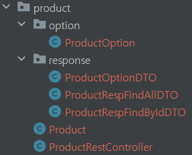

# 2주차 과제

# 1. 전체 API 주소 설계

| Verb : HTTP Method | Resource : HTTP URI | Param | Representations : HTTP Message Pay Load |
| --- | --- | --- | --- |
| GET | /products | ?page=0 | 전체 상품 조회 |
| GET | /products/{id} |  | 특정 상품 조회 |
| POST | /carts |  | 장바구니아이템 추가 |
| GET | /carts |  | 전체 장바구니아이템 조회 |
| PATCH | /carts |  | 장바구니아이템 수량 수정 |
| POST | /orders |  | 주문 추가 |
| GET | /orders/{id} |  | 특정 주문 조회 |

---

# 2. Mock API Controller 구현

## product



### GET /products?page=0 전체 상품 조회

- Response DTO
    
    ```java
    // response > ProductRespFindAllDTO
    ```
    
- Controller
    
    ```java
    // ProductRestController
    
    @GetMapping("/products")
        public ResponseEntity<?> findAll(@RequestParam(value="page", required = false, defaultValue = "0") int page) {
        }
    ```
    
- Response Body
    
    ```json
    {
        "success": true,
        "response": [
            {
                "id": 1,
                "productName": "기본에 슬라이딩 지퍼백 크리스마스/플라워에디션 에디션 외 주방용품 특가전",
                "description": "",
                "image": "/images/1.jpg",
                "price": 1000
            },
            {
                "id": 2,
                "productName": "[황금약단밤 골드]2022년산 햇밤 칼집밤700g외/군밤용/생율",
                "description": "",
                "image": "/images/2.jpg",
                "price": 2000
            },
            {
                "id": 3,
                "productName": "삼성전자 JBL JR310 외 어린이용/성인용 헤드셋 3종!",
                "description": "",
                "image": "/images/3.jpg",
                "price": 30000
            },
            {
                "id": 4,
                "productName": "바른 누룽지맛 발효효소 2박스 역가수치보장 / 외 7종",
                "description": "",
                "image": "/images/4.jpg",
                "price": 4000
            },
            {
                "id": 5,
                "productName": "[더주] 컷팅말랑장족, 숏다리 100g/300g 외 주전부리 모음 /중독성 최고/마른안주",
                "description": "",
                "image": "/images/5.jpg",
                "price": 5000
            },
            {
                "id": 6,
                "productName": "굳지않는 앙금절편 1,050g 2팩 외 우리쌀떡 모음전",
                "description": "",
                "image": "/images/6.jpg",
                "price": 15900
            },
            {
                "id": 7,
                "productName": "eoe 이너딜리티 30포, 오렌지맛 고 식이섬유 보충제",
                "description": "",
                "image": "/images/7.jpg",
                "price": 26800
            },
            {
                "id": 8,
                "productName": "제나벨 PDRN 크림 2개. 피부보습/진정 케어",
                "description": "",
                "image": "/images/8.jpg",
                "price": 25900
            },
            {
                "id": 9,
                "productName": "플레이스테이션 VR2 호라이즌 번들. 생생한 몰입감",
                "description": "",
                "image": "/images/9.jpg",
                "price": 797000
            }
        ],
        "error": null
    }
    ```
    

### GET /products/{id} 특정 상품 조회

- Response DTO
    
    ```java
    // response > ProductRespFindByIdDTO
    ```
    
    ```java
    // response > ProductOptionDTO
    ```
    
- Controller
    
    ```java
    // ProductRestController
    
    @GetMapping("/products/{id}")
        public ResponseEntity<?> findById(@PathVariable int id) {
        }
    ```
    
- Response Body
    
    ```json
    {
        "success": true,
        "response": {
            "id": 1,
            "productName": "기본에 슬라이딩 지퍼백 크리스마스/플라워에디션 에디션 외 주방용품 특가전",
            "description": "",
            "image": "/images/1.jpg",
            "price": 1000,
            "starCount": 5,
            "options": [
                {
                    "id": 1,
                    "optionName": "01. 슬라이딩 지퍼백 크리스마스에디션 4종",
                    "price": 10000
                },
                {
                    "id": 2,
                    "optionName": "02. 슬라이딩 지퍼백 플라워에디션 5종",
                    "price": 10900
                },
                {
                    "id": 3,
                    "optionName": "고무장갑 베이지 S(소형) 6팩",
                    "price": 9900
                },
                {
                    "id": 4,
                    "optionName": "뽑아쓰는 키친타올 130매 12팩",
                    "price": 16900
                },
                {
                    "id": 5,
                    "optionName": "2겹 식빵수세미 6매",
                    "price": 8900
                }
            ]
        },
        "error": null
    }
    ```
    

---

## cart


### ✏POST /carts 장바구니아이템 추가

- Request Body
    
    ```json
    [
        {
            "optionId": 1,
            "quantity": 5
        },
        {
            "optionId": 2,
            "quantity": 5
        }
    ]
    ```
    
- Request DTO
    
    ```java
    // request > CartItemRequAddDTO
    ```
    
    ```java
    // request > CartItemAddDTO
    ```
    
- Controller
    
    ```java
    // CartRestController
    
    @PostMapping("/carts")
        public ResponseEntity<?> add() {
            return ResponseEntity.ok(ApiUtils.success(null));
        }
    ```
    
- Response Body
    
    ```json
    {
        "success": true,
        "response": null,
        "error": null
    }
    ```
    

### GET /carts 전체 장바구니아이템 조회

- Response DTO
    
    ```java
    // response > CartItemRespFindAllDTO
    ```
    
    ```java
    // response > ProductDTO
    ```
    
    ```java
    // response > CartItemDTO
    ```
    
    ```java
    // response > ProductOptionDTO
    ```
    
- Controller
    
    ```java
    // CartRestController
    
    @GetMapping("/carts")
        public ResponseEntity<?> findAll() {
        }
    ```
    
- Response Body
    
    ```json
    {
        "success": true,
        "response": {
            "products": [
                {
                    "id": 1,
                    "productName": "기본에 슬라이딩 지퍼백 크리스마스/플라워에디션 에디션 외 주방용품 특가전",
                    "cartItems": [
                        {
                            "id": 4,
                            "option": {
                                "id": 1,
                                "optionName": "01. 슬라이딩 지퍼백 크리스마스에디션 4종",
                                "price": 10000
                            },
                            "quantity": 5,
                            "price": 50000
                        },
                        {
                            "id": 5,
                            "option": {
                                "id": 1,
                                "optionName": "02. 슬라이딩 지퍼백 크리스마스에디션 5종",
                                "price": 10900
                            },
                            "quantity": 5,
                            "price": 54500
                        }
                    ]
                }
            ],
            "totalPrice": 104500
        },
        "error": null
    }
    ```
    

### ✏PATCH /carts 장바구니아이템 수량 수정

- Request Body
    
    ```json
    [
        {
            "cartId": 4,
            "quantity": 10
        },
        {
            "cartId": 5,
            "quantity": 10
        }
    ]
    ```
    
- Request DTO
    
    ```java
    // request > CartItemRequUpdateDTO
    ```
    
    ```java
    // request > CartItemUpdateDTO
    ```
    
- Response DTO
    
    ```java
    // response > CartItemRespUpdateDTO
    ```
    
    ```java
    // response > CartItemUpdateDTO
    ```
    
- Controller
    
    ```java
    // CartRestController
    
    @PatchMapping("/carts")
        public ResponseEntity<?> update() {
        }
    ```
    
- Response Body
    
    ```json
    {
        "success": true,
        "response": {
            "carts": [
                {
                    "cartId": 4,
                    "optionId": 1,
                    "optionName": "01. 슬라이딩 지퍼백 크리스마스에디션 4종",
                    "quantity": 10,
                    "price": 100000
                },
                {
                    "cartId": 5,
                    "optionId": 2,
                    "optionName": "02. 슬라이딩 지퍼백 플라워에디션 5종",
                    "quantity": 10,
                    "price": 109000
                }
            ],
            "totalPrice": 209000
        },
        "error": null
    }
    ```
    

---

## order


### ✏POST /orders 주문 추가

- Response DTO
    
    ```java
    // response > OrderRespAddDTO
    ```
    
    ```java
    // response > ProductAddDTO
    ```
    
    ```java
    // response > OrderItemAddDTO
    ```
    
- Controller
    
    ```java
    // OrderRestController
    
    @PostMapping("/orders")
        public ResponseEntity<?> add() {
        }
    ```
    
- Response Body
    
    ```json
    {
        "success": true,
        "response": {
            "id": 1,
            "products": [
                {
                    "productName": "기본에 슬라이딩 지퍼백 크리스마스/플라워에디션 에디션 외 주방용품 특가전",
                    "items": [
                        {
                            "id": 4,
                            "optionName": "01. 슬라이딩 지퍼백 크리스마스에디션 4종",
                            "quantity": 10,
                            "price": 100000
                        },
                        {
                            "id": 5,
                            "optionName": "02. 슬라이딩 지퍼백 플라워에디션 5종",
                            "quantity": 10,
                            "price": 109000
                        }
                    ]
                }
            ],
            "totalPrice": 209000
        },
        "error": null
    }
    ```
    

### ✏GET /orders/{id} 특정 주문 조회

- Response DTO
    
    ```java
    // response > OrderRespFindByIdDTO
    ```
    
    ```java
    // response > ProductDTO
    ```
    
    ```java
    // response > OrderItemDTO
    ```
    
- Controller
    
    ```java
    // OrderRestController
    
    @GetMapping("/orders/{id}")
        public ResponseEntity<?> findById(@PathVariable int id) {
        }
    ```
    
- Response Body
    
    ```json
    {
        "success": true,
        "response": {
            "id": 1,
            "products": [
                {
                    "productName": "기본에 슬라이딩 지퍼백 크리스마스/플라워에디션 에디션 외 주방용품 특가전",
                    "items": [
                        {
                            "id": 4,
                            "optionName": "01. 슬라이딩 지퍼백 크리스마스에디션 4종",
                            "quantity": 10,
                            "price": 100000
                        },
                        {
                            "id": 5,
                            "optionName": "02. 슬라이딩 지퍼백 플라워에디션 5종",
                            "quantity": 10,
                            "price": 109000
                        }
                    ]
                }
            ],
            "totalPrice": 209000
        },
        "error": null
    }
    ```