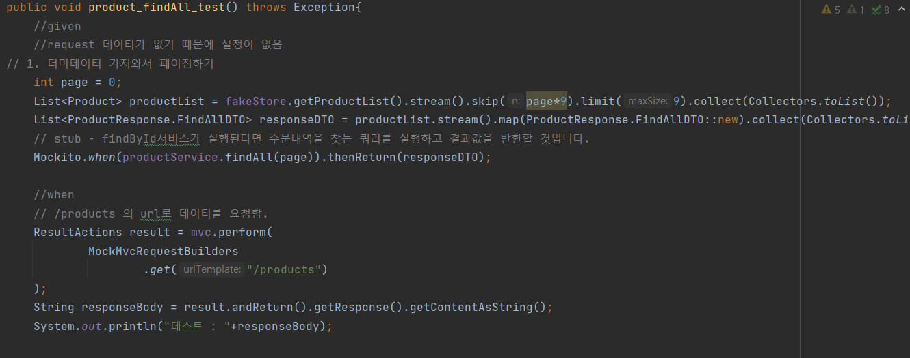

## Controller Test 구현

구현되어 있는 컨트롤러들에 대해 오류 발생 시의 응답에 대해서 추가하고, stub을 활용해 컨트롤러 단위테스트를 완성하는 것이 과제였다.
로그인이 필수적인 화면에서는 anonymous테스트도 동시에 진행해서 401에러가 발생하는지 체크했고, request Body를 받는 경우에는 400에러가 발생하는지 체크했다. 

### UserControllerTest - 완성되어있음

### ProductControllerTest

- findById, findAll에 대해 테스트를 했다.
- 특이상황으로는 findAll은 페이지가 존재하지 않으면 null이 반환됐고, 이에 대해 오류처리를 해야하나 고민했었다. 그래서 깃허브와 프로그래머스 사이트에 가서 page=100000을 설정해 봤었는데, 마지막 페이지가 반환되고 오류가 발생하지 않았었다. 그래서 오류 처리를 하지 않았다.
- findById는 존재하지 않는 페이지를 요청할 때 ~~404를 반환하는 시나리오를 테스트하였다.~~

**모든 상품을 불러오는 컨트롤러 테스트**

**하나의 상품을 세부사항과 불러오는 컨트롤러 테스트**

### CartControllerTest

- update, add, clear, findAll에 대해 테스트를 했다.
- 예상 외의 시나리오로는 각각에 로그인하지 않은 유저가 접근할 때를 테스트했고, 401 인증되지않은 유저를 반환하였다.
- add와 update는 request 유효성 검증을 추가했다.
- add와 update 시에 입력을 하지만 실제 존재하는 값인지 확인하는 로직은 service단에서 db와 대조하면서 작동될 것이기 때문에 controller에서 처리하지 않았다.
**create 요청 컨트롤러 테스트**

**read 요청 컨트롤러 테스트**

**update 요청 컨트롤러 테스트**

**delete 요청 컨트롤러 테스트**

### OrderControllerTest

- save, findById에 대해 테스트를 했다.
- save는 cart 데이터베이스에서 유저의 장바구니를 그대로 옮겨오는 것이기 때문에 request값이 없었고 권한 인증 외에는 controller단에서 할 것은 없었다.
- findById에서는 없는 주문내역일 경우 404를 반환할 수 있게 service에서 만들었고 테스트 상에는 stub로 테스트를 했다.(오류 발생)

**save 컨트롤러 테스트**

**findById 컨트롤러 테스트**

**테스트 결과**

저번주에 완성했던 레포지토리 테스트와 통합을 시켰다. 3주차 파일을 그대로 복붙을 했는데 저번주에 발생했던 오류가 update테스트에 남아있고 나머지는 다 통과한 걸 보면 독립적으로는 작동하는 것 같다. 남은 1개의 테스트의 오류를 해결하도록 노력해야겠다.
