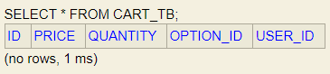

# 5주차 과제

# 1. 코드 리팩토링

- 장바구니 담기 - 예외처리
- 장바구니 수정 - 예외처리
- 주문하기 - 구현
- 주문 결과 확인 - 구현

---

## Cart

### 장바구니 담기

- CartRequest.`SaveDTO`
- CartService.`addCartList()`
  - ✅동일한 옵션이 들어오면 예외처리
    ```json
    [
      {
        "optionId": 1,
        "quantity": 10
      },
      {
        "optionId": 1,
        "quantity": 10
      }
    ]
    ```
    ```json
    {
      "success": false,
      "response": null,
      "error": {
        "message": "동일한 옵션이 입력되었습니다",
        "status": 400
      }
    }
    ```
  - ✅유효하지 않은 옵션이면 예외처리
    ```json
    [
      {
        "optionId": 100,
        "quantity": 10
      },
      {
        "optionId": 2,
        "quantity": 10
      }
    ]
    ```
    ```sql
    Hibernate:
        select
            option0_.id as id1_3_0_,
            option0_.option_name as option_n2_3_0_,
            option0_.price as price3_3_0_,
            option0_.product_id as product_4_3_0_
        from
            option_tb option0_
        where
            option0_.id=?
    ```
    ```json
    {
      "success": false,
      "response": null,
      "error": {
        "message": "해당 옵션을 찾을 수 없습니다 : 100",
        "status": 404
      }
    }
    ```
  - ✅장바구니 담기
    
    실행 전
    ```json
    [
      {
        "optionId": 1,
        "quantity": 10
      },
      {
        "optionId": 2,
        "quantity": 10
      }
    ]
    ```
    ```sql
    Hibernate:
        select
            option0_.id as id1_3_0_,
            option0_.option_name as option_n2_3_0_,
            option0_.price as price3_3_0_,
            option0_.product_id as product_4_3_0_
        from
            option_tb option0_
        where
            option0_.id=?
    ```
    ```sql
    Hibernate:
        select
            cart0_.id as id1_0_,
            cart0_.option_id as option_i4_0_,
            cart0_.price as price2_0_,
            cart0_.quantity as quantity3_0_,
            cart0_.user_id as user_id5_0_
        from
            cart_tb cart0_
        where
            cart0_.option_id=?
            and cart0_.user_id=?
    ```
    ```sql
    Hibernate:
        insert
        into
            cart_tb
            (id, option_id, price, quantity, user_id)
        values
            (default, ?, ?, ?, ?)
    ```
    ```json
    {
      "success": true,
      "response": null,
      "error": null
    }
    ```
    
    실행 후
  - ✅이미 추가한 옵션이면 수량을 수정하기
    
    실행 전
    ```json
    [
      {
        "optionId": 1,
        "quantity": 5
      },
      {
        "optionId": 2,
        "quantity": 5
      }
    ]
    ```
    ```sql
    Hibernate:
        select
            option0_.id as id1_3_0_,
            option0_.option_name as option_n2_3_0_,
            option0_.price as price3_3_0_,
            option0_.product_id as product_4_3_0_
        from
            option_tb option0_
        where
            option0_.id=?
    ```
    ```sql
    Hibernate:
        select
            cart0_.id as id1_0_,
            cart0_.option_id as option_i4_0_,
            cart0_.price as price2_0_,
            cart0_.quantity as quantity3_0_,
            cart0_.user_id as user_id5_0_
        from
            cart_tb cart0_
        where
            cart0_.option_id=?
            and cart0_.user_id=?
    ```
    ```sql
    Hibernate:
        update
            cart_tb
        set
            option_id=?,
            price=?,
            quantity=?,
            user_id=?
        where
            id=?
    ```
    ```json
    {
      "success": true,
      "response": null,
      "error": null
    }
    ```
    
    실행 후
- CartRestController.`addCartList()`

---

### 장바구니 조회

- CartResponse.`FindAllDTO`
- CartService.`findAll()`
  - ✅장바구니 조회
    
    실행 전
    ```sql
    Hibernate:
        select
            cart0_.id as id1_0_0_,
            option1_.id as id1_3_1_,
            product2_.id as id1_5_2_,
            cart0_.option_id as option_i4_0_0_,
            cart0_.price as price2_0_0_,
            cart0_.quantity as quantity3_0_0_,
            cart0_.user_id as user_id5_0_0_,
            option1_.option_name as option_n2_3_1_,
            option1_.price as price3_3_1_,
            option1_.product_id as product_4_3_1_,
            product2_.description as descript2_5_2_,
            product2_.image as image3_5_2_,
            product2_.price as price4_5_2_,
            product2_.product_name as product_5_5_2_
        from
            cart_tb cart0_
        inner join
            option_tb option1_
                on cart0_.option_id=option1_.id
        inner join
            product_tb product2_
                on option1_.product_id=product2_.id
        where
            cart0_.user_id=?
        order by
            cart0_.option_id asc
    ```
    ```json
    {
      "success": true,
      "response": {
        "products": [
          {
            "id": 1,
            "productName": "기본에 슬라이딩 지퍼백 크리스마스/플라워에디션 에디션 외 주방용품 특가전",
            "carts": [
              {
                "id": 1,
                "option": {
                  "id": 1,
                  "optionName": "01. 슬라이딩 지퍼백 크리스마스에디션 4종",
                  "price": 10000
                },
                "quantity": 10,
                "price": 100000
              },
              {
                "id": 2,
                "option": {
                  "id": 2,
                  "optionName": "02. 슬라이딩 지퍼백 플라워에디션 5종",
                  "price": 10900
                },
                "quantity": 10,
                "price": 109000
              }
            ]
          }
        ],
        "totalPrice": 209000
      },
      "error": null
    }
    ```
  - ✅장바구니가 비어있으면 예외처리
    ```sql
    Hibernate:
        select
            cart0_.id as id1_0_0_,
            option1_.id as id1_3_1_,
            product2_.id as id1_5_2_,
            cart0_.option_id as option_i4_0_0_,
            cart0_.price as price2_0_0_,
            cart0_.quantity as quantity3_0_0_,
            cart0_.user_id as user_id5_0_0_,
            option1_.option_name as option_n2_3_1_,
            option1_.price as price3_3_1_,
            option1_.product_id as product_4_3_1_,
            product2_.description as descript2_5_2_,
            product2_.image as image3_5_2_,
            product2_.price as price4_5_2_,
            product2_.product_name as product_5_5_2_
        from
            cart_tb cart0_
        inner join
            option_tb option1_
                on cart0_.option_id=option1_.id
        inner join
            product_tb product2_
                on option1_.product_id=product2_.id
        where
            cart0_.user_id=?
        order by
            cart0_.option_id asc
    ```
    ```json
    {
      "success": false,
      "response": null,
      "error": {
        "message": "장바구니가 비어있습니다",
        "status": 404
      }
    }
    ```
- CartRestController.`findAll()`

---

### 장바구니 수정

- CartRequest.`UpdateDTO`
- CartService.`update()`
  - ✅동일한 장바구니아이템이 들어오면 예외처리
    ```json
    [
      {
        "cartId": 1,
        "quantity": 20
      },
      {
        "cartId": 1,
        "quantity": 20
      }
    ]
    ```
    ```json
    {
      "success": false,
      "response": null,
      "error": {
        "message": "동일한 장바구니아이템이 입력되었습니다",
        "status": 400
      }
    }
    ```
  - ✅장바구니가 비어있으면 예외처리
    ```json
    [
      {
        "cartId": 1,
        "quantity": 20
      },
      {
        "cartId": 2,
        "quantity": 20
      }
    ]
    ```
    ```sql
    Hibernate:
        select
            cart0_.id as id1_0_0_,
            option1_.id as id1_3_1_,
            cart0_.option_id as option_i4_0_0_,
            cart0_.price as price2_0_0_,
            cart0_.quantity as quantity3_0_0_,
            cart0_.user_id as user_id5_0_0_,
            option1_.option_name as option_n2_3_1_,
            option1_.price as price3_3_1_,
            option1_.product_id as product_4_3_1_
        from
            cart_tb cart0_
        inner join
            option_tb option1_
                on cart0_.option_id=option1_.id
        where
            cart0_.user_id=?
    ```
    ```json
    {
      "success": false,
      "response": null,
      "error": {
        "message": "장바구니가 비어있습니다",
        "status": 404
      }
    }
    ```
  - ✅장바구니 수정
    
    실행 전
    ```json
    [
      {
        "cartId": 1,
        "quantity": 20
      },
      {
        "cartId": 2,
        "quantity": 20
      }
    ]
    ```
    ```sql
    Hibernate:
        select
            cart0_.id as id1_0_0_,
            option1_.id as id1_3_1_,
            cart0_.option_id as option_i4_0_0_,
            cart0_.price as price2_0_0_,
            cart0_.quantity as quantity3_0_0_,
            cart0_.user_id as user_id5_0_0_,
            option1_.option_name as option_n2_3_1_,
            option1_.price as price3_3_1_,
            option1_.product_id as product_4_3_1_
        from
            cart_tb cart0_
        inner join
            option_tb option1_
                on cart0_.option_id=option1_.id
        where
            cart0_.user_id=?
    ```
    ```sql
    Hibernate:
        update
            cart_tb
        set
            option_id=?,
            price=?,
            quantity=?,
            user_id=?
        where
            id=?
    ```
    ```json
    {
      "success": true,
      "response": {
        "carts": [
          {
            "cartId": 1,
            "optionId": 1,
            "optionName": "01. 슬라이딩 지퍼백 크리스마스에디션 4종",
            "quantity": 20,
            "price": 200000
          },
          {
            "cartId": 2,
            "optionId": 2,
            "optionName": "02. 슬라이딩 지퍼백 플라워에디션 5종",
            "quantity": 20,
            "price": 218000
          }
        ],
        "totalPrice": 418000
      },
      "error": null
    }
    ```
    
    실행 후
  - ✅유효하지 않은 장바구니아이템이면 예외처리
    ```json
    [
      {
        "cartId": 100,
        "quantity": 20
      },
      {
        "cartId": 2,
        "quantity": 20
      }
    ]
    ```
    ```sql
    Hibernate:
        select
            cart0_.id as id1_0_0_,
            option1_.id as id1_3_1_,
            cart0_.option_id as option_i4_0_0_,
            cart0_.price as price2_0_0_,
            cart0_.quantity as quantity3_0_0_,
            cart0_.user_id as user_id5_0_0_,
            option1_.option_name as option_n2_3_1_,
            option1_.price as price3_3_1_,
            option1_.product_id as product_4_3_1_
        from
            cart_tb cart0_
        inner join
            option_tb option1_
                on cart0_.option_id=option1_.id
        where
            cart0_.user_id=?
    ```
    ```json
    {
      "success": false,
      "response": null,
      "error": {
        "message": "해당 장바구니아이템을 찾을 수 없습니다 : 100",
        "status": 404
      }
    }
    ```
- CartRestController.`update()`

---

## Order

### 주문하기

- OrderResponse.`SaveDTO`
- OrderService.`save()`
  - ✅장바구니가 비어있으면 예외처리
    ```sql
    Hibernate:
        select
            cart0_.id as id1_0_0_,
            option1_.id as id1_3_1_,
            product2_.id as id1_5_2_,
            cart0_.option_id as option_i4_0_0_,
            cart0_.price as price2_0_0_,
            cart0_.quantity as quantity3_0_0_,
            cart0_.user_id as user_id5_0_0_,
            option1_.option_name as option_n2_3_1_,
            option1_.price as price3_3_1_,
            option1_.product_id as product_4_3_1_,
            product2_.description as descript2_5_2_,
            product2_.image as image3_5_2_,
            product2_.price as price4_5_2_,
            product2_.product_name as product_5_5_2_
        from
            cart_tb cart0_
        inner join
            option_tb option1_
                on cart0_.option_id=option1_.id
        inner join
            product_tb product2_
                on option1_.product_id=product2_.id
        where
            cart0_.user_id=?
        order by
            option1_.id asc
    ```
    ```json
    {
      "success": false,
      "response": null,
      "error": {
        "message": "장바구니가 비어있습니다",
        "status": 404
      }
    }
    ```
  - ✅주문하기
    
    실행 전
    
    실행 전
    
    실행 전
    ```sql
    Hibernate:
        select
            cart0_.id as id1_0_0_,
            option1_.id as id1_3_1_,
            product2_.id as id1_5_2_,
            cart0_.option_id as option_i4_0_0_,
            cart0_.price as price2_0_0_,
            cart0_.quantity as quantity3_0_0_,
            cart0_.user_id as user_id5_0_0_,
            option1_.option_name as option_n2_3_1_,
            option1_.price as price3_3_1_,
            option1_.product_id as product_4_3_1_,
            product2_.description as descript2_5_2_,
            product2_.image as image3_5_2_,
            product2_.price as price4_5_2_,
            product2_.product_name as product_5_5_2_
        from
            cart_tb cart0_
        inner join
            option_tb option1_
                on cart0_.option_id=option1_.id
        inner join
            product_tb product2_
                on option1_.product_id=product2_.id
        where
            cart0_.user_id=?
        order by
            option1_.id asc
    ```
    ```sql
    Hibernate:
        insert
        into
            order_tb
            (id, user_id)
        values
            (default, ?)
    ```
    ```sql
    Hibernate:
        insert
        into
            item_tb
            (id, option_id, order_id, price, quantity)
        values
            (default, ?, ?, ?, ?)
    ```
    ```sql
    Hibernate:
        delete
        from
            cart_tb
        where
            id=?
    ```
    ```json
    {
      "success": true,
      "response": {
        "id": 1,
        "products": [
          {
            "productName": "기본에 슬라이딩 지퍼백 크리스마스/플라워에디션 에디션 외 주방용품 특가전",
            "items": [
              {
                "id": 1,
                "optionName": "01. 슬라이딩 지퍼백 크리스마스에디션 4종",
                "quantity": 20,
                "price": 200000
              },
              {
                "id": 2,
                "optionName": "02. 슬라이딩 지퍼백 플라워에디션 5종",
                "quantity": 20,
                "price": 218000
              }
            ]
          }
        ],
        "totalPrice": 418000
      },
      "error": null
    }
    ```
    
    실행 후
    
    실행 후
    
    실행 후
- OrderRestController.`save()`

---

### 주문 결과 확인

- OrderResponse.`FindByIdDTO`
- OrderService.`findById()`

  - ✅유효하지 않은 주문이면 예외처리
    ```
    http://localhost:8080/orders/100
    ```
    ```sql
    Hibernate:
        select
            order0_.id as id1_4_0_,
            order0_.user_id as user_id2_4_0_
        from
            order_tb order0_
        where
            order0_.id=?
    ```
    ```json
    {
      "success": false,
      "response": null,
      "error": {
        "message": "해당 주문을 찾을 수 없습니다 : 100",
        "status": 404
      }
    }
    ```
  - ✅유저의 주문이 아니면 예외처리

    
    실행 전
    
    실행 전

    ```
    http://localhost:8080/orders/2
    ```

    ```sql
    Hibernate:
        select
            order0_.id as id1_4_0_,
            order0_.user_id as user_id2_4_0_
        from
            order_tb order0_
        where
            order0_.id=?
    ```

    ```json
    {
      "success": false,
      "response": null,
      "error": {
        "message": "접근할 수 없습니다 : 2",
        "status": 403
      }
    }
    ```

  - ✅주문 결과 확인

    
    실행 전
    
    실행 전

    ```sql
    Hibernate:
        select
            order0_.id as id1_4_0_,
            order0_.user_id as user_id2_4_0_
        from
            order_tb order0_
        where
            order0_.id=?
    ```

    ```sql
    Hibernate:
        select
            item0_.id as id1_2_0_,
            option1_.id as id1_3_1_,
            product2_.id as id1_5_2_,
            item0_.option_id as option_i4_2_0_,
            item0_.order_id as order_id5_2_0_,
            item0_.price as price2_2_0_,
            item0_.quantity as quantity3_2_0_,
            option1_.option_name as option_n2_3_1_,
            option1_.price as price3_3_1_,
            option1_.product_id as product_4_3_1_,
            product2_.description as descript2_5_2_,
            product2_.image as image3_5_2_,
            product2_.price as price4_5_2_,
            product2_.product_name as product_5_5_2_
        from
            item_tb item0_
        inner join
            option_tb option1_
                on item0_.option_id=option1_.id
        inner join
            product_tb product2_
                on option1_.product_id=product2_.id
        where
            item0_.order_id=?
    ```

    ```json
    {
      "success": true,
      "response": {
        "id": 1,
        "products": [
          {
            "productName": "기본에 슬라이딩 지퍼백 크리스마스/플라워에디션 에디션 외 주방용품 특가전",
            "items": [
              {
                "id": 1,
                "optionName": "01. 슬라이딩 지퍼백 크리스마스에디션 4종",
                "quantity": 10,
                "price": 100000
              },
              {
                "id": 2,
                "optionName": "02. 슬라이딩 지퍼백 플라워에디션 5종",
                "quantity": 10,
                "price": 109000
              }
            ]
          }
        ],
        "totalPrice": 209000
      },
      "error": null
    }
    ```

- OrderRestController.`findById()`

---

# 쿼리 최적화 규칙

- 한방쿼리로 만들자
- List일 땐 findAll을 사용, 1개일 땐 findBy를 사용하자
- join fetch 시에는 m을 붙이자
