## 5주차 과제수행
카카오 쇼핑 프로젝트 전체 코드를 리팩토링한다
이번 과제는 정해진 API에 따라 request 데이터의 예외처리를 하고, 데이터를 효율적으로 전송하고,
정해진 layer에 따라 구현하는 것이다. aop와 exception handler 부분, product와 user, cart부분은 강사님과 함께 만들었고, 입맛에 맞게 수정하였다. order부분은 직접 구현하였다.

### 바뀐 부분

**Product**
Product부분은 get api밖에 없고 강사님과 같이 진행했었다.

- findById -> 상품의 정보와 상세정보를 동시에 불러온다.k        - 사용자 인증 필수  
    - repository
    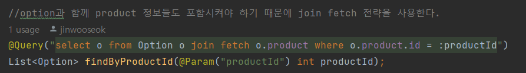
    해당 쿼리를 join fetch로 바꾸었다. findByProductId는 상품의 상세정보를 불러오는 repository로 상품 데이터와
    옵션 데이터가 모두 필요하기 때문이다.

        - 실제 쿼리
        
        option테이블과 product테이블의 inner join으로 한번에 데이터를 불러왔다.

        - postman 화면
        
        정상적으로 데이터가 출력되었다.

**Cart**

- **findAll** -> 유저의 장바구니 데이터를 GET한다.
    - request & response DTO
        - request - X (GET)
        - response
            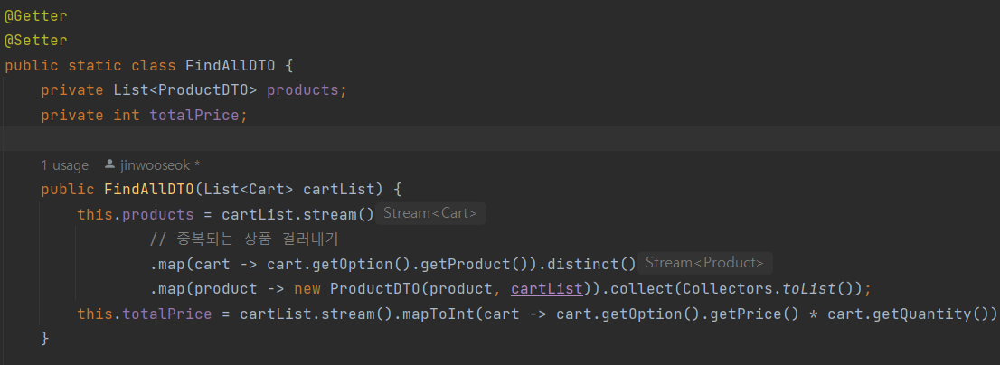
          
    - controller
        
        - 사용자 인증 필수 ->  @AuthenticationPrincipal userDetail로 해결
        
        - service 의존성을 주입한다.  
         
    - service
        로직수행
        1. user 본인의 현재 장바구니를 조회하는 service
        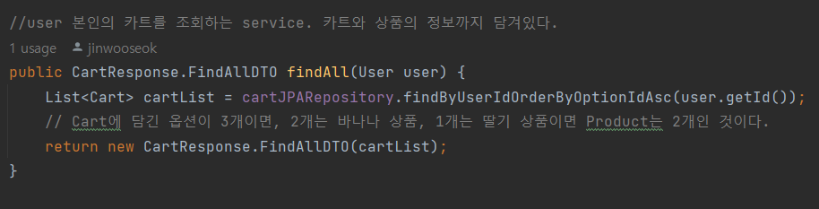
        repository를 통해 현재 자신의 장바구니에 있는 상품들의 정보를 등록한 순서대로 받아온다.
         
        - postman 실행결과
            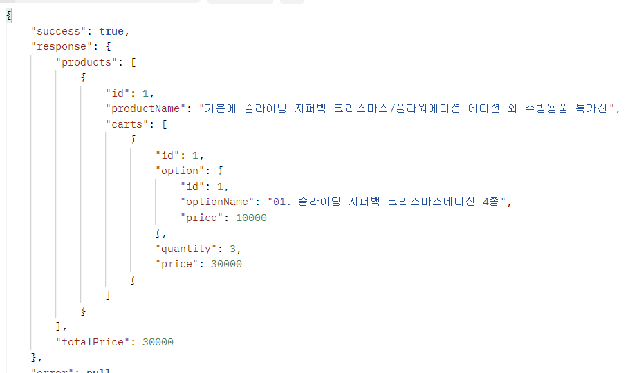
         
    - repository
        - 사용쿼리
        
        user의 카트 세부사항을 조회하는 쿼리이다. user id로 select해서 올 때, api 상 user정보는 필요하지 않기 때문에 join을 사용해서 user부분은 ?로 남겨두고 가져온다. join fetch를 통해 option은 한번에 호출한다.
        - 실제쿼리
        
        굉장히 길지만 한번에 쿼리를 출력할 수 있었고, 필요하지 않은 user정보는 ?처리된 것을 알 수 있다.
         
- **addCartList** -> 유저의 장바구니 데이터를 추가한다.
    - request & response DTO
        - request
        
        cart에 저장할 dto로 optionId와 quantity를 받아온다.
        예시 : {"optionId":1,"quantity":5}
        - response
        response : null
         
    - controller
        
        - 유효성 검사 -> AOP방식으로 GlobalValidationHandler를 만들어 PostMapping 컨트롤러 작동 전에 유효성 검사를 실시하게 했다. 
        - 사용자 인증 필수 ->  @AuthenticationPrincipal userDetail로 해결
        
        - service 의존성을 주입한다.
         
    - service
        로직수행
        1. 똑같은 optionId가 여러번 들어오면 예외처리
            
             
            - postman 실행결과
            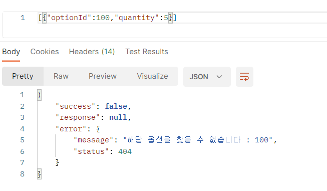
        2. user가 소유하지 않는 option를 요청했을 때 처리 -> 소유하지 않고 있을 때, save로직 작동, 소유하고 있다면 update로직 작동
            
            - 실행쿼리  
            
        3. save로직
            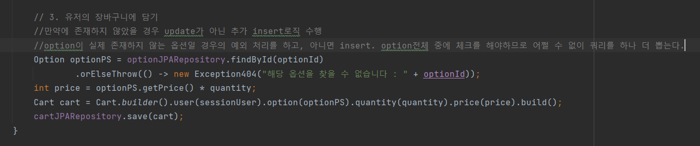
             
            - postman 실행결과
            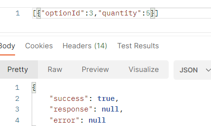
            

            
         
    - repository
        - 사용 쿼리
        
        유저의 소유여부를 검증할때(2번 로직) 카트테이블의 옵션과 유저가 정확히 일치하는지 검증하기 위한 쿼리이다. 조건일치만 확인하기 때문에 join전략으로 하고 user, option은 프록시객체로 남겨둔다.

        - 실제 쿼리
        
        save하기 위해 option과 user는 조건으로만 활용한다.
         
- **update** -> 유저의 장바구니 데이터를 업데이트하고, 주문을 하기 위한 페이지로 이동한다.
    - request & response DTO
        - request
        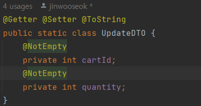
        NotEmpty 어노테이션을 통해 값이 전달되지 않을 가능성을 배제했다. cartId, quantity를 전달받는다.
        예시 : {"cartId":1,"quantity":5}

        - response
        
         
    - controller
        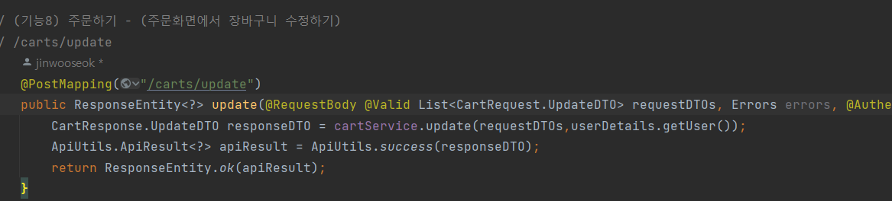
        - 유효성 검사 -> AOP방식으로 GlobalValidationHandler를 만들어 PostMapping 컨트롤러 작동 전에 유효성 검사를 실시하게 했다. 
        - 사용자 인증 필수 ->  @AuthenticationPrincipal userDetail로 해결
        
        - service 의존성을 주입한다.
         
    - service
        로직수행
        1. 장바구니에 아무것도 없을 때 업데이트는 없데이트이므로 예외처리 
            
            if문을 활용해 예외를 처리하였다.
             
            - postman 실행결과
            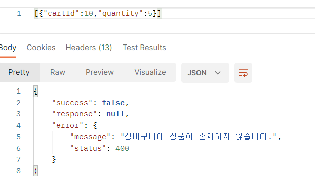

        2. 똑같은 cartId가 여러번 들어오면 예외처리
            
             
            - postman 실행결과
            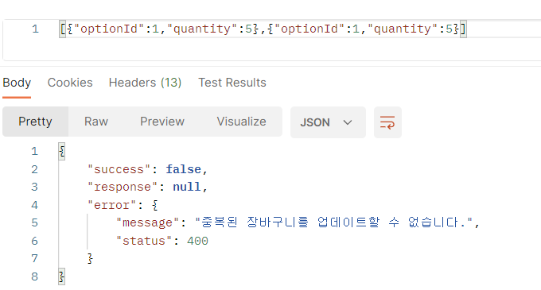
        3. 자신과 연관이 없는 cart의 업데이트를 시도하는 경우
            
            해당하는 
             
            - postman 실행결과
            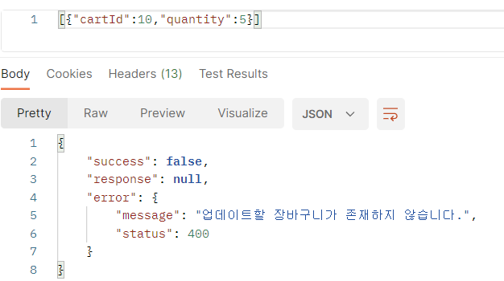
    - repository
        - 사용쿼리
            
        user의 카트 세부사항을 조회하는 쿼리이다. user id로 select해서 올 때, api 상 user정보는 필요하지 않기 때문에 join을 사용해서 user부분은 ?로 남겨두고 가져온다. join fetch를 통해 option은 한번에 호출한다. cartList를 dto화 할때, option과 product는 필요하다.
        - 실제쿼리
        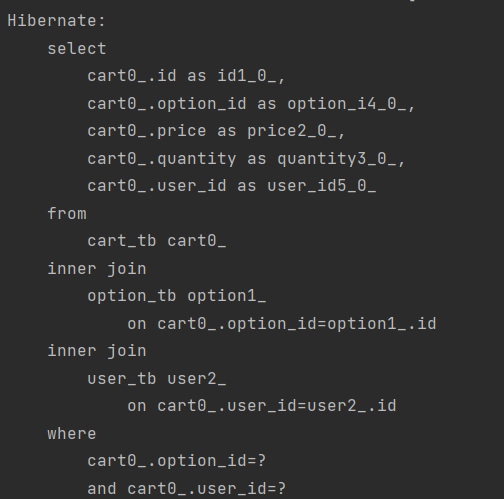
         

**Order**
- **save** -> 장바구니의 데이터를 그대로 주문하고, 장바구니 데이터는 삭제한다.
    - request & response DTO
        - request - X (GET)
        - response
            
    - controller
        
        - 유효성 검사 -> cart테이블의 항목들을 가져와 사용하므로 입력을 받지 않는다.
        - 사용자 인증 필수 ->  @AuthenticationPrincipal userDetail로 해결
        
        - service 의존성을 주입한다.
    - service
        1. 텅 빈 장바구니를 주문하는 경우
            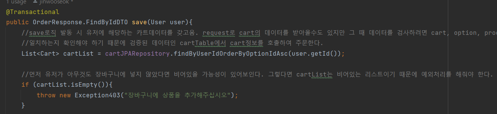
            여기에서 걸려서 주문이 안될 것이다.
             
            - postman 실행결과
            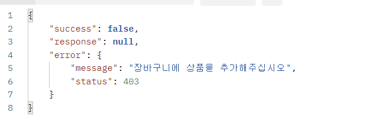

        2. 정상작동
            
            예외처리에 성공했다면 장바구니의 데이터들을 item, order테이블에 각각 save한 후, 장바구니 테이블에서는 제거한다. 그 후에 결과를 return해서 보여주고 싶은데 이는 유저의 가장 최근 주문내역을 호출하였다.
             
            - postman 실행결과
            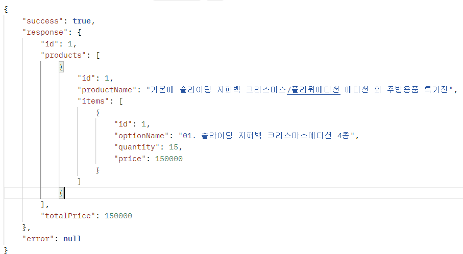
            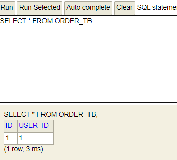
            최근 주문내역이 response로 반환된다.
    - repository
        - 사용쿼리
        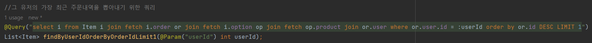
        해당 쿼리는 order, option, product를 한번에 엮어서 해당 유저id를 기준으로 주문번호 순으로 정렬한 다음 가장 최근 데이터를 추출한다.
        한번에 하려다 보니 너무 많은 것들이 join fetch되었다. limit 1을 통해 가장 최신의 것을 뽑으려고 했는데 limit 1은 native query여야 쓸 수 있음
        - 실제쿼리
        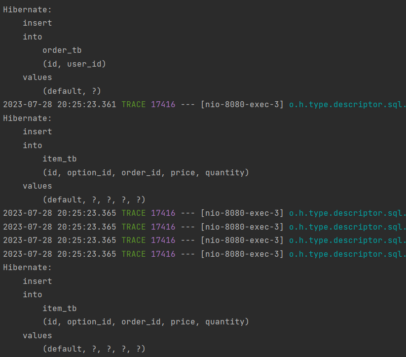
        먼저 order, item 테이블에 2번의 삽입, cart테이블에 1건의 삭제쿼리가 전송되었다.
        
        bulk쿼리로 한번에 삭제한다.
        
        join을 한 user테이블을 제외하고 나머지 필요한 정보들은 모두 fetch join하여 하나의 쿼리로 요청했다.
         
- **findById** -> 주문id에 따라 주문내역을 찾을 수 있다.
    - request & response DTO
        - request - X (GET)
        - response
            

    - controller
        
        - 유효성 검사 -> request Body를 받지 않음 
        - 사용자 인증 필수 ->  @AuthenticationPrincipal userDetail로 해결
        
        - service 의존성을 주입한다.

    - service
        1. 본인이 아닌 다른 사람의 주문내역에 접근하거나 주문내역이 존재하지 않는 경우
            
            해당 유저에게 주문내역이 없으면 404에러를 띄우도록 하였다.
             
            - postman 실행결과
            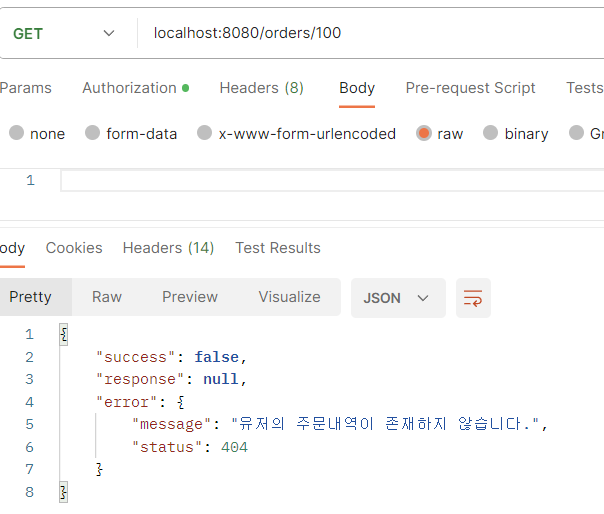
        2. 정상작동
            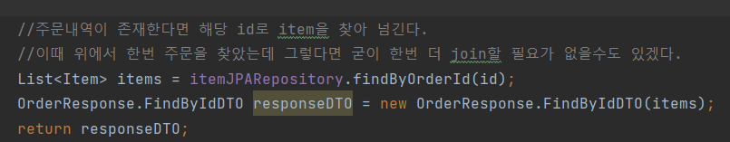
             
            - postman 실행결과
            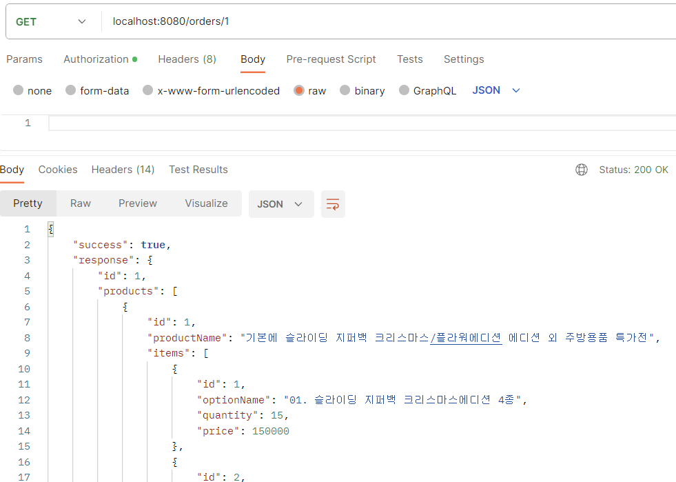

    - repository
        - 사용쿼리
        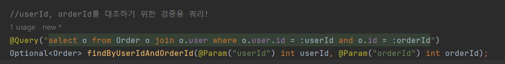
        이 repository는 접근하고자 하는 주문이 현재 유저가 소유하고있는 주문이 맞는지 확인하기 위한 쿼리를 제공한다.
        

        - 실제쿼리
        
        service-1에서 검증을 위해 활용했던 쿼리
        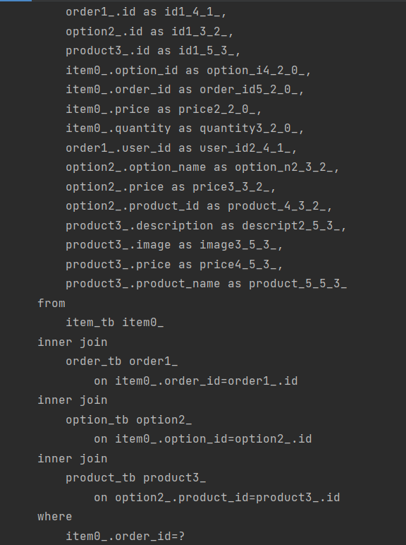
        데이터를 가져오는 쿼리
        *용도가 다르기 때문에 두개를 합치는게 고민이 된다.